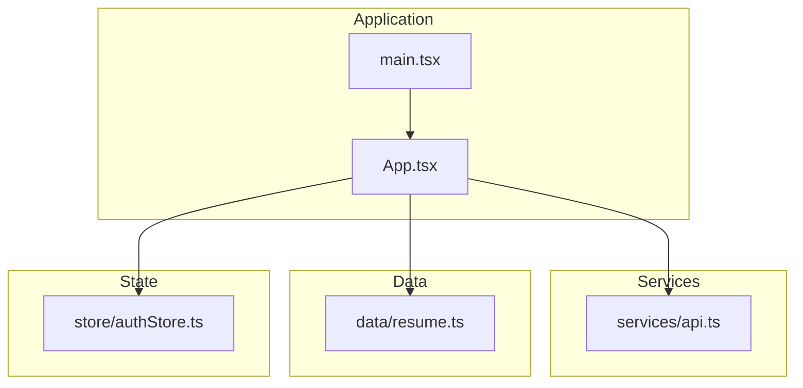
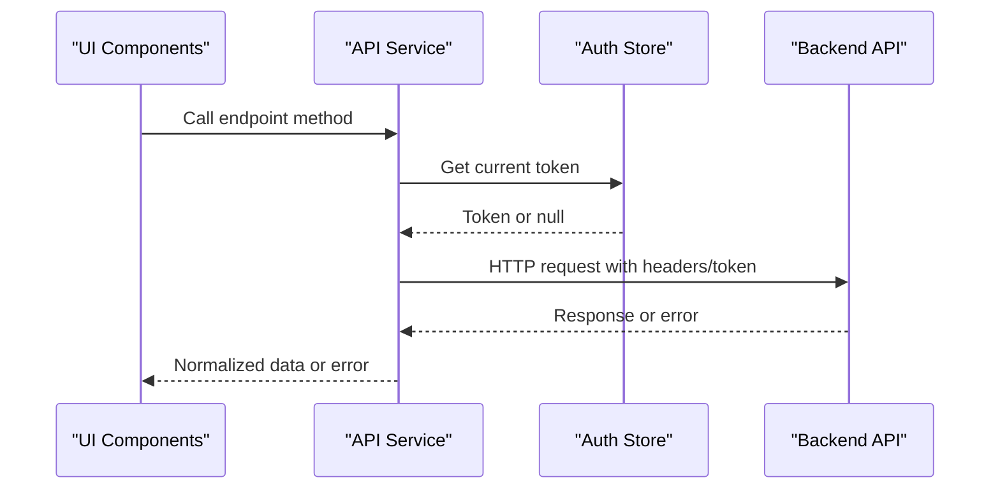
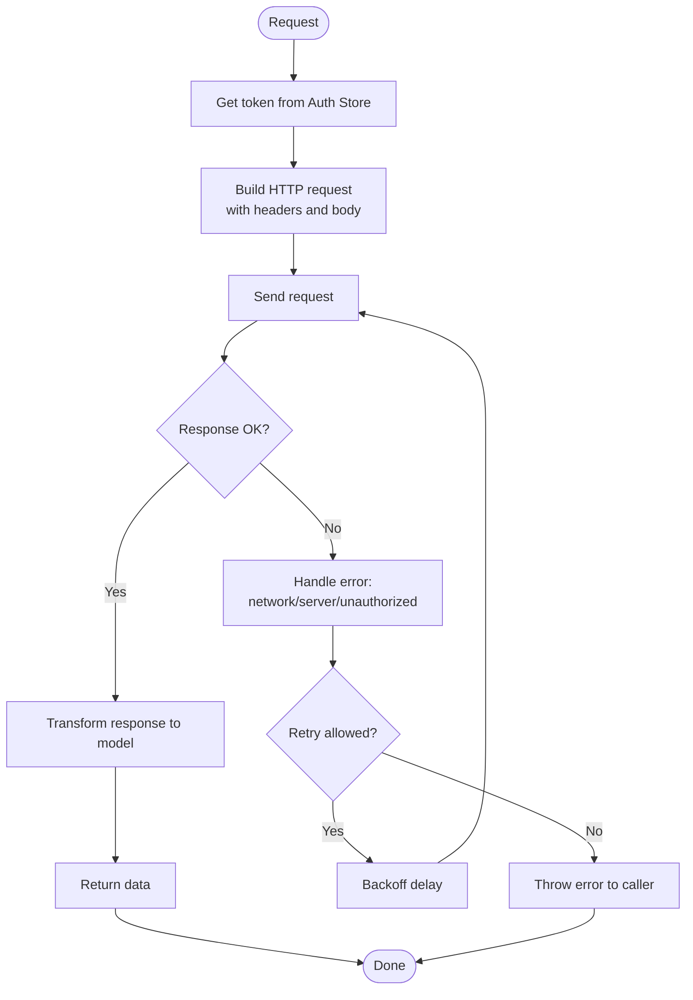
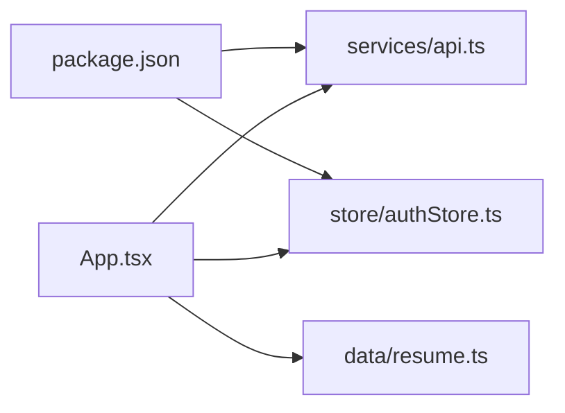

# API Integration

<cite>
**Referenced Files in This Document**
- [api.ts](file://src/services/api.ts)
- [resume.ts](file://src/data/resume.ts)
- [authStore.ts](file://src/store/authStore.ts)
- [App.tsx](file://src/App.tsx)
- [main.tsx](file://src/main.tsx)
- [package.json](file://package.json)
</cite>

## Table of Contents
1. [Introduction](#introduction)
2. [Project Structure](#project-structure)
3. [Core Components](#core-components)
4. [Architecture Overview](#architecture-overview)
5. [Detailed Component Analysis](#detailed-component-analysis)
6. [Dependency Analysis](#dependency-analysis)
7. [Performance Considerations](#performance-considerations)
8. [Troubleshooting Guide](#troubleshooting-guide)
9. [Conclusion](#conclusion)
10. [Appendices](#appendices)

## Introduction
This document explains the API integration layer and data management for the project. It covers the API service abstraction, HTTP client configuration, request/response handling, error management, authentication token handling, static data management for resume content, and how these pieces integrate with potential backend APIs. It also includes guidance on data transformation patterns, caching strategies, offline support considerations, and examples for adding new endpoints, handling different response types, and implementing retry logic.

## Project Structure
The relevant parts for API integration and data management are organized under:
- services/api.ts: Centralized API client and endpoint definitions
- data/resume.ts: Static resume content used by UI components
- store/authStore.ts: Authentication state and token management
- App.tsx and main.tsx: Application bootstrap and global providers
- package.json: Dependencies that may include networking or caching libraries

**Diagram sources**
- [App.tsx](file://src/App.tsx)
- [main.tsx](file://src/main.tsx)
- [api.ts](file://src/services/api.ts)
- [resume.ts](file://src/data/resume.ts)
- [authStore.ts](file://src/store/authStore.ts)

**Section sources**
- [api.ts](file://src/services/api.ts)
- [resume.ts](file://src/data/resume.ts)
- [authStore.ts](file://src/store/authStore.ts)
- [App.tsx](file://src/App.tsx)
- [main.tsx](file://src/main.tsx)
- [package.json](file://package.json)

## Core Components
- API Service Abstraction (services/api.ts): Provides a unified interface for HTTP requests, centralizes base URL and headers, handles errors, and encapsulates authentication token injection.
- Static Resume Data (data/resume.ts): Holds structured resume information consumed by sections and pages; can be swapped for API-driven data later.
- Auth Store (store/authStore.ts): Manages authentication state, including tokens, login/logout flows, and persistence strategy.

Key responsibilities:
- HTTP client configuration: Base URL, default headers, timeouts, interceptors for auth and errors.
- Request/response handling: Typed methods per domain, normalization of responses, mapping to application models.
- Error management: Centralized error parsing, user-friendly messages, retry hooks.
- Authentication: Token retrieval, injection into requests, refresh flow when needed.

**Section sources**
- [api.ts](file://src/services/api.ts)
- [resume.ts](file://src/data/resume.ts)
- [authStore.ts](file://src/store/authStore.ts)

## Architecture Overview
The API layer sits between UI components and backend services. Static data is used initially and can be replaced with live data via the API service. Authentication is managed centrally and injected into requests automatically.

**Diagram sources**
- [api.ts](file://src/services/api.ts)
- [authStore.ts](file://src/store/authStore.ts)

## Detailed Component Analysis

### API Service Abstraction (services/api.ts)
Responsibilities:
- Configure HTTP client with base URL, default headers, and timeouts.
- Provide typed methods for each domain (e.g., resume, experience, skills).
- Inject authentication tokens from the auth store.
- Normalize responses and handle errors consistently.
- Support optional caching and retry mechanisms.

Patterns:
- Factory-style functions for endpoints returning promises.
- Interceptors for attaching tokens and handling common errors.
- Response transformers to map server payloads to app models.

Error handling:
- Parse network errors vs. server errors.
- Surface actionable messages to UI.
- Optional retry for transient failures.

Authentication:
- Read token from auth store before each request.
- Refresh token flow if unauthorized responses occur.

Caching and offline:
- Cache GET responses locally when appropriate.
- Fallback to cached data when offline.

**Diagram sources**
- [api.ts](file://src/services/api.ts)
- [authStore.ts](file://src/store/authStore.ts)

**Section sources**
- [api.ts](file://src/services/api.ts)
- [authStore.ts](file://src/store/authStore.ts)

### Static Resume Data Management (data/resume.ts)
Purpose:
- Provide structured resume content for initial rendering.
- Serve as a contract/schema for future API-backed data.

Integration points:
- Consumed by section components directly.
- Can be replaced by API calls through the API service without changing component contracts.

Data transformation:
- Ensure shape matches what UI expects.
- When switching to API, add a transformer to normalize server responses to this shape.

Offline considerations:
- Keep static data as a fallback when network is unavailable.
- Optionally persist last known good version in local storage.

**Section sources**
- [resume.ts](file://src/data/resume.ts)

### Authentication Store (store/authStore.ts)
Responsibilities:
- Manage login/logout state.
- Persist tokens securely (e.g., localStorage/sessionStorage).
- Expose getters/setters for tokens and user profile.
- Trigger token refresh when necessary.

Integration with API:
- API service reads token before requests.
- On 401/403, trigger refresh and retry once.

Persistence:
- Sync state across tabs if using storage events.
- Clear on logout.

**Section sources**
- [authStore.ts](file://src/store/authStore.ts)

### Application Bootstrap (App.tsx and main.tsx)
Roles:
- Initialize providers and global configurations.
- Wire up API service instance with environment variables.
- Load initial static resume data or fetch from API based on feature flags.

Configuration:
- Environment-specific base URLs and timeouts.
- Feature toggles for enabling/disabling API usage.

**Section sources**
- [App.tsx](file://src/App.tsx)
- [main.tsx](file://src/main.tsx)

## Dependency Analysis
External dependencies that may influence API behavior:
- Networking library (e.g., axios/fetch wrapper)
- State management (for auth store)
- Caching libraries (optional)

**Diagram sources**
- [package.json](file://package.json)
- [api.ts](file://src/services/api.ts)
- [authStore.ts](file://src/store/authStore.ts)
- [resume.ts](file://src/data/resume.ts)
- [App.tsx](file://src/App.tsx)

**Section sources**
- [package.json](file://package.json)
- [api.ts](file://src/services/api.ts)
- [authStore.ts](file://src/store/authStore.ts)
- [resume.ts](file://src/data/resume.ts)
- [App.tsx](file://src/App.tsx)

## Performance Considerations
- Use GET caching for idempotent endpoints to reduce network load.
- Implement pagination and lazy loading for large datasets.
- Debounce search inputs to minimize requests.
- Prefer streaming or partial updates where applicable.
- Avoid unnecessary re-renders by memoizing derived data.

[No sources needed since this section provides general guidance]

## Troubleshooting Guide
Common issues and resolutions:
- Network errors: Check connectivity, proxy settings, CORS policies.
- Unauthorized errors: Verify token presence and expiration; implement refresh flow.
- Data mismatch: Validate response schema against expected model; add transformers.
- Stale cache: Invalidate cache on mutations; implement cache keys per query.

Operational tips:
- Log request/response summaries in development.
- Add health checks for backend availability.
- Monitor error rates and latency metrics.

[No sources needed since this section provides general guidance]

## Conclusion
The API integration layer centralizes HTTP interactions, authentication, error handling, and data transformation. Static resume data provides a stable contract that can be seamlessly replaced with live data. With proper caching, retries, and offline fallbacks, the system remains resilient and performant. Extending the API layer with new endpoints follows consistent patterns for maintainability and clarity.

[No sources needed since this section summarizes without analyzing specific files]

## Appendices

### How to Add a New API Endpoint
Steps:
- Define a typed method in the API service for the new endpoint.
- Include request parameters, headers, and response type.
- Attach authentication token from the auth store.
- Normalize the response to your application model.
- Add error handling and optional retry logic.
- Export the method for use in components or stores.

Best practices:
- Keep endpoint methods small and focused.
- Use consistent naming conventions.
- Document expected payloads and errors.

[No sources needed since this section provides general guidance]

### Handling Different Response Types
Approach:
- Create transformers for each response shape.
- Map server fields to application models.
- Validate required fields and provide defaults.
- Throw descriptive errors for invalid responses.

Example pattern:
- Fetch -> Transform -> Validate -> Return

[No sources needed since this section provides general guidance]

### Implementing Retry Logic for Failed Requests
Guidelines:
- Identify retriable errors (network timeouts, 5xx).
- Use exponential backoff with jitter.
- Limit maximum retries to avoid infinite loops.
- Respect user cancellation signals.
- Update UI states during retries.

[No sources needed since this section provides general guidance]

### Caching Strategies
Options:
- In-memory cache for short-lived data.
- Local storage for persistent cache.
- Cache invalidation on mutations.
- Time-based TTL for freshness.

Trade-offs:
- Balance freshness vs. performance.
- Handle cache conflicts gracefully.

[No sources needed since this section provides general guidance]

### Offline Support Considerations
Strategies:
- Detect online/offline status.
- Queue mutations while offline and sync when online.
- Serve cached data when offline.
- Show clear feedback to users about offline mode.

[No sources needed since this section provides general guidance]