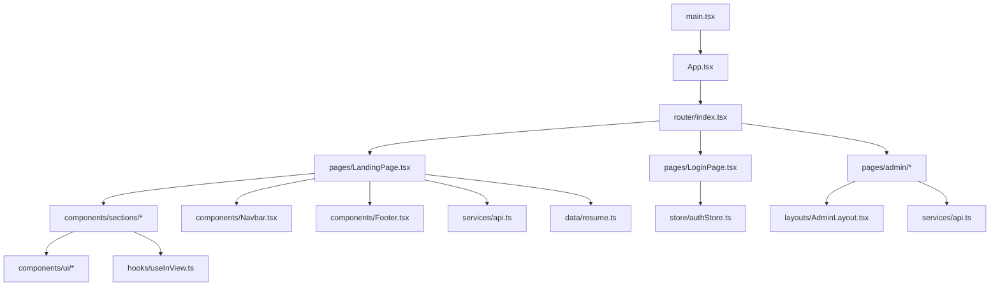
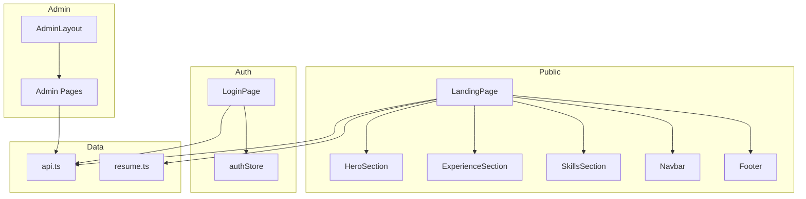
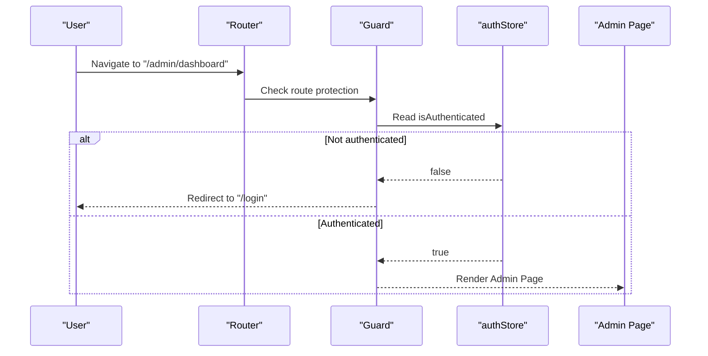
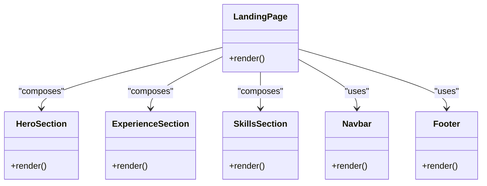
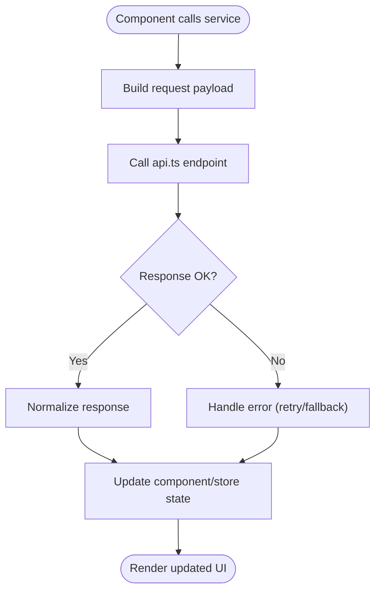
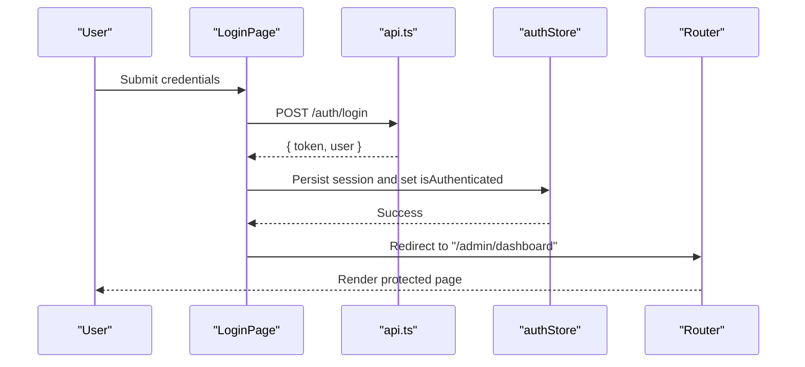
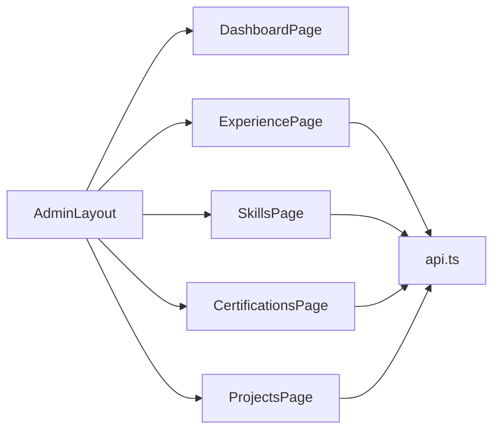
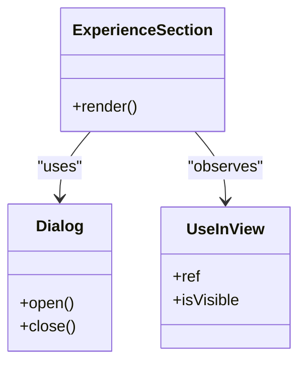
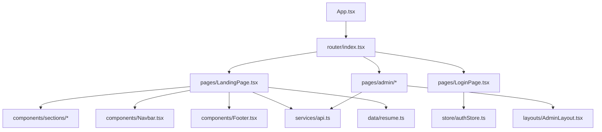

# Architecture Overview

<cite>
**Referenced Files in This Document**
- [App.tsx](file://src/App.tsx)
- [main.tsx](file://src/main.tsx)
- [router/index.tsx](file://src/router/index.tsx)
- [services/api.ts](file://src/services/api.ts)
- [store/authStore.ts](file://src/store/authStore.ts)
- [layouts/AdminLayout.tsx](file://src/layouts/AdminLayout.tsx)
- [pages/LandingPage.tsx](file://src/pages/LandingPage.tsx)
- [pages/LoginPage.tsx](file://src/pages/LoginPage.tsx)
- [components/sections/HeroSection.tsx](file://src/components/sections/HeroSection.tsx)
- [components/sections/ExperienceSection.tsx](file://src/components/sections/ExperienceSection.tsx)
- [components/sections/SkillsSection.tsx](file://src/components/sections/SkillsSection.tsx)
- [components/Navbar.tsx](file://src/components/Navbar.tsx)
- [components/Footer.tsx](file://src/components/Footer.tsx)
- [hooks/useInView.ts](file://src/hooks/useInView.ts)
- [data/resume.ts](file://src/data/resume.ts)
</cite>

## Table of Contents
1. [Introduction](#introduction)
2. [Project Structure](#project-structure)
3. [Core Components](#core-components)
4. [Architecture Overview](#architecture-overview)
5. [Detailed Component Analysis](#detailed-component-analysis)
6. [Dependency Analysis](#dependency-analysis)
7. [Performance Considerations](#performance-considerations)
8. [Troubleshooting Guide](#troubleshooting-guide)
9. [Conclusion](#conclusion)

## Introduction
This document explains the high-level architecture of the Resume Portfolio Application, focusing on how App.tsx bootstraps routing to page components, how public-facing resume sections are separated from administrative dashboard functionality, how state is managed via custom hooks and store patterns, and how the service layer abstracts API integration and data flow. It also covers authentication, route protection, and responsive design patterns across the system.

## Project Structure
The application follows a feature-oriented layout:
- Entry points: main.tsx initializes the app; App.tsx configures global providers and routes.
- Routing: router/index.tsx defines public and protected routes.
- Pages: LandingPage (public resume), LoginPage (auth), and admin pages under pages/admin.
- Layouts: AdminLayout wraps admin routes.
- Sections: Reusable resume sections under components/sections.
- UI primitives: Shared UI components under components/ui.
- Services: api.ts centralizes HTTP calls.
- Store: authStore.ts manages authentication state.
- Hooks: useInView.ts provides intersection observer utilities.
- Data: resume.ts holds static or initial resume content.

**Diagram sources**
- [main.tsx](file://src/main.tsx)
- [App.tsx](file://src/App.tsx)
- [router/index.tsx](file://src/router/index.tsx)
- [pages/LandingPage.tsx](file://src/pages/LandingPage.tsx)
- [pages/LoginPage.tsx](file://src/pages/LoginPage.tsx)
- [layouts/AdminLayout.tsx](file://src/layouts/AdminLayout.tsx)
- [services/api.ts](file://src/services/api.ts)
- [store/authStore.ts](file://src/store/authStore.ts)
- [hooks/useInView.ts](file://src/hooks/useInView.ts)
- [data/resume.ts](file://src/data/resume.ts)

**Section sources**
- [App.tsx](file://src/App.tsx)
- [router/index.tsx](file://src/router/index.tsx)
- [main.tsx](file://src/main.tsx)

## Core Components
- App.tsx: Initializes providers, theme, and global configuration; wires up routing and error boundaries.
- Router: Defines public routes (/) and protected admin routes (/admin/*). Guards enforce authentication.
- LandingPage: Composes public resume sections and navigates to login when needed.
- LoginPage: Handles authentication flows and redirects upon success.
- AdminLayout: Wraps admin pages with navigation and layout constraints.
- Sections: HeroSection, ExperienceSection, SkillsSection, etc., render resume content using UI primitives.
- Navbar/Footer: Global navigation and footer used by public pages.
- Services: Centralized API client for fetching and mutating resume and admin data.
- Store: Auth store exposes user session state and actions.
- Hooks: useInView supports scroll-triggered animations and lazy rendering.

**Section sources**
- [App.tsx](file://src/App.tsx)
- [router/index.tsx](file://src/router/index.tsx)
- [pages/LandingPage.tsx](file://src/pages/LandingPage.tsx)
- [pages/LoginPage.tsx](file://src/pages/LoginPage.tsx)
- [layouts/AdminLayout.tsx](file://src/layouts/AdminLayout.tsx)
- [components/sections/HeroSection.tsx](file://src/components/sections/HeroSection.tsx)
- [components/sections/ExperienceSection.tsx](file://src/components/sections/ExperienceSection.tsx)
- [components/sections/SkillsSection.tsx](file://src/components/sections/SkillsSection.tsx)
- [components/Navbar.tsx](file://src/components/Navbar.tsx)
- [components/Footer.tsx](file://src/components/Footer.tsx)
- [services/api.ts](file://src/services/api.ts)
- [store/authStore.ts](file://src/store/authStore.ts)
- [hooks/useInView.ts](file://src/hooks/useInView.ts)

## Architecture Overview
The system separates public resume viewing from administrative management:
- Public path: / renders LandingPage composed of sections.
- Protected path: /admin/* requires authentication and uses AdminLayout.
- Data access: All external calls go through services/api.ts.
- State: Authentication state lives in store/authStore.ts; section data may be local or fetched via services.
- UI composition: Sections compose UI primitives and leverage hooks like useInView for performance.

**Diagram sources**
- [pages/LandingPage.tsx](file://src/pages/LandingPage.tsx)
- [components/sections/HeroSection.tsx](file://src/components/sections/HeroSection.tsx)
- [components/sections/ExperienceSection.tsx](file://src/components/sections/ExperienceSection.tsx)
- [components/sections/SkillsSection.tsx](file://src/components/sections/SkillsSection.tsx)
- [components/Navbar.tsx](file://src/components/Navbar.tsx)
- [components/Footer.tsx](file://src/components/Footer.tsx)
- [pages/LoginPage.tsx](file://src/pages/LoginPage.tsx)
- [layouts/AdminLayout.tsx](file://src/layouts/AdminLayout.tsx)
- [services/api.ts](file://src/services/api.ts)
- [data/resume.ts](file://src/data/resume.ts)
- [store/authStore.ts](file://src/store/authStore.ts)

## Detailed Component Analysis

### Routing and Route Protection
- Public routes expose LandingPage without guards.
- Protected routes under /admin/* require an authenticated user; unauthenticated users are redirected to LoginPage.
- Navigation guards check authStore state before rendering admin pages.

**Diagram sources**
- [router/index.tsx](file://src/router/index.tsx)
- [store/authStore.ts](file://src/store/authStore.ts)
- [pages/LoginPage.tsx](file://src/pages/LoginPage.tsx)
- [layouts/AdminLayout.tsx](file://src/layouts/AdminLayout.tsx)

**Section sources**
- [router/index.tsx](file://src/router/index.tsx)
- [store/authStore.ts](file://src/store/authStore.ts)

### Public Resume Composition
- LandingPage composes multiple sections to present the resume.
- Each section encapsulates its own data and presentation logic, reusing UI primitives.
- Sections may fetch data via services or consume static data from resume.ts.

**Diagram sources**
- [pages/LandingPage.tsx](file://src/pages/LandingPage.tsx)
- [components/sections/HeroSection.tsx](file://src/components/sections/HeroSection.tsx)
- [components/sections/ExperienceSection.tsx](file://src/components/sections/ExperienceSection.tsx)
- [components/sections/SkillsSection.tsx](file://src/components/sections/SkillsSection.tsx)
- [components/Navbar.tsx](file://src/components/Navbar.tsx)
- [components/Footer.tsx](file://src/components/Footer.tsx)

**Section sources**
- [pages/LandingPage.tsx](file://src/pages/LandingPage.tsx)
- [components/sections/HeroSection.tsx](file://src/components/sections/HeroSection.tsx)
- [components/sections/ExperienceSection.tsx](file://src/components/sections/ExperienceSection.tsx)
- [components/sections/SkillsSection.tsx](file://src/components/sections/SkillsSection.tsx)
- [components/Navbar.tsx](file://src/components/Navbar.tsx)
- [components/Footer.tsx](file://src/components/Footer.tsx)

### Service Layer and Data Flow
- services/api.ts centralizes HTTP requests, error handling, and response normalization.
- Pages and sections call service methods rather than direct fetch/axios calls.
- Static data may be sourced from data/resume.ts for initial or demo content.

**Diagram sources**
- [services/api.ts](file://src/services/api.ts)
- [data/resume.ts](file://src/data/resume.ts)

**Section sources**
- [services/api.ts](file://src/services/api.ts)
- [data/resume.ts](file://src/data/resume.ts)

### Authentication Flow
- LoginPage handles credentials submission and updates authStore.
- On success, user is redirected to the intended destination or default admin page.
- Protected routes read authStore to decide whether to render or redirect.

**Diagram sources**
- [pages/LoginPage.tsx](file://src/pages/LoginPage.tsx)
- [services/api.ts](file://src/services/api.ts)
- [store/authStore.ts](file://src/store/authStore.ts)
- [router/index.tsx](file://src/router/index.tsx)

**Section sources**
- [pages/LoginPage.tsx](file://src/pages/LoginPage.tsx)
- [services/api.ts](file://src/services/api.ts)
- [store/authStore.ts](file://src/store/authStore.ts)

### Admin Dashboard Separation
- AdminLayout enforces consistent admin UI and guards.
- Admin pages manage CRUD operations for resume entities (e.g., experience, skills, certifications, projects).
- Admin pages rely on services/api.ts for persistence and fetch operations.

**Diagram sources**
- [layouts/AdminLayout.tsx](file://src/layouts/AdminLayout.tsx)
- [pages/admin/DashboardPage.tsx](file://src/pages/admin/DashboardPage.tsx)
- [pages/admin/ExperiencePage.tsx](file://src/pages/admin/ExperiencePage.tsx)
- [pages/admin/SkillsPage.tsx](file://src/pages/admin/SkillsPage.tsx)
- [pages/admin/CertificationsPage.tsx](file://src/pages/admin/CertificationsPage.tsx)
- [pages/admin/ProjectsPage.tsx](file://src/pages/admin/ProjectsPage.tsx)
- [services/api.ts](file://src/services/api.ts)

**Section sources**
- [layouts/AdminLayout.tsx](file://src/layouts/AdminLayout.tsx)
- [services/api.ts](file://src/services/api.ts)

### Section-to-UI Primitive Interaction
- Sections consume UI primitives (buttons, cards, dialogs) for consistent styling and behavior.
- Hooks like useInView enable scroll-based visibility toggling for performance.

**Diagram sources**
- [components/sections/ExperienceSection.tsx](file://src/components/sections/ExperienceSection.tsx)
- [components/ui/Dialog.tsx](file://src/components/ui/Dialog.tsx)
- [hooks/useInView.ts](file://src/hooks/useInView.ts)

**Section sources**
- [components/sections/ExperienceSection.tsx](file://src/components/sections/ExperienceSection.tsx)
- [components/ui/Dialog.tsx](file://src/components/ui/Dialog.tsx)
- [hooks/useInView.ts](file://src/hooks/useInView.ts)

## Dependency Analysis
- App.tsx depends on router and global providers.
- Router depends on pages and layouts; protected routes depend on authStore.
- Public pages depend on sections, navbar/footer, services, and static data.
- Admin pages depend on AdminLayout and services.
- Services abstract all external dependencies (HTTP clients, endpoints).

**Diagram sources**
- [App.tsx](file://src/App.tsx)
- [router/index.tsx](file://src/router/index.tsx)
- [pages/LandingPage.tsx](file://src/pages/LandingPage.tsx)
- [pages/LoginPage.tsx](file://src/pages/LoginPage.tsx)
- [components/sections/HeroSection.tsx](file://src/components/sections/HeroSection.tsx)
- [components/sections/ExperienceSection.tsx](file://src/components/sections/ExperienceSection.tsx)
- [components/sections/SkillsSection.tsx](file://src/components/sections/SkillsSection.tsx)
- [components/Navbar.tsx](file://src/components/Navbar.tsx)
- [components/Footer.tsx](file://src/components/Footer.tsx)
- [services/api.ts](file://src/services/api.ts)
- [data/resume.ts](file://src/data/resume.ts)
- [layouts/AdminLayout.tsx](file://src/layouts/AdminLayout.tsx)
- [store/authStore.ts](file://src/store/authStore.ts)

**Section sources**
- [App.tsx](file://src/App.tsx)
- [router/index.tsx](file://src/router/index.tsx)
- [services/api.ts](file://src/services/api.ts)
- [store/authStore.ts](file://src/store/authStore.ts)

## Performance Considerations
- Lazy-load sections and admin pages where appropriate to reduce initial bundle size.
- Use Intersection Observer via useInView to defer rendering off-screen content.
- Memoize expensive computations in sections and avoid unnecessary re-renders.
- Cache API responses at the service layer to minimize network calls.
- Optimize images and assets; consider code splitting per route.

[No sources needed since this section provides general guidance]

## Troubleshooting Guide
- Authentication failures: Verify login endpoint responses and ensure authStore persists tokens correctly.
- Route protection issues: Confirm guards read authStore consistently and redirect paths are correct.
- API errors: Inspect service error handling and fallback strategies; log request/response payloads during development.
- Section rendering problems: Validate props passed to sections and ensure UI primitives receive expected types.
- Responsive issues: Test breakpoints and ensure CSS classes adapt across devices.

**Section sources**
- [services/api.ts](file://src/services/api.ts)
- [store/authStore.ts](file://src/store/authStore.ts)
- [router/index.tsx](file://src/router/index.tsx)

## Conclusion
The Resume Portfolio Application cleanly separates public resume presentation from administrative management through routing and layout boundaries. State is centralized in a dedicated auth store, while services abstract external dependencies. Sections compose UI primitives and leverage hooks for performance. This architecture promotes maintainability, scalability, and clear separation of concerns across the application.

[No sources needed since this section summarizes without analyzing specific files]