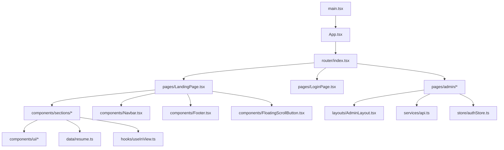
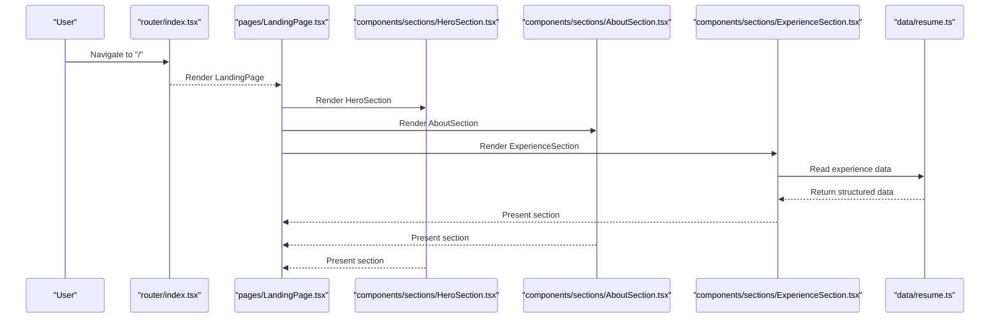
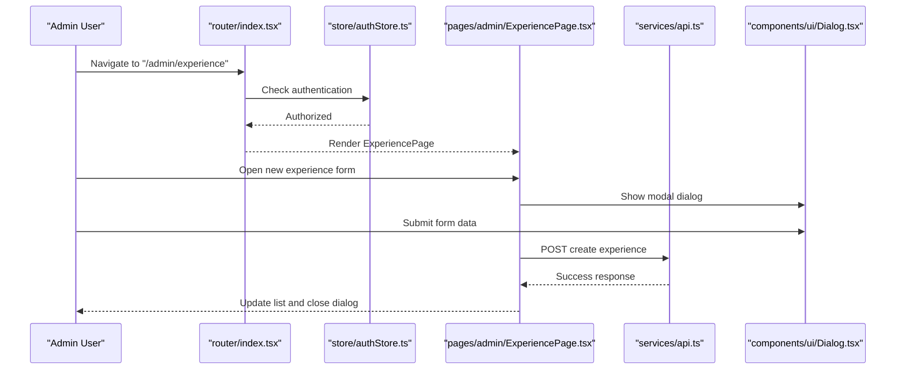
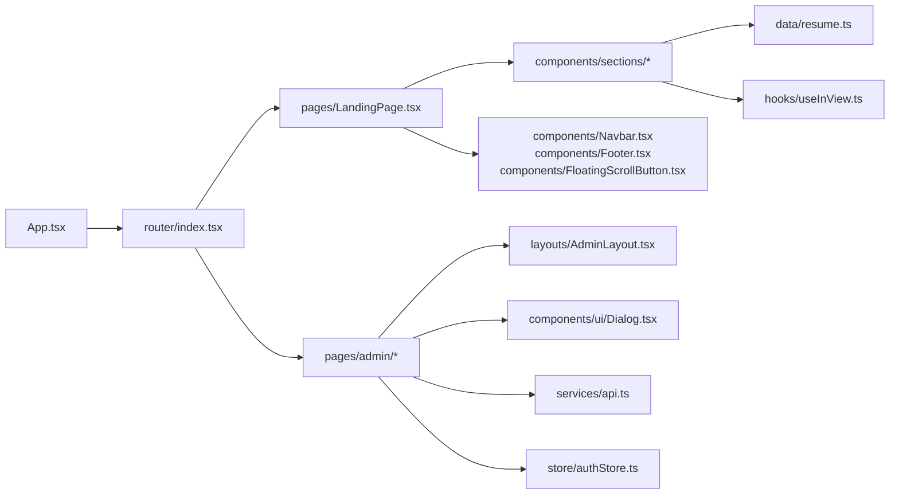

# Component Hierarchy and Structure

<cite>
**Referenced Files in This Document**
- [main.tsx](file://src/main.tsx)
- [App.tsx](file://src/App.tsx)
- [index.tsx](file://src/router/index.tsx)
- [LandingPage.tsx](file://src/pages/LandingPage.tsx)
- [LoginPage.tsx](file://src/pages/LoginPage.tsx)
- [DashboardPage.tsx](file://src/pages/admin/DashboardPage.tsx)
- [ExperiencePage.tsx](file://src/pages/admin/ExperiencePage.tsx)
- [ProjectsPage.tsx](file://src/pages/admin/ProjectsPage.tsx)
- [SkillsPage.tsx](file://src/pages/admin/SkillsPage.tsx)
- [CertificationsPage.tsx](file://src/pages/admin/CertificationsPage.tsx)
- [AdminLayout.tsx](file://src/layouts/AdminLayout.tsx)
- [HeroSection.tsx](file://src/components/sections/HeroSection.tsx)
- [AboutSection.tsx](file://src/components/sections/AboutSection.tsx)
- [ExperienceSection.tsx](file://src/components/sections/ExperienceSection.tsx)
- [EducationSection.tsx](file://src/components/sections/EducationSection.tsx)
- [ProjectsSection.tsx](file://src/components/sections/ProjectsSection.tsx)
- [SkillsSection.tsx](file://src/components/sections/SkillsSection.tsx)
- [KnowledgeSection.tsx](file://src/components/sections/KnowledgeSection.tsx)
- [CertificationSection.tsx](file://src/components/sections/CertificationSection.tsx)
- [OrganizationSection.tsx](file://src/components/sections/OrganizationSection.tsx)
- [Navbar.tsx](file://src/components/Navbar.tsx)
- [Footer.tsx](file://src/components/Footer.tsx)
- [FloatingScrollButton.tsx](file://src/components/FloatingScrollButton.tsx)
- [Dialog.tsx](file://src/components/ui/Dialog.tsx)
- [resume.ts](file://src/data/resume.ts)
- [useInView.ts](file://src/hooks/useInView.ts)
- [authStore.ts](file://src/store/authStore.ts)
- [api.ts](file://src/services/api.ts)
</cite>

## Table of Contents
1. [Introduction](#introduction)
2. [Project Structure](#project-structure)
3. [Core Components](#core-components)
4. [Architecture Overview](#architecture-overview)
5. [Detailed Component Analysis](#detailed-component-analysis)
6. [Dependency Analysis](#dependency-analysis)
7. [Performance Considerations](#performance-considerations)
8. [Troubleshooting Guide](#troubleshooting-guide)
9. [Conclusion](#conclusion)

## Introduction
This document explains the React component hierarchy in the Resume Portfolio Application, focusing on how App.tsx orchestrates the application structure from the main entry point through routing to page components, section components, and UI primitives. It clarifies the separation between public-facing resume sections and administrative dashboard pages, outlines composition patterns, prop interfaces, and state management at different levels, and provides visual diagrams illustrating parent-child relationships and data flow.

## Project Structure
The application follows a feature-based organization:
- Entry points and root configuration live in src/main.tsx and src/App.tsx.
- Routing is centralized in src/router/index.tsx.
- Public pages (e.g., LandingPage) compose reusable resume sections under src/components/sections.
- Administrative pages live under src/pages/admin and are wrapped by AdminLayout.
- Shared UI primitives reside under src/components/ui.
- Data sources include local data (src/data/resume.ts), API services (src/services/api.ts), and global store (src/store/authStore.ts).
- Custom hooks (e.g., useInView) support section behaviors like scroll-driven visibility.

**Diagram sources**
- [main.tsx](file://src/main.tsx)
- [App.tsx](file://src/App.tsx)
- [index.tsx](file://src/router/index.tsx)
- [LandingPage.tsx](file://src/pages/LandingPage.tsx)
- [LoginPage.tsx](file://src/pages/LoginPage.tsx)
- [DashboardPage.tsx](file://src/pages/admin/DashboardPage.tsx)
- [ExperiencePage.tsx](file://src/pages/admin/ExperiencePage.tsx)
- [ProjectsPage.tsx](file://src/pages/admin/ProjectsPage.tsx)
- [SkillsPage.tsx](file://src/pages/admin/SkillsPage.tsx)
- [CertificationsPage.tsx](file://src/pages/admin/CertificationsPage.tsx)
- [AdminLayout.tsx](file://src/layouts/AdminLayout.tsx)
- [HeroSection.tsx](file://src/components/sections/HeroSection.tsx)
- [AboutSection.tsx](file://src/components/sections/AboutSection.tsx)
- [ExperienceSection.tsx](file://src/components/sections/ExperienceSection.tsx)
- [EducationSection.tsx](file://src/components/sections/EducationSection.tsx)
- [ProjectsSection.tsx](file://src/components/sections/ProjectsSection.tsx)
- [SkillsSection.tsx](file://src/components/sections/SkillsSection.tsx)
- [KnowledgeSection.tsx](file://src/components/sections/KnowledgeSection.tsx)
- [CertificationSection.tsx](file://src/components/sections/CertificationSection.tsx)
- [OrganizationSection.tsx](file://src/components/sections/OrganizationSection.tsx)
- [Navbar.tsx](file://src/components/Navbar.tsx)
- [Footer.tsx](file://src/components/Footer.tsx)
- [FloatingScrollButton.tsx](file://src/components/FloatingScrollButton.tsx)
- [Dialog.tsx](file://src/components/ui/Dialog.tsx)
- [resume.ts](file://src/data/resume.ts)
- [useInView.ts](file://src/hooks/useInView.ts)
- [authStore.ts](file://src/store/authStore.ts)
- [api.ts](file://src/services/api.ts)

**Section sources**
- [main.tsx](file://src/main.tsx)
- [App.tsx](file://src/App.tsx)
- [index.tsx](file://src/router/index.tsx)

## Core Components
- Root orchestration: App.tsx configures providers, theme, and routing integration, ensuring consistent app-wide behavior.
- Entry bootstrap: main.tsx mounts the React tree into the DOM and initializes global styles and dependencies.
- Router: index.tsx defines routes for public and admin areas, protecting admin routes as needed.
- Public landing: LandingPage composes multiple section components to render the resume content.
- Admin pages: DashboardPage and other admin pages manage CRUD workflows using shared layouts and services.

Key responsibilities:
- App.tsx: Sets up global context, stores, and router; ensures layout consistency across routes.
- main.tsx: Bootstraps the app, renders <App />, and attaches error boundaries if present.
- Router: Maps URL paths to page components and guards admin access via auth store.

**Section sources**
- [App.tsx](file://src/App.tsx)
- [main.tsx](file://src/main.tsx)
- [index.tsx](file://src/router/index.tsx)

## Architecture Overview
The application separates concerns into layers:
- Presentation layer: Page components (public and admin) composed of reusable sections and UI primitives.
- Routing layer: Centralized route definitions with optional authentication guards.
- State layer: Local component state, custom hooks, and global store for authentication and shared data.
- Data layer: Local data files and API services for fetching and mutating resources.

```mermaid
graph TB
subgraph "Entry"
M["main.tsx"] --> A["App.tsx"]
end
subgraph "Routing"
R["router/index.tsx"]
end
subgraph "Public Pages"
LP["pages/LandingPage.tsx"]
end
subgraph "Admin Pages"
AP1["pages/admin/DashboardPage.tsx"]
AP2["pages/admin/ExperiencePage.tsx"]
AP3["pages/admin/ProjectsPage.tsx"]
AP4["pages/admin/SkillsPage.tsx"]
AP5["pages/admin/CertificationsPage.tsx"]
end
subgraph "Sections"
S1["components/sections/HeroSection.tsx"]
S2["components/sections/AboutSection.tsx"]
S3["components/sections/ExperienceSection.tsx"]
S4["components/sections/EducationSection.tsx"]
S5["components/sections/ProjectsSection.tsx"]
S6["components/sections/SkillsSection.tsx"]
S7["components/sections/KnowledgeSection.tsx"]
S8["components/sections/CertificationSection.tsx"]
S9["components/sections/OrganizationSection.tsx"]
end
subgraph "UI Primitives"
U1["components/ui/Dialog.tsx"]
end
subgraph "Shared"
SH1["components/Navbar.tsx"]
SH2["components/Footer.tsx"]
SH3["components/FloatingScrollButton.tsx"]
end
subgraph "Data & State"
D1["data/resume.ts"]
D2["services/api.ts"]
D3["store/authStore.ts"]
H1["hooks/useInView.ts"]
end
A --> R
R --> LP
R --> AP1
R --> AP2
R --> AP3
R --> AP4
R --> AP5
LP --> S1
LP --> S2
LP --> S3
LP --> S4
LP --> S5
LP --> S6
LP --> S7
LP --> S8
LP --> S9
LP --> SH1
LP --> SH2
LP --> SH3
AP1 --> U1
AP2 --> U1
AP3 --> U1
AP4 --> U1
AP5 --> U1
S1 --> D1
S2 --> D1
S3 --> D1
S4 --> D1
S5 --> D1
S6 --> D1
S7 --> D1
S8 --> D1
S9 --> D1
AP1 --> D2
AP2 --> D2
AP3 --> D2
AP4 --> D2
AP5 --> D2
R --> D3
S3 --> H1
S5 --> H1
S6 --> H1
```

**Diagram sources**
- [App.tsx](file://src/App.tsx)
- [index.tsx](file://src/router/index.tsx)
- [LandingPage.tsx](file://src/pages/LandingPage.tsx)
- [DashboardPage.tsx](file://src/pages/admin/DashboardPage.tsx)
- [ExperiencePage.tsx](file://src/pages/admin/ExperiencePage.tsx)
- [ProjectsPage.tsx](file://src/pages/admin/ProjectsPage.tsx)
- [SkillsPage.tsx](file://src/pages/admin/SkillsPage.tsx)
- [CertificationsPage.tsx](file://src/pages/admin/CertificationsPage.tsx)
- [HeroSection.tsx](file://src/components/sections/HeroSection.tsx)
- [AboutSection.tsx](file://src/components/sections/AboutSection.tsx)
- [ExperienceSection.tsx](file://src/components/sections/ExperienceSection.tsx)
- [EducationSection.tsx](file://src/components/sections/EducationSection.tsx)
- [ProjectsSection.tsx](file://src/components/sections/ProjectsSection.tsx)
- [SkillsSection.tsx](file://src/components/sections/SkillsSection.tsx)
- [KnowledgeSection.tsx](file://src/components/sections/KnowledgeSection.tsx)
- [CertificationSection.tsx](file://src/components/sections/CertificationSection.tsx)
- [OrganizationSection.tsx](file://src/components/sections/OrganizationSection.tsx)
- [Dialog.tsx](file://src/components/ui/Dialog.tsx)
- [resume.ts](file://src/data/resume.ts)
- [api.ts](file://src/services/api.ts)
- [authStore.ts](file://src/store/authStore.ts)
- [useInView.ts](file://src/hooks/useInView.ts)

## Detailed Component Analysis

### Root Orchestration: App.tsx
Responsibilities:
- Configures global providers (theme, store, router integration).
- Wraps the application shell to ensure consistent layout and behavior.
- Ensures that routing decisions are applied consistently across all pages.

Composition patterns:
- Uses provider wrappers around children to inject global state and utilities.
- Integrates router to map URLs to page components.

State management:
- Initializes or connects to global store (e.g., authentication) used by both public and admin routes.

**Section sources**
- [App.tsx](file://src/App.tsx)

### Entry Bootstrap: main.tsx
Responsibilities:
- Mounts the React application into the DOM.
- Applies global CSS and initializes any necessary libraries.
- Renders <App /> as the root component.

Error handling:
- Optionally wraps the app with an error boundary to catch rendering errors.

**Section sources**
- [main.tsx](file://src/main.tsx)

### Routing Layer: router/index.tsx
Responsibilities:
- Defines routes for public pages (e.g., LandingPage) and admin pages (e.g., DashboardPage).
- Protects admin routes based on authentication state from the store.
- Provides fallback routes and redirects.

Navigation flow:
- Public users navigate to landing and resume sections.
- Admin users authenticate and access protected admin pages.

**Section sources**
- [index.tsx](file://src/router/index.tsx)
- [authStore.ts](file://src/store/authStore.ts)

### Public Landing Page: LandingPage.tsx
Responsibilities:
- Composes multiple section components to build the resume portfolio.
- Manages minimal page-level state (e.g., active section tracking).
- Integrates shared UI elements like Navbar and Footer.

Composition patterns:
- Sections are rendered sequentially, each receiving props for data and behavior.
- Uses custom hooks (e.g., useInView) to enhance interactivity.

Data flow:
- Reads static data from resume.ts and passes it down to sections.
- May fetch additional data via api.ts when needed.

**Section sources**
- [LandingPage.tsx](file://src/pages/LandingPage.tsx)
- [resume.ts](file://src/data/resume.ts)
- [useInView.ts](file://src/hooks/useInView.ts)
- [Navbar.tsx](file://src/components/Navbar.tsx)
- [Footer.tsx](file://src/components/Footer.tsx)
- [FloatingScrollButton.tsx](file://src/components/FloatingScrollButton.tsx)

#### Section Composition Flow

**Diagram sources**
- [index.tsx](file://src/router/index.tsx)
- [LandingPage.tsx](file://src/pages/LandingPage.tsx)
- [HeroSection.tsx](file://src/components/sections/HeroSection.tsx)
- [AboutSection.tsx](file://src/components/sections/AboutSection.tsx)
- [ExperienceSection.tsx](file://src/components/sections/ExperienceSection.tsx)
- [resume.ts](file://src/data/resume.ts)

### Administrative Pages: Admin Layout and Pages
Responsibilities:
- AdminLayout.tsx provides a consistent admin shell (sidebar, header, content area).
- Individual admin pages (DashboardPage, ExperiencePage, ProjectsPage, SkillsPage, CertificationsPage) implement CRUD operations.
- Authentication guard ensures only authenticated users can access admin routes.

State management:
- Uses global store (authStore.ts) for authentication state.
- Employs local component state for form inputs and list states.
- Interacts with api.ts for data persistence.

Composition patterns:
- Admin pages reuse Dialog.tsx for modals and forms.
- Consistent layout and navigation across admin features.

**Section sources**
- [AdminLayout.tsx](file://src/layouts/AdminLayout.tsx)
- [DashboardPage.tsx](file://src/pages/admin/DashboardPage.tsx)
- [ExperiencePage.tsx](file://src/pages/admin/ExperiencePage.tsx)
- [ProjectsPage.tsx](file://src/pages/admin/ProjectsPage.tsx)
- [SkillsPage.tsx](file://src/pages/admin/SkillsPage.tsx)
- [CertificationsPage.tsx](file://src/pages/admin/CertificationsPage.tsx)
- [Dialog.tsx](file://src/components/ui/Dialog.tsx)
- [authStore.ts](file://src/store/authStore.ts)
- [api.ts](file://src/services/api.ts)

#### Admin CRUD Sequence

**Diagram sources**
- [index.tsx](file://src/router/index.tsx)
- [authStore.ts](file://src/store/authStore.ts)
- [ExperiencePage.tsx](file://src/pages/admin/ExperiencePage.tsx)
- [api.ts](file://src/services/api.ts)
- [Dialog.tsx](file://src/components/ui/Dialog.tsx)

### Section Components: Reusable Building Blocks
Each section component encapsulates a specific part of the resume:
- HeroSection.tsx: Displays introductory information and call-to-action.
- AboutSection.tsx: Presents personal background and summary.
- ExperienceSection.tsx: Lists professional experiences with details.
- EducationSection.tsx: Shows educational qualifications.
- ProjectsSection.tsx: Highlights notable projects.
- SkillsSection.tsx: Enumerates technical skills.
- KnowledgeSection.tsx: Details domain knowledge and expertise.
- CertificationSection.tsx: Lists certifications and credentials.
- OrganizationSection.tsx: Describes organizational affiliations.

Prop interfaces:
- Each section receives typed props for data arrays, labels, and optional callbacks.
- Sections may accept flags for animation triggers or visibility toggles.

Reusability patterns:
- Sections are pure presentational components where possible.
- They consume data from resume.ts or API responses passed down from parent pages.
- Hooks like useInView.ts enable scroll-triggered animations within sections.

**Section sources**
- [HeroSection.tsx](file://src/components/sections/HeroSection.tsx)
- [AboutSection.tsx](file://src/components/sections/AboutSection.tsx)
- [ExperienceSection.tsx](file://src/components/sections/ExperienceSection.tsx)
- [EducationSection.tsx](file://src/components/sections/EducationSection.tsx)
- [ProjectsSection.tsx](file://src/components/sections/ProjectsSection.tsx)
- [SkillsSection.tsx](file://src/components/sections/SkillsSection.tsx)
- [KnowledgeSection.tsx](file://src/components/sections/KnowledgeSection.tsx)
- [CertificationSection.tsx](file://src/components/sections/CertificationSection.tsx)
- [OrganizationSection.tsx](file://src/components/sections/OrganizationSection.tsx)
- [resume.ts](file://src/data/resume.ts)
- [useInView.ts](file://src/hooks/useInView.ts)

### UI Primitives: Dialog.tsx
Responsibilities:
- Provides a reusable modal dialog for forms, confirmations, and overlays.
- Accepts props for title, content, actions, and visibility control.
- Handles keyboard interactions and focus management.

Usage:
- Admin pages open dialogs to create/edit records.
- Public pages may use dialogs for contact forms or feedback.

**Section sources**
- [Dialog.tsx](file://src/components/ui/Dialog.tsx)

### Shared UI Elements: Navbar, Footer, FloatingScrollButton
Responsibilities:
- Navbar.tsx: Top navigation bar with links to sections or pages.
- Footer.tsx: Bottom footer with copyright and links.
- FloatingScrollButton.tsx: Scroll-to-top button triggered by scroll position.

Integration:
- Used by LandingPage.tsx to provide consistent navigation and UX.

**Section sources**
- [Navbar.tsx](file://src/components/Navbar.tsx)
- [Footer.tsx](file://src/components/Footer.tsx)
- [FloatingScrollButton.tsx](file://src/components/FloatingScrollButton.tsx)

## Dependency Analysis
Component dependencies follow a clear hierarchy:
- App.tsx depends on router and store initialization.
- Router maps to page components and applies guards.
- LandingPage.tsx composes section components and shared UI elements.
- Admin pages depend on AdminLayout, Dialog, API services, and auth store.
- Sections depend on data sources and hooks for behavior.

**Diagram sources**
- [App.tsx](file://src/App.tsx)
- [index.tsx](file://src/router/index.tsx)
- [LandingPage.tsx](file://src/pages/LandingPage.tsx)
- [DashboardPage.tsx](file://src/pages/admin/DashboardPage.tsx)
- [ExperiencePage.tsx](file://src/pages/admin/ExperiencePage.tsx)
- [ProjectsPage.tsx](file://src/pages/admin/ProjectsPage.tsx)
- [SkillsPage.tsx](file://src/pages/admin/SkillsPage.tsx)
- [CertificationsPage.tsx](file://src/pages/admin/CertificationsPage.tsx)
- [AdminLayout.tsx](file://src/layouts/AdminLayout.tsx)
- [Dialog.tsx](file://src/components/ui/Dialog.tsx)
- [HeroSection.tsx](file://src/components/sections/HeroSection.tsx)
- [AboutSection.tsx](file://src/components/sections/AboutSection.tsx)
- [ExperienceSection.tsx](file://src/components/sections/ExperienceSection.tsx)
- [EducationSection.tsx](file://src/components/sections/EducationSection.tsx)
- [ProjectsSection.tsx](file://src/components/sections/ProjectsSection.tsx)
- [SkillsSection.tsx](file://src/components/sections/SkillsSection.tsx)
- [KnowledgeSection.tsx](file://src/components/sections/KnowledgeSection.tsx)
- [CertificationSection.tsx](file://src/components/sections/CertificationSection.tsx)
- [OrganizationSection.tsx](file://src/components/sections/OrganizationSection.tsx)
- [resume.ts](file://src/data/resume.ts)
- [useInView.ts](file://src/hooks/useInView.ts)
- [api.ts](file://src/services/api.ts)
- [authStore.ts](file://src/store/authStore.ts)

**Section sources**
- [App.tsx](file://src/App.tsx)
- [index.tsx](file://src/router/index.tsx)
- [LandingPage.tsx](file://src/pages/LandingPage.tsx)
- [AdminLayout.tsx](file://src/layouts/AdminLayout.tsx)
- [Dialog.tsx](file://src/components/ui/Dialog.tsx)
- [resume.ts](file://src/data/resume.ts)
- [useInView.ts](file://src/hooks/useInView.ts)
- [api.ts](file://src/services/api.ts)
- [authStore.ts](file://src/store/authStore.ts)

## Performance Considerations
- Prefer memoization for expensive section computations when data changes frequently.
- Use lazy loading for admin pages to reduce initial bundle size.
- Optimize images and assets within sections to improve load times.
- Debounce scroll events for FloatingScrollButton and useInView hook to avoid excessive re-renders.
- Keep section components pure and avoid unnecessary state updates.

[No sources needed since this section provides general guidance]

## Troubleshooting Guide
Common issues and resolutions:
- Authentication failures in admin routes: Verify authStore.ts state and router guards.
- Missing data in sections: Ensure resume.ts contains required fields and correct types.
- Dialog not closing: Confirm event handlers and state updates in Dialog.tsx usage.
- Scroll animations not triggering: Check useInView.ts implementation and intersection observer setup.
- API errors in admin pages: Inspect network requests and error handling in api.ts.

**Section sources**
- [authStore.ts](file://src/store/authStore.ts)
- [index.tsx](file://src/router/index.tsx)
- [resume.ts](file://src/data/resume.ts)
- [Dialog.tsx](file://src/components/ui/Dialog.tsx)
- [useInView.ts](file://src/hooks/useInView.ts)
- [api.ts](file://src/services/api.ts)

## Conclusion
The Resume Portfolio Application demonstrates a well-structured React component hierarchy with clear separation between public-facing resume sections and administrative dashboard pages. App.tsx orchestrates global configuration and routing, while LandingPage.tsx composes reusable sections to present the resume content. Admin pages leverage shared layouts and UI primitives to deliver robust CRUD functionality. The architecture promotes reusability, maintainability, and scalability through consistent composition patterns, typed prop interfaces, and layered state management.