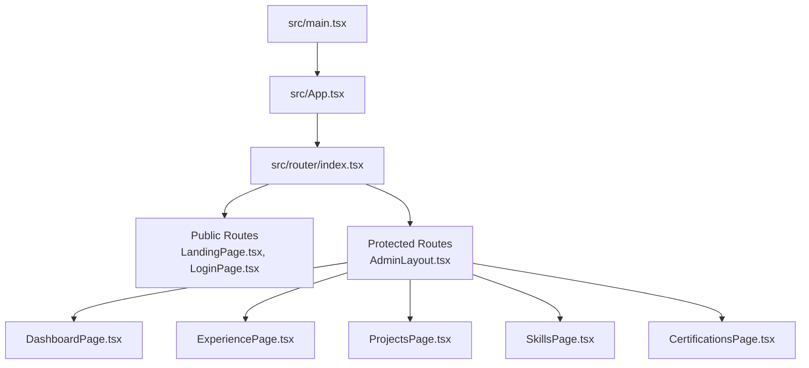
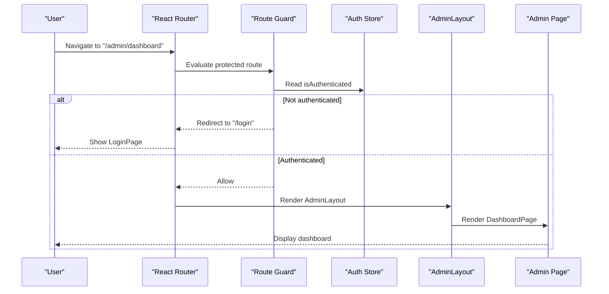
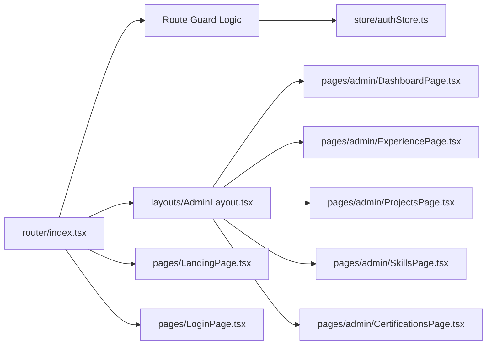

# Routing and Navigation Architecture

<cite>
**Referenced Files in This Document**
- [main.tsx](file://src/main.tsx)
- [App.tsx](file://src/App.tsx)
- [index.tsx](file://src/router/index.tsx)
- [AdminLayout.tsx](file://src/layouts/AdminLayout.tsx)
- [authStore.ts](file://src/store/authStore.ts)
- [LandingPage.tsx](file://src/pages/LandingPage.tsx)
- [LoginPage.tsx](file://src/pages/LoginPage.tsx)
- [DashboardPage.tsx](file://src/pages/admin/DashboardPage.tsx)
- [ExperiencePage.tsx](file://src/pages/admin/ExperiencePage.tsx)
- [ProjectsPage.tsx](file://src/pages/admin/ProjectsPage.tsx)
- [SkillsPage.tsx](file://src/pages/admin/SkillsPage.tsx)
- [CertificationsPage.tsx](file://src/pages/admin/CertificationsPage.tsx)
</cite>

## Table of Contents
1. [Introduction](#introduction)
2. [Project Structure](#project-structure)
3. [Core Components](#core-components)
4. [Architecture Overview](#architecture-overview)
5. [Detailed Component Analysis](#detailed-component-analysis)
6. [Dependency Analysis](#dependency-analysis)
7. [Performance Considerations](#performance-considerations)
8. [Troubleshooting Guide](#troubleshooting-guide)
9. [Conclusion](#conclusion)

## Introduction
This document explains the client-side routing architecture built with React Router. It covers route configuration, protected routes for admin functionality, navigation patterns between public and private sections, integration with authentication state, layout system using AdminLayout, route guards, lazy loading strategies, URL conventions, parameter handling, and programmatic navigation.

## Project Structure
The routing layer is centralized under src/router, while pages are organized into public (root-level) and private (admin) folders. The application entry point initializes the router and integrates authentication context. Layouts encapsulate shared UI chrome for grouped routes.

**Diagram sources**
- [main.tsx:1-50](file://src/main.tsx#L1-L50)
- [App.tsx:1-80](file://src/App.tsx#L1-L80)
- [index.tsx:1-120](file://src/router/index.tsx#L1-L120)
- [AdminLayout.tsx:1-120](file://src/layouts/AdminLayout.tsx#L1-L120)
- [LandingPage.tsx:1-60](file://src/pages/LandingPage.tsx#L1-L60)
- [LoginPage.tsx:1-60](file://src/pages/LoginPage.tsx#L1-L60)
- [DashboardPage.tsx:1-60](file://src/pages/admin/DashboardPage.tsx#L1-L60)
- [ExperiencePage.tsx:1-60](file://src/pages/admin/ExperiencePage.tsx#L1-L60)
- [ProjectsPage.tsx:1-60](file://src/pages/admin/ProjectsPage.tsx#L1-L60)
- [SkillsPage.tsx:1-60](file://src/pages/admin/SkillsPage.tsx#L1-L60)
- [CertificationsPage.tsx:1-60](file://src/pages/admin/CertificationsPage.tsx#L1-L60)

**Section sources**
- [main.tsx:1-50](file://src/main.tsx#L1-L50)
- [App.tsx:1-80](file://src/App.tsx#L1-L80)
- [index.tsx:1-120](file://src/router/index.tsx#L1-L120)

## Core Components
- Router configuration: Centralized route definitions under src/router/index.tsx define public and protected routes, nested layouts, and route parameters.
- Authentication store: src/store/authStore.ts exposes the current authentication state used by route guards to protect admin routes.
- Layout system: src/layouts/AdminLayout.tsx provides a consistent shell for all admin pages, including navigation and content area.
- Public pages: Landing and login pages live at the root level and are accessible without authentication.
- Admin pages: Dashboard, Experience, Projects, Skills, and Certifications reside under src/pages/admin and are protected behind an authenticated guard.

Key responsibilities:
- Route index orchestrates route hierarchy and guards.
- Auth store supplies isAuthenticated and user metadata consumed by guards.
- AdminLayout renders sidebar/header and <Outlet /> for nested admin routes.
- Pages implement feature-specific UI and use hooks for navigation and params.

**Section sources**
- [index.tsx:1-120](file://src/router/index.tsx#L1-L120)
- [authStore.ts:1-120](file://src/store/authStore.ts#L1-L120)
- [AdminLayout.tsx:1-120](file://src/layouts/AdminLayout.tsx#L1-L120)
- [LandingPage.tsx:1-60](file://src/pages/LandingPage.tsx#L1-L60)
- [LoginPage.tsx:1-60](file://src/pages/LoginPage.tsx#L1-L60)
- [DashboardPage.tsx:1-60](file://src/pages/admin/DashboardPage.tsx#L1-L60)
- [ExperiencePage.tsx:1-60](file://src/pages/admin/ExperiencePage.tsx#L1-L60)
- [ProjectsPage.tsx:1-60](file://src/pages/admin/ProjectsPage.tsx#L1-L60)
- [SkillsPage.tsx:1-60](file://src/pages/admin/SkillsPage.tsx#L1-L60)
- [CertificationsPage.tsx:1-60](file://src/pages/admin/CertificationsPage.tsx#L1-L60)

## Architecture Overview
The router composes public and protected sections. Protected routes wrap child routes with AdminLayout and enforce authentication via a guard that reads from authStore. Public routes render landing and login flows. Nested admin routes share layout and can access route parameters and search states.

**Diagram sources**
- [index.tsx:1-120](file://src/router/index.tsx#L1-L120)
- [authStore.ts:1-120](file://src/store/authStore.ts#L1-L120)
- [AdminLayout.tsx:1-120](file://src/layouts/AdminLayout.tsx#L1-L120)
- [DashboardPage.tsx:1-60](file://src/pages/admin/DashboardPage.tsx#L1-L60)

## Detailed Component Analysis

### Router Configuration and Route Guards
- Route index defines:
  - Public routes for landing and login.
  - Protected routes group under /admin with AdminLayout wrapper.
  - Child routes for each admin feature.
- Route guard logic:
  - Reads authentication state from authStore.
  - Redirects unauthenticated users to login.
  - Allows authenticated users to proceed to requested admin page.

Best practices applied:
- Centralized route definitions for clarity and maintainability.
- Consistent protection pattern across all admin routes.
- Clear separation between public and private sections.

**Section sources**
- [index.tsx:1-120](file://src/router/index.tsx#L1-L120)
- [authStore.ts:1-120](file://src/store/authStore.ts#L1-L120)

### AdminLayout and Nested Routes
- AdminLayout provides:
  - Shared header/sidebar for navigation within admin section.
  - Outlet component to render nested admin pages.
- Nested routes:
  - Dashboard, Experience, Projects, Skills, Certifications are children of /admin.
  - Each page receives props from React Router for params and search state.

Benefits:
- Consistent visual structure across admin pages.
- Reduced duplication of navigation and chrome.
- Easy addition of new admin features under the same layout.

**Section sources**
- [AdminLayout.tsx:1-120](file://src/layouts/AdminLayout.tsx#L1-L120)
- [DashboardPage.tsx:1-60](file://src/pages/admin/DashboardPage.tsx#L1-L60)
- [ExperiencePage.tsx:1-60](file://src/pages/admin/ExperiencePage.tsx#L1-L60)
- [ProjectsPage.tsx:1-60](file://src/pages/admin/ProjectsPage.tsx#L1-L60)
- [SkillsPage.tsx:1-60](file://src/pages/admin/SkillsPage.tsx#L1-L60)
- [CertificationsPage.tsx:1-60](file://src/pages/admin/CertificationsPage.tsx#L1-L60)

### Public vs Private Navigation Patterns
- Public navigation:
  - Landing page links to login or other public resources.
  - Login page handles authentication flow and redirects on success.
- Private navigation:
  - Admin pages navigate internally using the router API.
  - Programmatic navigation uses hooks to move between admin sections.

Patterns:
- Declarative navigation for static links.
- Programmatic navigation for dynamic flows (e.g., post-login redirect).
- Query parameters for filters and search within admin pages.

**Section sources**
- [LandingPage.tsx:1-60](file://src/pages/LandingPage.tsx#L1-L60)
- [LoginPage.tsx:1-60](file://src/pages/LoginPage.tsx#L1-L60)
- [DashboardPage.tsx:1-60](file://src/pages/admin/DashboardPage.tsx#L1-L60)

### URL Structure Conventions and Parameter Handling
- URL conventions:
  - Public routes at root (/).
  - Admin routes under /admin/* for clear separation.
  - Feature-specific segments (e.g., /admin/experience, /admin/projects).
- Parameter handling:
  - Path parameters for resource IDs where applicable.
  - Search parameters for filtering and pagination.
  - State passed via navigation for transient data.

Guidelines:
- Keep URLs predictable and readable.
- Use query strings for non-identity concerns (filters, sorting).
- Validate and sanitize path/search parameters before use.

**Section sources**
- [index.tsx:1-120](file://src/router/index.tsx#L1-L120)
- [DashboardPage.tsx:1-60](file://src/pages/admin/DashboardPage.tsx#L1-L60)
- [ExperiencePage.tsx:1-60](file://src/pages/admin/ExperiencePage.tsx#L1-L60)
- [ProjectsPage.tsx:1-60](file://src/pages/admin/ProjectsPage.tsx#L1-L60)
- [SkillsPage.tsx:1-60](file://src/pages/admin/SkillsPage.tsx#L1-L60)
- [CertificationsPage.tsx:1-60](file://src/pages/admin/CertificationsPage.tsx#L1-L60)

### Lazy Loading Strategies
- Strategy:
  - Load admin pages lazily to reduce initial bundle size.
  - Defer heavy components until they are needed.
- Benefits:
  - Faster initial load times.
  - Improved perceived performance on first visit.
- Implementation notes:
  - Wrap route components with dynamic imports.
  - Ensure fallback UI during loading if necessary.

**Section sources**
- [index.tsx:1-120](file://src/router/index.tsx#L1-L120)

### Programmatic Navigation Patterns
- Common patterns:
  - Navigate after successful login to return to intended destination.
  - Redirect to login when accessing protected routes without authentication.
  - Switch between admin sections based on user actions.
- Hooks usage:
  - Use navigation hooks for imperative control.
  - Combine with search/state for rich interactions.

**Section sources**
- [LoginPage.tsx:1-60](file://src/pages/LoginPage.tsx#L1-L60)
- [DashboardPage.tsx:1-60](file://src/pages/admin/DashboardPage.tsx#L1-L60)

## Dependency Analysis
The router depends on authentication state and layout components. Pages depend on router hooks for navigation and parameters.

**Diagram sources**
- [index.tsx:1-120](file://src/router/index.tsx#L1-L120)
- [authStore.ts:1-120](file://src/store/authStore.ts#L1-L120)
- [AdminLayout.tsx:1-120](file://src/layouts/AdminLayout.tsx#L1-L120)
- [LandingPage.tsx:1-60](file://src/pages/LandingPage.tsx#L1-L60)
- [LoginPage.tsx:1-60](file://src/pages/LoginPage.tsx#L1-L60)
- [DashboardPage.tsx:1-60](file://src/pages/admin/DashboardPage.tsx#L1-L60)
- [ExperiencePage.tsx:1-60](file://src/pages/admin/ExperiencePage.tsx#L1-L60)
- [ProjectsPage.tsx:1-60](file://src/pages/admin/ProjectsPage.tsx#L1-L60)
- [SkillsPage.tsx:1-60](file://src/pages/admin/SkillsPage.tsx#L1-L60)
- [CertificationsPage.tsx:1-60](file://src/pages/admin/CertificationsPage.tsx#L1-L60)

**Section sources**
- [index.tsx:1-120](file://src/router/index.tsx#L1-L120)
- [authStore.ts:1-120](file://src/store/authStore.ts#L1-L120)

## Performance Considerations
- Lazy-load admin pages to minimize initial payload.
- Keep public routes lightweight for fast first paint.
- Avoid unnecessary re-renders by memoizing layout and frequently used components.
- Use search parameters for filters instead of heavy state updates.
- Preload critical assets and defer non-critical code.

[No sources needed since this section provides general guidance]

## Troubleshooting Guide
Common issues and resolutions:
- Unauthenticated redirect loops:
  - Ensure auth store reflects current session state.
  - Verify guard logic redirects to login only when not authenticated.
- Missing layout rendering:
  - Confirm nested routes are wrapped with AdminLayout.
  - Check that outlet is present in layout.
- Navigation not updating URL:
  - Use correct navigation hooks and ensure proper dependencies.
  - Validate route paths match configured routes.
- Parameters not available:
  - Verify path parameters are defined in route config.
  - Access search parameters via appropriate hooks.

**Section sources**
- [index.tsx:1-120](file://src/router/index.tsx#L1-L120)
- [authStore.ts:1-120](file://src/store/authStore.ts#L1-L120)
- [AdminLayout.tsx:1-120](file://src/layouts/AdminLayout.tsx#L1-L120)

## Conclusion
The routing architecture cleanly separates public and private sections, enforces authentication through route guards, and leverages AdminLayout for consistent admin experiences. Lazy loading improves performance, while well-defined URL conventions and navigation patterns support scalable growth. Following these guidelines ensures maintainable and user-friendly navigation across the application.

[No sources needed since this section summarizes without analyzing specific files]