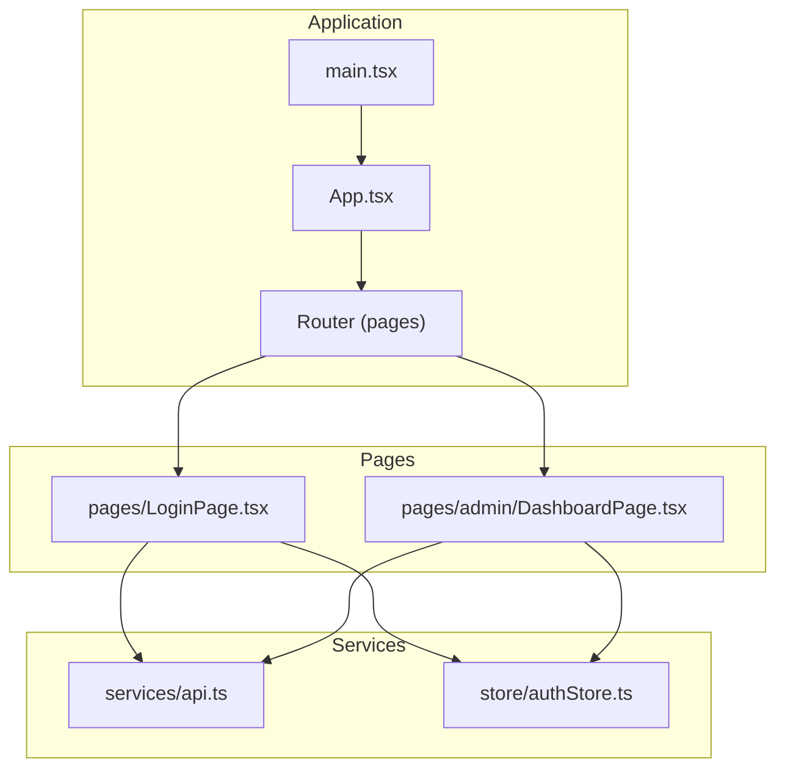
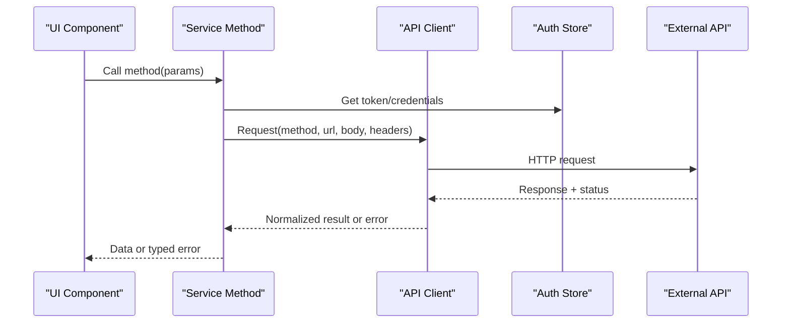
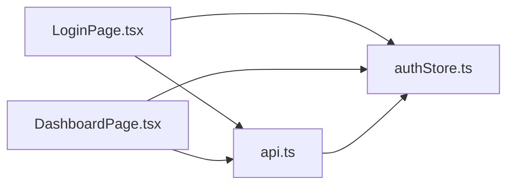

# Service Layer and API Integration

<cite>
**Referenced Files in This Document**
- [api.ts](file://src/services/api.ts)
- [authStore.ts](file://src/store/authStore.ts)
- [LoginPage.tsx](file://src/pages/LoginPage.tsx)
- [DashboardPage.tsx](file://src/pages/admin/DashboardPage.tsx)
- [App.tsx](file://src/App.tsx)
- [main.tsx](file://src/main.tsx)
</cite>

## Table of Contents
1. [Introduction](#introduction)
2. [Project Structure](#project-structure)
3. [Core Components](#core-components)
4. [Architecture Overview](#architecture-overview)
5. [Detailed Component Analysis](#detailed-component-analysis)
6. [Dependency Analysis](#dependency-analysis)
7. [Performance Considerations](#performance-considerations)
8. [Troubleshooting Guide](#troubleshooting-guide)
9. [Conclusion](#conclusion)

## Introduction
This document explains the service layer architecture that abstracts external dependencies and API communications. It focuses on how a centralized API client is implemented, how requests and responses are handled consistently, and how errors are managed across the application. It also describes how services provide clean interfaces to components while hiding implementation details, including data fetching patterns, caching strategies, offline handling considerations, authentication integration, and testing strategies for mocking external dependencies.

## Project Structure
The service layer is centered around a single API client module that encapsulates HTTP interactions. Authentication state is maintained in a store and consumed by pages and other components. The entry points initialize the app and routing, which then render pages that consume the API client through service abstractions.

**Diagram sources**
- [main.tsx](file://src/main.tsx)
- [App.tsx](file://src/App.tsx)
- [api.ts](file://src/services/api.ts)
- [authStore.ts](file://src/store/authStore.ts)
- [LoginPage.tsx](file://src/pages/LoginPage.tsx)
- [DashboardPage.tsx](file://src/pages/admin/DashboardPage.tsx)

**Section sources**
- [main.tsx](file://src/main.tsx)
- [App.tsx](file://src/App.tsx)
- [api.ts](file://src/services/api.ts)
- [authStore.ts](file://src/store/authStore.ts)
- [LoginPage.tsx](file://src/pages/LoginPage.tsx)
- [DashboardPage.tsx](file://src/pages/admin/DashboardPage.tsx)

## Core Components
- Centralized API Client: A single module provides methods for HTTP operations with consistent request/response handling, error normalization, and optional caching or offline behavior.
- Authentication Store: Holds authentication state and tokens, exposing actions to update state and helpers to attach credentials to requests.
- Page Consumers: Pages call service methods from the API client, handle loading states, and present user-friendly errors.

Key responsibilities:
- API client: Base URL configuration, headers management, serialization/deserialization, retries, timeouts, and error mapping.
- Auth store: Token lifecycle, login/logout flows, and intercepting requests to inject authorization headers.
- Services: Thin wrappers over the API client that expose domain-specific methods (e.g., fetchUser, createProject).

**Section sources**
- [api.ts](file://src/services/api.ts)
- [authStore.ts](file://src/store/authStore.ts)
- [LoginPage.tsx](file://src/pages/LoginPage.tsx)
- [DashboardPage.tsx](file://src/pages/admin/DashboardPage.tsx)

## Architecture Overview
The service layer sits between UI components and external APIs. It centralizes network concerns and exposes simple functions to callers. Authentication is integrated via the auth store, ensuring secure requests without leaking secrets into components.

**Diagram sources**
- [api.ts](file://src/services/api.ts)
- [authStore.ts](file://src/store/authStore.ts)
- [LoginPage.tsx](file://src/pages/LoginPage.tsx)
- [DashboardPage.tsx](file://src/pages/admin/DashboardPage.tsx)

## Detailed Component Analysis

### Centralized API Client
Responsibilities:
- Base URL and default headers configuration
- Request transformation (serialization, headers, auth injection)
- Response parsing and validation
- Error normalization and mapping to consistent shapes
- Optional features: retries, timeouts, caching, offline queueing

Typical method signatures:
- get<T>(url: string, options?): Promise<Result<T>>
- post<T>(url: string, body?, options?): Promise<Result<T>>
- put<T>(url: string, body?, options?): Promise<Result<T>>
- delete(url: string, options?): Promise<void>

Request/response pattern:
- Input: URL, HTTP method, payload, headers, query params
- Output: Typed data wrapped in a consistent result object containing success flag, data, and error metadata

Error management strategy:
- Network errors mapped to a common error type
- HTTP status codes grouped into categories (client/server/network)
- User-facing messages derived from server payloads when available

Caching and offline handling:
- In-memory cache keyed by URL and params with TTL
- Stale-while-revalidate for improved perceived performance
- Offline detection using navigator.onLine; queue mutations until connectivity resumes

Authentication integration:
- Read token from auth store and attach Authorization header
- Handle 401 by triggering refresh or redirect to login

Testing approach:
- Mock fetch or HTTP library at the client level
- Provide test utilities to simulate network delays and failures
- Assert normalized error shapes and response types

**Section sources**
- [api.ts](file://src/services/api.ts)

### Authentication Store
Responsibilities:
- Maintain current user and token state
- Provide login/logout actions
- Expose helper to determine if user is authenticated
- Optionally persist token securely

Integration with API client:
- Inject Authorization header on outgoing requests
- Intercept 401 responses to clear session and redirect

State shape examples:
- isAuthenticated: boolean
- token: string | null
- user: User | null

Actions:
- login(credentials): Promise<void>
- logout(): void
- setToken(token: string): void

**Section sources**
- [authStore.ts](file://src/store/authStore.ts)

### Page Consumers and Service Usage
Pages call service methods exposed by the API client or thin service wrappers. They manage local state for loading, data, and errors.

Example flow:
- On mount, page calls fetchResource()
- While loading, show spinner
- On success, render data
- On error, display friendly message and retry option

Login page example:
- Calls authenticate endpoint via service
- Updates auth store on success
- Redirects to dashboard

Dashboard page example:
- Guards access based on auth store
- Fetches protected resources via service
- Handles unauthorized redirects

**Section sources**
- [LoginPage.tsx](file://src/pages/LoginPage.tsx)
- [DashboardPage.tsx](file://src/pages/admin/DashboardPage.tsx)

### Data Fetching Patterns
Common patterns:
- Single source of truth: All network calls go through the API client
- Typed responses: Use generics to ensure type safety
- Consistent error handling: Centralized error mapping and user feedback
- Loading states: Coordinated per-request or global loading flags

Caching strategies:
- In-memory cache with TTL
- Cache invalidation on mutations
- Prefetching critical data on route transitions

Offline handling:
- Detect connectivity changes
- Queue write operations locally
- Retry queued operations when online

**Section sources**
- [api.ts](file://src/services/api.ts)

### Error Management Strategies
Error taxonomy:
- Network errors (timeout, no internet)
- Client errors (validation, forbidden)
- Server errors (internal server error)
- Auth errors (unauthorized, token expired)

Response format:
- Success: { ok: true, data: T }
- Failure: { ok: false, error: { code, message, details? } }

User experience:
- Map technical errors to actionable messages
- Provide retry mechanisms where appropriate
- Log errors for observability

**Section sources**
- [api.ts](file://src/services/api.ts)

### Testing Strategies for Service Layers
Approaches:
- Unit tests for service methods with mocked HTTP client
- Integration tests against a mock server or test fixtures
- Snapshot tests for stable response structures
- Error path tests for all expected failure modes

Mocking techniques:
- Replace fetch or HTTP client with a test double
- Simulate latency and random failures
- Verify headers, payloads, and error handling paths

Assertions:
- Correct method calls with expected parameters
- Proper error normalization
- State updates in auth store after login/logout

**Section sources**
- [api.ts](file://src/services/api.ts)
- [authStore.ts](file://src/store/authStore.ts)

## Dependency Analysis
The service layer depends on:
- HTTP runtime (fetch or underlying library)
- Auth store for credentials
- UI components for consumption

Components depend on:
- API client for data operations
- Auth store for authentication state

**Diagram sources**
- [LoginPage.tsx](file://src/pages/LoginPage.tsx)
- [DashboardPage.tsx](file://src/pages/admin/DashboardPage.tsx)
- [api.ts](file://src/services/api.ts)
- [authStore.ts](file://src/store/authStore.ts)

**Section sources**
- [LoginPage.tsx](file://src/pages/LoginPage.tsx)
- [DashboardPage.tsx](file://src/pages/admin/DashboardPage.tsx)
- [api.ts](file://src/services/api.ts)
- [authStore.ts](file://src/store/authStore.ts)

## Performance Considerations
- Use caching to reduce redundant network calls
- Implement stale-while-revalidate for responsive UIs
- Debounce rapid mutations and batch requests where possible
- Set appropriate timeouts and retry policies
- Avoid heavy computations on the main thread during data processing

[No sources needed since this section provides general guidance]

## Troubleshooting Guide
Common issues and resolutions:
- 401 Unauthorized: Ensure token is present and valid; trigger refresh or re-login
- Network timeout: Increase timeout or implement exponential backoff
- CORS errors: Verify server CORS settings and preflight requests
- Data not updating: Check cache invalidation logic and mutation endpoints
- Offline mode: Confirm connectivity checks and queue persistence

Diagnostics:
- Log request/response summaries (without sensitive data)
- Track error codes and messages centrally
- Add feature flags for toggling debug logs in development

**Section sources**
- [api.ts](file://src/services/api.ts)
- [authStore.ts](file://src/store/authStore.ts)

## Conclusion
The service layer centralizes API communication, standardizes request/response handling, and unifies error management. By providing clean interfaces to components and hiding implementation details, it improves maintainability and testability. With robust authentication integration, caching, and offline strategies, the system delivers a resilient user experience. Adopting the outlined testing practices ensures reliability during development and production.

[No sources needed since this section summarizes without analyzing specific files]