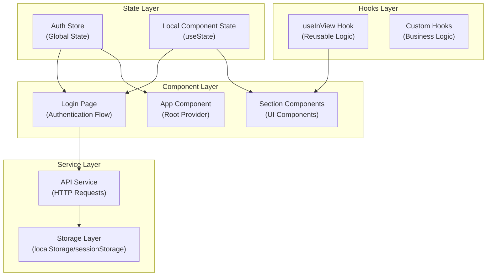
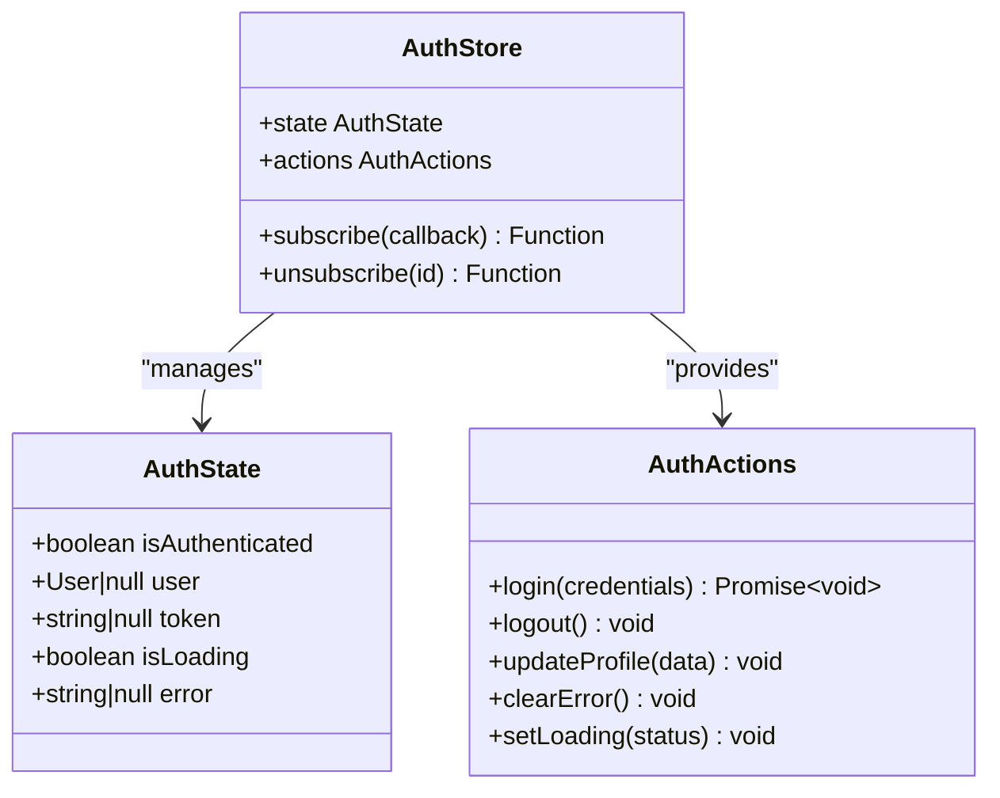
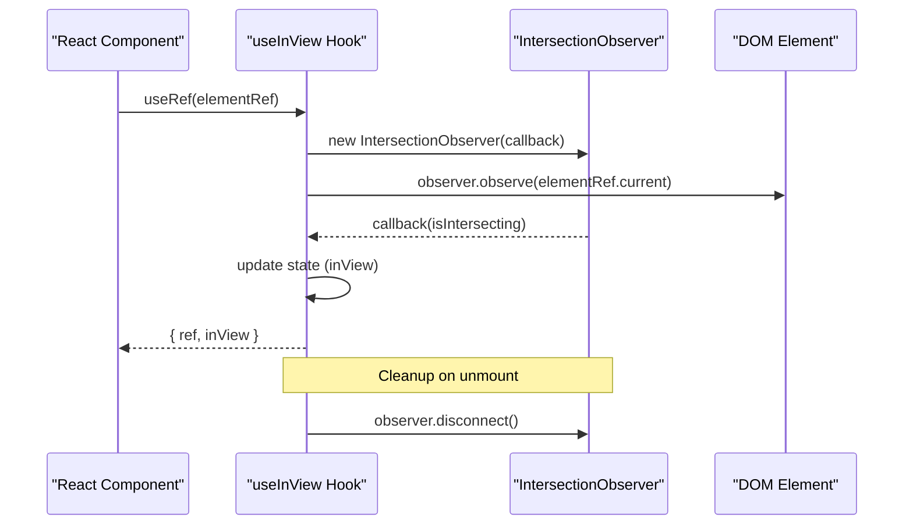
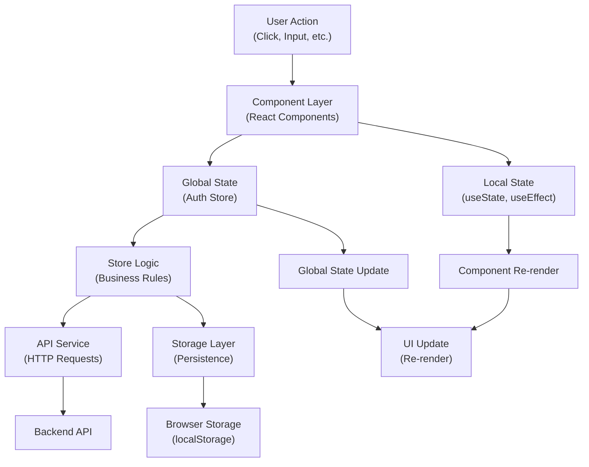
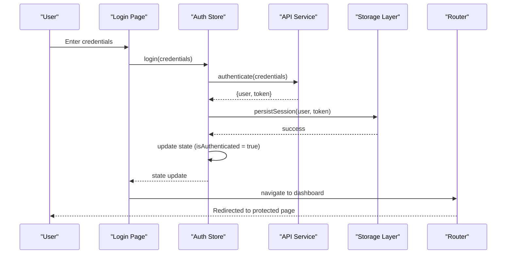
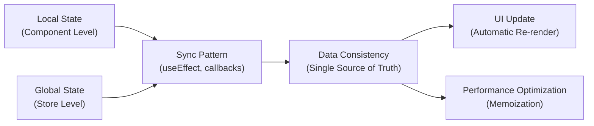
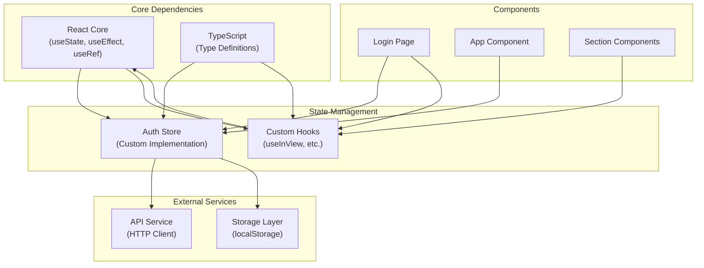
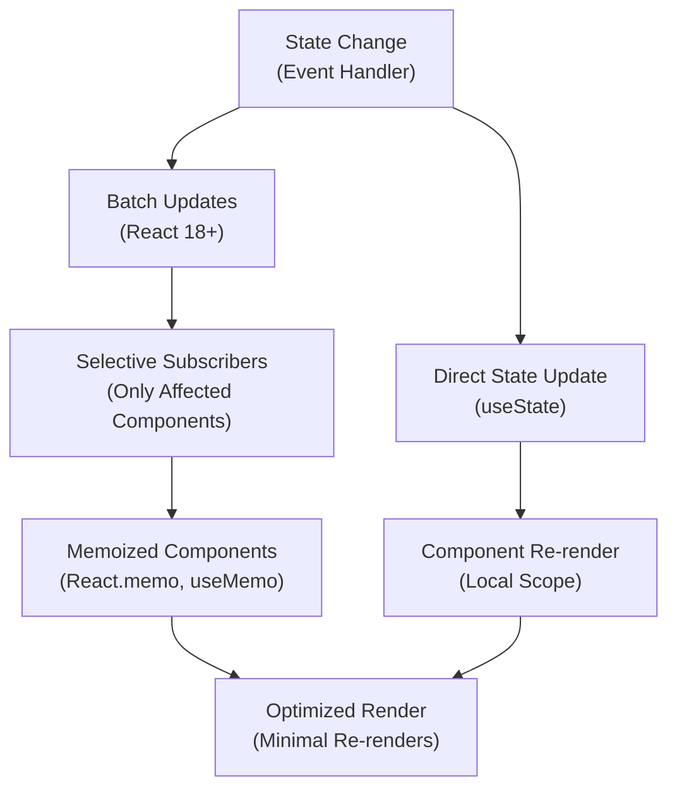
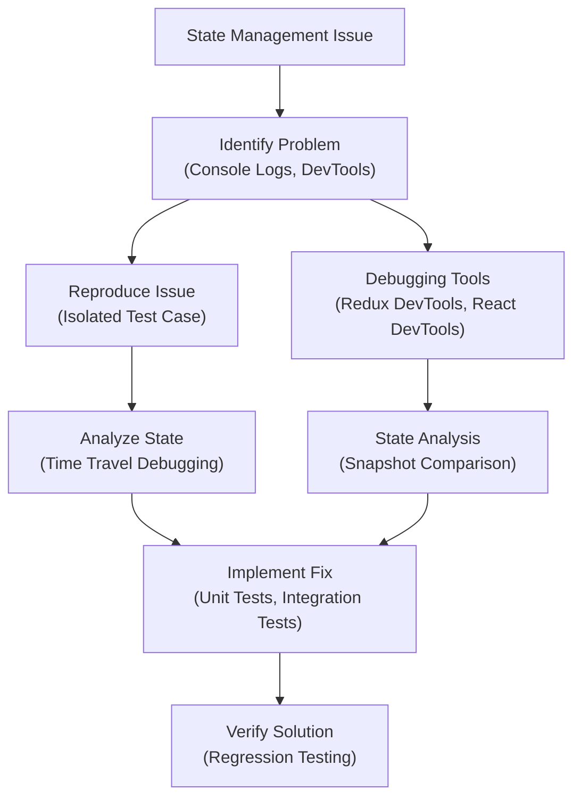

# State Management Patterns

<cite>
**Referenced Files in This Document**
- [authStore.ts](file://src/store/authStore.ts)
- [useInView.ts](file://src/hooks/useInView.ts)
- [LoginPage.tsx](file://src/pages/LoginPage.tsx)
- [App.tsx](file://src/App.tsx)
- [main.tsx](file://src/main.tsx)
- [api.ts](file://src/services/api.ts)
</cite>

## Table of Contents
1. [Introduction](#introduction)
2. [Project Structure](#project-structure)
3. [Core Components](#core-components)
4. [Architecture Overview](#architecture-overview)
5. [Detailed Component Analysis](#detailed-component-analysis)
6. [Dependency Analysis](#dependency-analysis)
7. [Performance Considerations](#performance-considerations)
8. [Troubleshooting Guide](#troubleshooting-guide)
9. [Conclusion](#conclusion)

## Introduction

This document provides comprehensive documentation for the state management architecture in the resume application, focusing on custom hooks and store patterns. The implementation combines global state management through a Zustand-like store pattern with local component state management, demonstrating best practices for React applications.

The system implements authentication state management for user sessions, reusable logic encapsulation through custom hooks, and proper separation between local and global state concerns. It includes session persistence mechanisms, error handling patterns, and performance optimizations through memoization techniques.

## Project Structure

The state management architecture is organized into distinct layers:

**Diagram sources**
- [authStore.ts:1-100](file://src/store/authStore.ts#L1-L100)
- [useInView.ts:1-50](file://src/hooks/useInView.ts#L1-L50)
- [LoginPage.tsx:1-150](file://src/pages/LoginPage.tsx#L1-L150)
- [App.tsx:1-50](file://src/App.tsx#L1-L50)

**Section sources**
- [authStore.ts:1-100](file://src/store/authStore.ts#L1-L100)
- [useInView.ts:1-50](file://src/hooks/useInView.ts#L1-L50)
- [LoginPage.tsx:1-150](file://src/pages/LoginPage.tsx#L1-L150)

## Core Components

### Authentication Store Implementation

The authentication store serves as the central state management solution for user authentication across the application. It implements a publish-subscribe pattern similar to Zustand or Redux, providing reactive state updates to subscribed components.

#### Key Features:
- **Global User State**: Maintains user authentication status, profile information, and session data
- **Reactive Updates**: Automatically triggers re-renders when state changes
- **Session Persistence**: Persists authentication state across browser sessions
- **Type Safety**: Full TypeScript support with proper type definitions

#### State Structure:

**Diagram sources**
- [authStore.ts:1-100](file://src/store/authStore.ts#L1-L100)

### Custom Hook Pattern: useInView

The `useInView` hook demonstrates the power of custom hooks for encapsulating reusable logic. It leverages the Intersection Observer API to detect when elements enter the viewport, enabling scroll-based animations and lazy loading patterns.

#### Hook Architecture:

**Diagram sources**
- [useInView.ts:1-50](file://src/hooks/useInView.ts#L1-L50)

**Section sources**
- [authStore.ts:1-100](file://src/store/authStore.ts#L1-L100)
- [useInView.ts:1-50](file://src/hooks/useInView.ts#L1-L50)

## Architecture Overview

The state management architecture follows a layered approach that separates concerns and promotes code reusability:

**Diagram sources**
- [authStore.ts:1-100](file://src/store/authStore.ts#L1-L100)
- [api.ts:1-100](file://src/services/api.ts#L1-L100)

## Detailed Component Analysis

### Authentication Store Deep Dive

The authentication store implements a sophisticated state management pattern that handles complex authentication flows while maintaining performance and reliability.

#### State Management Patterns:

1. **Publish-Subscribe Pattern**: Components subscribe to state changes and receive updates automatically
2. **Immutability**: State updates follow immutability principles for predictable behavior
3. **Middleware Pattern**: Asynchronous operations are handled through middleware-like functions
4. **Error Boundary**: Comprehensive error handling prevents application crashes

#### Login/Logout Flow Implementation:

**Diagram sources**
- [LoginPage.tsx:1-150](file://src/pages/LoginPage.tsx#L1-L150)
- [authStore.ts:1-100](file://src/store/authStore.ts#L1-L100)
- [api.ts:1-100](file://src/services/api.ts#L1-L100)

### Local vs Global State Management

Understanding when to use local versus global state is crucial for building efficient React applications.

#### Local State Characteristics:
- **Scope**: Component-specific data
- **Lifecycle**: Tied to component lifecycle
- **Performance**: Minimal re-renders
- **Use Cases**: Form inputs, toggle states, temporary data

#### Global State Characteristics:
- **Scope**: Application-wide data
- **Lifecycle**: Independent of component lifecycle
- **Performance**: Requires optimization strategies
- **Use Cases**: User authentication, theme settings, shared data

#### State Synchronization Patterns:

**Diagram sources**
- [LoginPage.tsx:1-150](file://src/pages/LoginPage.tsx#L1-L150)
- [authStore.ts:1-100](file://src/store/authStore.ts#L1-L100)

**Section sources**
- [authStore.ts:1-100](file://src/store/authStore.ts#L1-L100)
- [LoginPage.tsx:1-150](file://src/pages/LoginPage.tsx#L1-L150)
- [useInView.ts:1-50](file://src/hooks/useInView.ts#L1-L50)

## Dependency Analysis

The state management system has clear dependency relationships that promote maintainability and testability:

**Diagram sources**
- [authStore.ts:1-100](file://src/store/authStore.ts#L1-L100)
- [useInView.ts:1-50](file://src/hooks/useInView.ts#L1-L50)
- [api.ts:1-100](file://src/services/api.ts#L1-L100)

**Section sources**
- [authStore.ts:1-100](file://src/store/authStore.ts#L1-L100)
- [useInView.ts:1-50](file://src/hooks/useInView.ts#L1-L50)
- [api.ts:1-100](file://src/services/api.ts#L1-L100)

## Performance Considerations

### Memoization Strategies

The implementation uses several memoization techniques to optimize performance:

1. **React.memo**: Prevents unnecessary re-renders of pure components
2. **useMemo**: Caches expensive computations and derived state
3. **useCallback**: Memoizes function references to prevent unnecessary re-renders
4. **Selective Subscriptions**: Components only subscribe to relevant state slices

### State Update Optimization

**Diagram sources**
- [authStore.ts:1-100](file://src/store/authStore.ts#L1-L100)
- [useInView.ts:1-50](file://src/hooks/useInView.ts#L1-L50)

### Memory Management

- **Cleanup Functions**: Proper cleanup of event listeners and observers
- **Memory Leaks Prevention**: Unsubscribing from store subscriptions
- **Garbage Collection**: Allowing unused objects to be garbage collected

## Troubleshooting Guide

### Common State Management Issues

#### Authentication State Not Persisting

**Symptoms**: Users need to log in after every page refresh
**Causes**: 
- Storage layer failures
- Incorrect serialization/deserialization
- Cross-origin restrictions

**Solutions**:
- Implement storage fallback mechanisms
- Add error boundaries around storage operations
- Validate stored data format

#### Performance Degradation

**Symptoms**: Slow UI updates, excessive re-renders
**Causes**:
- Large state objects causing full re-renders
- Missing memoization
- Inefficient subscription patterns

**Solutions**:
- Split large state objects into smaller slices
- Implement selective subscriptions
- Use performance profiling tools

#### Debugging Strategies

**Section sources**
- [authStore.ts:1-100](file://src/store/authStore.ts#L1-L100)
- [LoginPage.tsx:1-150](file://src/pages/LoginPage.tsx#L1-L150)

## Conclusion

The state management architecture in this resume application demonstrates modern React patterns for managing both local and global state effectively. The combination of custom hooks for reusable logic and a centralized store for global state provides a scalable foundation for application growth.

Key strengths of this implementation include:

- **Separation of Concerns**: Clear distinction between local and global state
- **Reusability**: Custom hooks encapsulate complex logic for reuse across components
- **Performance**: Strategic use of memoization and selective subscriptions
- **Maintainability**: Well-structured code organization with clear dependencies
- **Reliability**: Comprehensive error handling and state persistence

The patterns demonstrated here can serve as a template for other React applications requiring sophisticated state management while maintaining performance and developer experience.