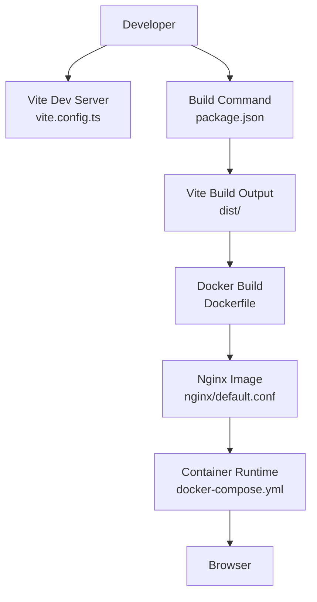
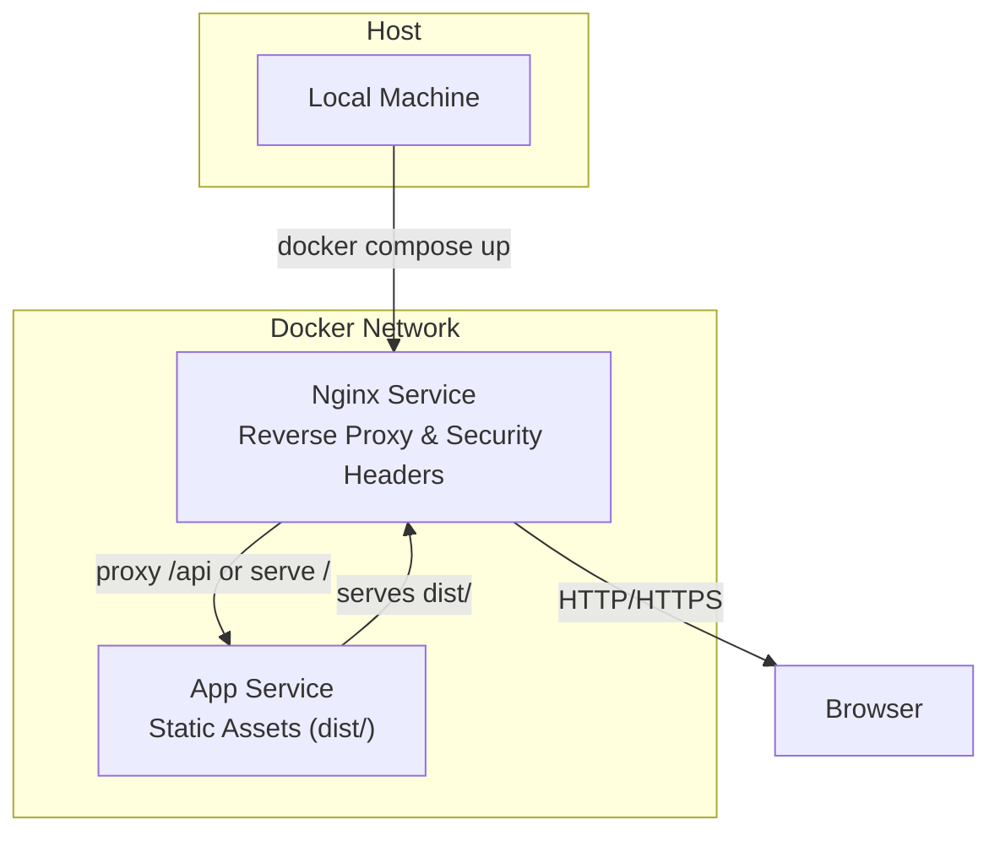
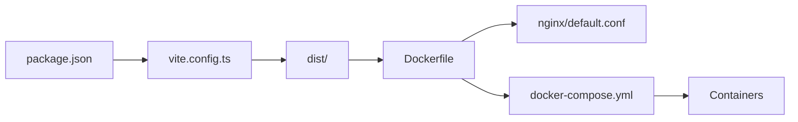

# Build and Deployment

<cite>
**Referenced Files in This Document**
- [vite.config.ts](file://vite.config.ts)
- [package.json](file://package.json)
- [Dockerfile](file://Dockerfile)
- [docker-compose.yml](file://docker-compose.yml)
- [nginx/default.conf](file://nginx/default.conf)
- [.dockerignore](file://.dockerignore)
- [index.html](file://index.html)
</cite>

## Table of Contents
1. [Introduction](#introduction)
2. [Project Structure](#project-structure)
3. [Core Components](#core-components)
4. [Architecture Overview](#architecture-overview)
5. [Detailed Component Analysis](#detailed-component-analysis)
6. [Dependency Analysis](#dependency-analysis)
7. [Performance Considerations](#performance-considerations)
8. [Troubleshooting Guide](#troubleshooting-guide)
9. [Conclusion](#conclusion)
10. [Appendices](#appendices)

## Introduction
This document explains how to build, containerize, and deploy the Resume Portfolio Application. It covers:
- Vite build configuration for development and production
- Docker multi-stage builds and image optimization
- Docker Compose orchestration for local development and deployment
- Nginx reverse proxy, static asset serving, and security headers
- Environment variables, deployment scripts, and monitoring considerations

## Project Structure
The project is a Vite + React application with TypeScript, packaged into a minimal Nginx image using Docker. Key files for build and deployment are:
- vite.config.ts: Vite configuration for dev server and production build
- package.json: Scripts and dependencies
- Dockerfile: Multi-stage build producing a small runtime image
- docker-compose.yml: Orchestration for app and Nginx
- nginx/default.conf: Reverse proxy and static file serving
- .dockerignore: Excludes unnecessary files from Docker context
- index.html: Entry HTML for the SPA

**Diagram sources**
- [vite.config.ts](file://vite.config.ts)
- [package.json](file://package.json)
- [Dockerfile](file://Dockerfile)
- [nginx/default.conf](file://nginx/default.conf)
- [docker-compose.yml](file://docker-compose.yml)

**Section sources**
- [vite.config.ts](file://vite.config.ts)
- [package.json](file://package.json)
- [Dockerfile](file://Dockerfile)
- [docker-compose.yml](file://docker-compose.yml)
- [nginx/default.conf](file://nginx/default.conf)
- [.dockerignore](file://.dockerignore)
- [index.html](file://index.html)

## Core Components
- Vite Configuration: Controls dev server behavior, plugin usage, and production optimizations such as code splitting and minification.
- Dockerfile: Uses a multi-stage approach to compile assets and serve them via a lightweight Nginx image.
- Docker Compose: Defines services for the app and Nginx, environment variables, ports, and health checks.
- Nginx Configuration: Serves static assets, sets cache headers, and applies security headers.

Key responsibilities:
- Development: Fast refresh, hot module replacement, and local proxy if needed.
- Production: Optimized bundle, caching strategies, and secure headers.
- Containerization: Minimal runtime image and reproducible builds.
- Orchestration: Declarative service definitions for consistent environments.

**Section sources**
- [vite.config.ts](file://vite.config.ts)
- [Dockerfile](file://Dockerfile)
- [docker-compose.yml](file://docker-compose.yml)
- [nginx/default.conf](file://nginx/default.conf)

## Architecture Overview
The deployment architecture uses Vite to build the SPA, then serves it through Nginx inside a container. Docker Compose orchestrates the services.

[No sources needed since this diagram shows conceptual workflow, not actual code structure]

## Detailed Component Analysis

### Vite Build Configuration
- Development server:
  - Host binding and port configuration
  - Hot Module Replacement (HMR) enabled by default
  - Optional API proxy settings for backend integration
- Production build:
  - Code splitting and chunking
  - Minification and tree-shaking
  - Asset hashing and cache-busting
  - Base path configuration for deployments under subpaths

Operational notes:
- Use environment variables to toggle features like analytics or API endpoints.
- Ensure publicPath/base aligns with your deployment path.

**Section sources**
- [vite.config.ts](file://vite.config.ts)

### Dockerfile: Multi-Stage Build and Optimization
- Stage 1 (Builder):
  - Install Node.js dependencies
  - Run Vite build to generate optimized static assets
- Stage 2 (Runtime):
  - Use a minimal Nginx base image
  - Copy built assets into Nginx’s web root
  - Configure Nginx for SPA routing and caching
- Image optimization:
  - Avoid installing unnecessary packages in the runtime stage
  - Leverage Docker layer caching by copying dependency manifests first

Runtime configuration:
- Set environment variables at container run time (e.g., API base URL)
- Mount volumes only for development; use read-only images in production

**Section sources**
- [Dockerfile](file://Dockerfile)

### Docker Compose: Local Development and Deployment
- Services:
  - app: Builds and runs the static site via Nginx
  - nginx: Optional reverse proxy for HTTPS termination or domain routing
- Networking:
  - Internal network for inter-service communication
  - Port mapping for local access
- Environment variables:
  - Centralized configuration for API endpoints and feature flags
- Health checks:
  - Liveness and readiness probes for reliable orchestration

Usage:
- Development: docker compose up --build
- Production: docker compose up -d with production overrides

**Section sources**
- [docker-compose.yml](file://docker-compose.yml)

### Nginx Configuration: Reverse Proxy and Static Serving
- Static asset serving:
  - Serve files from the correct directory
  - Enable gzip/brotli compression where applicable
- SPA routing:
  - Rewrite all routes to index.html for client-side routing
- Caching:
  - Cache static assets with long-lived headers
  - Bypass cache for dynamic requests
- Security headers:
  - Content-Security-Policy, X-Frame-Options, X-Content-Type-Options, Referrer-Policy, Strict-Transport-Security
- Reverse proxy:
  - Forward API calls to backend services
  - Preserve headers and handle CORS if required

**Section sources**
- [nginx/default.conf](file://nginx/default.conf)

### Build Scripts and Package Management
- Scripts:
  - Development server start
  - Production build
  - Linting and type checking
- Dependencies:
  - Vite, React, TypeScript, and related tooling
- Lockfile:
  - Deterministic installs for reproducible builds

Best practices:
- Pin versions in lockfiles
- Separate dev and production dependencies
- Validate builds in CI before publishing artifacts

**Section sources**
- [package.json](file://package.json)

### Docker Context and Ignore Rules
- .dockerignore:
  - Exclude node_modules, logs, IDE files, and test artifacts
  - Reduce context size and speed up builds

Impact:
- Faster builds and smaller images
- Reduced risk of leaking sensitive data

**Section sources**
- [.dockerignore](file://.dockerignore)

### Entry Point and SPA Routing
- index.html:
  - Root HTML for the SPA
  - Script and CSS references resolved by Vite
- Client-side routing:
  - Ensured by Nginx fallback to index.html

**Section sources**
- [index.html](file://index.html)

## Dependency Analysis
The build and deployment pipeline has clear separation of concerns:
- Vite handles asset compilation and optimization
- Dockerfile encapsulates build steps and runtime image creation
- Docker Compose defines service relationships and environment
- Nginx serves assets and enforces security policies

**Diagram sources**
- [package.json](file://package.json)
- [vite.config.ts](file://vite.config.ts)
- [Dockerfile](file://Dockerfile)
- [nginx/default.conf](file://nginx/default.conf)
- [docker-compose.yml](file://docker-compose.yml)

**Section sources**
- [package.json](file://package.json)
- [vite.config.ts](file://vite.config.ts)
- [Dockerfile](file://Dockerfile)
- [nginx/default.conf](file://nginx/default.conf)
- [docker-compose.yml](file://docker-compose.yml)

## Performance Considerations
- Vite optimizations:
  - Enable code splitting and minification
  - Use appropriate base path for CDN or subpath deployments
- Docker image size:
  - Prefer slim Nginx base images
  - Avoid copying source code into runtime image
- Caching strategy:
  - Long-lived cache for hashed assets
  - Short cache for HTML to ensure updates propagate
- Network:
  - Enable HTTP/2 or HTTP/3 on Nginx
  - Use gzip/brotli compression
- Monitoring:
  - Add health check endpoints
  - Collect container metrics and logs centrally

[No sources needed since this section provides general guidance]

## Troubleshooting Guide
Common issues and resolutions:
- Build fails due to missing dependencies:
  - Ensure node_modules are not included in Docker context
  - Reinstall dependencies in CI
- SPA routing returns 404:
  - Verify Nginx fallback to index.html
  - Check base path alignment with Vite configuration
- CORS errors when calling APIs:
  - Configure Nginx proxy headers and CORS settings
  - Validate backend CORS policy
- Stale assets in browser:
  - Confirm asset hashing and cache headers
  - Clear browser cache or force reload
- Container networking problems:
  - Inspect docker-compose networks and service names
  - Use internal DNS within the compose network

**Section sources**
- [nginx/default.conf](file://nginx/default.conf)
- [docker-compose.yml](file://docker-compose.yml)
- [vite.config.ts](file://vite.config.ts)

## Conclusion
By combining Vite’s fast builds, Docker’s reproducible packaging, and Nginx’s efficient serving, the Resume Portfolio Application achieves a robust, scalable, and secure deployment. Follow the guidelines for environment configuration, performance tuning, and monitoring to maintain reliability across environments.

[No sources needed since this section summarizes without analyzing specific files]

## Appendices

### Environment Variables
Recommended variables:
- API_BASE_URL: Backend API endpoint
- APP_ENV: Environment name (development, staging, production)
- LOG_LEVEL: Logging verbosity
- FEATURE_FLAGS: Feature toggles for controlled rollouts

Where to set:
- Docker Compose environment sections
- Container runtime env files
- CI/CD secrets and deployment configs

**Section sources**
- [docker-compose.yml](file://docker-compose.yml)

### Deployment Scripts
Suggested script flow:
- Install dependencies
- Run linters and type checks
- Build production assets
- Build Docker image
- Push image to registry
- Deploy to target environment
- Run smoke tests and health checks

Integrate with CI/CD pipelines for automated testing and deployment.

[No sources needed since this section provides general guidance]

### Monitoring Setup
- Metrics:
  - Expose Prometheus-compatible metrics if applicable
  - Track request rates, error rates, and latency
- Logs:
  - Aggregate container logs
  - Correlate logs with trace IDs
- Alerts:
  - Define thresholds for CPU, memory, and error rates
  - Notify on service downtime

[No sources needed since this section provides general guidance]