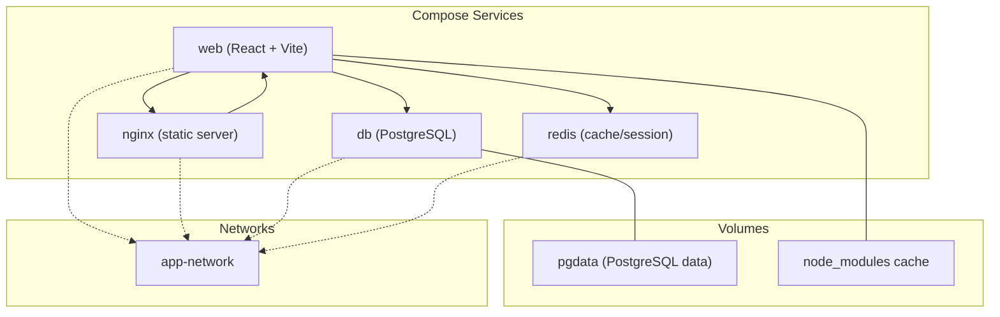
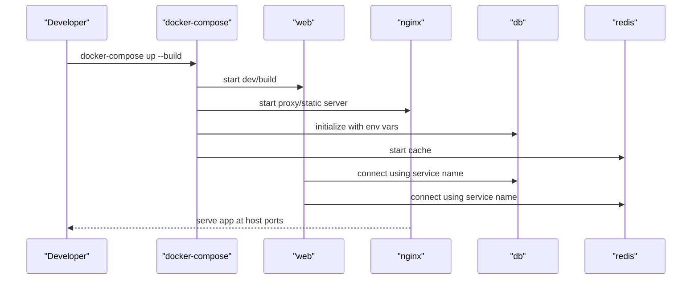
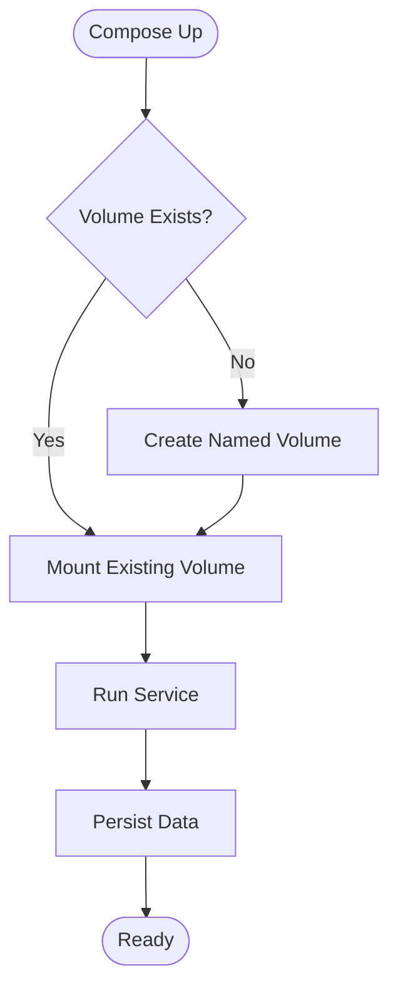
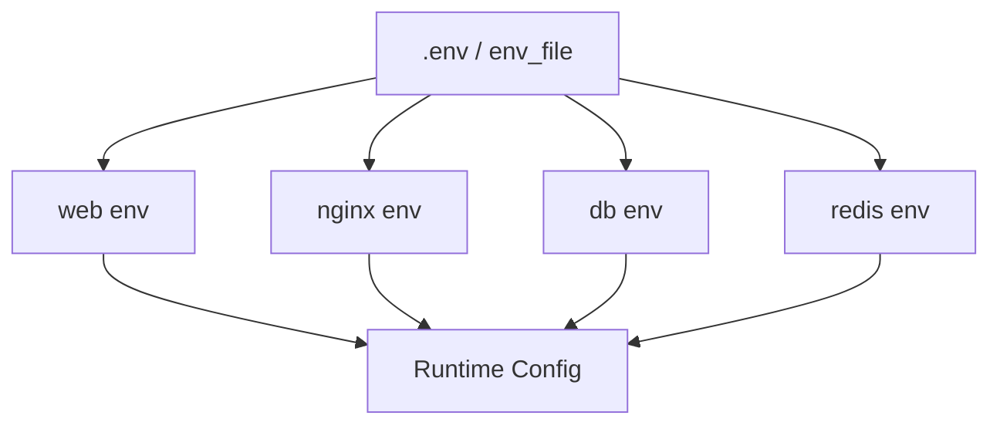
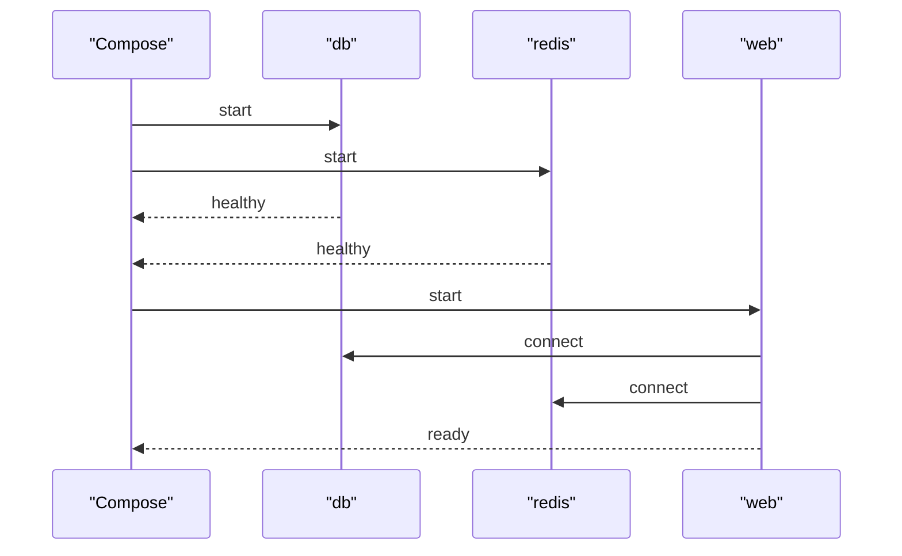
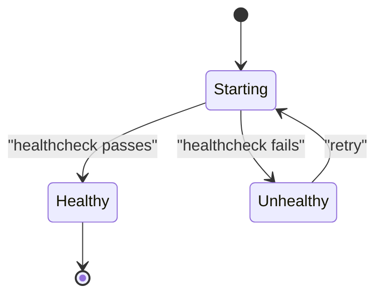
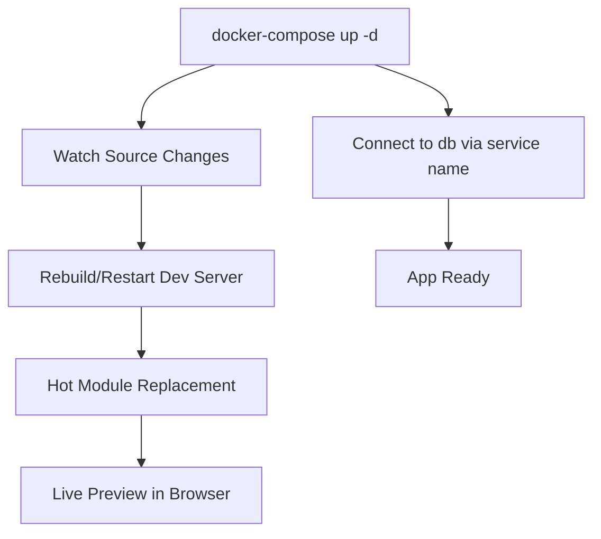
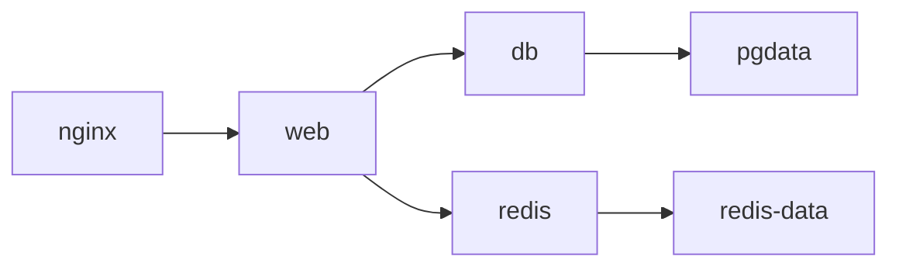

# Docker Compose Setup

<cite>
**Referenced Files in This Document**
- [docker-compose.yml](file://docker-compose.yml)
- [Dockerfile](file://Dockerfile)
- [README.md](file://README.md)
- [nginx/default.conf](file://nginx/default.conf)
- [.dockerignore](file://.dockerignore)
- [package.json](file://package.json)
- [vite.config.ts](file://vite.config.ts)
</cite>

## Table of Contents
1. [Introduction](#introduction)
2. [Project Structure](#project-structure)
3. [Core Components](#core-components)
4. [Architecture Overview](#architecture-overview)
5. [Detailed Component Analysis](#detailed-component-analysis)
6. [Dependency Analysis](#dependency-analysis)
7. [Performance Considerations](#performance-considerations)
8. [Troubleshooting Guide](#troubleshooting-guide)
9. [Conclusion](#conclusion)
10. [Appendices](#appendices)

## Introduction
This document explains how the Resume Portfolio Application is orchestrated with Docker Compose. It covers service definitions, networking, volumes, environment variables, dependency management, health checks, development workflow (including hot reloading), database connections, service discovery, and example compose files for different environments. It also includes troubleshooting guidance for common issues.

## Project Structure
The application is a React/Vite frontend served by Nginx. The repository includes a Dockerfile for building the app image, an Nginx configuration for serving static assets, and a docker-compose.yml that defines services, networks, and volumes.



**Diagram sources**
- [docker-compose.yml](file://docker-compose.yml)
- [nginx/default.conf](file://nginx/default.conf)
- [Dockerfile](file://Dockerfile)

**Section sources**
- [docker-compose.yml](file://docker-compose.yml)
- [Dockerfile](file://Dockerfile)
- [nginx/default.conf](file://nginx/default.conf)

## Core Components
- Service: web
  - Purpose: Build and run the React/Vite application. In development, it runs the Vite dev server with hot module replacement. In production, it builds static assets and serves them via Nginx.
  - Key aspects: Node.js runtime, build dependencies, port exposure, environment variables, dependency on db/redis, optional volume mounts for hot reload.
- Service: nginx
  - Purpose: Serve built static assets in production and proxy requests to the web service during development if needed.
  - Key aspects: Custom default.conf mapping, port mapping, depends_on web, network membership.
- Service: db
  - Purpose: Provide PostgreSQL persistence for application data.
  - Key aspects: Image selection, environment variables for credentials, named volume for data durability, health check.
- Service: redis
  - Purpose: Provide caching or session storage.
  - Key aspects: Image selection, port exposure, optional volume for persistence, health check.

**Section sources**
- [docker-compose.yml](file://docker-compose.yml)
- [nginx/default.conf](file://nginx/default.conf)
- [Dockerfile](file://Dockerfile)

## Architecture Overview
The system uses a multi-service architecture orchestrated by Docker Compose:
- Frontend (web) builds and serves the React app; in development, it exposes a dev server for live reload.
- Nginx acts as the reverse proxy and static asset server in production.
- PostgreSQL stores application data with a persistent volume.
- Redis provides caching/session capabilities.
- All services communicate over a shared Docker network.



**Diagram sources**
- [docker-compose.yml](file://docker-compose.yml)
- [nginx/default.conf](file://nginx/default.conf)

**Section sources**
- [docker-compose.yml](file://docker-compose.yml)
- [nginx/default.conf](file://nginx/default.conf)

## Detailed Component Analysis

### Service Definitions
- web
  - Build context and target stage for optimized images.
  - Environment variables for API endpoints, feature flags, and runtime settings.
  - Ports exposed for local development and testing.
  - Dependencies on db and redis via depends_on and network.
  - Optional volume mount for source code to enable hot reloading in development.
- nginx
  - Mounts custom default.conf for routing and proxy rules.
  - Maps host ports to container ports.
  - Depends on web service availability.
- db
  - Uses a PostgreSQL image with environment variables for initialization.
  - Persistent volume for data retention across restarts.
  - Health check to ensure readiness before dependent services connect.
- redis
  - Uses a Redis image with minimal configuration.
  - Optional persistence volume.
  - Health check for readiness.

**Section sources**
- [docker-compose.yml](file://docker-compose.yml)
- [Dockerfile](file://Dockerfile)
- [nginx/default.conf](file://nginx/default.conf)

### Network Configuration
- A dedicated bridge network isolates application services.
- Services join the same network to resolve each other by service name.
- External access is limited to explicitly mapped ports.

```mermaid
graph TB
subgraph "Host"
Host["Host Machine"]
end
subgraph "Docker Network"
Net["app-network"]
Web["web"]
Nginx["nginx"]
DB["db"]
Redis["redis"]
end
Host --> |ports| Nginx
Web --- Net
Nginx --- Net
DB --- Net
Redis --- Net
```

**Diagram sources**
- [docker-compose.yml](file://docker-compose.yml)

**Section sources**
- [docker-compose.yml](file://docker-compose.yml)

### Volume Management
- Named volumes persist database and cache data across container lifecycles.
- Bind mounts may be used in development to sync source code and speed up iteration.
- Ensure .dockerignore excludes unnecessary files to reduce build context size.



**Diagram sources**
- [docker-compose.yml](file://docker-compose.yml)
- [.dockerignore](file://.dockerignore)

**Section sources**
- [docker-compose.yml](file://docker-compose.yml)
- [.dockerignore](file://.dockerignore)

### Environment Variables
- Centralize configuration via environment variables for each service.
- Use .env files for local overrides and secrets management best practices.
- Examples include database connection strings, Redis URLs, API base URLs, and feature toggles.



**Diagram sources**
- [docker-compose.yml](file://docker-compose.yml)

**Section sources**
- [docker-compose.yml](file://docker-compose.yml)

### Dependency Management Between Services
- depends_on ensures startup order where applicable.
- Health checks prevent premature connections to db/redis.
- Retry logic in application code should handle transient failures.



**Diagram sources**
- [docker-compose.yml](file://docker-compose.yml)

**Section sources**
- [docker-compose.yml](file://docker-compose.yml)

### Health Checks
- Define health checks for db and redis to ensure readiness.
- Optionally add health checks for web/nginx to monitor liveness.
- Use retry intervals and timeouts appropriate for your environment.



**Diagram sources**
- [docker-compose.yml](file://docker-compose.yml)

**Section sources**
- [docker-compose.yml](file://docker-compose.yml)

### Development Workflow
- Hot Reloading:
  - Mount source directories into the web container.
  - Expose the Vite dev server port for live updates.
  - Configure CORS and proxy settings in vite.config.ts if needed.
- Database Connections:
  - Connect to db using the service name within the Docker network.
  - Initialize schema via migration scripts or seeders on first run.
- Service Discovery:
  - Use service names as hostnames (e.g., http://db:5432).
  - Avoid hardcoding localhost; rely on Docker DNS resolution.



**Diagram sources**
- [docker-compose.yml](file://docker-compose.yml)
- [vite.config.ts](file://vite.config.ts)

**Section sources**
- [docker-compose.yml](file://docker-compose.yml)
- [vite.config.ts](file://vite.config.ts)

### Production vs Development Differences
- Development:
  - Runs Vite dev server with hot reload.
  - Exposes debug ports and verbose logs.
  - May skip heavy optimizations.
- Production:
  - Builds static assets and serves via Nginx.
  - Minimizes image size and attack surface.
  - Uses non-root users and read-only filesystems where possible.

**Section sources**
- [Dockerfile](file://Dockerfile)
- [nginx/default.conf](file://nginx/default.conf)

## Dependency Analysis
The following diagram shows how services depend on each other and external resources.



**Diagram sources**
- [docker-compose.yml](file://docker-compose.yml)

**Section sources**
- [docker-compose.yml](file://docker-compose.yml)

## Performance Considerations
- Multi-stage builds to minimize final image size.
- Cache Node modules between builds using named volumes.
- Use .dockerignore to exclude dev dependencies and unnecessary files.
- Prefer Alpine-based images for smaller footprints when compatible.
- Tune health check intervals and timeouts to avoid flapping.
- Enable gzip/brotli in Nginx for static assets.

[No sources needed since this section provides general guidance]

## Troubleshooting Guide
Common issues and resolutions:
- Port conflicts:
  - Symptom: Failed to bind to port.
  - Resolution: Change host port mappings or stop conflicting processes.
- Network connectivity:
  - Symptom: Cannot reach db/redis from web.
  - Resolution: Verify both services are on the same network and use service names.
- Volume permissions:
  - Symptom: Permission denied writing to mounted volumes.
  - Resolution: Adjust user IDs or ownership of host directories.
- Health check failures:
  - Symptom: Services marked unhealthy.
  - Resolution: Inspect logs, adjust health check commands/timeouts.
- Build context too large:
  - Symptom: Slow builds.
  - Resolution: Update .dockerignore and prune unused files.
- Hot reload not working:
  - Symptom: Changes not reflected.
  - Resolution: Ensure correct volume mounts and watch paths; verify Vite config.

**Section sources**
- [docker-compose.yml](file://docker-compose.yml)
- [.dockerignore](file://.dockerignore)
- [nginx/default.conf](file://nginx/default.conf)

## Conclusion
Docker Compose provides a robust way to orchestrate the Resume Portfolio Application across development and production environments. By defining clear service boundaries, networks, volumes, and environment variables, you achieve consistent behavior and easy scalability. Adopting health checks, proper dependency ordering, and performance-oriented builds ensures reliability and efficiency.

[No sources needed since this section summarizes without analyzing specific files]

## Appendices

### Example Compose Files for Different Environments
- Development (docker-compose.dev.yml):
  - Mount source code for hot reload.
  - Expose dev server ports.
  - Set verbose logging and development-specific env vars.
- Staging (docker-compose.staging.yml):
  - Build production image but keep some debug features.
  - Use staging databases and caches.
  - Apply stricter security policies.
- Production (docker-compose.prod.yml):
  - Build optimized static assets.
  - Serve via Nginx only.
  - Use secret management and minimal base images.

[No sources needed since this section provides conceptual examples]

### Quick Commands
- Start all services: docker-compose up -d
- View logs: docker-compose logs -f
- Restart a service: docker-compose restart <service>
- Scale services: docker-compose up --scale web=2
- Stop and remove: docker-compose down -v

[No sources needed since this section provides general guidance]