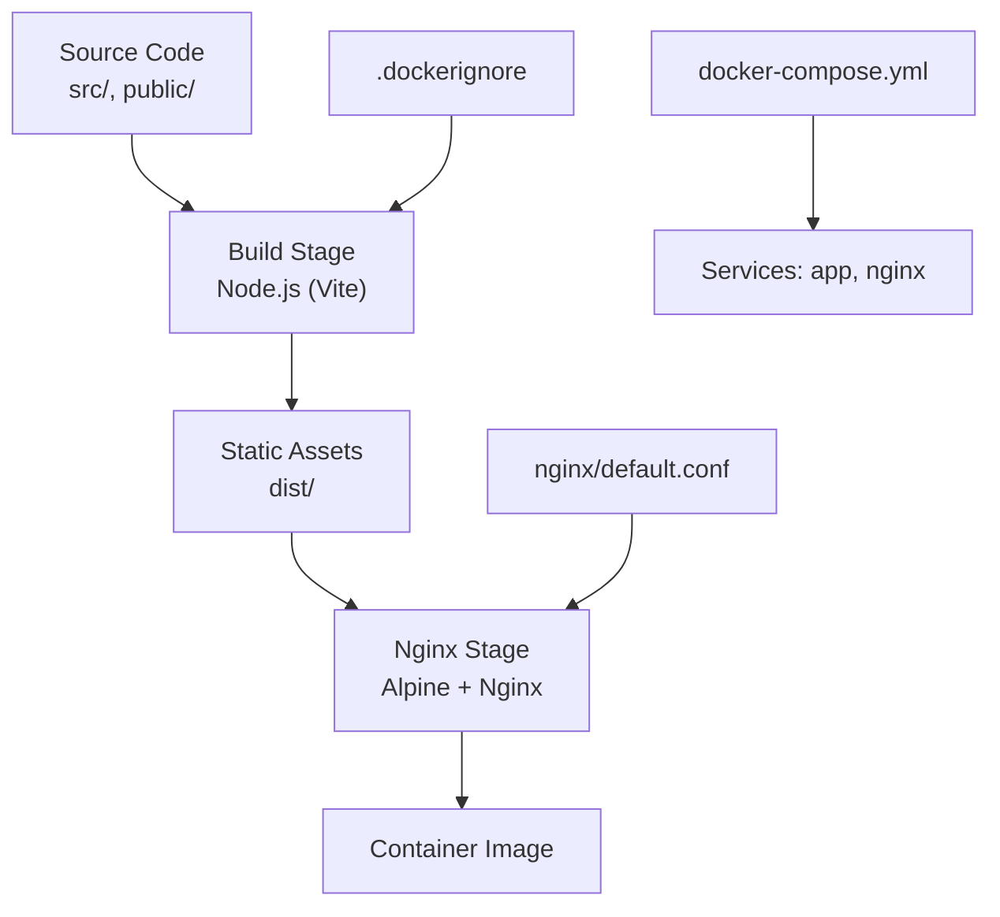
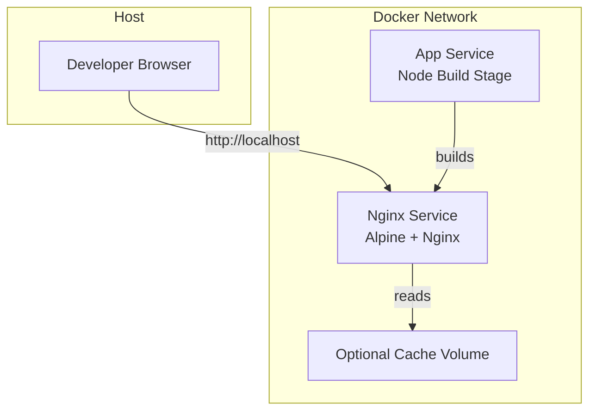
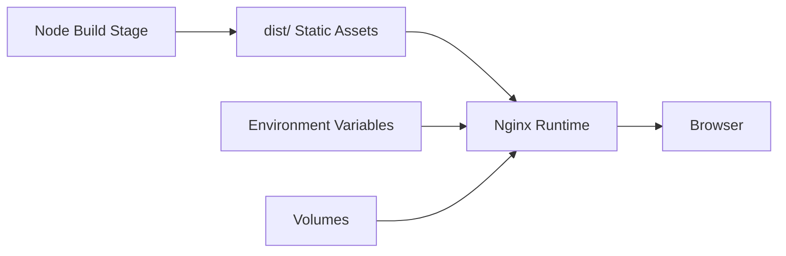

# Docker Containerization

<cite>
**Referenced Files in This Document**
- [Dockerfile](file://Dockerfile)
- [.dockerignore](file://.dockerignore)
- [docker-compose.yml](file://docker-compose.yml)
- [nginx/default.conf](file://nginx/default.conf)
- [package.json](file://package.json)
- [vite.config.ts](file://vite.config.ts)
</cite>

## Table of Contents
1. [Introduction](#introduction)
2. [Project Structure](#project-structure)
3. [Core Components](#core-components)
4. [Architecture Overview](#architecture-overview)
5. [Detailed Component Analysis](#detailed-component-analysis)
6. [Dependency Analysis](#dependency-analysis)
7. [Performance Considerations](#performance-considerations)
8. [Troubleshooting Guide](#troubleshooting-guide)
9. [Conclusion](#conclusion)
10. [Appendices](#appendices)

## Introduction
This document explains how the Resume Portfolio Application is containerized with Docker. It covers multi-stage builds, image layering, security best practices, .dockerignore configuration, runtime configuration, environment variables, volume strategies, networking, logging, monitoring, and optimization techniques to produce small, secure, and efficient images suitable for development and production.

## Project Structure
The containerization artifacts are organized around a multi-stage Dockerfile, an Nginx reverse proxy configuration, and a docker-compose setup that orchestrates services. The build pipeline compiles the Vite-based React application into static assets and serves them via Nginx in production. Development uses a Node-based stage for hot reloading and faster iteration.

**Diagram sources**
- [Dockerfile](file://Dockerfile)
- [docker-compose.yml](file://docker-compose.yml)
- [nginx/default.conf](file://nginx/default.conf)
- [.dockerignore](file://.dockerignore)

**Section sources**
- [Dockerfile](file://Dockerfile)
- [docker-compose.yml](file://docker-compose.yml)
- [nginx/default.conf](file://nginx/default.conf)
- [.dockerignore](file://.dockerignore)

## Core Components
- Multi-stage Dockerfile: Separates development and production builds to minimize final image size and reduce attack surface.
- Nginx configuration: Serves built static files efficiently and securely.
- docker-compose: Defines services, networks, volumes, and environment variables for local development and testing.
- .dockerignore: Excludes unnecessary files from the build context to speed up builds and reduce image size.
- Vite configuration: Controls build output and asset handling during the Node build stage.

Key responsibilities:
- Build stage: Install dependencies, run Vite build, and produce optimized static assets.
- Runtime stage: Serve assets with Nginx, expose HTTP ports, and enforce minimal base image usage.
- Compose orchestration: Wire services together, mount volumes for development, and manage environment variables.

**Section sources**
- [Dockerfile](file://Dockerfile)
- [nginx/default.conf](file://nginx/default.conf)
- [docker-compose.yml](file://docker-compose.yml)
- [.dockerignore](file://.dockerignore)
- [vite.config.ts](file://vite.config.ts)

## Architecture Overview
The container architecture follows a two-service pattern:
- App service: Builds the React application using Node and outputs static assets.
- Nginx service: Serves the static assets and handles reverse proxy rules if needed.

**Diagram sources**
- [docker-compose.yml](file://docker-compose.yml)
- [nginx/default.conf](file://nginx/default.conf)

## Detailed Component Analysis

### Multi-Stage Dockerfile
The Dockerfile implements a multi-stage build:
- Development stage: Uses a full Node image to install dependencies and run the dev server with hot module replacement.
- Production stage: Uses a lightweight Nginx image to serve only the compiled static assets.

Benefits:
- Smaller production image by excluding Node runtime and dev dependencies.
- Faster cold starts due to fewer layers and smaller footprint.
- Improved security by minimizing installed packages and OS components.

Layering strategy:
- Copy package manifests first to leverage Docker cache for dependency installation.
- Copy source code after dependency install to avoid invalidating cache when only source changes.
- Run build commands to generate static assets.
- Copy only the necessary build output into the Nginx stage.

Security best practices:
- Use a minimal base image (e.g., Alpine).
- Avoid running as root; use a non-root user where possible.
- Pin exact versions for base images and dependencies.
- Do not include secrets or sensitive data in the image.

Optimization tips:
- Enable gzip/brotli compression in Nginx.
- Remove unnecessary files from the build context via .dockerignore.
- Use multi-stage caching effectively by ordering COPY and RUN instructions.

**Section sources**
- [Dockerfile](file://Dockerfile)

### .dockerignore Configuration
A well-configured .dockerignore improves build performance and reduces image size by excluding:
- node_modules
- .git and version control metadata
- IDE settings and temporary files
- Logs and test artifacts
- Local environment files (.env.local, .env.development)

Impact:
- Faster context transfer to Docker daemon.
- Reduced risk of leaking secrets.
- Better cache utilization across builds.

Recommended exclusions:
- Dependency directories and caches
- OS-specific files and editor artifacts
- Documentation and examples not required at runtime

**Section sources**
- [.dockerignore](file://.dockerignore)

### Nginx Configuration
The Nginx configuration serves the built static assets and may include:
- Root directory pointing to the dist folder
- MIME types and caching headers
- Compression settings (gzip/brotli)
- Security headers (CSP, HSTS, X-Frame-Options)
- Redirects and routing rules if needed

Best practices:
- Set appropriate cache-control headers for long-term caching of assets.
- Enable compression to reduce bandwidth usage.
- Configure error pages and access logs.
- Restrict methods and enforce HTTPS termination upstream.

**Section sources**
- [nginx/default.conf](file://nginx/default.conf)

### docker-compose Configuration
The compose file defines:
- Services: app (build), nginx (serve)
- Networks: isolated network for inter-service communication
- Volumes: shared directories for development (source code, node_modules)
- Environment variables: configuration passed to services
- Ports: mapping container ports to host ports

Development workflow:
- Mount source code into the app container for live reload.
- Use a separate Nginx container to serve static assets.
- Manage environment variables via .env files.

Production considerations:
- Use read-only filesystems where possible.
- Limit resource usage with CPU/memory constraints.
- Define health checks and restart policies.

**Section sources**
- [docker-compose.yml](file://docker-compose.yml)

### Vite Configuration
Vite controls the build process during the Node stage:
- Output directory (typically dist)
- Asset handling and bundling options
- Environment variable injection
- Optimization flags (minification, tree-shaking)

Tuning recommendations:
- Disable source maps in production builds.
- Configure chunk splitting for better caching.
- Ensure public path matches deployment expectations.

**Section sources**
- [vite.config.ts](file://vite.config.ts)

## Dependency Analysis
The containerization depends on:
- Node.js runtime for building the React application
- Nginx for serving static assets
- Docker engine and Compose for orchestration

Inter-service relationships:
- App service produces static assets consumed by Nginx.
- Nginx exposes HTTP endpoints to clients.
- Optional shared volumes persist node_modules and build artifacts.

Potential circular dependencies:
- None expected; build and serve stages are decoupled.

External integrations:
- Package registry for npm dependencies
- Registry for base images (Docker Hub)

**Diagram sources**
- [docker-compose.yml](file://docker-compose.yml)
- [nginx/default.conf](file://nginx/default.conf)

**Section sources**
- [docker-compose.yml](file://docker-compose.yml)
- [nginx/default.conf](file://nginx/default.conf)

## Performance Considerations
- Image size:
  - Use multi-stage builds to exclude dev dependencies.
  - Prefer Alpine or distroless base images for Nginx.
  - Clean package manager caches after installs.
- Build speed:
  - Leverage .dockerignore to limit context size.
  - Order COPY instructions to maximize cache hits.
  - Parallelize independent steps where possible.
- Runtime efficiency:
  - Enable compression in Nginx.
  - Use HTTP/2 and keep-alive connections.
  - Tune worker processes and connections.

[No sources needed since this section provides general guidance]

## Troubleshooting Guide
Common issues and resolutions:
- Build fails due to missing dependencies:
  - Ensure package.json and lock files are present in the build context.
  - Verify network access to registries inside containers.
- Hot reload not working in development:
  - Confirm volume mounts for source code and correct port mappings.
  - Check Vite dev server configuration and CORS settings.
- Nginx returns 404:
  - Validate the root path points to the correct dist directory.
  - Ensure assets are copied into the Nginx stage.
- Permission errors:
  - Adjust file ownership and permissions for mounted volumes.
  - Avoid running as root; set appropriate USER in Dockerfile.
- Large image size:
  - Review .dockerignore and remove unnecessary files.
  - Combine RUN commands to reduce layers.
  - Use slim base images.

**Section sources**
- [Dockerfile](file://Dockerfile)
- [docker-compose.yml](file://docker-compose.yml)
- [nginx/default.conf](file://nginx/default.conf)
- [.dockerignore](file://.dockerignore)

## Conclusion
The Resume Portfolio Application’s Docker setup leverages multi-stage builds, Nginx serving, and Compose orchestration to deliver a fast, secure, and maintainable containerized experience. By following the recommended practices for layering, security, and optimization, you can achieve small images, rapid builds, and reliable deployments across environments.

[No sources needed since this section summarizes without analyzing specific files]

## Appendices

### Building Custom Images
Steps:
- Prepare the repository with all necessary files.
- Ensure .dockerignore excludes unwanted content.
- Build the image using Docker or Compose.
- Tag images appropriately for different environments.

Commands overview:
- Build with Docker: use the Dockerfile to create images for dev and prod.
- Build with Compose: define services and build targets.

**Section sources**
- [Dockerfile](file://Dockerfile)
- [docker-compose.yml](file://docker-compose.yml)

### Running Containers Locally
Development:
- Start services with Compose to enable hot reload and live updates.
- Map ports to access the app locally.
- Mount source code volumes for quick iterations.

Production-like:
- Build static assets and serve via Nginx.
- Use environment variables for configuration.
- Verify health checks and logs.

**Section sources**
- [docker-compose.yml](file://docker-compose.yml)

### Environment Variables
Usage:
- Pass configuration via .env files or Compose environment sections.
- Separate development and production variables.
- Avoid committing secrets; use secret management tools.

Examples:
- API endpoints and feature flags
- Logging levels and debug toggles
- Nginx tuning parameters

**Section sources**
- [docker-compose.yml](file://docker-compose.yml)

### Volume Mounting Strategies
Development:
- Mount source code for live reload.
- Share node_modules to speed up installs.
- Persist build artifacts between runs.

Production:
- Use read-only mounts where feasible.
- Mount configuration files separately.
- Avoid writing to the image filesystem.

**Section sources**
- [docker-compose.yml](file://docker-compose.yml)

### Container Networking
- Create an internal network for inter-service communication.
- Expose only necessary ports to the host.
- Use service names for DNS resolution within the network.

**Section sources**
- [docker-compose.yml](file://docker-compose.yml)

### Logging and Monitoring
Logging:
- Configure Nginx access and error logs.
- Stream logs to stdout/stderr for collection.
- Use structured logging formats.

Monitoring:
- Add health check endpoints.
- Integrate with external monitoring systems.
- Track resource usage and performance metrics.

**Section sources**
- [nginx/default.conf](file://nginx/default.conf)
- [docker-compose.yml](file://docker-compose.yml)

### Optimizing Image Size
Techniques:
- Multi-stage builds to strip dev dependencies.
- Minimal base images (Alpine, distroless).
- Clean package caches and temporary files.
- Avoid copying unnecessary files.

Validation:
- Inspect layers with Docker inspect.
- Use tools to analyze image contents.
- Compare sizes across builds.

**Section sources**
- [Dockerfile](file://Dockerfile)
- [.dockerignore](file://.dockerignore)