# Nginx Production Deployment

<cite>
**Referenced Files in This Document**
- [default.conf](file://nginx/default.conf)
- [Dockerfile](file://Dockerfile)
- [docker-compose.yml](file://docker-compose.yml)
- [README.md](file://README.md)
</cite>

## Table of Contents
1. [Introduction](#introduction)
2. [Project Structure](#project-structure)
3. [Core Components](#core-components)
4. [Architecture Overview](#architecture-overview)
5. [Detailed Component Analysis](#detailed-component-analysis)
6. [Dependency Analysis](#dependency-analysis)
7. [Performance Considerations](#performance-considerations)
8. [Troubleshooting Guide](#troubleshooting-guide)
9. [Conclusion](#conclusion)
10. [Appendices](#appendices)

## Introduction
This document provides comprehensive guidance for deploying a React application behind Nginx in production. It covers reverse proxy configuration, static asset optimization, caching strategies, SSL/TLS setup, security headers, access control, load balancing, error handling, logging, and advanced configurations for high-traffic environments. It also includes CDN integration patterns, performance tuning recommendations, troubleshooting steps, and monitoring practices to ensure a robust and secure deployment.

## Project Structure
The repository contains an Nginx configuration file under the nginx directory, along with Docker artifacts that define how the application is built and orchestrated. The React application source code resides under src, while public assets are served statically by Nginx after build.

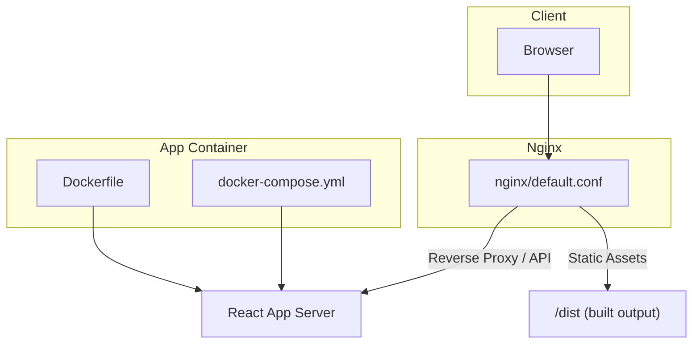

**Diagram sources**
- [default.conf](file://nginx/default.conf)
- [Dockerfile](file://Dockerfile)
- [docker-compose.yml](file://docker-compose.yml)

**Section sources**
- [default.conf](file://nginx/default.conf)
- [Dockerfile](file://Dockerfile)
- [docker-compose.yml](file://docker-compose.yml)
- [README.md](file://README.md)

## Core Components
- Nginx Reverse Proxy: Routes client requests to the React application server and serves static files from the build output.
- SSL/TLS Termination: Handles HTTPS termination at the edge using certificates and modern TLS settings.
- Security Headers: Enforces HTTP security policies such as HSTS, CSP, X-Frame-Options, and more.
- Caching Strategy: Configures browser and proxy cache headers for optimal performance.
- Access Control: Restricts sensitive endpoints via IP allowlists or authentication where applicable.
- Logging and Monitoring: Centralized logs and metrics for observability and alerting.
- Load Balancing: Distributes traffic across multiple backend instances when scaling horizontally.

**Section sources**
- [default.conf](file://nginx/default.conf)

## Architecture Overview
At runtime, clients connect to Nginx over HTTPS. Nginx terminates TLS, applies security headers, and routes API calls to the React app server while serving static assets directly from disk. For high availability, multiple app servers can be defined upstream and balanced by Nginx.

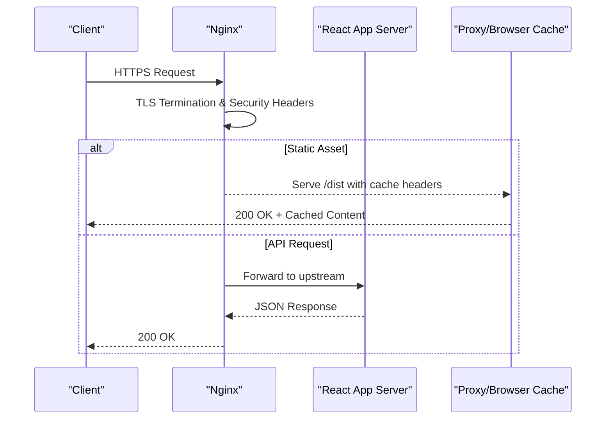

**Diagram sources**
- [default.conf](file://nginx/default.conf)

## Detailed Component Analysis

### Nginx Reverse Proxy Configuration
- Purpose: Route incoming requests to the React application server and serve static files efficiently.
- Key behaviors:
  - Define upstream groups for one or more backend servers.
  - Use location blocks to differentiate between static assets and API paths.
  - Apply proxy headers to preserve client information.
  - Configure timeouts and buffering for stability under load.

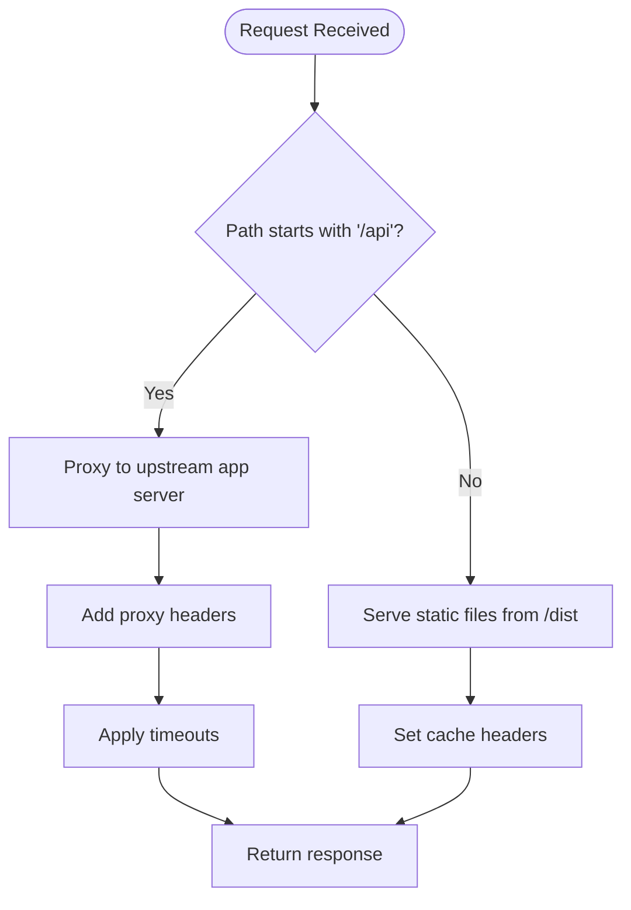

**Diagram sources**
- [default.conf](file://nginx/default.conf)

**Section sources**
- [default.conf](file://nginx/default.conf)

### SSL/TLS Configuration
- Terminate TLS at Nginx using certificate files.
- Enable modern protocols (TLS 1.2+) and strong cipher suites.
- Prefer HTTP/2 for multiplexed connections.
- Redirect all HTTP to HTTPS for consistent security posture.

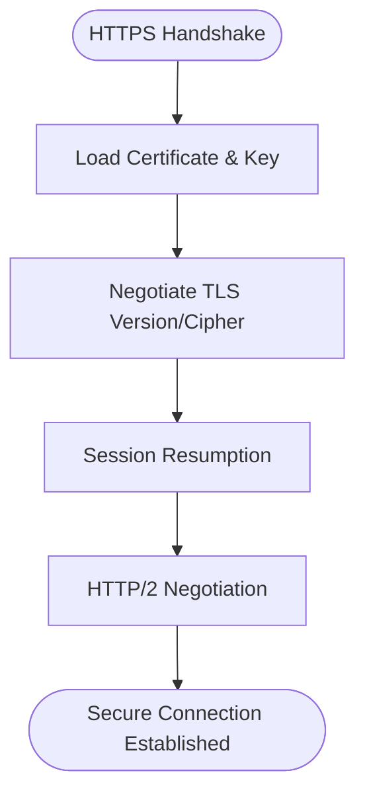

**Diagram sources**
- [default.conf](file://nginx/default.conf)

**Section sources**
- [default.conf](file://nginx/default.conf)

### Security Headers and Access Control
- Enforce strict transport security (HSTS), content type sniffing prevention, clickjacking protection, and XSS filters.
- Implement Content Security Policy (CSP) tailored to your app’s needs.
- Restrict access to admin or internal endpoints via IP allowlists or basic auth if required.
- Limit request sizes and methods to reduce attack surface.

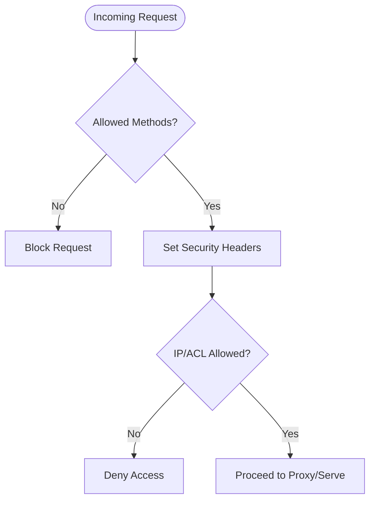

**Diagram sources**
- [default.conf](file://nginx/default.conf)

**Section sources**
- [default.conf](file://nginx/default.conf)

### Caching Strategies
- Browser caching: Set long-lived cache headers for immutable assets (hashed filenames).
- Proxy cache: Cache responses from upstream for repeated requests.
- ETag/Last-Modified: Leverage conditional requests to reduce bandwidth.
- Cache invalidation: Use versioned URLs or cache purging mechanisms.

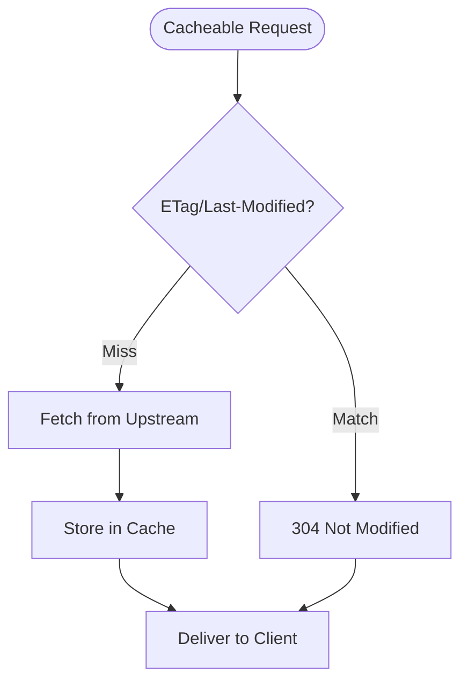

**Diagram sources**
- [default.conf](file://nginx/default.conf)

**Section sources**
- [default.conf](file://nginx/default.conf)

### Error Handling and Logging
- Custom error pages for common HTTP errors (4xx/5xx).
- Structured logging with access and error logs for diagnostics.
- Rate limiting and connection limits to mitigate abuse.
- Health check endpoints for orchestrators and load balancers.

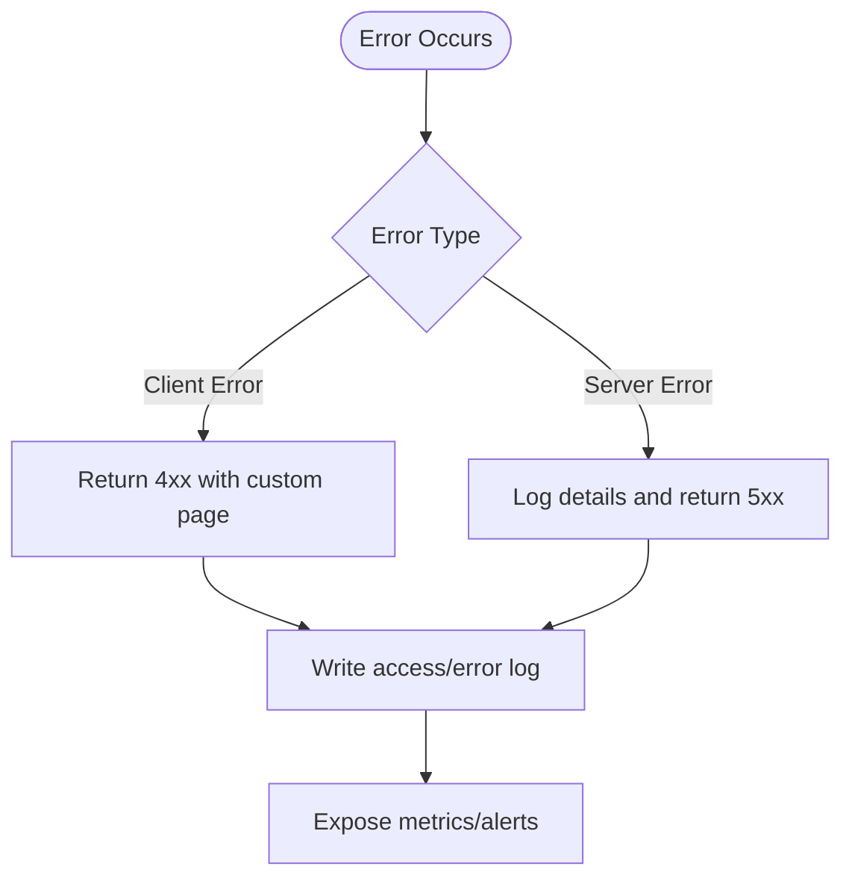

**Diagram sources**
- [default.conf](file://nginx/default.conf)

**Section sources**
- [default.conf](file://nginx/default.conf)

### Load Balancing Setup
- Define upstream groups with multiple backend servers.
- Choose a strategy: round-robin (default), least_conn, ip_hash, or weighted distribution.
- Configure health checks and failover behavior.
- Use sticky sessions only when necessary and understand implications.

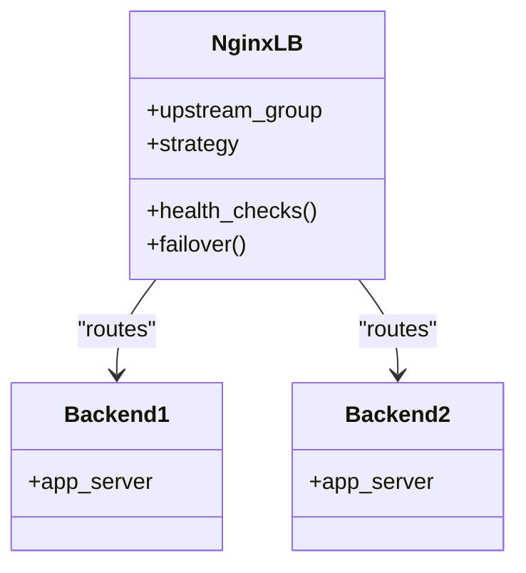

**Diagram sources**
- [default.conf](file://nginx/default.conf)

**Section sources**
- [default.conf](file://nginx/default.conf)

### Advanced High-Traffic Scenarios
- Worker processes and connections tuning based on CPU cores and memory.
- Buffer sizing and keepalive tuning for high concurrency.
- Gzip/Brotli compression for text-based assets.
- CDN integration via origin pull or signed cookies.
- Connection pooling and HTTP/2 multiplexing.

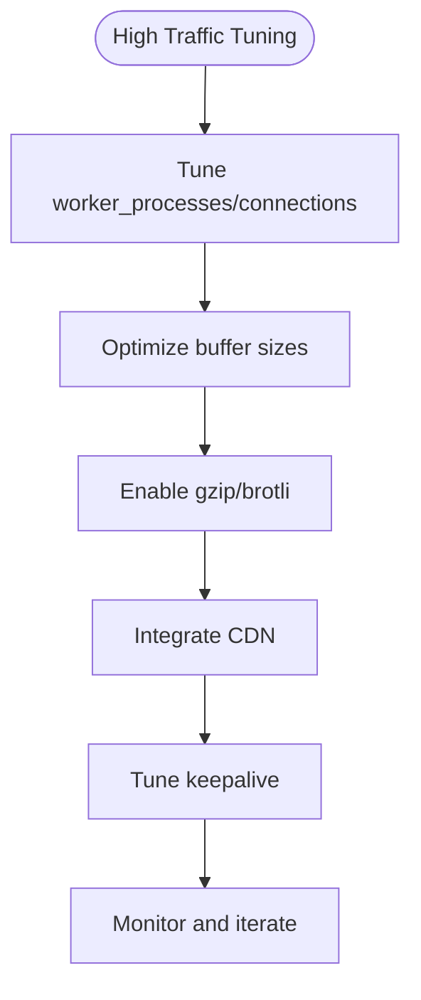

**Diagram sources**
- [default.conf](file://nginx/default.conf)

**Section sources**
- [default.conf](file://nginx/default.conf)

### Docker Integration
- Build the React app into static assets and serve them with Nginx.
- Use multi-stage builds to minimize image size.
- Orchestrate containers with docker-compose for development and staging.

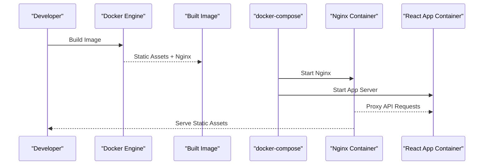

**Diagram sources**
- [Dockerfile](file://Dockerfile)
- [docker-compose.yml](file://docker-compose.yml)

**Section sources**
- [Dockerfile](file://Dockerfile)
- [docker-compose.yml](file://docker-compose.yml)

## Dependency Analysis
Nginx depends on:
- Application server(s) defined as upstream targets.
- TLS certificates and keys for HTTPS termination.
- Filesystem access to serve static assets from the build output.
- Optional modules for compression, caching, and rate limiting.

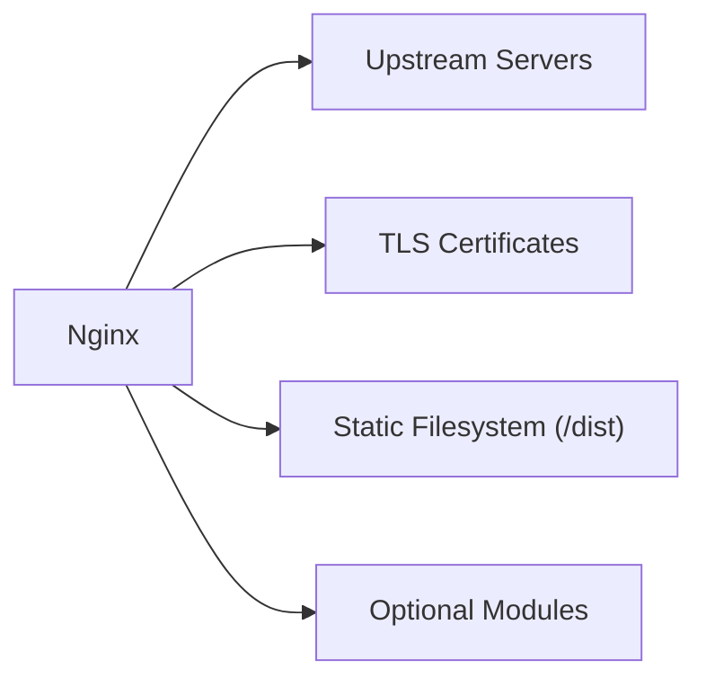

**Diagram sources**
- [default.conf](file://nginx/default.conf)

**Section sources**
- [default.conf](file://nginx/default.conf)

## Performance Considerations
- Tune worker processes and events for maximum throughput.
- Enable HTTP/2 and keepalive connections.
- Use Brotli or Gzip compression judiciously.
- Cache aggressively for immutable assets; use cache-busting filenames.
- Offload heavy tasks to CDNs and edge caches.
- Monitor CPU, memory, and I/O usage; scale horizontally when needed.

[No sources needed since this section provides general guidance]

## Troubleshooting Guide
Common issues and resolutions:
- 502 Bad Gateway: Verify upstream connectivity and ports; check DNS resolution and firewall rules.
- 403 Forbidden: Review file permissions and access control lists; ensure correct root path.
- Slow Responses: Inspect upstream latency; tune buffers and timeouts; enable compression.
- TLS Errors: Confirm certificate validity and chain; verify protocol versions and ciphers.
- Cache Staleness: Clear proxy/browser cache; validate cache headers and ETags.
- High Memory Usage: Reduce worker_connections; analyze logs for leaks; monitor process growth.

**Section sources**
- [default.conf](file://nginx/default.conf)

## Conclusion
A well-configured Nginx deployment ensures secure, fast, and reliable delivery of React applications. By implementing proper reverse proxying, SSL/TLS termination, security headers, caching, access control, logging, and load balancing, you can achieve high availability and performance. Continuously monitor and tune configurations based on real-world traffic patterns and observability data.

[No sources needed since this section summarizes without analyzing specific files]

## Appendices
- Reference the README for project-specific notes and environment variables.
- Use docker-compose for local testing of configurations before production rollout.

**Section sources**
- [README.md](file://README.md)
- [docker-compose.yml](file://docker-compose.yml)