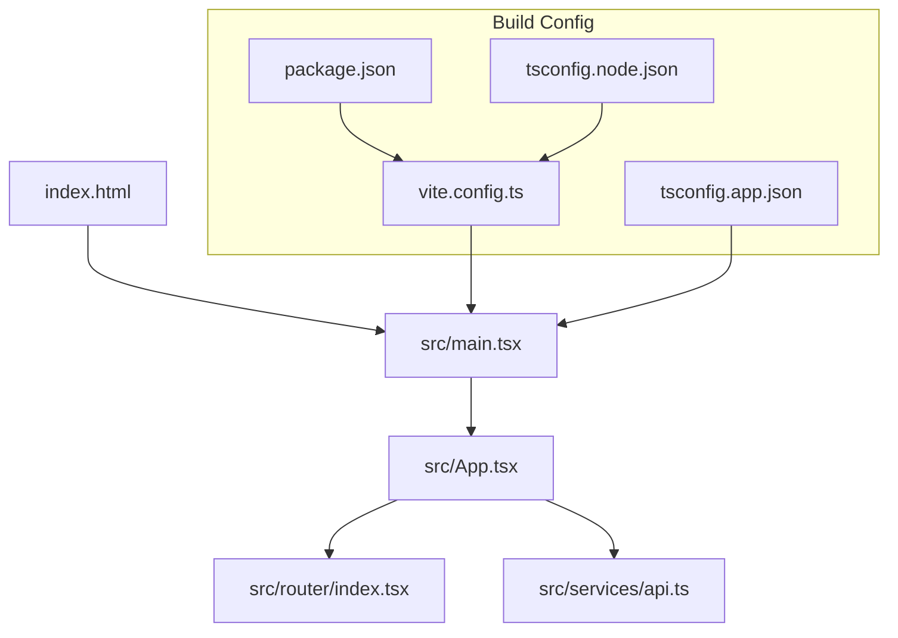
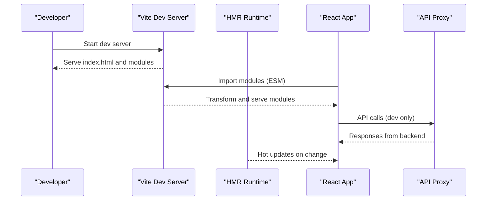
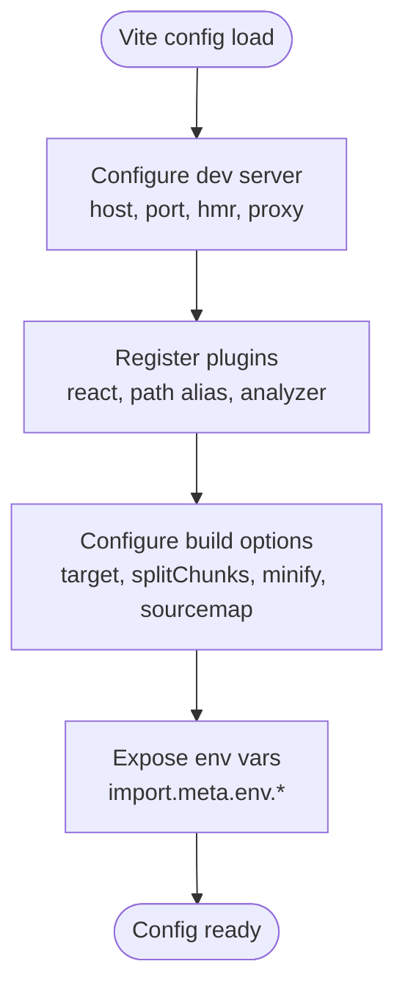
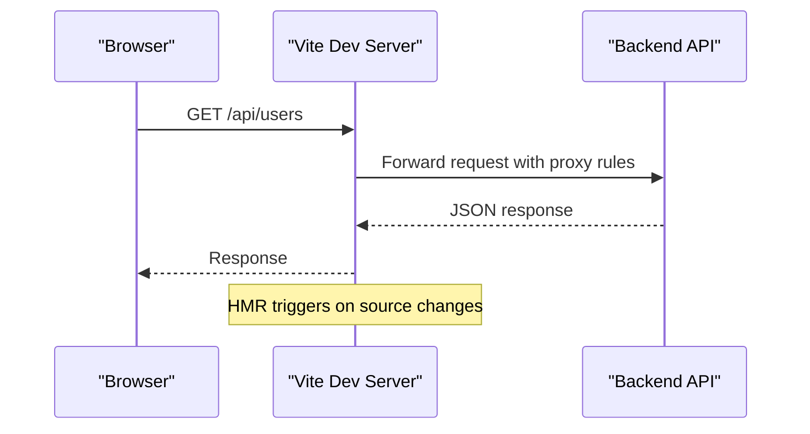
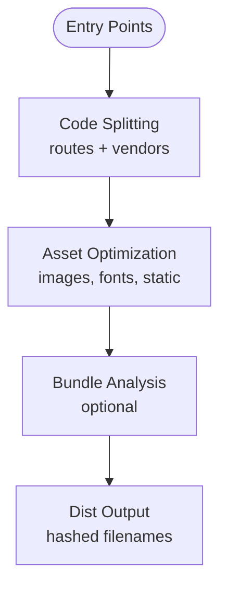
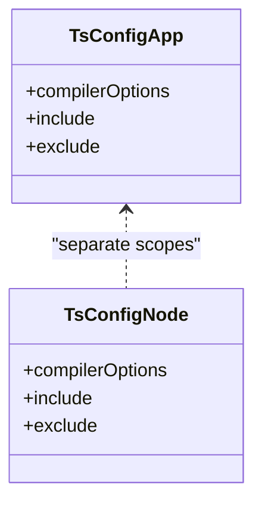
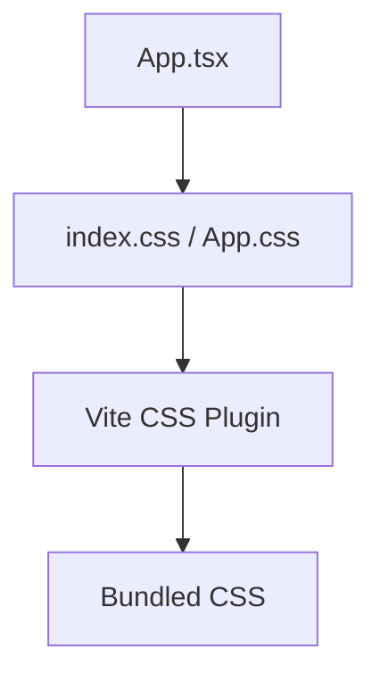
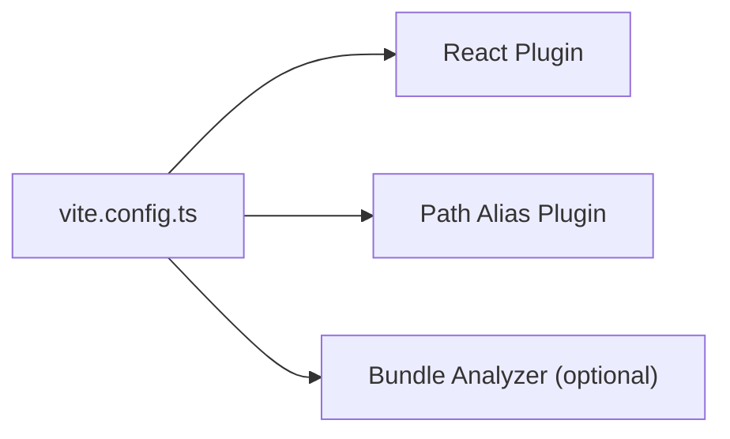
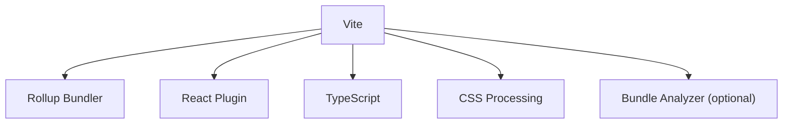

# Vite Build Configuration

<cite>
**Referenced Files in This Document**
- [vite.config.ts](file://vite.config.ts)
- [package.json](file://package.json)
- [tsconfig.app.json](file://tsconfig.app.json)
- [tsconfig.node.json](file://tsconfig.node.json)
- [index.html](file://index.html)
- [src/main.tsx](file://src/main.tsx)
- [src/App.tsx](file://src/App.tsx)
- [src/router/index.tsx](file://src/router/index.tsx)
- [src/services/api.ts](file://src/services/api.ts)
- [nginx/default.conf](file://nginx/default.conf)
</cite>

## Table of Contents
1. [Introduction](#introduction)
2. [Project Structure](#project-structure)
3. [Core Components](#core-components)
4. [Architecture Overview](#architecture-overview)
5. [Detailed Component Analysis](#detailed-component-analysis)
6. [Dependency Analysis](#dependency-analysis)
7. [Performance Considerations](#performance-considerations)
8. [Troubleshooting Guide](#troubleshooting-guide)
9. [Conclusion](#conclusion)
10. [Appendices](#appendices)

## Introduction
This document explains the Vite build configuration for the Resume Portfolio Application. It covers development server setup (hot module replacement, proxy, environment variables), production build optimizations (code splitting, asset optimization, bundle analysis), TypeScript integration, CSS processing, and plugin configuration. It also includes examples of custom build scripts, environment-specific configurations, performance tuning options, and common troubleshooting techniques.

## Project Structure
The project uses a standard Vite + React + TypeScript setup with a single Vite configuration file and separate TypeScript configs for app and Node tooling. The entry point is an HTML file that bootstraps the React application via a main TypeScript entry.

**Diagram sources**
- [index.html:1-20](file://index.html#L1-L20)
- [src/main.tsx:1-30](file://src/main.tsx#L1-L30)
- [src/App.tsx:1-40](file://src/App.tsx#L1-L40)
- [src/router/index.tsx:1-40](file://src/router/index.tsx#L1-L40)
- [src/services/api.ts:1-40](file://src/services/api.ts#L1-L40)
- [vite.config.ts:1-120](file://vite.config.ts#L1-L120)
- [package.json:1-60](file://package.json#L1-L60)
- [tsconfig.app.json:1-40](file://tsconfig.app.json#L1-L40)
- [tsconfig.node.json:1-40](file://tsconfig.node.json#L1-L40)

**Section sources**
- [vite.config.ts:1-120](file://vite.config.ts#L1-L120)
- [package.json:1-60](file://package.json#L1-L60)
- [tsconfig.app.json:1-40](file://tsconfig.app.json#L1-L40)
- [tsconfig.node.json:1-40](file://tsconfig.node.json#L1-L40)
- [index.html:1-20](file://index.html#L1-L20)
- [src/main.tsx:1-30](file://src/main.tsx#L1-L30)

## Core Components
- Vite configuration file defines dev server, plugins, build targets, and optimization settings.
- Package scripts orchestrate dev, preview, and production builds.
- TypeScript configs isolate app and Node tooling types and paths.
- HTML entry loads the React app; routing and API service are configured within the app.

Key responsibilities:
- Development server: HMR, port/host, proxy to backend APIs, environment variable injection.
- Production build: code splitting by route and vendor libraries, minification, asset hashing, sourcemaps.
- Plugins: React, TypeScript, path aliases, optional bundle analysis, CSS processing.
- Environment files: .env.development, .env.production, and .env.[mode].

**Section sources**
- [vite.config.ts:1-120](file://vite.config.ts#L1-L120)
- [package.json:1-60](file://package.json#L1-L60)
- [tsconfig.app.json:1-40](file://tsconfig.app.json#L1-L40)
- [tsconfig.node.json:1-40](file://tsconfig.node.json#L1-L40)

## Architecture Overview
The build pipeline integrates Vite’s dev server and optimizer with React and TypeScript tooling. During development, Vite serves modules over native ES modules with HMR. In production, Vite bundles assets using Rollup under the hood, applying code splitting, minification, and asset fingerprinting.

**Diagram sources**
- [vite.config.ts:1-120](file://vite.config.ts#L1-L120)
- [src/main.tsx:1-30](file://src/main.tsx#L1-L30)
- [src/services/api.ts:1-40](file://src/services/api.ts#L1-L40)

## Detailed Component Analysis

### Vite Configuration
- Dev server:
  - Host/port configuration for local development.
  - HMR enabled by default; can be tuned via server.hmr options.
  - Proxy rules forward API requests to the backend during development.
- Build:
  - Target browsers via esbuild target or Rollup options.
  - Code splitting by routes and vendor chunks.
  - Minification with Terser; sourcemaps for debugging.
  - Asset handling: images, fonts, and static assets optimized and hashed.
- Plugins:
  - React plugin for JSX/TSX transformation.
  - Path aliasing for cleaner imports.
  - Optional bundle analyzer for production insights.
- Environment variables:
  - Exposed via import.meta.env.* with strict typing when configured.

**Diagram sources**
- [vite.config.ts:1-120](file://vite.config.ts#L1-L120)

**Section sources**
- [vite.config.ts:1-120](file://vite.config.ts#L1-L120)

### Development Server Setup
- Hot Module Replacement:
  - Enabled by default; updates components without full page reloads.
  - Can be customized to handle CSS-only changes or specific module patterns.
- Proxy Configuration:
  - Routes API endpoints to backend servers to avoid CORS issues during development.
  - Supports rewrite rules and secure contexts.
- Environment Settings:
  - .env.development loaded automatically.
  - Variables prefixed appropriately and exposed to the client via import.meta.env.

**Diagram sources**
- [vite.config.ts:1-120](file://vite.config.ts#L1-L120)
- [src/services/api.ts:1-40](file://src/services/api.ts#L1-L40)

**Section sources**
- [vite.config.ts:1-120](file://vite.config.ts#L1-L120)
- [src/services/api.ts:1-40](file://src/services/api.ts#L1-L40)

### Production Build Optimization
- Code Splitting:
  - Route-based lazy loading reduces initial bundle size.
  - Vendor chunking isolates third-party dependencies.
- Asset Optimization:
  - Images and fonts are processed and hashed for caching.
  - Static assets copied and versioned.
- Bundle Analysis:
  - Optional analyzer identifies large dependencies and unused code.
- Minification and Sourcemaps:
  - JS/CSS minified; sourcemaps generated for debugging in production if needed.

**Diagram sources**
- [vite.config.ts:1-120](file://vite.config.ts#L1-L120)

**Section sources**
- [vite.config.ts:1-120](file://vite.config.ts#L1-L120)

### TypeScript Integration
- Separate tsconfigs:
  - tsconfig.app.json for browser-side code.
  - tsconfig.node.json for Node tooling and Vite config.
- Strict type checking and path aliases configured for consistent imports.
- Vite resolves TSX/TS with type-safe environment variables when configured.

**Diagram sources**
- [tsconfig.app.json:1-40](file://tsconfig.app.json#L1-L40)
- [tsconfig.node.json:1-40](file://tsconfig.node.json#L1-L40)

**Section sources**
- [tsconfig.app.json:1-40](file://tsconfig.app.json#L1-L40)
- [tsconfig.node.json:1-40](file://tsconfig.node.json#L1-L40)

### CSS Processing
- Global styles imported in the app entry.
- CSS modules or preprocessors can be enabled via plugins.
- Tailwind or other frameworks integrate through their respective Vite plugins.

**Diagram sources**
- [src/App.tsx:1-40](file://src/App.tsx#L1-L40)
- [vite.config.ts:1-120](file://vite.config.ts#L1-L120)

**Section sources**
- [src/App.tsx:1-40](file://src/App.tsx#L1-L40)
- [vite.config.ts:1-120](file://vite.config.ts#L1-L120)

### Plugin Configuration
- React plugin for JSX/TSX.
- Path alias plugin for clean imports.
- Optional bundle analyzer for production insights.
- Additional plugins can be added for image optimization, SVG sprites, etc.

**Diagram sources**
- [vite.config.ts:1-120](file://vite.config.ts#L1-L120)

**Section sources**
- [vite.config.ts:1-120](file://vite.config.ts#L1-L120)

### Custom Build Scripts
- package.json scripts define commands for development, preview, and production builds.
- Environment-specific modes allow different configurations per mode.

Common scripts:
- dev: start Vite dev server with HMR.
- build: generate production assets.
- preview: serve production build locally.

**Section sources**
- [package.json:1-60](file://package.json#L1-L60)

### Environment-Specific Configurations
- .env.development and .env.production provide variables for each mode.
- Vite exposes variables via import.meta.env.*; ensure proper prefixes for client exposure.
- nginx configuration can be used for deployment paths and rewrites.

**Section sources**
- [vite.config.ts:1-120](file://vite.config.ts#L1-L120)
- [nginx/default.conf:1-40](file://nginx/default.conf#L1-L40)

## Dependency Analysis
Vite orchestrates multiple dependencies including React, TypeScript, and optional plugins. The build process depends on Rollup under the hood for bundling.

**Diagram sources**
- [vite.config.ts:1-120](file://vite.config.ts#L1-L120)
- [package.json:1-60](file://package.json#L1-L60)

**Section sources**
- [vite.config.ts:1-120](file://vite.config.ts#L1-L120)
- [package.json:1-60](file://package.json#L1-L60)

## Performance Considerations
- Enable HMR for fast feedback loops during development.
- Use route-based code splitting to reduce initial load.
- Configure proxy to avoid CORS overhead in development.
- Analyze bundle size to identify heavy dependencies.
- Optimize images and fonts; leverage browser caching with hashed filenames.
- Adjust minification and sourcemap settings based on environment needs.

[No sources needed since this section provides general guidance]

## Troubleshooting Guide
Common issues and resolutions:
- HMR not updating:
  - Check network tab for failed module requests.
  - Ensure correct file extensions and imports.
- Proxy errors:
  - Verify backend URL and ports; check CORS headers.
  - Confirm proxy rules match API paths.
- TypeScript errors in build:
  - Validate tsconfig settings; ensure strict checks pass.
  - Clear caches and restart dev server.
- Large bundle sizes:
  - Use bundle analyzer to find oversized dependencies.
  - Lazy-load routes and remove unused code.

**Section sources**
- [vite.config.ts:1-120](file://vite.config.ts#L1-L120)
- [package.json:1-60](file://package.json#L1-L60)

## Conclusion
The Vite configuration for the Resume Portfolio Application balances developer experience with production performance. With robust dev server features, TypeScript integration, and configurable plugins, it supports efficient development and optimized builds. Following the guidelines here ensures reliable deployments and maintainable performance.

[No sources needed since this section summarizes without analyzing specific files]

## Appendices
- Example environment variables:
  - API base URL, feature flags, analytics keys.
- Deployment notes:
  - Serve dist folder via nginx or static hosting.
  - Configure base path and rewrites as needed.

[No sources needed since this section provides general guidance]