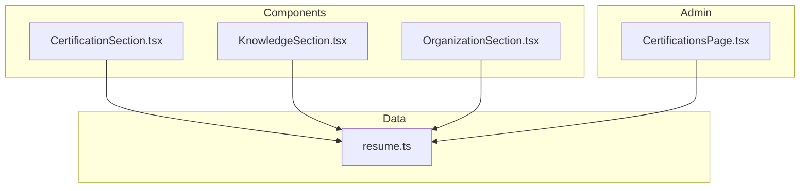
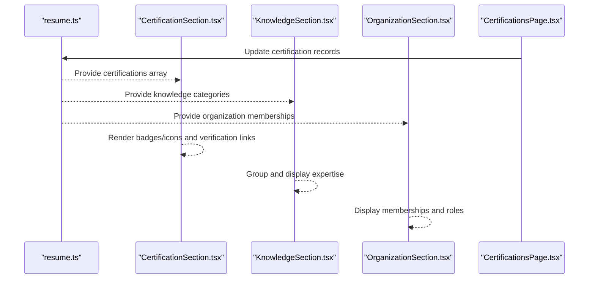
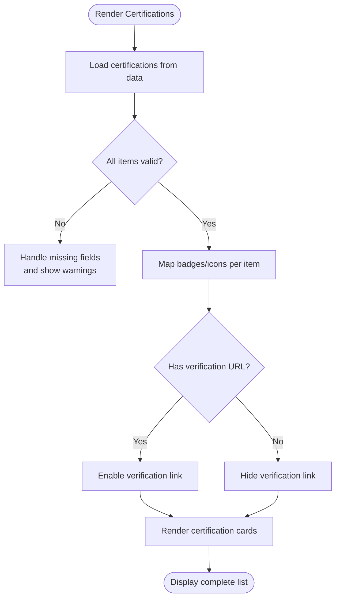
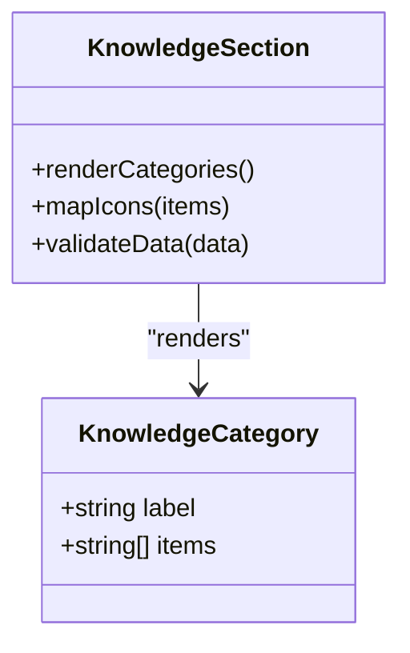
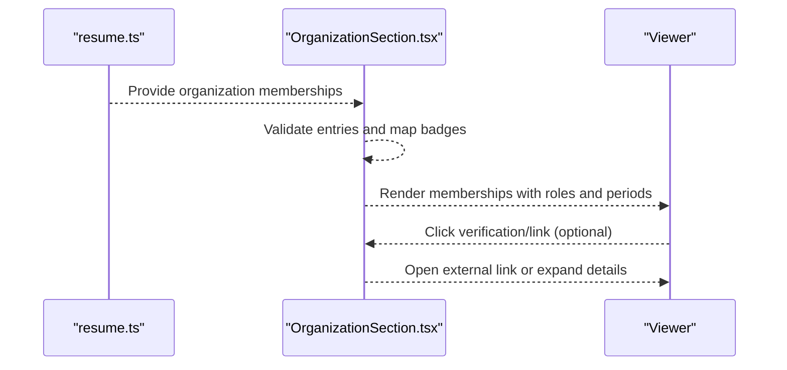
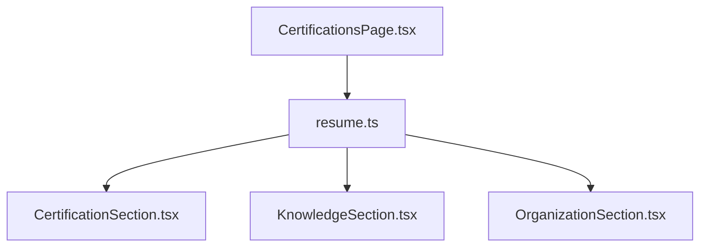

# Certifications, Knowledge, and Organization Sections

<cite>
**Referenced Files in This Document**
- [CertificationSection.tsx](file://src/components/sections/CertificationSection.tsx)
- [KnowledgeSection.tsx](file://src/components/sections/KnowledgeSection.tsx)
- [OrganizationSection.tsx](file://src/components/sections/OrganizationSection.tsx)
- [resume.ts](file://src/data/resume.ts)
- [CertificationsPage.tsx](file://src/pages/admin/CertificationsPage.tsx)
</cite>

## Table of Contents
1. [Introduction](#introduction)
2. [Project Structure](#project-structure)
3. [Core Components](#core-components)
4. [Architecture Overview](#architecture-overview)
5. [Detailed Component Analysis](#detailed-component-analysis)
6. [Dependency Analysis](#dependency-analysis)
7. [Performance Considerations](#performance-considerations)
8. [Troubleshooting Guide](#troubleshooting-guide)
9. [Conclusion](#conclusion)
10. [Appendices](#appendices)

## Introduction
This document provides comprehensive documentation for three key resume sections: CertificationsSection, KnowledgeSection, and OrganizationSection. It explains their responsibilities, data models, props interfaces, badge/icon systems, validation features, and verification workflows. It also includes practical examples for adding credentials, organizing knowledge categories, and managing organizational memberships, with guidance on credibility enhancement through verification.

## Project Structure
The components are implemented as React TypeScript files under src/components/sections and consume structured data from src/data/resume.ts. An admin page exists to manage certifications.

**Diagram sources**
- [CertificationSection.tsx](file://src/components/sections/CertificationSection.tsx)
- [KnowledgeSection.tsx](file://src/components/sections/KnowledgeSection.tsx)
- [OrganizationSection.tsx](file://src/components/sections/OrganizationSection.tsx)
- [resume.ts](file://src/data/resume.ts)
- [CertificationsPage.tsx](file://src/pages/admin/CertificationsPage.tsx)

**Section sources**
- [CertificationSection.tsx](file://src/components/sections/CertificationSection.tsx)
- [KnowledgeSection.tsx](file://src/components/sections/KnowledgeSection.tsx)
- [OrganizationSection.tsx](file://src/components/sections/OrganizationSection.tsx)
- [resume.ts](file://src/data/resume.ts)
- [CertificationsPage.tsx](file://src/pages/admin/CertificationsPage.tsx)

## Core Components
- CertificationsSection: Displays professional certifications, licenses, training programs, and credential verification status. Supports badges/icons for issuing organizations and verification links.
- KnowledgeSection: Showcases domain expertise, specialized knowledge areas, and professional competencies, typically grouped by categories or proficiency levels.
- OrganizationSection: Highlights involvement in professional organizations, committees, and community leadership roles, including membership status and tenure.

These components read structured data from the resume data module and render consistent UI elements such as cards, badges, and icons.

**Section sources**
- [CertificationSection.tsx](file://src/components/sections/CertificationSection.tsx)
- [KnowledgeSection.tsx](file://src/components/sections/KnowledgeSection.tsx)
- [OrganizationSection.tsx](file://src/components/sections/OrganizationSection.tsx)
- [resume.ts](file://src/data/resume.ts)

## Architecture Overview
Each section component is a presentational layer that consumes typed data structures defined in the data module. Admin pages can update these datasets. The following diagram shows how data flows from the data source into each section.

**Diagram sources**
- [resume.ts](file://src/data/resume.ts)
- [CertificationSection.tsx](file://src/components/sections/CertificationSection.tsx)
- [KnowledgeSection.tsx](file://src/components/sections/KnowledgeSection.tsx)
- [OrganizationSection.tsx](file://src/components/sections/OrganizationSection.tsx)
- [CertificationsPage.tsx](file://src/pages/admin/CertificationsPage.tsx)

## Detailed Component Analysis

### CertificationsSection
Purpose:
- Present certifications, licenses, and training programs with clear visual indicators for verification status and issuing bodies.
- Support badges/icons for credibility and optional external verification links.

Key responsibilities:
- Render a list of certification entries with title, issuer, date, and verification status.
- Apply badges/icons based on attributes (e.g., verified, active, expired).
- Provide access to verification URLs when available.

Data model expectations:
- Array of certification objects containing fields such as identifier, name/title, issuer, issue/expiry dates, verification URL, and status flags.

Props interface highlights:
- Accepts an array of certification items and optional configuration for rendering badges and icons.
- May include callbacks for actions like opening verification links.

Badge/icon system:
- Uses visual markers to indicate verification state and credential type.
- Icons represent issuing organizations or credential categories.

Validation features:
- Validates presence of required fields (e.g., title, issuer, dates).
- Enforces date formats and checks expiry logic to mark statuses appropriately.

Examples:
- Adding a new credential: Insert a new object into the certifications array with all required fields and set verification URL if applicable.
- Verifying a credential: Ensure the verification URL is valid and accessible; mark the item as verified when confirmed.

Credibility enhancement:
- Include official verification links and logos where permitted.
- Display current status (active/expired) and issue/expiry dates prominently.

**Diagram sources**
- [CertificationSection.tsx](file://src/components/sections/CertificationSection.tsx)
- [resume.ts](file://src/data/resume.ts)

**Section sources**
- [CertificationSection.tsx](file://src/components/sections/CertificationSection.tsx)
- [resume.ts](file://src/data/resume.ts)

### KnowledgeSection
Purpose:
- Showcase domain expertise, specialized knowledge areas, and professional competencies.
- Organize content into logical categories for readability and quick scanning.

Key responsibilities:
- Group knowledge items by category or skill level.
- Render lists or grids with labels and optional proficiency indicators.
- Maintain consistent typography and spacing for clarity.

Data model expectations:
- Array or object of knowledge categories, each containing a label and a list of items (e.g., skills, tools, methodologies).

Props interface highlights:
- Accepts categorized knowledge data and optional settings for layout (grid vs. list) and iconography.
- May support sorting or filtering by category.

Badge/icon system:
- Optional icons to denote proficiency or familiarity levels.
- Category-specific icons to improve visual scanning.

Validation features:
- Ensures categories and items are non-empty and properly labeled.
- Guards against malformed arrays or unexpected types.

Examples:
- Organizing knowledge categories: Define categories with descriptive titles and populate each with relevant items.
- Adding a new competency: Append an item to the appropriate category with a concise label.

**Diagram sources**
- [KnowledgeSection.tsx](file://src/components/sections/KnowledgeSection.tsx)
- [resume.ts](file://src/data/resume.ts)

**Section sources**
- [KnowledgeSection.tsx](file://src/components/sections/KnowledgeSection.tsx)
- [resume.ts](file://src/data/resume.ts)

### OrganizationSection
Purpose:
- Highlight involvement in professional organizations, committees, and community leadership roles.
- Communicate membership status, tenure, and any notable contributions.

Key responsibilities:
- Render a list of organization memberships with role, organization name, and period.
- Optionally display badges for leadership positions or active membership.
- Provide links to organization profiles or publications when available.

Data model expectations:
- Array of organization entries with fields such as organization name, role/title, start/end dates, and optional description or link.

Props interface highlights:
- Accepts an array of organization items and optional configuration for displaying badges and links.
- May include handlers for opening external links or expanding details.

Badge/icon system:
- Visual markers for leadership roles (e.g., chair, committee member).
- Status indicators for active or past memberships.

Validation features:
- Validates required fields (organization name, role, dates).
- Checks date consistency (end date after start date when provided).

Examples:
- Managing organizational memberships: Add a new entry with role and dates; remove outdated memberships.
- Enhancing credibility: Include links to recognized organizations and highlight leadership roles.

**Diagram sources**
- [OrganizationSection.tsx](file://src/components/sections/OrganizationSection.tsx)
- [resume.ts](file://src/data/resume.ts)

**Section sources**
- [OrganizationSection.tsx](file://src/components/sections/OrganizationSection.tsx)
- [resume.ts](file://src/data/resume.ts)

## Dependency Analysis
The three sections depend on shared data structures defined in the resume data module. Admin pages may modify this data, which then propagates to the sections at runtime.

**Diagram sources**
- [resume.ts](file://src/data/resume.ts)
- [CertificationSection.tsx](file://src/components/sections/CertificationSection.tsx)
- [KnowledgeSection.tsx](file://src/components/sections/KnowledgeSection.tsx)
- [OrganizationSection.tsx](file://src/components/sections/OrganizationSection.tsx)
- [CertificationsPage.tsx](file://src/pages/admin/CertificationsPage.tsx)

**Section sources**
- [resume.ts](file://src/data/resume.ts)
- [CertificationsPage.tsx](file://src/pages/admin/CertificationsPage.tsx)

## Performance Considerations
- Keep data arrays small and well-structured to avoid unnecessary re-renders.
- Use memoization for computed badges and icons where possible.
- Avoid heavy operations during render; defer expensive validations to initialization or input time.
- Prefer lazy loading for large lists of certifications or organizations if the dataset grows significantly.

[No sources needed since this section provides general guidance]

## Troubleshooting Guide
Common issues and resolutions:
- Missing required fields: Ensure all certification, knowledge, and organization entries contain necessary properties (titles, names, dates).
- Invalid date formats: Normalize date strings and validate ranges before rendering.
- Broken verification links: Test URLs and handle errors gracefully by hiding unavailable links.
- Empty categories: Prevent rendering empty sections by checking for non-empty arrays.

**Section sources**
- [CertificationSection.tsx](file://src/components/sections/CertificationSection.tsx)
- [KnowledgeSection.tsx](file://src/components/sections/KnowledgeSection.tsx)
- [OrganizationSection.tsx](file://src/components/sections/OrganizationSection.tsx)

## Conclusion
CertificationsSection, KnowledgeSection, and OrganizationSection provide structured, visually consistent ways to present professional credentials, expertise, and organizational involvement. By adhering to clear data models, robust validation, and credible verification practices, these sections enhance the overall professionalism and trustworthiness of the resume profile.

[No sources needed since this section summarizes without analyzing specific files]

## Appendices

### Data Models Reference
- Certification: Fields include identifier, title/name, issuer, issue/expiry dates, verification URL, and status flags.
- Knowledge Category: Contains a label and an array of items representing skills or competencies.
- Organization Membership: Includes organization name, role/title, start/end dates, and optional description or link.

**Section sources**
- [resume.ts](file://src/data/resume.ts)

### Example Workflows
- Adding a credential: Create a new certification object with all required fields and add it to the certifications array.
- Organizing knowledge: Define categories with meaningful labels and populate them with concise, relevant items.
- Managing memberships: Add or update organization entries with accurate roles and periods; remove outdated memberships.

**Section sources**
- [CertificationsPage.tsx](file://src/pages/admin/CertificationsPage.tsx)
- [resume.ts](file://src/data/resume.ts)