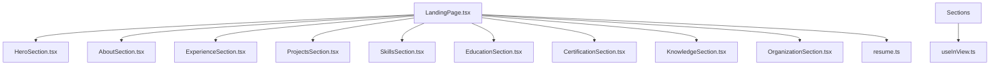
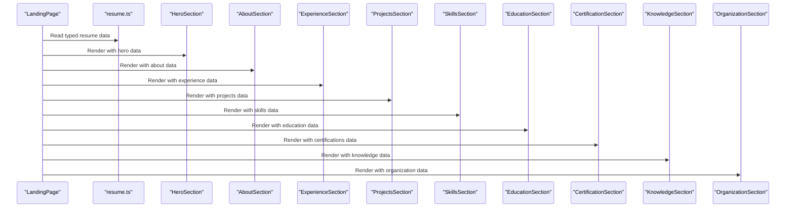
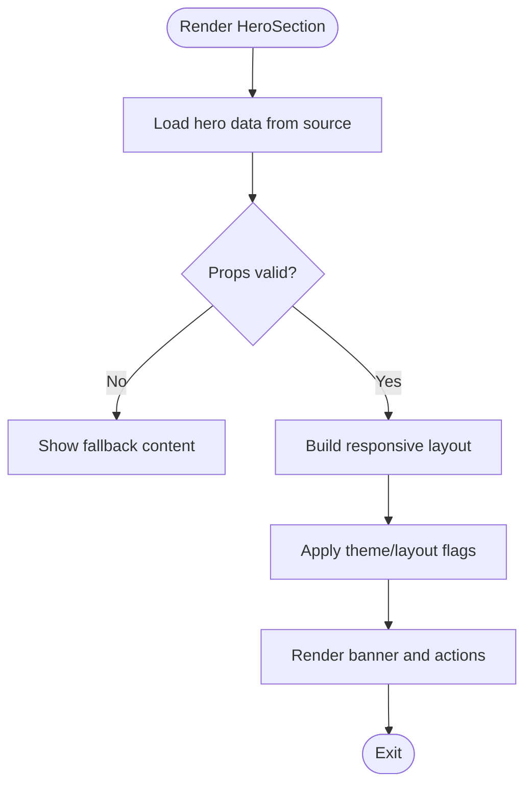
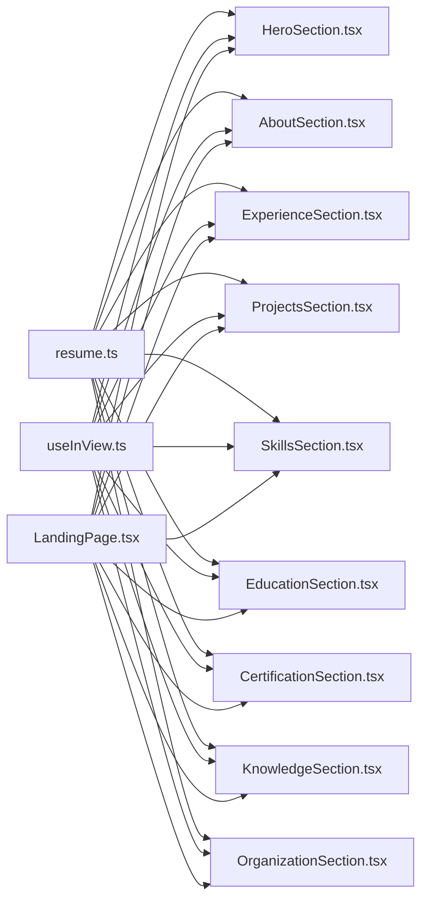

# Core Components

<cite>
**Referenced Files in This Document**
- [LandingPage.tsx](file://src/pages/LandingPage.tsx)
- [AboutSection.tsx](file://src/components/sections/AboutSection.tsx)
- [CertificationSection.tsx](file://src/components/sections/CertificationSection.tsx)
- [EducationSection.tsx](file://src/components/sections/EducationSection.tsx)
- [ExperienceSection.tsx](file://src/components/sections/ExperienceSection.tsx)
- [HeroSection.tsx](file://src/components/sections/HeroSection.tsx)
- [KnowledgeSection.tsx](file://src/components/sections/KnowledgeSection.tsx)
- [OrganizationSection.tsx](file://src/components/sections/OrganizationSection.tsx)
- [ProjectsSection.tsx](file://src/components/sections/ProjectsSection.tsx)
- [SkillsSection.tsx](file://src/components/sections/SkillsSection.tsx)
- [resume.ts](file://src/data/resume.ts)
- [useInView.ts](file://src/hooks/useInView.ts)
</cite>

## Table of Contents
1. Introduction
2. Project Structure
3. Core Components
4. Architecture Overview
5. Detailed Component Analysis
6. Dependency Analysis
7. Performance Considerations
8. Troubleshooting Guide
9. Conclusion

## Introduction
This document provides comprehensive documentation for the core resume section components used to build the landing page. It explains each section’s purpose, props interface, data structure requirements, and rendering behavior. It also covers common patterns across sections such as data binding, responsive design, accessibility, composition with the main landing page, customization strategies, performance considerations, and best practices for extending or creating new sections.

## Project Structure
The resume application is organized into feature-based directories:
- Section components live under src/components/sections and render individual resume sections.
- The main landing page composes these sections and binds them to centralized data.
- Data is defined in a single source file for consistency and easy maintenance.
- A custom hook supports intersection observer-based behaviors (e.g., animations).

**Diagram sources**
- [LandingPage.tsx](file://src/pages/LandingPage.tsx)
- [HeroSection.tsx](file://src/components/sections/HeroSection.tsx)
- [AboutSection.tsx](file://src/components/sections/AboutSection.tsx)
- [ExperienceSection.tsx](file://src/components/sections/ExperienceSection.tsx)
- [ProjectsSection.tsx](file://src/components/sections/ProjectsSection.tsx)
- [SkillsSection.tsx](file://src/components/sections/SkillsSection.tsx)
- [EducationSection.tsx](file://src/components/sections/EducationSection.tsx)
- [CertificationSection.tsx](file://src/components/sections/CertificationSection.tsx)
- [KnowledgeSection.tsx](file://src/components/sections/KnowledgeSection.tsx)
- [OrganizationSection.tsx](file://src/components/sections/OrganizationSection.tsx)
- [resume.ts](file://src/data/resume.ts)
- [useInView.ts](file://src/hooks/useInView.ts)

**Section sources**
- [LandingPage.tsx](file://src/pages/LandingPage.tsx)
- [resume.ts](file://src/data/resume.ts)
- [useInView.ts](file://src/hooks/useInView.ts)

## Core Components
The following section components are part of the resume landing page. Each component renders a distinct area of the resume and consumes typed data from the central data source.

- HeroSection
  - Purpose: Displays the primary introduction and key highlights at the top of the page.
  - Props: Typically includes title, subtitle, summary, and optional action links; may accept theme overrides and visibility flags.
  - Data: Binds to hero-related fields from the data source.
  - Rendering: Full-width banner with responsive typography and layout; often includes call-to-action elements.
  - Accessibility: Semantic headings, descriptive labels, sufficient color contrast.

- AboutSection
  - Purpose: Presents a concise personal overview and background.
  - Props: Text content, image/avatar reference, and optional layout variants.
  - Data: Reads about/bio fields from the data source.
  - Rendering: Two-column layout on larger screens, stacked on small screens.
  - Accessibility: Proper heading hierarchy, alt text for images, readable line lengths.

- ExperienceSection
  - Purpose: Lists professional experience entries with roles, companies, dates, and descriptions.
  - Props: Array of experience items, sorting/filtering options, and display toggles.
  - Data: Consumes an array of experience objects from the data source.
  - Rendering: Timeline or card list; collapsible details on mobile.
  - Accessibility: Descriptive lists, proper date formatting, keyboard navigable if interactive.

- ProjectsSection
  - Purpose: Showcases notable projects with titles, descriptions, links, and media.
  - Props: Array of project items, filtering by tags/categories, and view mode.
  - Data: Consumes an array of project objects from the data source.
  - Rendering: Grid of cards with hover states; responsive columns.
  - Accessibility: Link labels describe destinations, images have alt text.

- SkillsSection
  - Purpose: Displays technical skills grouped by category or proficiency.
  - Props: Skill groups, visualization type (list, bars, badges), and ordering.
  - Data: Consumes skill group arrays from the data source.
  - Rendering: Responsive lists or visual indicators; accessible progress semantics when applicable.
  - Accessibility: Avoid misleading progress bars; use text labels for proficiency levels.

- EducationSection
  - Purpose: Lists educational background including degrees, institutions, and dates.
  - Props: Array of education items and display preferences.
  - Data: Consumes an array of education objects from the data source.
  - Rendering: List or timeline similar to experience but tailored for academic info.
  - Accessibility: Clear headings per entry, semantic lists.

- CertificationSection
  - Purpose: Highlights certifications with names, issuing bodies, and dates.
  - Props: Array of certification items and optional verification links.
  - Data: Consumes an array of certification objects from the data source.
  - Rendering: Compact list or badge-style cards.
  - Accessibility: Links labeled with certification name and issuer.

- KnowledgeSection
  - Purpose: Summarizes domain knowledge areas or expertise topics.
  - Props: Array of knowledge items and grouping strategy.
  - Data: Consumes an array of knowledge objects from the data source.
  - Rendering: Tag clouds or categorized lists.
  - Accessibility: Grouped lists with headings per category.

- OrganizationSection
  - Purpose: Details organizational affiliations or memberships.
  - Props: Array of organization items and role metadata.
  - Data: Consumes an array of organization objects from the data source.
  - Rendering: List with roles and tenure information.
  - Accessibility: Proper labeling and structured lists.

Common patterns across all sections:
- Data binding: All sections receive typed data from the central data source and map it to their props.
- Responsive design: Sections adapt layouts using CSS classes and breakpoints; typically switch from multi-column to single-column on smaller screens.
- Accessibility: Use semantic HTML, descriptive labels, alt text, and keyboard navigation where applicable.
- Composition: Sections are composed by the landing page, which orchestrates data flow and layout.

**Section sources**
- [AboutSection.tsx](file://src/components/sections/AboutSection.tsx)
- [CertificationSection.tsx](file://src/components/sections/CertificationSection.tsx)
- [EducationSection.tsx](file://src/components/sections/EducationSection.tsx)
- [ExperienceSection.tsx](file://src/components/sections/ExperienceSection.tsx)
- [HeroSection.tsx](file://src/components/sections/HeroSection.tsx)
- [KnowledgeSection.tsx](file://src/components/sections/KnowledgeSection.tsx)
- [OrganizationSection.tsx](file://src/components/sections/OrganizationSection.tsx)
- [ProjectsSection.tsx](file://src/components/sections/ProjectsSection.tsx)
- [SkillsSection.tsx](file://src/components/sections/SkillsSection.tsx)
- [resume.ts](file://src/data/resume.ts)

## Architecture Overview
The landing page acts as the root container that imports and renders all section components. Data is centralized in a single module and passed down to sections via props. Optional hooks provide shared behaviors like intersection observer triggers.

**Diagram sources**
- [LandingPage.tsx](file://src/pages/LandingPage.tsx)
- [resume.ts](file://src/data/resume.ts)
- [HeroSection.tsx](file://src/components/sections/HeroSection.tsx)
- [AboutSection.tsx](file://src/components/sections/AboutSection.tsx)
- [ExperienceSection.tsx](file://src/components/sections/ExperienceSection.tsx)
- [ProjectsSection.tsx](file://src/components/sections/ProjectsSection.tsx)
- [SkillsSection.tsx](file://src/components/sections/SkillsSection.tsx)
- [EducationSection.tsx](file://src/components/sections/EducationSection.tsx)
- [CertificationSection.tsx](file://src/components/sections/CertificationSection.tsx)
- [KnowledgeSection.tsx](file://src/components/sections/KnowledgeSection.tsx)
- [OrganizationSection.tsx](file://src/components/sections/OrganizationSection.tsx)

## Detailed Component Analysis

### HeroSection
- Purpose: Primary introduction and key highlights at the top of the page.
- Props interface: Title, subtitle, summary text, optional action links, and theme/layout flags.
- Data structure: Binds to hero fields from the data source.
- Rendering behavior: Full-width banner with responsive typography; may include call-to-action buttons.
- Accessibility: Uses semantic headings and descriptive link labels.

**Diagram sources**
- [HeroSection.tsx](file://src/components/sections/HeroSection.tsx)
- [resume.ts](file://src/data/resume.ts)

**Section sources**
- [HeroSection.tsx](file://src/components/sections/HeroSection.tsx)
- [resume.ts](file://src/data/resume.ts)

### AboutSection
- Purpose: Personal overview and background.
- Props interface: Bio text, avatar/image reference, layout variant.
- Data structure: Reads about/bio fields from the data source.
- Rendering behavior: Two-column layout on large screens; stacked on small screens.
- Accessibility: Alt text for images, proper heading hierarchy.

**Section sources**
- [AboutSection.tsx](file://src/components/sections/AboutSection.tsx)
- [resume.ts](file://src/data/resume.ts)

### ExperienceSection
- Purpose: Professional experience listings.
- Props interface: Array of experience items, sorting/filtering options, display toggles.
- Data structure: Consumes an array of experience objects from the data source.
- Rendering behavior: Timeline or card list; collapsible details on mobile.
- Accessibility: Keyboard navigable lists, clear date formatting.

**Section sources**
- [ExperienceSection.tsx](file://src/components/sections/ExperienceSection.tsx)
- [resume.ts](file://src/data/resume.ts)

### ProjectsSection
- Purpose: Showcase projects with descriptions and links.
- Props interface: Array of project items, filters by tags/categories, view mode.
- Data structure: Consumes an array of project objects from the data source.
- Rendering behavior: Responsive grid of cards with hover states.
- Accessibility: Descriptive link labels, alt text for images.

**Section sources**
- [ProjectsSection.tsx](file://src/components/sections/ProjectsSection.tsx)
- [resume.ts](file://src/data/resume.ts)

### SkillsSection
- Purpose: Display technical skills grouped by category or proficiency.
- Props interface: Skill groups, visualization type (list, bars, badges), ordering.
- Data structure: Consumes skill group arrays from the data source.
- Rendering behavior: Responsive lists or visual indicators; accessible labels for proficiency.
- Accessibility: Avoid misleading progress semantics; use text labels.

**Section sources**
- [SkillsSection.tsx](file://src/components/sections/SkillsSection.tsx)
- [resume.ts](file://src/data/resume.ts)

### EducationSection
- Purpose: Educational background listing.
- Props interface: Array of education items and display preferences.
- Data structure: Consumes an array of education objects from the data source.
- Rendering behavior: List or timeline tailored for academic info.
- Accessibility: Clear headings per entry, semantic lists.

**Section sources**
- [EducationSection.tsx](file://src/components/sections/EducationSection.tsx)
- [resume.ts](file://src/data/resume.ts)

### CertificationSection
- Purpose: Highlight certifications with issuers and dates.
- Props interface: Array of certification items and optional verification links.
- Data structure: Consumes an array of certification objects from the data source.
- Rendering behavior: Compact list or badge-style cards.
- Accessibility: Links labeled with certification name and issuer.

**Section sources**
- [CertificationSection.tsx](file://src/components/sections/CertificationSection.tsx)
- [resume.ts](file://src/data/resume.ts)

### KnowledgeSection
- Purpose: Summarize domain knowledge areas.
- Props interface: Array of knowledge items and grouping strategy.
- Data structure: Consumes an array of knowledge objects from the data source.
- Rendering behavior: Tag clouds or categorized lists.
- Accessibility: Grouped lists with headings per category.

**Section sources**
- [KnowledgeSection.tsx](file://src/components/sections/KnowledgeSection.tsx)
- [resume.ts](file://src/data/resume.ts)

### OrganizationSection
- Purpose: Organizational affiliations and memberships.
- Props interface: Array of organization items and role metadata.
- Data structure: Consumes an array of organization objects from the data source.
- Rendering behavior: List with roles and tenure information.
- Accessibility: Proper labeling and structured lists.

**Section sources**
- [OrganizationSection.tsx](file://src/components/sections/OrganizationSection.tsx)
- [resume.ts](file://src/data/resume.ts)

## Dependency Analysis
Sections depend on:
- Centralized data source for consistent types and values.
- Optional shared hook for intersection observer behaviors.
- Landing page for composition and layout orchestration.

**Diagram sources**
- [resume.ts](file://src/data/resume.ts)
- [useInView.ts](file://src/hooks/useInView.ts)
- [LandingPage.tsx](file://src/pages/LandingPage.tsx)
- [HeroSection.tsx](file://src/components/sections/HeroSection.tsx)
- [AboutSection.tsx](file://src/components/sections/AboutSection.tsx)
- [ExperienceSection.tsx](file://src/components/sections/ExperienceSection.tsx)
- [ProjectsSection.tsx](file://src/components/sections/ProjectsSection.tsx)
- [SkillsSection.tsx](file://src/components/sections/SkillsSection.tsx)
- [EducationSection.tsx](file://src/components/sections/EducationSection.tsx)
- [CertificationSection.tsx](file://src/components/sections/CertificationSection.tsx)
- [KnowledgeSection.tsx](file://src/components/sections/KnowledgeSection.tsx)
- [OrganizationSection.tsx](file://src/components/sections/OrganizationSection.tsx)

**Section sources**
- [resume.ts](file://src/data/resume.ts)
- [useInView.ts](file://src/hooks/useInView.ts)
- [LandingPage.tsx](file://src/pages/LandingPage.tsx)

## Performance Considerations
- Prefer memoization for expensive computations within sections (e.g., derived lists, filtered datasets).
- Use lazy loading for heavy assets (images, videos) and consider code splitting for large sections.
- Minimize re-renders by passing stable props and avoiding unnecessary state updates.
- Optimize intersection observer usage: debounce callbacks and avoid heavy work inside observers.
- Keep data structures flat and typed to reduce parsing overhead.
- Use responsive utilities efficiently; avoid excessive media queries by leveraging utility classes.

[No sources needed since this section provides general guidance]

## Troubleshooting Guide
Common issues and resolutions:
- Missing or incorrect data fields: Ensure the data source matches the expected types; add default values in sections to prevent crashes.
- Layout breaks on small screens: Verify responsive classes and test across breakpoints; ensure images scale correctly.
- Accessibility failures: Check heading hierarchy, alt text presence, and link labels; run automated audits and manual keyboard testing.
- Performance regressions: Profile renders with React DevTools; identify unnecessary re-renders and optimize with memoization or virtualization for long lists.
- Intersection observer not triggering: Confirm element visibility and observer configuration; avoid heavy operations inside callbacks.

**Section sources**
- [useInView.ts](file://src/hooks/useInView.ts)

## Conclusion
The resume section components follow consistent patterns for data binding, responsive design, and accessibility. The landing page composes these sections and centralizes data management. By adhering to the documented interfaces and best practices, you can extend existing sections or create new ones while maintaining performance and user experience.

[No sources needed since this section summarizes without analyzing specific files]