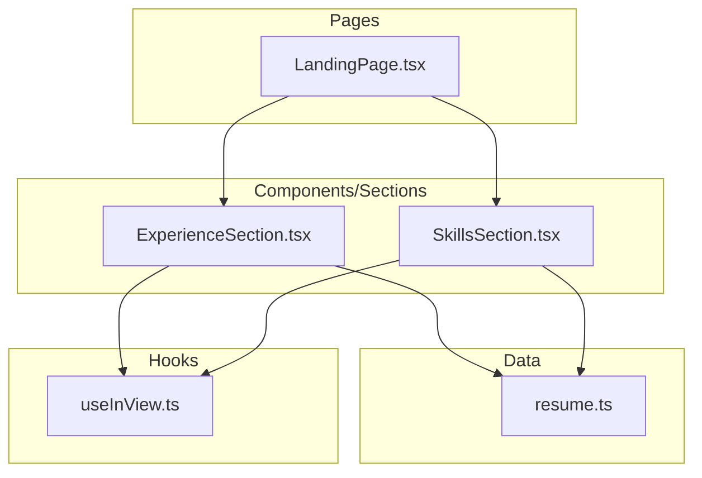
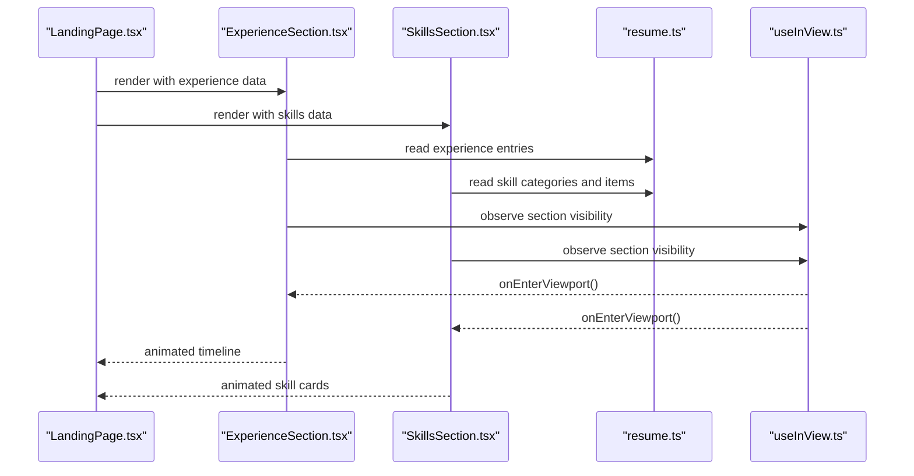
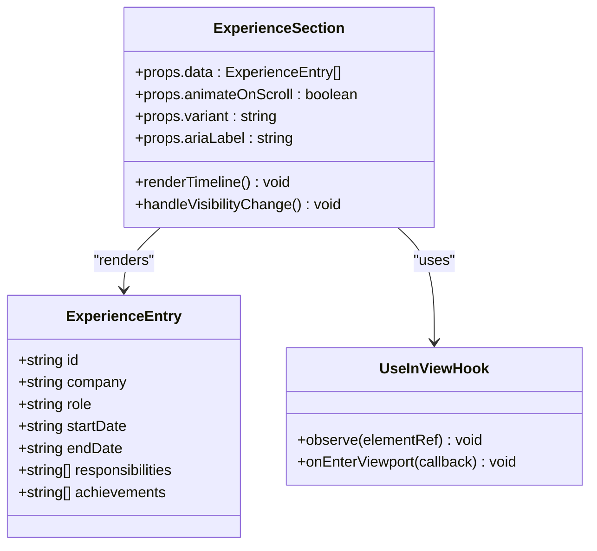
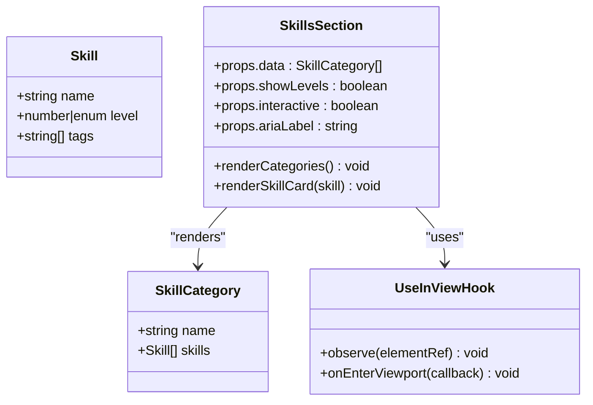
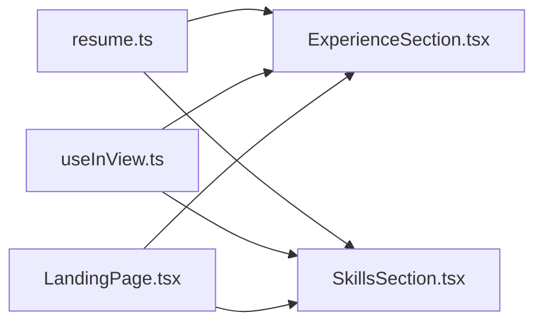

# Experience and Skills Sections

<cite>
**Referenced Files in This Document**
- [ExperienceSection.tsx](file://src/components/sections/ExperienceSection.tsx)
- [SkillsSection.tsx](file://src/components/sections/SkillsSection.tsx)
- [resume.ts](file://src/data/resume.ts)
- [useInView.ts](file://src/hooks/useInView.ts)
- [LandingPage.tsx](file://src/pages/LandingPage.tsx)
</cite>

## Table of Contents
1. [Introduction](#introduction)
2. [Project Structure](#project-structure)
3. [Core Components](#core-components)
4. [Architecture Overview](#architecture-overview)
5. [Detailed Component Analysis](#detailed-component-analysis)
6. [Dependency Analysis](#dependency-analysis)
7. [Performance Considerations](#performance-considerations)
8. [Troubleshooting Guide](#troubleshooting-guide)
9. [Conclusion](#conclusion)
10. [Appendices](#appendices)

## Introduction
This document provides comprehensive documentation for the ExperienceSection and SkillsSection components. It explains how work history, responsibilities, achievements, and timeline visualization are implemented in ExperienceSection, and how technical skills, proficiency levels, categories, and interactive indicators are rendered in SkillsSection. The guide includes data models, props interfaces, animation strategies, responsive design patterns, examples for extending content, integration with external data sources, performance optimization for large datasets, and accessibility compliance.

## Project Structure
The relevant code resides under src/components/sections for UI sections, src/data for static resume data, src/hooks for reusable hooks (e.g., intersection observer), and src/pages for page composition where these sections are used.

**Diagram sources**
- [LandingPage.tsx](file://src/pages/LandingPage.tsx)
- [ExperienceSection.tsx](file://src/components/sections/ExperienceSection.tsx)
- [SkillsSection.tsx](file://src/components/sections/SkillsSection.tsx)
- [resume.ts](file://src/data/resume.ts)
- [useInView.ts](file://src/hooks/useInView.ts)

**Section sources**
- [ExperienceSection.tsx](file://src/components/sections/ExperienceSection.tsx)
- [SkillsSection.tsx](file://src/components/sections/SkillsSection.tsx)
- [resume.ts](file://src/data/resume.ts)
- [useInView.ts](file://src/hooks/useInView.ts)
- [LandingPage.tsx](file://src/pages/LandingPage.tsx)

## Core Components
- ExperienceSection: Renders a chronological timeline of professional experiences, including company, role, date range, responsibilities, and achievements. Supports animations on scroll and responsive layouts.
- SkillsSection: Displays categorized technical skills with proficiency indicators. Includes interactive elements such as hover states and optional toggles to filter or expand skill groups.

Key responsibilities:
- Data binding from resume data source
- Rendering accessible lists and timelines
- Animations via intersection observer hook
- Responsive layout using CSS classes and flex/grid patterns
- Error handling for missing or malformed data

**Section sources**
- [ExperienceSection.tsx](file://src/components/sections/ExperienceSection.tsx)
- [SkillsSection.tsx](file://src/components/sections/SkillsSection.tsx)

## Architecture Overview
ExperienceSection and SkillsSection are presentational components that consume typed data from resume.ts and use useInView.ts to trigger animations when sections enter the viewport. LandingPage composes these sections into the main view.

**Diagram sources**
- [LandingPage.tsx](file://src/pages/LandingPage.tsx)
- [ExperienceSection.tsx](file://src/components/sections/ExperienceSection.tsx)
- [SkillsSection.tsx](file://src/components/sections/SkillsSection.tsx)
- [resume.ts](file://src/data/resume.ts)
- [useInView.ts](file://src/hooks/useInView.ts)

## Detailed Component Analysis

### ExperienceSection
Purpose:
- Showcase work history with job title, company, dates, responsibilities, and achievements.
- Visualize timeline with clear chronological ordering and visual markers.
- Provide smooth entry animations when scrolled into view.

Data model expectations:
- Array of experience entries with fields such as id, company, role, startDate, endDate, responsibilities, achievements.
- Dates formatted consistently for display.
- Optional metadata like location, link to project or portfolio.

Props interface highlights:
- data: array of experience entries
- animateOnScroll: boolean to enable/disable animations
- variant: optional styling variant (e.g., compact vs detailed)
- ariaLabel: accessible label for screen readers

Rendering logic:
- Sorts entries by date if not pre-sorted.
- Maps each entry to a timeline item with structured headings and lists.
- Uses semantic HTML (section, h2/h3, ul/li) for accessibility.
- Applies CSS classes for responsive behavior and theme consistency.

Animation implementation:
- Uses useInView hook to detect visibility.
- Triggers fade-in or slide-up transitions when entering viewport.
- Debounces repeated triggers to avoid excessive re-renders.

Responsive design:
- Single-column layout on small screens; multi-column or expanded details on larger screens.
- Collapsible responsibility lists on mobile to reduce vertical space.

Accessibility:
- Proper heading hierarchy and ARIA attributes.
- Keyboard navigable lists and links.
- Sufficient color contrast and focus indicators.

Error handling:
- Gracefully handles missing fields by rendering placeholders.
- Logs warnings for malformed date ranges.

Performance considerations:
- Memoizes expensive computations (sorting, filtering).
- Avoids unnecessary re-renders by stabilizing props and keys.

Examples:
- Adding a new experience entry: extend the data source with a new object matching the expected shape and ensure date formatting is consistent.
- Customizing timeline visuals: adjust CSS classes or pass a variant prop to change spacing, colors, and typography.

Integration with external data:
- Replace static data import with an API call pattern and state management to fetch and cache entries.
- Implement loading and error states for network requests.

**Section sources**
- [ExperienceSection.tsx](file://src/components/sections/ExperienceSection.tsx)
- [resume.ts](file://src/data/resume.ts)
- [useInView.ts](file://src/hooks/useInView.ts)

#### Class Diagram (Conceptual Mapping)

[No diagram sources since this diagram is conceptual mapping]

### SkillsSection
Purpose:
- Display technical skills grouped by categories (e.g., Frontend, Backend, DevOps).
- Show proficiency levels visually (e.g., bars, dots, or badges).
- Provide interactive indicators for hover/focus states and optional toggles to filter or expand categories.

Data model expectations:
- Array of skill categories, each containing name and a list of skills.
- Each skill has name, level (numeric or categorical), and optional tags or icons.

Props interface highlights:
- data: array of skill categories
- showLevels: boolean to toggle proficiency indicators
- interactive: boolean to enable hover/toggle behaviors
- ariaLabel: accessible label for screen readers

Rendering logic:
- Maps categories to sections with headings and skill grids/cards.
- Renders proficiency indicators based on level values.
- Applies CSS classes for responsive grid layouts.

Animation implementation:
- Uses useInView hook to animate category entrances.
- Staggered animations for skill items to improve perceived performance.

Responsive design:
- Grid adapts from single column on mobile to multiple columns on desktop.
- Skill cards collapse or wrap gracefully.

Accessibility:
- Semantic structure with proper headings and lists.
- ARIA roles for progress indicators and interactive elements.
- Keyboard navigation and focus management.

Error handling:
- Skips invalid categories or skills with missing required fields.
- Provides fallback labels for unknown levels.

Performance considerations:
- Memoizes category rendering and skill lists.
- Uses stable keys to minimize diffing overhead.

Examples:
- Customizing skill displays: adjust level thresholds, change indicator styles, or add tooltips for descriptions.
- Integrating with external data: fetch categories and skills from an API, handle loading/error states, and normalize data shapes.

**Section sources**
- [SkillsSection.tsx](file://src/components/sections/SkillsSection.tsx)
- [resume.ts](file://src/data/resume.ts)
- [useInView.ts](file://src/hooks/useInView.ts)

#### Class Diagram (Conceptual Mapping)

[No diagram sources since this diagram is conceptual mapping]

## Dependency Analysis
ExperienceSection and SkillsSection depend on:
- Static data source (resume.ts) for initial content
- Intersection observer hook (useInView.ts) for animations
- Page composition (LandingPage.tsx) for layout and context

**Diagram sources**
- [resume.ts](file://src/data/resume.ts)
- [ExperienceSection.tsx](file://src/components/sections/ExperienceSection.tsx)
- [SkillsSection.tsx](file://src/components/sections/SkillsSection.tsx)
- [useInView.ts](file://src/hooks/useInView.ts)
- [LandingPage.tsx](file://src/pages/LandingPage.tsx)

**Section sources**
- [ExperienceSection.tsx](file://src/components/sections/ExperienceSection.tsx)
- [SkillsSection.tsx](file://src/components/sections/SkillsSection.tsx)
- [resume.ts](file://src/data/resume.ts)
- [useInView.ts](file://src/hooks/useInView.ts)
- [LandingPage.tsx](file://src/pages/LandingPage.tsx)

## Performance Considerations
- Memoization: Wrap heavy computations (sorting, filtering, mapping) with memoization utilities to prevent unnecessary recalculations.
- Virtualization: For large datasets (e.g., many experiences or hundreds of skills), consider virtualized lists to render only visible items.
- Animation throttling: Debounce or throttle intersection observer callbacks to avoid frequent state updates.
- Image and icon optimization: Lazy-load assets and use SVG sprites or icon libraries efficiently.
- CSS containment: Use CSS containment to isolate component rendering and reduce layout thrashing.
- Accessibility performance: Ensure ARIA updates do not cause excessive reflows; batch DOM changes where possible.

[No sources needed since this section provides general guidance]

## Troubleshooting Guide
Common issues and resolutions:
- Missing data fields: Validate input shapes and provide fallbacks; log warnings for malformed entries.
- Animation not triggering: Verify element refs and intersection observer configuration; ensure container has sufficient height.
- Responsiveness problems: Inspect media queries and grid/flex configurations; test across device widths.
- Accessibility failures: Run automated checks (axe, Lighthouse); fix heading hierarchy, ARIA roles, and keyboard navigation.
- Performance regressions: Profile renders with React DevTools; identify unnecessary re-renders and apply memoization.

**Section sources**
- [ExperienceSection.tsx](file://src/components/sections/ExperienceSection.tsx)
- [SkillsSection.tsx](file://src/components/sections/SkillsSection.tsx)
- [useInView.ts](file://src/hooks/useInView.ts)

## Conclusion
ExperienceSection and SkillsSection deliver robust, accessible, and performant presentations of work history and technical skills. By adhering to the documented data models, props interfaces, animation strategies, and responsive patterns, developers can extend and customize these components effectively. Integration with external data sources and adherence to accessibility standards ensure a high-quality user experience across devices and assistive technologies.

[No sources needed since this section summarizes without analyzing specific files]

## Appendices

### Example: Adding a New Experience Entry
- Extend the data source with a new entry matching the expected shape.
- Ensure date fields are consistently formatted.
- Verify that ExperienceSection renders the new entry correctly and maintains timeline order.

**Section sources**
- [resume.ts](file://src/data/resume.ts)
- [ExperienceSection.tsx](file://src/components/sections/ExperienceSection.tsx)

### Example: Customizing Skill Displays
- Adjust proficiency thresholds and indicator styles within SkillsSection.
- Add tooltips or descriptions for skills to enhance interactivity.
- Toggle category visibility or implement search/filter functionality.

**Section sources**
- [SkillsSection.tsx](file://src/components/sections/SkillsSection.tsx)
- [resume.ts](file://src/data/resume.ts)

### Example: Integrating with External Data Sources
- Replace static imports with asynchronous data fetching.
- Manage loading and error states in both components.
- Normalize incoming data to match expected shapes before rendering.

**Section sources**
- [ExperienceSection.tsx](file://src/components/sections/ExperienceSection.tsx)
- [SkillsSection.tsx](file://src/components/sections/SkillsSection.tsx)