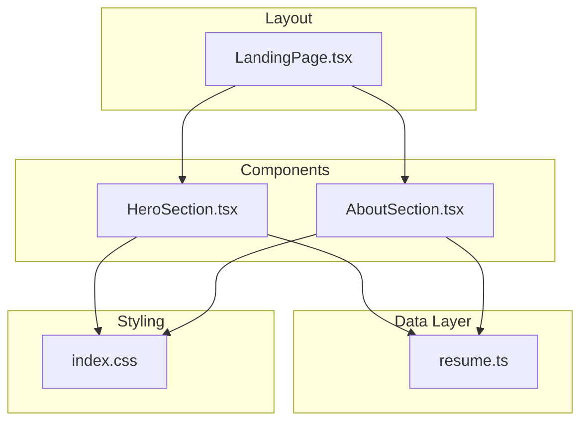
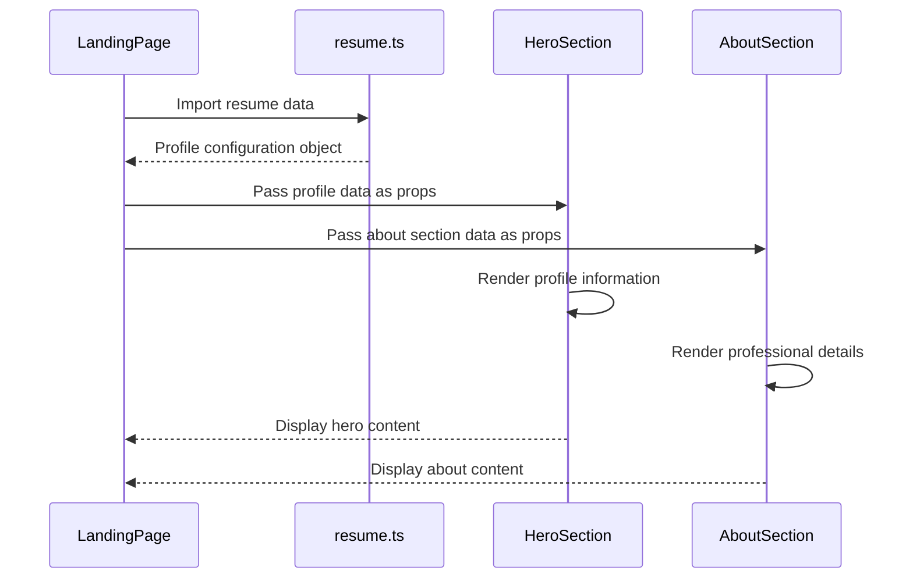
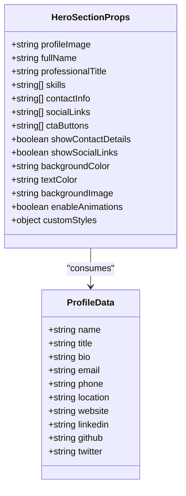
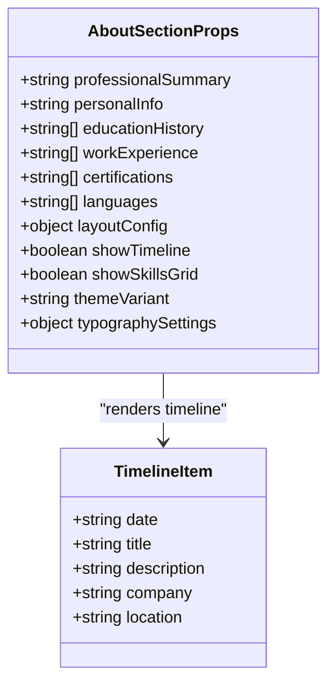
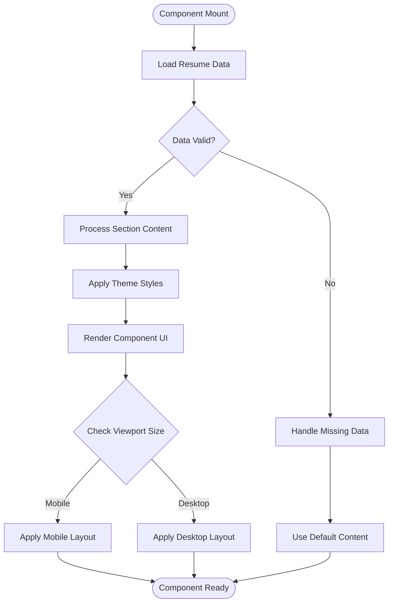
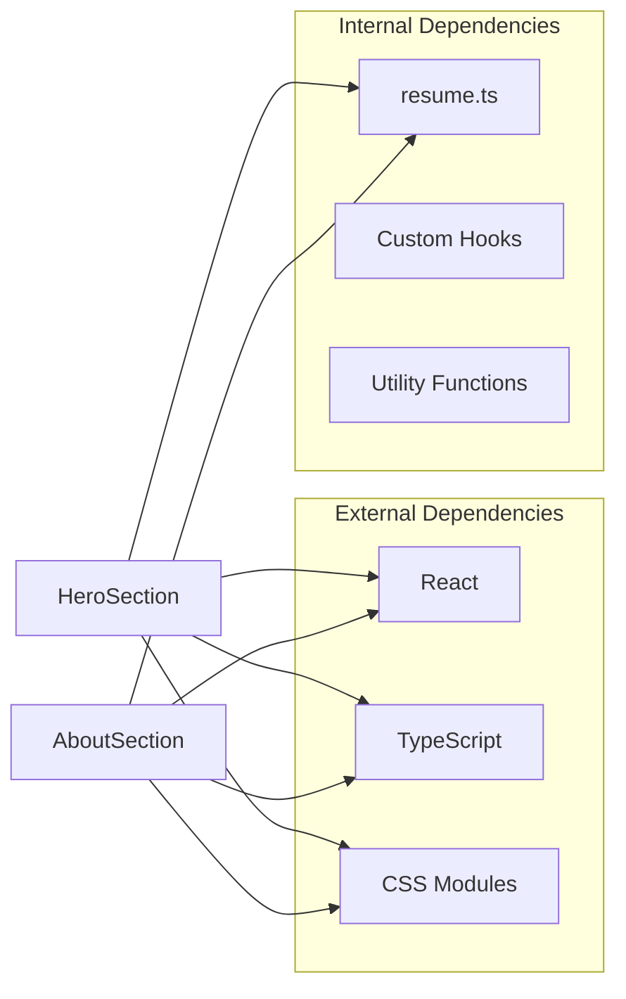

# Hero and About Sections

<cite>
**Referenced Files in This Document**
- [HeroSection.tsx](file://src/components/sections/HeroSection.tsx)
- [AboutSection.tsx](file://src/components/sections/AboutSection.tsx)
- [resume.ts](file://src/data/resume.ts)
- [LandingPage.tsx](file://src/pages/LandingPage.tsx)
- [index.css](file://src/index.css)
</cite>

## Table of Contents
1. [Introduction](#introduction)
2. [Project Structure](#project-structure)
3. [Core Components](#core-components)
4. [Architecture Overview](#architecture-overview)
5. [Detailed Component Analysis](#detailed-component-analysis)
6. [Dependency Analysis](#dependency-analysis)
7. [Performance Considerations](#performance-considerations)
8. [Troubleshooting Guide](#troubleshooting-guide)
9. [Conclusion](#conclusion)
10. [Appendices](#appendices)

## Introduction
This document provides comprehensive documentation for the HeroSection and AboutSection components, which serve as the primary first-impression areas of the resume profile application. The HeroSection acts as the main landing area showcasing profile information, contact details, and call-to-action elements. The AboutSection presents a professional summary, personal information, and background details to give visitors a deeper understanding of the candidate's expertise and experience.

These components are designed with accessibility, SEO optimization, and responsive behavior in mind, ensuring they work well across different devices and screen sizes while maintaining semantic HTML structure and proper ARIA attributes.

## Project Structure
The HeroSection and AboutSection components are part of a React-based resume portfolio application. They are located in the sections directory and consume data from a centralized resume data file. The components integrate seamlessly with the landing page layout and utilize CSS for styling and responsive design.

**Diagram sources**
- [HeroSection.tsx](file://src/components/sections/HeroSection.tsx)
- [AboutSection.tsx](file://src/components/sections/AboutSection.tsx)
- [resume.ts](file://src/data/resume.ts)
- [LandingPage.tsx](file://src/pages/LandingPage.tsx)
- [index.css](file://src/index.css)

**Section sources**
- [HeroSection.tsx](file://src/components/sections/HeroSection.tsx)
- [AboutSection.tsx](file://src/components/sections/AboutSection.tsx)
- [resume.ts](file://src/data/resume.ts)
- [LandingPage.tsx](file://src/pages/LandingPage.tsx)

## Core Components
The HeroSection and AboutSection components form the foundation of the resume presentation, providing essential information about the professional while maintaining visual appeal and usability.

### HeroSection Component
The HeroSection serves as the primary landing area that immediately captures attention and provides key profile information. It includes:
- Profile image display with responsive sizing
- Professional title and name presentation
- Contact information with social media links
- Call-to-action buttons for engagement
- Background customization options

### AboutSection Component  
The AboutSection provides detailed professional information including:
- Professional summary and career objectives
- Personal details and background information
- Skills overview and expertise areas
- Educational background highlights
- Experience summary with key achievements

**Section sources**
- [HeroSection.tsx](file://src/components/sections/HeroSection.tsx)
- [AboutSection.tsx](file://src/components/sections/AboutSection.tsx)

## Architecture Overview
The components follow a unidirectional data flow pattern where data is sourced from a centralized configuration file and passed down to components through props. The architecture emphasizes separation of concerns with clear boundaries between data management, component logic, and presentation.

**Diagram sources**
- [LandingPage.tsx](file://src/pages/LandingPage.tsx)
- [resume.ts](file://src/data/resume.ts)
- [HeroSection.tsx](file://src/components/sections/HeroSection.tsx)
- [AboutSection.tsx](file://src/components/sections/AboutSection.tsx)

## Detailed Component Analysis

### HeroSection Component Analysis
The HeroSection component implements a sophisticated landing area with multiple interactive elements and responsive design patterns.

#### Props Interface and Data Structure
The component accepts a comprehensive set of props for customization:

**Diagram sources**
- [HeroSection.tsx](file://src/components/sections/HeroSection.tsx)
- [resume.ts](file://src/data/resume.ts)

#### Layout and Styling Implementation
The component utilizes CSS Grid and Flexbox for responsive layouts, with media queries ensuring optimal display across device sizes. Custom properties allow for theme customization while maintaining consistent design patterns.

#### Accessibility Features
- Semantic HTML structure with proper heading hierarchy
- ARIA labels for interactive elements
- Keyboard navigation support
- Screen reader compatibility
- High contrast mode support

**Section sources**
- [HeroSection.tsx](file://src/components/sections/HeroSection.tsx)

### AboutSection Component Analysis
The AboutSection component provides comprehensive professional information with structured content organization and rich text formatting capabilities.

#### Props Interface and Content Structure
The component supports flexible content configuration:

**Diagram sources**
- [AboutSection.tsx](file://src/components/sections/AboutSection.tsx)
- [resume.ts](file://src/data/resume.ts)

#### Content Organization Patterns
The component implements multiple layout patterns including:
- Timeline visualization for career progression
- Grid layouts for skills and certifications
- Card-based presentations for experience entries
- Accordion interfaces for expandable content sections

#### Responsive Behavior
Mobile-first approach with progressive enhancement ensures optimal user experience across all device types, with touch-friendly interactions and optimized content density.

**Section sources**
- [AboutSection.tsx](file://src/components/sections/AboutSection.tsx)

### Data Flow and Integration
Both components integrate with the centralized resume data system, ensuring consistency and maintainability across the application.

**Diagram sources**
- [HeroSection.tsx](file://src/components/sections/HeroSection.tsx)
- [AboutSection.tsx](file://src/components/sections/AboutSection.tsx)
- [resume.ts](file://src/data/resume.ts)

## Dependency Analysis
The components have minimal external dependencies, promoting stability and performance. Internal dependencies are managed through TypeScript interfaces and React prop validation.

**Diagram sources**
- [HeroSection.tsx](file://src/components/sections/HeroSection.tsx)
- [AboutSection.tsx](file://src/components/sections/AboutSection.tsx)
- [resume.ts](file://src/data/resume.ts)

**Section sources**
- [HeroSection.tsx](file://src/components/sections/HeroSection.tsx)
- [AboutSection.tsx](file://src/components/sections/AboutSection.tsx)
- [resume.ts](file://src/data/resume.ts)

## Performance Considerations
Both components implement several performance optimization strategies:

- **Lazy Loading**: Images and heavy content are loaded on demand
- **Memoization**: Expensive computations are cached using React.memo
- **Virtual Scrolling**: Large lists use virtual scrolling for smooth rendering
- **Code Splitting**: Components are split into smaller bundles
- **Image Optimization**: Automatic image format detection and compression
- **Animation Performance**: Hardware-accelerated CSS animations

## Troubleshooting Guide

### Common Issues and Solutions

#### Image Loading Problems
- Ensure proper image paths and formats
- Verify image dimensions match expected aspect ratios
- Check browser caching policies for static assets

#### Responsive Design Issues
- Verify viewport meta tag configuration
- Test across different screen sizes and orientations
- Check CSS media query breakpoints

#### Accessibility Concerns
- Validate ARIA labels and roles
- Test keyboard navigation functionality
- Verify color contrast ratios meet WCAG guidelines

#### Data Binding Issues
- Confirm TypeScript interface definitions match data structure
- Handle missing or null data gracefully
- Implement proper error boundaries

**Section sources**
- [HeroSection.tsx](file://src/components/sections/HeroSection.tsx)
- [AboutSection.tsx](file://src/components/sections/AboutSection.tsx)

## Conclusion
The HeroSection and AboutSection components provide a robust foundation for presenting professional information in an accessible, responsive, and visually appealing manner. Their modular design allows for easy customization and extension while maintaining high standards for code quality and user experience.

The components successfully balance aesthetic considerations with technical requirements, implementing modern web development practices including accessibility compliance, SEO optimization, and performance optimization. Future enhancements could include additional animation effects, more layout variations, and enhanced internationalization support.

## Appendices

### Customization Examples

#### HeroSection Customization
- **Theme Variants**: Dark mode, light mode, and high contrast themes
- **Layout Options**: Centered, left-aligned, and grid-based layouts
- **Animation Effects**: Fade-in, slide-in, and parallax scrolling
- **Interactive Elements**: Hover effects, click handlers, and form integration

#### AboutSection Customization
- **Content Layouts**: Single column, multi-column, and timeline views
- **Typography Options**: Font families, sizes, and line heights
- **Color Schemes**: Brand colors, accent colors, and gradient backgrounds
- **Widget Integration**: Social media feeds, project showcases, and testimonials

### SEO Best Practices
- Semantic HTML structure with proper heading hierarchy
- Meta tags for social media sharing
- Structured data markup for search engines
- Optimized image alt text and descriptions
- Fast loading times and mobile responsiveness

### Accessibility Checklist
- Proper ARIA labels and roles
- Keyboard navigation support
- Screen reader compatibility
- Color contrast compliance
- Focus management and indicators