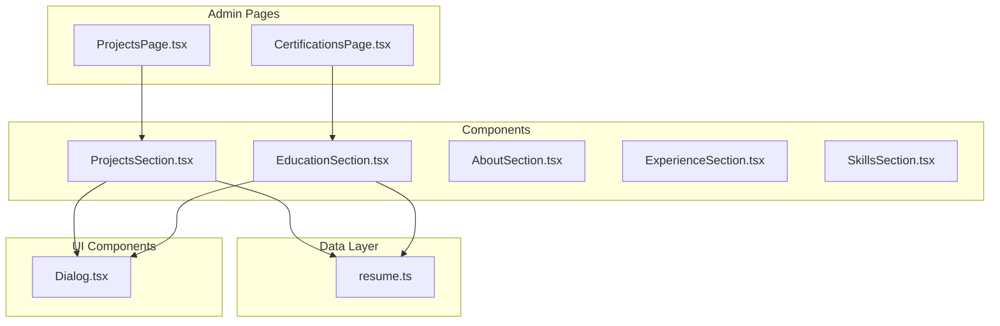
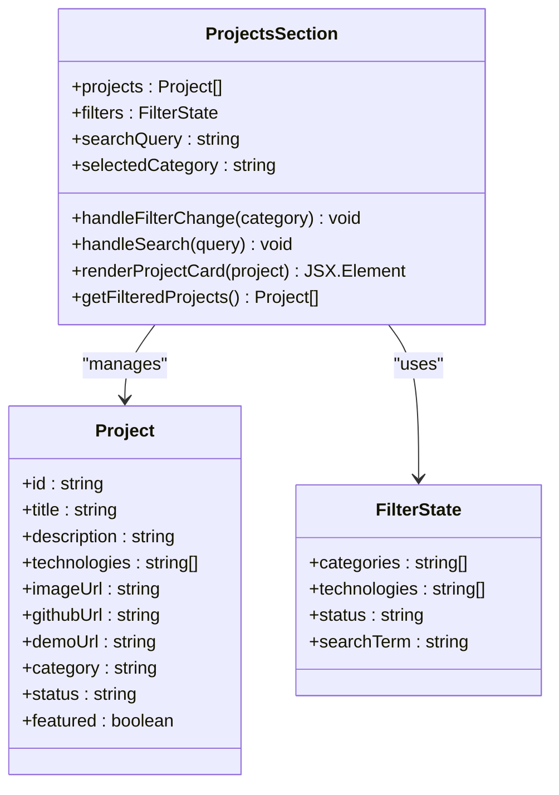
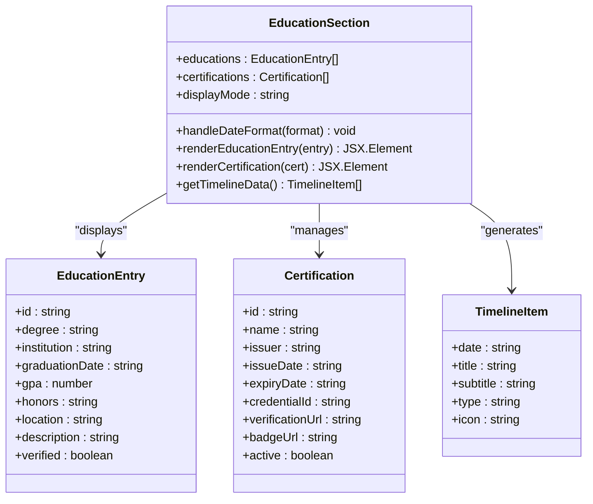
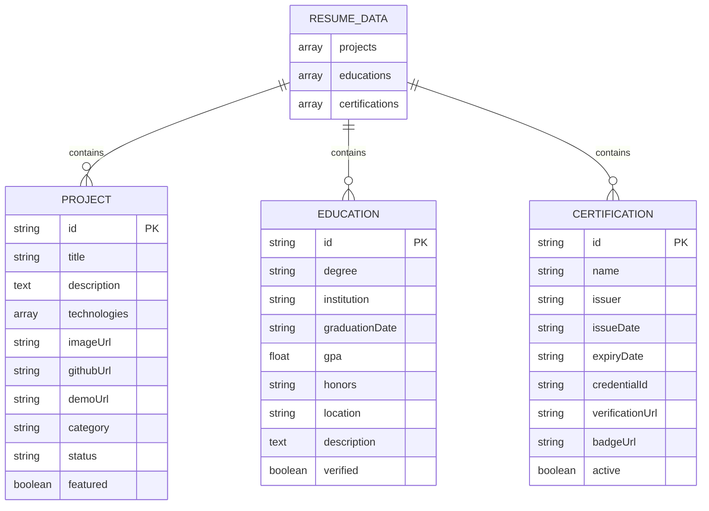
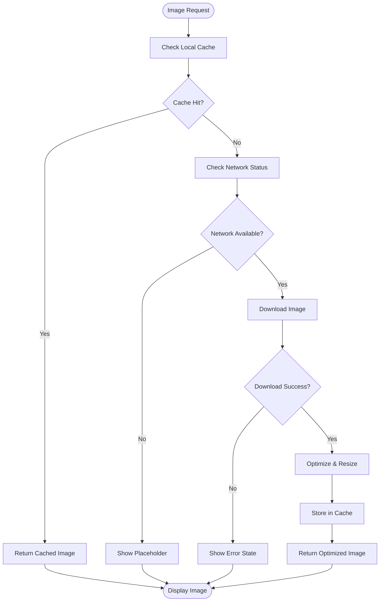
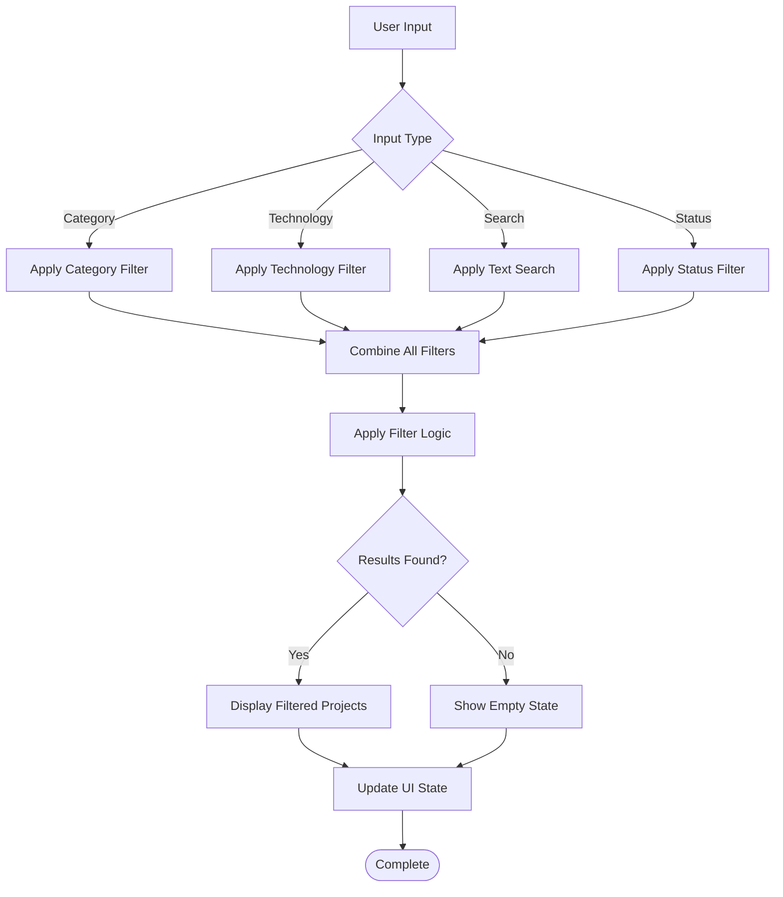
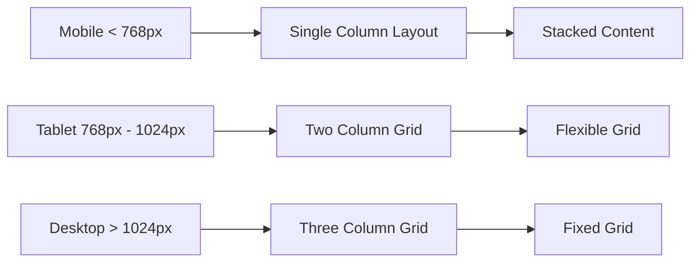
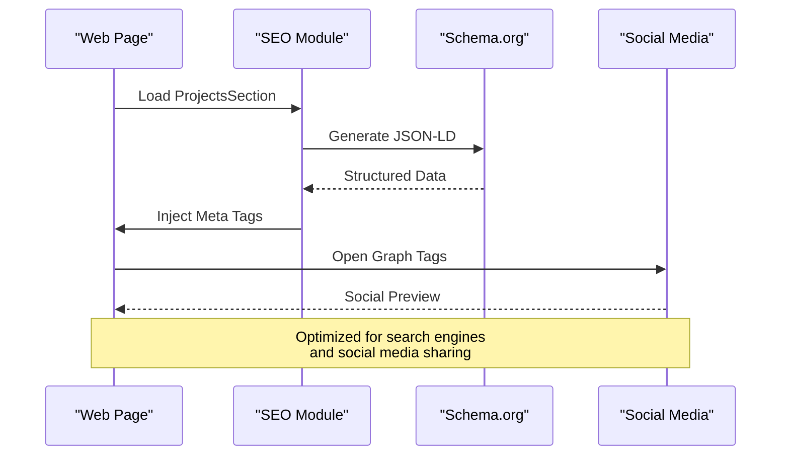

# Projects and Education Sections

<cite>
**Referenced Files in This Document**
- [ProjectsSection.tsx](file://src/components/sections/ProjectsSection.tsx)
- [EducationSection.tsx](file://src/components/sections/EducationSection.tsx)
- [resume.ts](file://src/data/resume.ts)
- [ProjectsPage.tsx](file://src/pages/admin/ProjectsPage.tsx)
- [CertificationsPage.tsx](file://src/pages/admin/CertificationsPage.tsx)
- [AboutSection.tsx](file://src/components/sections/AboutSection.tsx)
- [ExperienceSection.tsx](file://src/components/sections/ExperienceSection.tsx)
- [SkillsSection.tsx](file://src/components/sections/SkillsSection.tsx)
</cite>

## Table of Contents
1. [Introduction](#introduction)
2. [Project Structure Overview](#project-structure-overview)
3. [ProjectsSection Component](#projectsseccion-component)
4. [EducationSection Component](#educationsection-component)
5. [Data Structures and APIs](#data-structures-and-apis)
6. [Image Handling and Media Management](#image-handling-and-media-management)
7. [Filtering and Search Functionality](#filtering-and-search-functionality)
8. [Responsive Design Implementation](#responsive-design-implementation)
9. [SEO Optimization](#seo-optimization)
10. [Social Media Integration](#social-media-integration)
11. [Customization Examples](#customization-examples)
12. [Troubleshooting Guide](#troubleshooting-guide)
13. [Conclusion](#conclusion)

## Introduction

This document provides comprehensive documentation for the ProjectsSection and EducationSection components in the resume-fathaV2 portfolio website. These components are essential parts of a modern developer portfolio, showcasing professional work experience and educational background in an engaging, responsive manner.

The ProjectsSection component is designed to display portfolio projects with rich metadata including descriptions, technologies used, external links, and visual representations. The EducationSection component presents academic credentials, certifications, institutions, and graduation dates in a clean, organized format.

Both components follow React best practices with TypeScript for type safety, implement responsive design patterns, and support various customization options to meet different portfolio requirements.

## Project Structure Overview

The resume-fathaV2 project follows a modular architecture with clear separation of concerns:

**Diagram sources**
- [ProjectsSection.tsx](file://src/components/sections/ProjectsSection.tsx)
- [EducationSection.tsx](file://src/components/sections/EducationSection.tsx)
- [resume.ts](file://src/data/resume.ts)
- [ProjectsPage.tsx](file://src/pages/admin/ProjectsPage.tsx)
- [CertificationsPage.tsx](file://src/pages/admin/CertificationsPage.tsx)

**Section sources**
- [ProjectsSection.tsx](file://src/components/sections/ProjectsSection.tsx)
- [EducationSection.tsx](file://src/components/sections/EducationSection.tsx)
- [resume.ts](file://src/data/resume.ts)

## ProjectsSection Component

The ProjectsSection component serves as the primary showcase for portfolio projects, providing a comprehensive display system with advanced filtering and interactive features.

### Core Features

- **Project Cards**: Display individual projects with titles, descriptions, and visual elements
- **Technology Tags**: Show programming languages, frameworks, and tools used
- **External Links**: Support for GitHub repositories, live demos, and documentation
- **Image Gallery**: Handle project screenshots and demo images
- **Filtering System**: Filter projects by technology, category, or status
- **Responsive Layout**: Adaptive grid system for different screen sizes

### Component Architecture

**Diagram sources**
- [ProjectsSection.tsx](file://src/components/sections/ProjectsSection.tsx)
- [resume.ts](file://src/data/resume.ts)

### Data Structure

The ProjectsSection component works with a well-defined data structure for projects:

| Property | Type | Description | Required |
|----------|------|-------------|----------|
| id | string | Unique identifier for the project | Yes |
| title | string | Project display name | Yes |
| description | string | Detailed project description | Yes |
| technologies | string[] | Array of technologies used | Yes |
| imageUrl | string | Path to project screenshot | No |
| githubUrl | string | GitHub repository link | No |
| demoUrl | string | Live demo URL | No |
| category | string | Project category for filtering | Yes |
| status | string | Development status | Yes |
| featured | boolean | Highlight important projects | No |

### Filtering Capabilities

The component implements a robust filtering system that supports:

- **Category-based filtering**: Group projects by type (web apps, mobile, etc.)
- **Technology-based filtering**: Filter by programming languages or frameworks
- **Status filtering**: Show active, completed, or archived projects
- **Search functionality**: Full-text search across project titles and descriptions
- **Featured projects**: Priority display for highlighted work

**Section sources**
- [ProjectsSection.tsx](file://src/components/sections/ProjectsSection.tsx)
- [resume.ts](file://src/data/resume.ts)

## EducationSection Component

The EducationSection component provides a structured way to display academic background, certifications, and professional development achievements.

### Core Features

- **Academic Degrees**: Display degrees with institution names and graduation dates
- **Certifications**: Showcase professional certifications and licenses
- **Institution Information**: Include university or organization details
- **Date Management**: Handle graduation dates and certification periods
- **Timeline Layout**: Visual timeline representation of educational journey
- **Credential Verification**: Support for verification links and badges

### Component Architecture

**Diagram sources**
- [EducationSection.tsx](file://src/components/sections/EducationSection.tsx)
- [resume.ts](file://src/data/resume.ts)

### Data Structure

The EducationSection component handles two main data types:

#### Education Entry Properties

| Property | Type | Description | Required |
|----------|------|-------------|----------|
| id | string | Unique identifier | Yes |
| degree | string | Degree program name | Yes |
| institution | string | University or organization | Yes |
| graduationDate | string | Completion date | Yes |
| gpa | number | Grade point average | No |
| honors | string | Academic honors received | No |
| location | string | Institution location | No |
| description | string | Additional details | No |
| verified | boolean | Verified credential | No |

#### Certification Properties

| Property | Type | Description | Required |
|----------|------|-------------|----------|
| id | string | Unique identifier | Yes |
| name | string | Certification name | Yes |
| issuer | string | Issuing organization | Yes |
| issueDate | string | Date issued | Yes |
| expiryDate | string | Expiration date | No |
| credentialId | string | Credential reference | No |
| verificationUrl | string | Verification link | No |
| badgeUrl | string | Digital badge image | No |
| active | boolean | Currently valid | No |

**Section sources**
- [EducationSection.tsx](file://src/components/sections/EducationSection.tsx)
- [resume.ts](file://src/data/resume.ts)

## Data Structures and APIs

Both components rely on shared data structures defined in the resume data layer.

### Resume Data Model

The central data structure manages all resume content:

**Diagram sources**
- [resume.ts](file://src/data/resume.ts)

### Component APIs

#### ProjectsSection API

| Method | Parameters | Return Type | Description |
|--------|------------|-------------|-------------|
| handleFilterChange | category: string | void | Update filter state |
| handleSearch | query: string | void | Process search input |
| renderProjectCard | project: Project | JSX.Element | Render individual project |
| getFilteredProjects | - | Project[] | Apply filters to projects |

#### EducationSection API

| Method | Parameters | Return Type | Description |
|--------|------------|-------------|-------------|
| handleDateFormat | format: string | void | Change date display format |
| renderEducationEntry | entry: EducationEntry | JSX.Element | Display education record |
| renderCertification | cert: Certification | JSX.Element | Show certification details |
| getTimelineData | - | TimelineItem[] | Generate timeline entries |

**Section sources**
- [resume.ts](file://src/data/resume.ts)

## Image Handling and Media Management

Both components implement sophisticated image handling strategies for optimal performance and user experience.

### Image Loading Strategy

**Diagram sources**
- [ProjectsSection.tsx](file://src/components/sections/ProjectsSection.tsx)
- [EducationSection.tsx](file://src/components/sections/EducationSection.tsx)

### Image Optimization Features

- **Lazy Loading**: Images load only when visible in viewport
- **Responsive Images**: Automatic size adjustment based on device
- **Fallback Handling**: Graceful error states for missing images
- **Caching Strategy**: Browser and service worker caching
- **Compression**: Automatic image compression for faster loading

### Link Management

Both components support various link types with security and accessibility considerations:

| Link Type | Purpose | Security | Accessibility |
|-----------|---------|----------|---------------|
| External URLs | GitHub, demos, portfolios | rel="noopener noreferrer" | aria-labels |
| Internal Routes | Navigation within app | Standard routing | Semantic HTML |
| Email Links | Contact information | mailto protocol | Proper formatting |
| Social Media | Profile links | Target="_blank" | Platform icons |

**Section sources**
- [ProjectsSection.tsx](file://src/components/sections/ProjectsSection.tsx)
- [EducationSection.tsx](file://src/components/sections/EducationSection.tsx)

## Filtering and Search Functionality

Advanced filtering capabilities enhance user experience by allowing visitors to find relevant content quickly.

### Projects Filtering System

**Diagram sources**
- [ProjectsSection.tsx](file://src/components/sections/ProjectsSection.tsx)

### Search Algorithm

The search functionality implements fuzzy matching for better user experience:

- **Partial Matching**: Finds substrings within titles and descriptions
- **Case Insensitive**: Handles both uppercase and lowercase input
- **Multi-field Search**: Searches across multiple project properties
- **Real-time Updates**: Instant feedback as users type
- **Highlighting**: Emphasizes matched text in results

### Filter State Management

| Filter Type | Default Value | Options | Behavior |
|-------------|---------------|---------|----------|
| Category | "All" | Web, Mobile, Desktop, Other | Single selection |
| Technology | "All" | Dynamic based on projects | Multi-select |
| Status | "All" | Active, Completed, Archived | Single selection |
| Featured | false | true/false | Toggle |
| Search Query | "" | Any text | Real-time |

**Section sources**
- [ProjectsSection.tsx](file://src/components/sections/ProjectsSection.tsx)

## Responsive Design Implementation

Both components use modern responsive design patterns to ensure optimal viewing across all devices.

### Breakpoint Strategy

**Diagram sources**
- [ProjectsSection.tsx](file://src/components/sections/ProjectsSection.tsx)
- [EducationSection.tsx](file://src/components/sections/EducationSection.tsx)

### Responsive Features

- **Adaptive Grid Systems**: CSS Grid with media queries
- **Touch-friendly Interfaces**: Larger tap targets on mobile
- **Flexible Typography**: Scalable font sizes and spacing
- **Collapsible Content**: Expandable sections on smaller screens
- **Performance Optimization**: Reduced assets for mobile devices

### Accessibility Considerations

- **Keyboard Navigation**: Full keyboard support for all interactions
- **Screen Reader Compatibility**: Proper ARIA labels and semantic HTML
- **Color Contrast**: WCAG AA compliant color schemes
- **Focus Management**: Logical tab order and focus indicators
- **Reduced Motion**: Respects user motion preferences

**Section sources**
- [ProjectsSection.tsx](file://src/components/sections/ProjectsSection.tsx)
- [EducationSection.tsx](file://src/components/sections/EducationSection.tsx)

## SEO Optimization

Both components implement comprehensive SEO strategies to improve search engine visibility and social media sharing.

### Meta Tags and Structured Data

**Diagram sources**
- [ProjectsSection.tsx](file://src/components/sections/ProjectsSection.tsx)
- [EducationSection.tsx](file://src/components/sections/EducationSection.tsx)

### SEO Best Practices Implemented

- **Semantic HTML**: Proper heading hierarchy and semantic elements
- **Meta Descriptions**: Unique descriptions for each project
- **Alt Text**: Descriptive alt attributes for all images
- **URL Structure**: Clean, descriptive URLs for project pages
- **Loading Performance**: Optimized for Core Web Vitals
- **Mobile Friendliness**: Responsive design for mobile-first indexing

### Social Media Integration

| Platform | Integration | Features |
|----------|-------------|----------|
| Twitter | Card meta tags | Summary cards with images |
| Facebook | Open Graph | Rich previews with descriptions |
| LinkedIn | Custom schema | Professional profile integration |
| GitHub | Repository linking | Direct project access |

**Section sources**
- [ProjectsSection.tsx](file://src/components/sections/ProjectsSection.tsx)
- [EducationSection.tsx](file://src/components/sections/EducationSection.tsx)

## Customization Examples

### Adding New Projects

To add new projects to the portfolio, follow these steps:

1. **Update Data Source**: Add project data to the resume data file
2. **Define Properties**: Ensure all required fields are populated
3. **Add Images**: Upload project screenshots to the assets folder
4. **Configure Links**: Set up GitHub and demo URLs
5. **Set Categories**: Assign appropriate categories for filtering

### Customizing Education Entries

For education section customization:

1. **Edit Data Structure**: Modify education entries in the data file
2. **Add Certifications**: Include professional certifications
3. **Update Dates**: Ensure accurate graduation and issue dates
4. **Verify Credentials**: Add verification links where applicable
5. **Customize Display**: Adjust layout and styling as needed

### Implementing Advanced Filtering

For custom filtering functionality:

1. **Extend Filter Types**: Add new filter categories
2. **Implement Search Logic**: Create custom search algorithms
3. **Update UI Components**: Modify filter controls and displays
4. **Handle Edge Cases**: Manage empty states and error conditions
5. **Test Thoroughly**: Verify filtering accuracy and performance

**Section sources**
- [resume.ts](file://src/data/resume.ts)
- [ProjectsPage.tsx](file://src/pages/admin/ProjectsPage.tsx)
- [CertificationsPage.tsx](file://src/pages/admin/CertificationsPage.tsx)

## Troubleshooting Guide

### Common Issues and Solutions

#### Image Loading Problems

**Issue**: Images not displaying correctly
**Solutions**:
- Verify image paths and file permissions
- Check browser console for 404 errors
- Ensure proper image formats (JPEG, PNG, WebP)
- Validate CORS settings for external images

#### Filtering Not Working

**Issue**: Filters don't affect project display
**Solutions**:
- Check filter state management
- Verify data structure matches expected format
- Debug filter logic with console logs
- Test with sample data sets

#### Responsive Layout Issues

**Issue**: Layout breaks on certain screen sizes
**Solutions**:
- Review CSS media queries
- Check flexbox/grid configurations
- Test on actual devices, not just browser resize
- Validate responsive breakpoints

#### Performance Problems

**Issue**: Slow loading or rendering
**Solutions**:
- Implement lazy loading for images
- Optimize image file sizes
- Use code splitting for large datasets
- Monitor memory usage and cleanup

### Debugging Tips

- **Browser DevTools**: Use network tab for resource loading
- **React Developer Tools**: Inspect component state and props
- **Console Logging**: Add strategic log statements
- **Performance Profiling**: Identify bottlenecks with performance tab
- **Accessibility Testing**: Use axe or Lighthouse for accessibility audits

**Section sources**
- [ProjectsSection.tsx](file://src/components/sections/ProjectsSection.tsx)
- [EducationSection.tsx](file://src/components/sections/EducationSection.tsx)

## Conclusion

The ProjectsSection and EducationSection components provide a robust foundation for showcasing professional work and educational background in modern portfolio websites. Both components demonstrate excellent React patterns, TypeScript implementation, and responsive design principles.

Key strengths include:

- **Comprehensive Feature Sets**: Rich filtering, search, and display capabilities
- **Type Safety**: Strong TypeScript definitions for better development experience
- **Responsive Design**: Mobile-first approach with adaptive layouts
- **Performance Optimization**: Lazy loading, caching, and efficient rendering
- **Accessibility**: WCAG compliance and inclusive design practices
- **Extensibility**: Modular architecture supporting future enhancements

These components serve as excellent examples of modern React development practices and can be easily customized to meet specific portfolio requirements while maintaining high standards of usability and performance.