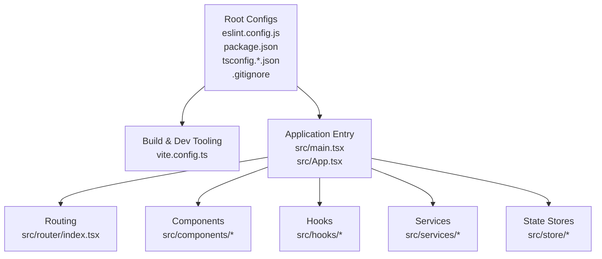
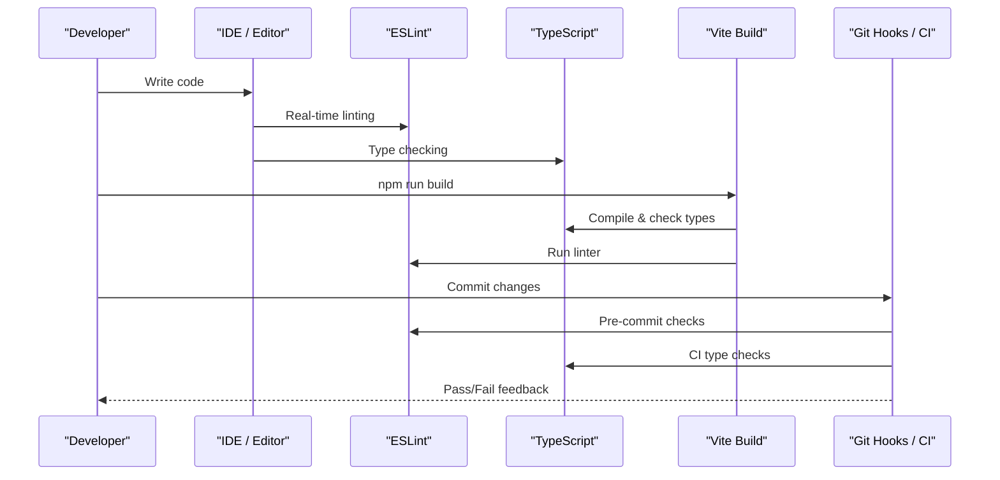
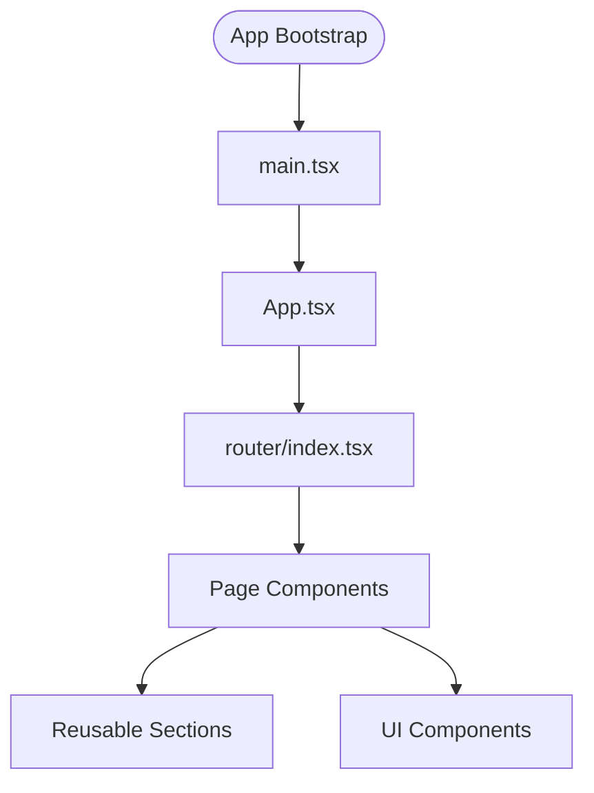
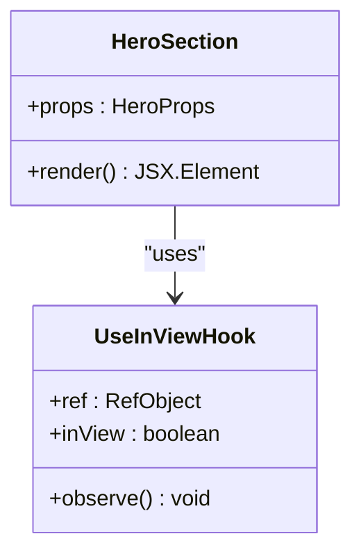
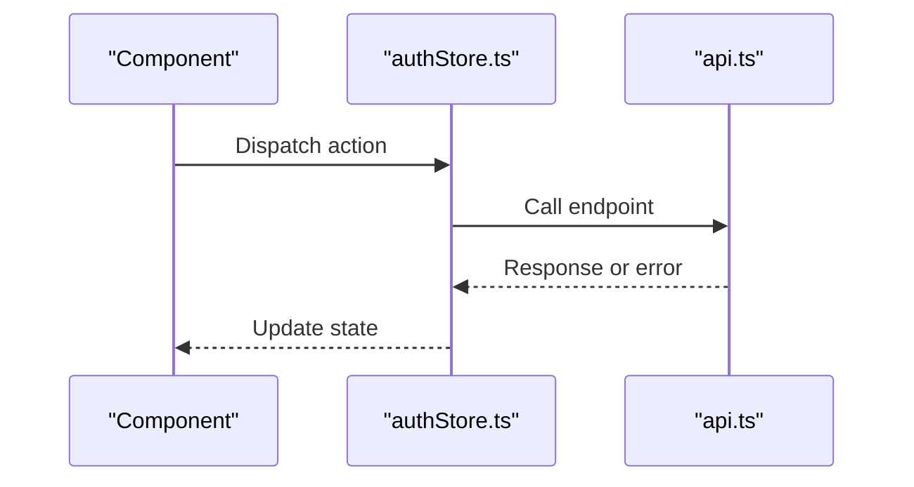
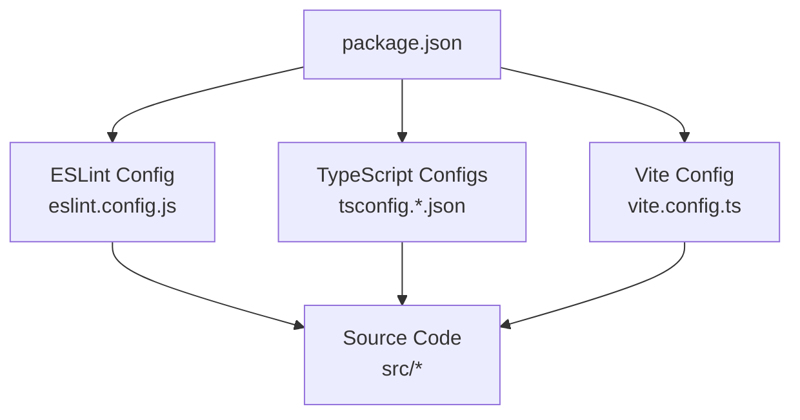

# Code Quality Standards

<cite>
**Referenced Files in This Document**
- [eslint.config.js](file://eslint.config.js)
- [.gitignore](file://.gitignore)
- [package.json](file://package.json)
- [tsconfig.app.json](file://tsconfig.app.json)
- [tsconfig.node.json](file://tsconfig.node.json)
- [vite.config.ts](file://vite.config.ts)
- [src/App.tsx](file://src/App.tsx)
- [src/main.tsx](file://src/main.tsx)
- [src/router/index.tsx](file://src/router/index.tsx)
- [src/components/sections/HeroSection.tsx](file://src/components/sections/HeroSection.tsx)
- [src/hooks/useInView.ts](file://src/hooks/useInView.ts)
- [src/store/authStore.ts](file://src/store/authStore.ts)
- [src/services/api.ts](file://src/services/api.ts)
</cite>

## Table of Contents
1. [Introduction](#introduction)
2. [Project Structure](#project-structure)
3. [Core Components](#core-components)
4. [Architecture Overview](#architecture-overview)
5. [Detailed Component Analysis](#detailed-component-analysis)
6. [Dependency Analysis](#dependency-analysis)
7. [Performance Considerations](#performance-considerations)
8. [Troubleshooting Guide](#troubleshooting-guide)
9. [Conclusion](#conclusion)
10. [Appendices](#appendices)

## Introduction
This document defines the code quality standards and linting rules for the project, focusing on ESLint configuration, formatting standards, TypeScript conventions, and version control best practices. It provides guidance for writing clean, maintainable React and TypeScript code, outlines automated checks, and includes IDE integration tips to enforce consistency across the team.

## Project Structure
The repository is a modern React + TypeScript application built with Vite. Code quality is enforced through ESLint and TypeScript compiler options, while version control excludes generated and environment-specific files via .gitignore. The key configuration files are located at the project root, and source code follows a feature-oriented structure under src/.

**Diagram sources**
- [eslint.config.js:1-200](file://eslint.config.js#L1-L200)
- [package.json:1-200](file://package.json#L1-L200)
- [tsconfig.app.json:1-200](file://tsconfig.app.json#L1-L200)
- [tsconfig.node.json:1-200](file://tsconfig.node.json#L1-L200)
- [.gitignore:1-200](file://.gitignore#L1-L200)
- [vite.config.ts:1-200](file://vite.config.ts#L1-L200)
- [src/main.tsx:1-200](file://src/main.tsx#L1-L200)
- [src/App.tsx:1-200](file://src/App.tsx#L1-L200)
- [src/router/index.tsx:1-200](file://src/router/index.tsx#L1-L200)

**Section sources**
- [eslint.config.js:1-200](file://eslint.config.js#L1-L200)
- [package.json:1-200](file://package.json#L1-L200)
- [tsconfig.app.json:1-200](file://tsconfig.app.json#L1-L200)
- [tsconfig.node.json:1-200](file://tsconfig.node.json#L1-L200)
- [.gitignore:1-200](file://.gitignore#L1-L200)
- [vite.config.ts:1-200](file://vite.config.ts#L1-L200)

## Core Components
This section explains how code quality is configured and enforced across the project.

- ESLint Configuration
  - Centralized ESLint setup resides in eslint.config.js. It configures parsers, plugins, and rule sets appropriate for React and TypeScript development.
  - Recommended practices include enabling strict TypeScript checks, enforcing consistent imports, preventing unused variables, and standardizing JSX patterns.
  - Custom rules can be added to align with team preferences (e.g., naming conventions, import ordering, component prop typing).

- TypeScript Compiler Options
  - tsconfig.app.json governs app-level type checking, module resolution, and JSX handling.
  - tsconfig.node.json applies stricter settings for Node-side tooling and scripts.
  - Ensure noImplicitAny, strictNullChecks, and esModuleInterop are enabled to catch common issues early.

- Package Scripts and Tooling
  - package.json defines scripts for linting, building, and development. Use these scripts consistently to ensure uniform checks across environments.
  - Integrate ESLint with the build pipeline to fail builds on violations.

- Build and Development Tooling
  - vite.config.ts configures the dev server, bundling, and plugin ecosystem. Keep it minimal and avoid heavy transformations that could bypass type or lint checks.

**Section sources**
- [eslint.config.js:1-200](file://eslint.config.js#L1-L200)
- [tsconfig.app.json:1-200](file://tsconfig.app.json#L1-L200)
- [tsconfig.node.json:1-200](file://tsconfig.node.json#L1-L200)
- [package.json:1-200](file://package.json#L1-L200)
- [vite.config.ts:1-200](file://vite.config.ts#L1-L200)

## Architecture Overview
The following diagram shows how code quality tools integrate into the development workflow.

[No sources needed since this diagram shows conceptual workflow, not actual code structure]

## Detailed Component Analysis

### ESLint Configuration and Rules
- Purpose: Enforce consistent coding style, prevent anti-patterns, and improve readability.
- Key aspects:
  - Parser and plugins for TypeScript and React.
  - Rule categories:
    - Best Practices: disallow console statements in production, enforce error handling, restrict unsafe patterns.
    - Styling: indentation, quotes, semicolons, import ordering, trailing commas.
    - React: component definitions, prop typing, hooks usage, JSX constraints.
    - TypeScript: strictness flags, no implicit any, null checks, exhaustive switches.
  - Custom rules: Add team-specific conventions such as file naming, folder structure, and API call patterns.

- Example enforcement areas:
  - Disallow unused imports and variables.
  - Enforce explicit return types for functions where helpful.
  - Require descriptive prop interfaces for components.
  - Restrict direct DOM access; prefer React abstractions.

**Section sources**
- [eslint.config.js:1-200](file://eslint.config.js#L1-L200)

### TypeScript Conventions
- Strict mode: Enable comprehensive checks to catch errors early.
- Module resolution: Configure paths and aliases if used; keep them consistent across IDE and build.
- JSX handling: Ensure correct JSX factory and fragment usage aligned with React 17+ patterns.
- Utility types: Prefer mapped and conditional types over ad-hoc unions when possible.

**Section sources**
- [tsconfig.app.json:1-200](file://tsconfig.app.json#L1-L200)
- [tsconfig.node.json:1-200](file://tsconfig.node.json#L1-L200)

### Version Control Best Practices (.gitignore)
- Exclude:
  - Build outputs and caches (dist, node_modules, logs).
  - Environment files (.env, secrets).
  - IDE settings and local configs.
- Include:
  - Source code, configs, and documentation.
- Maintain a clean history by avoiding accidental commits of large binaries or sensitive data.

**Section sources**
- [.gitignore:1-200](file://.gitignore#L1-L200)

### Application Entry Points and Routing
- Entry points:
  - src/main.tsx bootstraps the React application.
  - src/App.tsx defines the top-level component tree.
- Routing:
  - src/router/index.tsx centralizes route definitions and navigation guards.
- Guidelines:
  - Keep entry points minimal; delegate logic to services and stores.
  - Define routes declaratively and protect sensitive pages.

**Diagram sources**
- [src/main.tsx:1-200](file://src/main.tsx#L1-L200)
- [src/App.tsx:1-200](file://src/App.tsx#L1-L200)
- [src/router/index.tsx:1-200](file://src/router/index.tsx#L1-L200)

**Section sources**
- [src/main.tsx:1-200](file://src/main.tsx#L1-L200)
- [src/App.tsx:1-200](file://src/App.tsx#L1-L200)
- [src/router/index.tsx:1-200](file://src/router/index.tsx#L1-L200)

### Components and Hooks
- Components:
  - Organize by feature sections under src/components/sections.
  - Use functional components with typed props and clear responsibilities.
- Hooks:
  - Encapsulate reusable logic in src/hooks (e.g., useInView.ts).
  - Follow naming conventions and memoization best practices.

**Diagram sources**
- [src/components/sections/HeroSection.tsx:1-200](file://src/components/sections/HeroSection.tsx#L1-L200)
- [src/hooks/useInView.ts:1-200](file://src/hooks/useInView.ts#L1-L200)

**Section sources**
- [src/components/sections/HeroSection.tsx:1-200](file://src/components/sections/HeroSection.tsx#L1-L200)
- [src/hooks/useInView.ts:1-200](file://src/hooks/useInView.ts#L1-L200)

### Services and State Management
- Services:
  - Centralize API calls in src/services/api.ts.
  - Handle errors consistently and return typed responses.
- State:
  - Use src/store/authStore.ts for global state; keep it small and focused.
  - Avoid mixing UI state with server state; prefer caching strategies.

**Diagram sources**
- [src/store/authStore.ts:1-200](file://src/store/authStore.ts#L1-L200)
- [src/services/api.ts:1-200](file://src/services/api.ts#L1-L200)

**Section sources**
- [src/store/authStore.ts:1-200](file://src/store/authStore.ts#L1-L200)
- [src/services/api.ts:1-200](file://src/services/api.ts#L1-L200)

## Dependency Analysis
Code quality tools and dependencies are declared in package.json and enforced by ESLint and TypeScript.

**Diagram sources**
- [package.json:1-200](file://package.json#L1-L200)
- [eslint.config.js:1-200](file://eslint.config.js#L1-L200)
- [tsconfig.app.json:1-200](file://tsconfig.app.json#L1-L200)
- [tsconfig.node.json:1-200](file://tsconfig.node.json#L1-L200)
- [vite.config.ts:1-200](file://vite.config.ts#L1-L200)

**Section sources**
- [package.json:1-200](file://package.json#L1-L200)

## Performance Considerations
- Keep ESLint rules efficient; avoid overly expensive custom rules.
- Leverage TypeScript’s incremental compilation for faster builds.
- Minimize runtime overhead in hooks and components; memoize where necessary.
- Avoid unnecessary re-renders by separating concerns between UI and data fetching.

[No sources needed since this section provides general guidance]

## Troubleshooting Guide
- Common ESLint Issues:
  - Unused imports or variables: Remove or utilize them; enable no-unused-* rules.
  - Import order conflicts: Configure import sorting rules and run auto-fixers.
  - React-specific warnings: Ensure proper hook usage and prop typing.
- TypeScript Errors:
  - Implicit any: Enable strict checks and annotate types explicitly.
  - Null checks: Use non-null assertions judiciously; prefer optional chaining.
- Build Failures:
  - Verify that ESLint and TypeScript pass locally before committing.
  - Check for conflicting configurations between IDE and project settings.
- IDE Integration:
  - Install ESLint and TypeScript extensions.
  - Configure save-to-fix behavior and real-time diagnostics.
  - Align editor settings with project configs (indentation, quotes, semicolons).

**Section sources**
- [eslint.config.js:1-200](file://eslint.config.js#L1-L200)
- [tsconfig.app.json:1-200](file://tsconfig.app.json#L1-L200)
- [package.json:1-200](file://package.json#L1-L200)

## Conclusion
Adopting consistent code quality standards ensures maintainability, reduces bugs, and improves collaboration. By configuring ESLint and TypeScript appropriately, integrating them into your IDE and CI, and following React and TypeScript best practices, the team can deliver high-quality code efficiently.

[No sources needed since this section summarizes without analyzing specific files]

## Appendices

### Formatting Standards and Style Enforcement
- Indentation: Consistent spaces or tabs as defined in ESLint.
- Quotes: Single or double quotes enforced globally.
- Semicolons: Always required or never, based on rules.
- Trailing Commas: Enforce for cleaner diffs.
- Line Length: Set reasonable limits to improve readability.

**Section sources**
- [eslint.config.js:1-200](file://eslint.config.js#L1-L200)

### Automated Code Quality Checks
- Local:
  - Run linter and type checker before committing.
  - Use pre-commit hooks to enforce checks automatically.
- CI:
  - Fail pipelines on lint or type errors.
  - Report results in pull requests.

**Section sources**
- [package.json:1-200](file://package.json#L1-L200)

### IDE Integration Tips
- VS Code:
  - Enable ESLint extension with auto-fix on save.
  - Use TypeScript language service for accurate diagnostics.
- JetBrains WebStorm:
  - Configure ESLint runner and formatter.
  - Align inspections with project rules.

[No sources needed since this section provides general guidance]

### Examples of Patterns and Anti-Patterns
- Good patterns:
  - Typed props with interfaces.
  - Explicit error handling in services.
  - Memoized hooks for performance.
- Anti-patterns:
  - Any-typed variables.
  - Inline complex logic in JSX.
  - Unhandled promises or missing try/catch.

[No sources needed since this section provides general guidance]