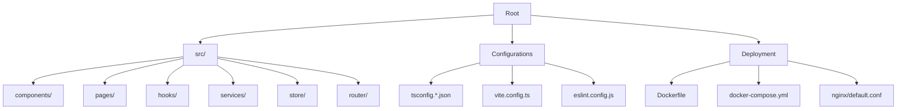
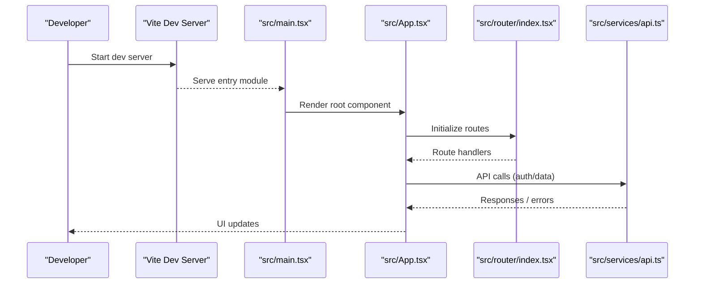
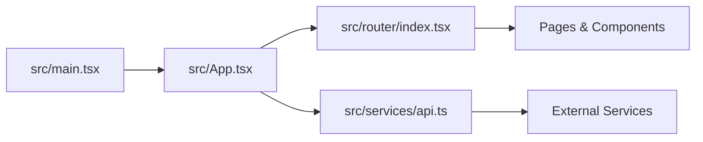

# Development Guide

<cite>
**Referenced Files in This Document**
- [package.json](file://package.json)
- [tsconfig.json](file://tsconfig.json)
- [tsconfig.app.json](file://tsconfig.app.json)
- [tsconfig.node.json](file://tsconfig.node.json)
- [vite.config.ts](file://vite.config.ts)
- [eslint.config.js](file://eslint.config.js)
- [.gitignore](file://.gitignore)
- [Dockerfile](file://Dockerfile)
- [docker-compose.yml](file://docker-compose.yml)
- [nginx/default.conf](file://nginx/default.conf)
- [src/main.tsx](file://src/main.tsx)
- [src/App.tsx](file://src/App.tsx)
- [src/router/index.tsx](file://src/router/index.tsx)
- [src/services/api.ts](file://src/services/api.ts)
- [README.md](file://README.md)
</cite>

## Table of Contents
1. [Introduction](#introduction)
2. [Project Structure](#project-structure)
3. [Core Components](#core-components)
4. [Architecture Overview](#architecture-overview)
5. [Detailed Component Analysis](#detailed-component-analysis)
6. [Dependency Analysis](#dependency-analysis)
7. [Performance Considerations](#performance-considerations)
8. [Troubleshooting Guide](#troubleshooting-guide)
9. [Conclusion](#conclusion)
10. [Appendices](#appendices)

## Introduction
This guide documents the development workflow and coding standards for the project. It covers TypeScript configuration, ESLint rules, Git branching strategy, pull request process, testing guidelines, debugging techniques, performance profiling, environment setup, IDE recommendations, and productivity tool integrations. The goal is to help contributors set up a consistent, high-quality development experience aligned with the project’s architecture and quality bar.

## Project Structure
The project follows a modern React + Vite + TypeScript stack with clear separation between application code, build configuration, and deployment artifacts:
- Application source under src/ organized by feature areas (components, pages, hooks, services, store).
- Build and type configuration files at the root (Vite, TypeScript configs).
- Linting configuration via ESLint.
- Containerization and server configuration for production deployments.

**Section sources**
- [package.json](file://package.json)
- [tsconfig.json](file://tsconfig.json)
- [vite.config.ts](file://vite.config.ts)
- [eslint.config.js](file://eslint.config.js)
- [Dockerfile](file://Dockerfile)
- [docker-compose.yml](file://docker-compose.yml)
- [nginx/default.conf](file://nginx/default.conf)

## Core Components
Key development-related components include:
- TypeScript configuration files that define strict mode, path mappings, and compilation targets.
- Vite configuration for development server, build targets, and plugin usage.
- ESLint configuration enforcing code quality and consistency.
- Package scripts for running dev, build, lint, and test commands.
- Docker and Nginx configurations for containerized deployment.

**Section sources**
- [tsconfig.json](file://tsconfig.json)
- [tsconfig.app.json](file://tsconfig.app.json)
- [tsconfig.node.json](file://tsconfig.node.json)
- [vite.config.ts](file://vite.config.ts)
- [eslint.config.js](file://eslint.config.js)
- [package.json](file://package.json)

## Architecture Overview
At runtime, the application bootstraps through the main entry point, initializes the app component tree, configures routing, and interacts with backend APIs via a centralized service layer.

**Diagram sources**
- [src/main.tsx](file://src/main.tsx)
- [src/App.tsx](file://src/App.tsx)
- [src/router/index.tsx](file://src/router/index.tsx)
- [src/services/api.ts](file://src/services/api.ts)

## Detailed Component Analysis

### TypeScript Configuration
- Strict Mode: Enabled across project-level and app-level configs to enforce null checks, strict function types, and other safety features.
- Path Mappings: Centralized path aliases configured to simplify imports and avoid relative path hell.
- Compilation Targets: ES target and module settings are defined to ensure compatibility with the intended runtime environments.
- Node vs App Configs: Separate configs for application code and Node tooling to isolate type resolution and module systems.

Recommendations:
- Use path aliases consistently for all new modules.
- Keep strict mode enabled; address any new violations promptly.
- Align tsconfig settings with Vite’s expectations for optimal DX.

**Section sources**
- [tsconfig.json](file://tsconfig.json)
- [tsconfig.app.json](file://tsconfig.app.json)
- [tsconfig.node.json](file://tsconfig.node.json)

### Vite Configuration
- Development Server: Hot Module Replacement (HMR), proxy settings, and port configuration.
- Build Settings: Output format, minification, and optimization flags.
- Plugins: Integration with React, TypeScript, and optional plugins for CSS or asset handling.
- Environment Variables: Usage of .env files and variable exposure to the client.

Recommendations:
- Prefer environment variables for configuration values.
- Keep plugins minimal to reduce bundle size and improve build times.
- Use proxy configuration to connect to local backends during development.

**Section sources**
- [vite.config.ts](file://vite.config.ts)

### ESLint Rules and Code Quality
- Rule Set: Enforces consistent style, no-unused variables, import ordering, and React-specific rules.
- Formatting: Integrated with Prettier (if configured) to standardize formatting.
- CI Checks: Lint runs on pre-commit or CI pipeline to prevent low-quality code from merging.

Recommendations:
- Run linter locally before committing.
- Fix warnings proactively to maintain a clean history.
- Extend rules only when necessary and document exceptions.

**Section sources**
- [eslint.config.js](file://eslint.config.js)

### Git Workflow and Branching Strategy
- Branch Naming: Feature branches prefixed with feature/, bugfix/, hotfix/, etc.
- Mainline Protection: Protect main branch; require PR reviews and passing CI checks.
- Commit Messages: Follow conventional commits for clarity and automated changelogs.
- Pull Requests: Small, focused PRs with descriptive titles and checklists.

Recommended flow:
- Create a feature branch from main.
- Implement changes with incremental commits.
- Open a PR, request review, address feedback.
- Squash merge after approval and CI passes.

[No sources needed since this section provides general guidance]

### Testing Guidelines
- Framework: Use a unit/integration testing framework compatible with Vite and React.
- File Conventions: Co-locate tests near components or place them under a dedicated tests directory.
- Coverage: Aim for meaningful coverage thresholds on critical paths.
- Mocking: Isolate external dependencies (APIs, storage) with mocks.

Best practices:
- Write tests for user-facing behavior and edge cases.
- Keep tests fast and deterministic.
- Use snapshot tests sparingly and validate diffs carefully.

[No sources needed since this section provides general guidance]

### Debugging Techniques
- Browser DevTools: Breakpoints, network inspection, and performance profiling.
- Logging: Structured logs with levels and context; avoid excessive console statements in production.
- Source Maps: Ensure source maps are enabled in development and optionally in production builds.
- Error Boundaries: Wrap UI trees to catch rendering errors gracefully.

[No sources needed since this section provides general guidance]

### Performance Profiling
- Metrics: Monitor Time to First Byte, Largest Contentful Paint, and Total Blocking Time.
- Tools: Use browser performance tab, Lighthouse, and Web Vitals.
- Optimization: Lazy loading, code splitting, memoization, and efficient state updates.

[No sources needed since this section provides general guidance]

### Development Environment Setup
- Prerequisites: Node.js LTS, package manager (npm/yarn/pnpm), Docker (optional).
- Installation: Install dependencies, configure environment variables.
- Scripts: Use provided npm scripts for dev, build, lint, and test.

Steps:
- Clone repository.
- Install dependencies.
- Configure .env if required.
- Start dev server.

**Section sources**
- [package.json](file://package.json)
- [README.md](file://README.md)

### IDE Recommendations and Productivity Tools
- Editor: VS Code recommended with extensions for TypeScript, ESLint, Prettier, and Tailwind (if used).
- Extensions: Enable live linting, auto-format on save, and Go-to-Definition.
- Task Runners: Use integrated terminal for scripts and task runners.
- Docker Integration: Use remote containers for consistent environments.

[No sources needed since this section provides general guidance]

## Dependency Analysis
High-level dependency relationships among core modules:

**Diagram sources**
- [src/main.tsx](file://src/main.tsx)
- [src/App.tsx](file://src/App.tsx)
- [src/router/index.tsx](file://src/router/index.tsx)
- [src/services/api.ts](file://src/services/api.ts)

**Section sources**
- [src/main.tsx](file://src/main.tsx)
- [src/App.tsx](file://src/App.tsx)
- [src/router/index.tsx](file://src/router/index.tsx)
- [src/services/api.ts](file://src/services/api.ts)

## Performance Considerations
- Build Optimizations: Leverage Vite’s default optimizations; enable code splitting and lazy loading where appropriate.
- Bundle Size: Analyze bundle with built-in tools; remove unused dependencies.
- Runtime Performance: Avoid unnecessary re-renders; use memoization and stable references.
- Network Efficiency: Cache API responses; implement pagination and debouncing for search inputs.

[No sources needed since this section provides general guidance]

## Troubleshooting Guide
Common issues and resolutions:
- Type Errors: Ensure strict mode alignment across tsconfigs; resolve undefined/null cases explicitly.
- Import Aliases: Verify path mappings match tsconfig and editor settings.
- Dev Server Issues: Clear cache, restart server, and verify ports and proxies.
- Lint Failures: Run formatter and fix reported issues; avoid disabling rules without justification.
- Docker Builds: Check base image versions and dependency installation steps.

**Section sources**
- [tsconfig.json](file://tsconfig.json)
- [vite.config.ts](file://vite.config.ts)
- [eslint.config.js](file://eslint.config.js)
- [Dockerfile](file://Dockerfile)
- [docker-compose.yml](file://docker-compose.yml)

## Conclusion
This guide outlines the development workflow, coding standards, and best practices to maintain a healthy, scalable codebase. By adhering to the TypeScript and ESLint configurations, following the Git workflow, and leveraging debugging and performance tools, contributors can deliver high-quality features efficiently.

[No sources needed since this section summarizes without analyzing specific files]

## Appendices

### Environment and Deployment
- Local Development: Use Vite dev server with HMR.
- Production Build: Generate optimized assets with Vite.
- Containerization: Build images using Dockerfile; orchestrate with docker-compose.
- Reverse Proxy: Configure Nginx for static assets and API routing.

**Section sources**
- [Dockerfile](file://Dockerfile)
- [docker-compose.yml](file://docker-compose.yml)
- [nginx/default.conf](file://nginx/default.conf)