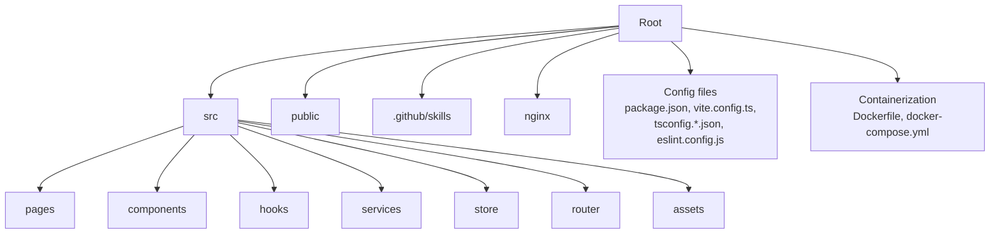
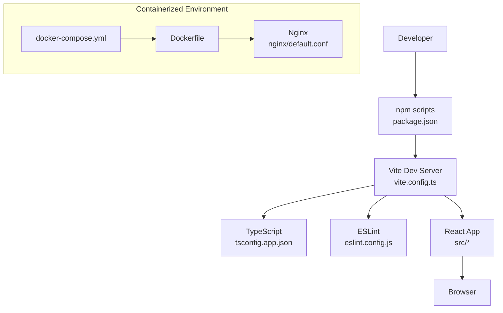
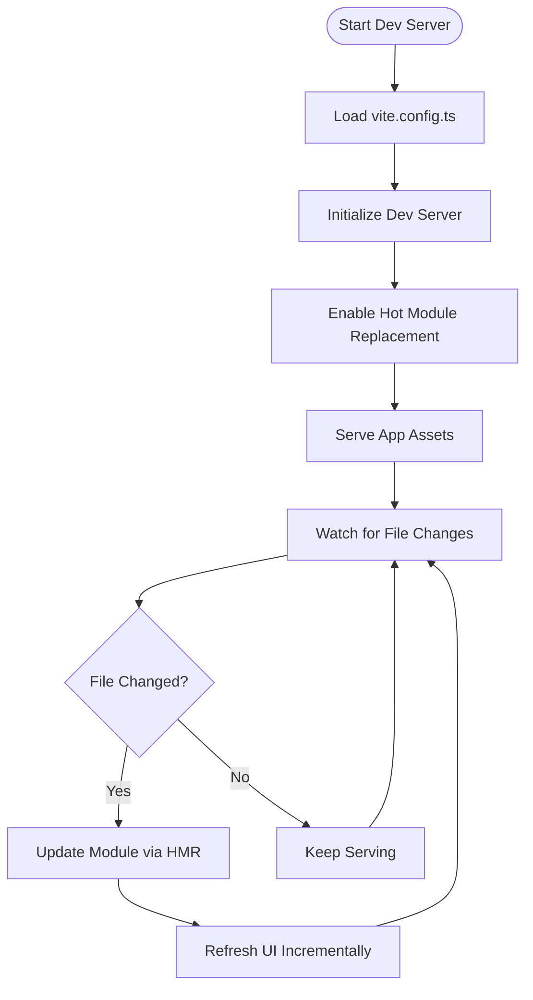
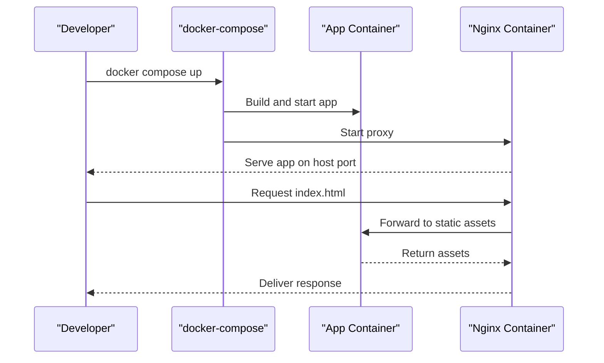
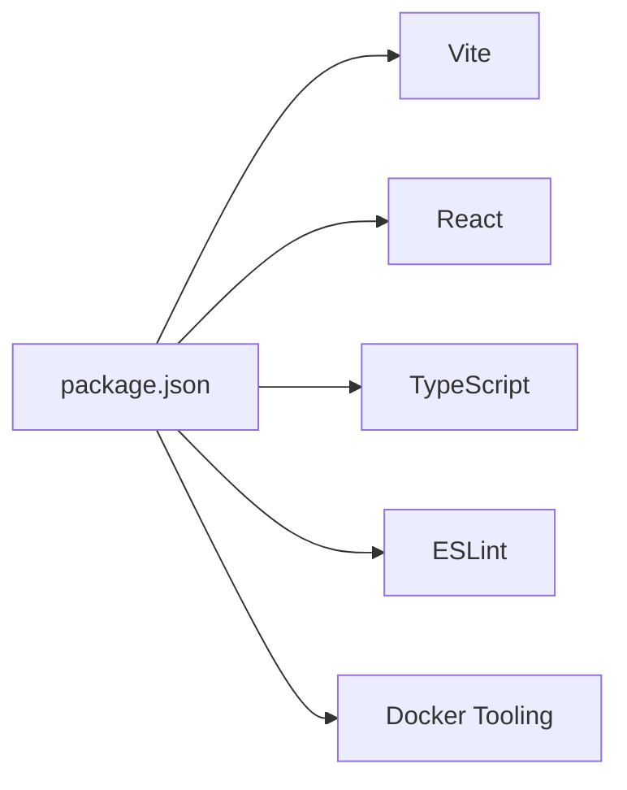

# Development Workflow

<cite>
**Referenced Files in This Document**
- [package.json](file://package.json)
- [vite.config.ts](file://vite.config.ts)
- [tsconfig.app.json](file://tsconfig.app.json)
- [tsconfig.node.json](file://tsconfig.node.json)
- [eslint.config.js](file://eslint.config.js)
- [Dockerfile](file://Dockerfile)
- [docker-compose.yml](file://docker-compose.yml)
- [nginx/default.conf](file://nginx/default.conf)
- [README.md](file://README.md)
</cite>

## Table of Contents
1. [Introduction](#introduction)
2. [Project Structure](#project-structure)
3. [Core Components](#core-components)
4. [Architecture Overview](#architecture-overview)
5. [Detailed Component Analysis](#detailed-component-analysis)
6. [Dependency Analysis](#dependency-analysis)
7. [Performance Considerations](#performance-considerations)
8. [Troubleshooting Guide](#troubleshooting-guide)
9. [Conclusion](#conclusion)
10. [Appendices](#appendices)

## Introduction
This document explains the development workflow and project setup for a Vite-based React application. It covers npm scripts, Vite configuration, hot module replacement (HMR), debugging, environment setup, branching strategy, commit conventions, pull request process, and common troubleshooting steps. The goal is to help both new and experienced contributors set up a smooth local development experience and ship changes reliably.

## Project Structure
The repository follows a standard Vite + React + TypeScript layout:
- Configuration files at the root include package.json, vite.config.ts, tsconfig.*.json, eslint.config.js, Dockerfile, docker-compose.yml, and nginx configuration.
- Source code lives under src with pages, components, hooks, services, store, router, and assets.
- Public assets are served from public.
- Containerization and deployment artifacts are included via Docker and Nginx.

[No sources needed since this diagram shows conceptual structure]

## Core Components
Key development-related components:
- package.json: Defines npm scripts for development, building, linting, type checking, and deployment.
- vite.config.ts: Configures the Vite dev server, HMR, build targets, and plugin options.
- TypeScript configs: tsconfig.app.json and tsconfig.node.json define compilation settings for app and tooling.
- ESLint config: Centralized linting rules for consistent code quality.
- Docker and Nginx: Containerized runtime and reverse proxy configuration for production-like environments.

**Section sources**
- [package.json](file://package.json)
- [vite.config.ts](file://vite.config.ts)
- [tsconfig.app.json](file://tsconfig.app.json)
- [tsconfig.node.json](file://tsconfig.node.json)
- [eslint.config.js](file://eslint.config.js)
- [Dockerfile](file://Dockerfile)
- [docker-compose.yml](file://docker-compose.yml)
- [nginx/default.conf](file://nginx/default.conf)

## Architecture Overview
High-level development architecture:
- Developer runs npm scripts defined in package.json.
- Vite dev server serves the app with HMR enabled.
- TypeScript compiler and ESLint enforce code quality and types.
- Docker Compose can run the full stack locally or in CI/CD.

**Diagram sources**
- [package.json](file://package.json)
- [vite.config.ts](file://vite.config.ts)
- [tsconfig.app.json](file://tsconfig.app.json)
- [eslint.config.js](file://eslint.config.js)
- [Dockerfile](file://Dockerfile)
- [docker-compose.yml](file://docker-compose.yml)
- [nginx/default.conf](file://nginx/default.conf)

## Detailed Component Analysis

### npm Scripts and Development Commands
- Purpose: Provide standardized commands for running the dev server, building, linting, type-checking, and deploying.
- Typical categories:
  - Development: start dev server with HMR.
  - Build: create optimized production assets.
  - Lint and Type Check: ensure code quality and correctness.
  - Deployment: containerize and push images or deploy artifacts.
- How to use:
  - Install dependencies once using the install script.
  - Run the development server to get live reload and HMR.
  - Use lint/type check before committing changes.
  - Build for production when ready to release.

**Section sources**
- [package.json](file://package.json)

### Vite Development Server and HMR
- Dev server:
  - Host and port configuration for local access.
  - Proxy settings for API endpoints during development.
  - Open browser automatically on startup.
- HMR:
  - Enabled by default in Vite; updates modules without full page reload.
  - Preserves state where possible.
- Debugging:
  - Use browser developer tools.
  - Configure source maps for accurate debugging.
  - Integrate with VS Code debugger if needed.

**Diagram sources**
- [vite.config.ts](file://vite.config.ts)

**Section sources**
- [vite.config.ts](file://vite.config.ts)

### TypeScript Configuration
- tsconfig.app.json:
  - Targets modern browsers.
  - Enables strict mode and JSX transforms.
  - Sets path aliases for imports.
- tsconfig.node.json:
  - Configures Node-side tooling (e.g., Vite plugins).
- Usage:
  - Ensure all source files compile cleanly.
  - Use IDE integration for real-time type errors.

**Section sources**
- [tsconfig.app.json](file://tsconfig.app.json)
- [tsconfig.node.json](file://tsconfig.node.json)

### ESLint Configuration
- Centralized rules for consistent code style and error prevention.
- Integrates with Vite and TypeScript.
- Recommended workflow:
  - Run lint before commits.
  - Fix issues reported by the editor or CLI.

**Section sources**
- [eslint.config.js](file://eslint.config.js)

### Docker and Nginx Setup
- Dockerfile:
  - Multi-stage build for smaller images.
  - Copies built assets and serves them via Nginx.
- docker-compose.yml:
  - Orchestrates services (app, proxy).
  - Exposes ports and sets environment variables.
- Nginx configuration:
  - Reverse proxy and static file serving.
  - Handles routing and caching headers.

**Diagram sources**
- [Dockerfile](file://Dockerfile)
- [docker-compose.yml](file://docker-compose.yml)
- [nginx/default.conf](file://nginx/default.conf)

**Section sources**
- [Dockerfile](file://Dockerfile)
- [docker-compose.yml](file://docker-compose.yml)
- [nginx/default.conf](file://nginx/default.conf)

### README and Additional Skills
- README.md provides high-level project overview and quickstart instructions.
- .github/skills contains specialized guides for different workflows and features.

**Section sources**
- [README.md](file://README.md)

## Dependency Analysis
Development dependencies typically include:
- Vite and React plugins.
- TypeScript and related tooling.
- ESLint and formatters.
- Testing libraries (if present).
- Docker tooling for containerization.

**Diagram sources**
- [package.json](file://package.json)

**Section sources**
- [package.json](file://package.json)

## Performance Considerations
- Use HMR to avoid full page reloads during development.
- Enable source maps only in development for faster builds.
- Optimize asset sizes in production builds.
- Leverage browser caching via Nginx headers.
- Profile React components and network requests using browser dev tools.

[No sources needed since this section provides general guidance]

## Troubleshooting Guide
Common issues and resolutions:
- Port conflicts:
  - Change the dev server port in vite.config.ts or environment variables.
- HMR not working:
  - Verify WebSocket connections and CORS settings.
  - Ensure proxy configurations match API endpoints.
- TypeScript errors:
  - Run type checks and fix strict mode violations.
  - Clear node_modules and reinstall dependencies if corrupted.
- ESLint failures:
  - Auto-fix where possible; otherwise adjust rules or code.
- Docker build failures:
  - Check base image versions and multi-stage stages.
  - Validate environment variables and mounted volumes.

**Section sources**
- [vite.config.ts](file://vite.config.ts)
- [tsconfig.app.json](file://tsconfig.app.json)
- [eslint.config.js](file://eslint.config.js)
- [Dockerfile](file://Dockerfile)
- [docker-compose.yml](file://docker-compose.yml)

## Conclusion
By following the documented npm scripts, Vite configuration, TypeScript and ESLint setups, and containerization guidelines, developers can efficiently develop, test, and deploy the application. Adhering to branching strategies, commit conventions, and PR processes ensures collaborative stability and quality.

[No sources needed since this section summarizes without analyzing specific files]

## Appendices

### Local Development Setup Steps
- Prerequisites:
  - Node.js and npm installed.
  - Optional: Docker and Docker Compose for containerized development.
- Steps:
  - Clone the repository.
  - Install dependencies using the install script.
  - Start the development server.
  - Open the browser and verify HMR.
  - Run lint and type checks before committing.
  - Use Docker Compose to run the full stack locally.

**Section sources**
- [package.json](file://package.json)
- [vite.config.ts](file://vite.config.ts)
- [docker-compose.yml](file://docker-compose.yml)

### Branching Strategy
- Main branch: stable releases.
- Feature branches: prefixed with feature/.
- Bugfix branches: prefixed with bugfix/.
- Release branches: prefixed with release/.
- Merge back via pull requests with reviews.

[No sources needed since this section provides general guidance]

### Commit Message Conventions
- Use conventional commits:
  - feat: new feature.
  - fix: bug fix.
  - docs: documentation changes.
  - refactor: code refactoring.
  - test: adding or updating tests.
  - chore: maintenance tasks.
- Keep messages concise and descriptive.

[No sources needed since this section provides general guidance]

### Pull Request Process
- Create a branch from main or target branch.
- Implement changes and ensure tests pass.
- Open a PR with clear description and linked issues.
- Request reviews and address feedback.
- Squash and merge after approval.

[No sources needed since this section provides general guidance]