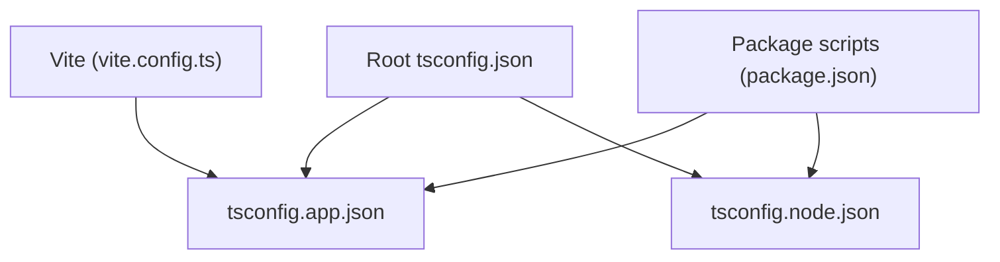
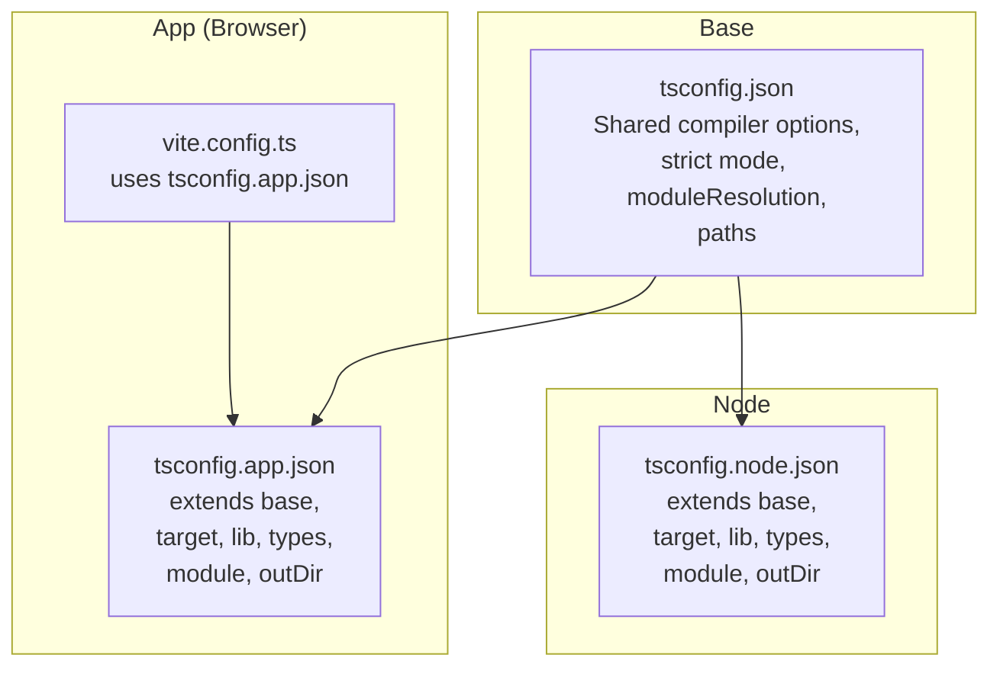
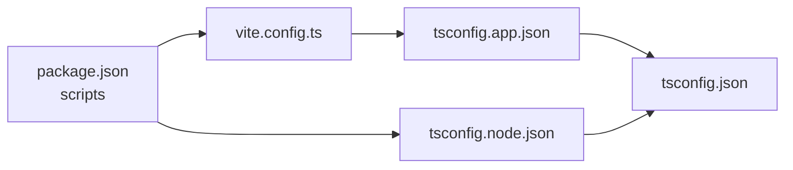

# TypeScript Configuration

<cite>
**Referenced Files in This Document**
- [tsconfig.json](file://tsconfig.json)
- [tsconfig.app.json](file://tsconfig.app.json)
- [tsconfig.node.json](file://tsconfig.node.json)
- [vite.config.ts](file://vite.config.ts)
- [package.json](file://package.json)
</cite>

## Table of Contents
1. [Introduction](#introduction)
2. [Project Structure](#project-structure)
3. [Core Components](#core-components)
4. [Architecture Overview](#architecture-overview)
5. [Detailed Component Analysis](#detailed-component-analysis)
6. [Dependency Analysis](#dependency-analysis)
7. [Performance Considerations](#performance-considerations)
8. [Troubleshooting Guide](#troubleshooting-guide)
9. [Conclusion](#conclusion)
10. [Appendices](#appendices)

## Introduction
This document explains the TypeScript configuration setup for the project, focusing on root tsconfig settings, strict mode, module resolution, and path mappings. It also clarifies the separation between application (browser) and Node.js configurations using tsconfig.app.json and tsconfig.node.json. You will find guidance on compiler options, target versions, library references, build optimizations, extending configurations, adding type definitions, and resolving common issues within this structure.

## Project Structure
The TypeScript configuration is split across three primary files:
- Root tsconfig.json: base settings shared by all projects
- tsconfig.app.json: browser-focused app configuration used by Vite
- tsconfig.node.json: Node.js-focused configuration for tooling and server-side code

**Diagram sources**
- [tsconfig.json](file://tsconfig.json)
- [tsconfig.app.json](file://tsconfig.app.json)
- [tsconfig.node.json](file://tsconfig.node.json)
- [vite.config.ts](file://vite.config.ts)
- [package.json](file://package.json)

**Section sources**
- [tsconfig.json](file://tsconfig.json)
- [tsconfig.app.json](file://tsconfig.app.json)
- [tsconfig.node.json](file://tsconfig.node.json)
- [vite.config.ts](file://vite.config.ts)
- [package.json](file://package.json)

## Core Components
- Root tsconfig.json defines shared compiler options, strictness, module resolution strategy, and path aliases.
- tsconfig.app.json extends the root config to configure browser-specific targets, libraries, and Vite integration.
- tsconfig.node.json extends the root config to configure Node.js runtime targets and tooling-related options.

Key responsibilities:
- Strict mode: Enforces strong typing and safer defaults across the project.
- Module resolution: Ensures consistent import behavior across environments.
- Path mappings: Provides convenient alias imports for source directories.
- Target and libraries: Aligns compilation output with the intended runtime environment.
- Build optimization: Enables incremental builds and efficient bundling via Vite.

**Section sources**
- [tsconfig.json](file://tsconfig.json)
- [tsconfig.app.json](file://tsconfig.app.json)
- [tsconfig.node.json](file://tsconfig.node.json)

## Architecture Overview
The configuration architecture follows a layered approach:
- Base layer (root): Shared settings and constraints
- App layer: Browser-targeted compilation and Vite integration
- Node layer: Node-targeted compilation for tooling and server code

**Diagram sources**
- [tsconfig.json](file://tsconfig.json)
- [tsconfig.app.json](file://tsconfig.app.json)
- [tsconfig.node.json](file://tsconfig.node.json)
- [vite.config.ts](file://vite.config.ts)

## Detailed Component Analysis

### Root tsconfig.json
Responsibilities:
- Defines shared compiler options such as strict mode, module resolution, and path aliases.
- Serves as the base for both app and node configurations via extends.

Highlights:
- Strict mode: Enabled to enforce stricter type checking and safer defaults.
- Module resolution: Configured to resolve modules consistently across environments.
- Path mappings: Aliases defined for cleaner imports from src directories.

Best practices:
- Keep environment-specific options out of the root file.
- Centralize shared flags here to avoid duplication.

**Section sources**
- [tsconfig.json](file://tsconfig.json)

### Application Configuration (tsconfig.app.json)
Responsibilities:
- Extends the root configuration for browser-based development and production builds.
- Specifies target version, libraries, and module system compatible with Vite.
- Declares type roots or types for frontend libraries.

Highlights:
- Target: Set to a modern JavaScript version suitable for browsers.
- Libraries: Include DOM and ES features appropriate for client-side code.
- Module: Uses an ES module format aligned with Vite’s expectations.
- OutDir: Directs compiled artifacts to a dedicated folder.

Integration:
- Vite reads this configuration during development and build processes.

**Section sources**
- [tsconfig.app.json](file://tsconfig.app.json)
- [vite.config.ts](file://vite.config.ts)

### Node Configuration (tsconfig.node.json)
Responsibilities:
- Extends the root configuration for Node.js tooling and server-side code.
- Sets target and libraries appropriate for Node.js runtime.
- Configures module system and output directory for Node artifacts.

Highlights:
- Target: Matches the Node.js version used in development and CI.
- Libraries: Includes Node globals and APIs.
- Module: Uses CommonJS or ES modules depending on Node setup.
- OutDir: Outputs Node build artifacts separately from the app.

**Section sources**
- [tsconfig.node.json](file://tsconfig.node.json)

### Vite Integration
Responsibilities:
- Vite uses tsconfig.app.json for type-checking and build-time transformations.
- Ensures that TypeScript features are correctly transpiled for the browser.

Highlights:
- Vite respects tsconfig.app.json paths and module settings.
- Development server leverages fast HMR with proper TS support.

**Section sources**
- [vite.config.ts](file://vite.config.ts)
- [tsconfig.app.json](file://tsconfig.app.json)

### Package Scripts and Tooling
Responsibilities:
- package.json contains scripts that invoke Vite and TypeScript tooling.
- Scripts reference tsconfig.app.json and tsconfig.node.json for different tasks.

Highlights:
- Development script runs Vite with TS enabled.
- Build script produces optimized assets using Vite and TS checks.

**Section sources**
- [package.json](file://package.json)

## Dependency Analysis
The configuration dependencies form a clear hierarchy:
- Root tsconfig.json is extended by both app and node configs.
- Vite depends on tsconfig.app.json for browser builds.
- Package scripts orchestrate usage of these configs.

**Diagram sources**
- [package.json](file://package.json)
- [vite.config.ts](file://vite.config.ts)
- [tsconfig.app.json](file://tsconfig.app.json)
- [tsconfig.node.json](file://tsconfig.node.json)
- [tsconfig.json](file://tsconfig.json)

**Section sources**
- [package.json](file://package.json)
- [vite.config.ts](file://vite.config.ts)
- [tsconfig.app.json](file://tsconfig.app.json)
- [tsconfig.node.json](file://tsconfig.node.json)
- [tsconfig.json](file://tsconfig.json)

## Performance Considerations
- Incremental builds: Ensure incremental compilation is enabled to speed up rebuilds.
- Target selection: Use a modern target to reduce polyfills and improve performance.
- Library selection: Include only necessary libs to minimize bundle size.
- Path aliases: Reduce long relative imports and improve IDE navigation speed.
- Separate configs: Keep app and node builds isolated to avoid unnecessary processing.

[No sources needed since this section provides general guidance]

## Troubleshooting Guide
Common issues and solutions:
- Module not found errors:
  - Verify path mappings in tsconfig.json match actual directory structure.
  - Ensure moduleResolution is set appropriately for your environment.
- Type errors in browser code:
  - Confirm tsconfig.app.json includes DOM libraries.
  - Check that Vite is reading tsconfig.app.json.
- Node-specific types missing:
  - Ensure tsconfig.node.json includes Node types and correct target.
- Conflicts between app and node:
  - Avoid mixing browser-only and Node-only imports in shared modules.
  - Use conditional imports or separate packages where necessary.
- Slow builds:
  - Enable incremental compilation and limit included libraries.
  - Use path aliases to reduce redundant imports.

**Section sources**
- [tsconfig.json](file://tsconfig.json)
- [tsconfig.app.json](file://tsconfig.app.json)
- [tsconfig.node.json](file://tsconfig.node.json)
- [vite.config.ts](file://vite.config.ts)
- [package.json](file://package.json)

## Conclusion
This project uses a layered TypeScript configuration to cleanly separate browser and Node concerns while sharing common settings. The root tsconfig.json centralizes strictness and module resolution, while tsconfig.app.json and tsconfig.node.json tailor targets and libraries for their respective environments. Vite integrates seamlessly with the app configuration, and package scripts coordinate the build process. Following the guidelines here ensures consistent type checking, efficient builds, and maintainable code organization.

[No sources needed since this section summarizes without analyzing specific files]

## Appendices

### How to Extend Configurations
- Create a new tsconfig.*.json that extends the root tsconfig.json.
- Override only the environment-specific options (target, lib, module, outDir).
- Reference the new config in relevant scripts or tooling.

**Section sources**
- [tsconfig.json](file://tsconfig.json)
- [tsconfig.app.json](file://tsconfig.app.json)
- [tsconfig.node.json](file://tsconfig.node.json)

### Adding New Type Definitions
- Install the desired @types package via the package manager.
- Ensure the types are included by either:
  - Adding the package name to the types array in tsconfig.app.json or tsconfig.node.json, or
  - Placing declaration files under a recognized types directory referenced by typeRoots.
- Re-run the dev/build script to pick up new types.

**Section sources**
- [tsconfig.app.json](file://tsconfig.app.json)
- [tsconfig.node.json](file://tsconfig.node.json)
- [package.json](file://package.json)