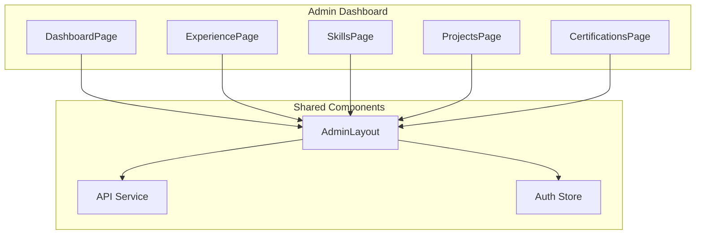
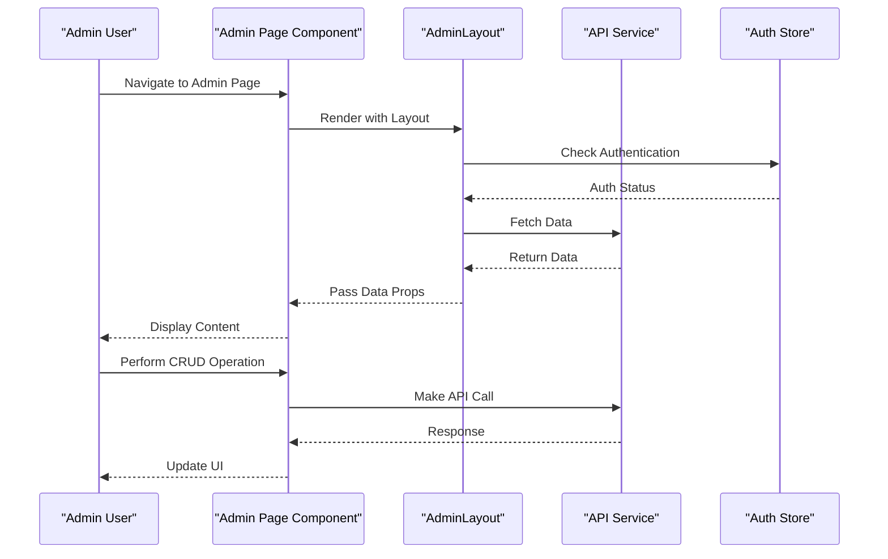
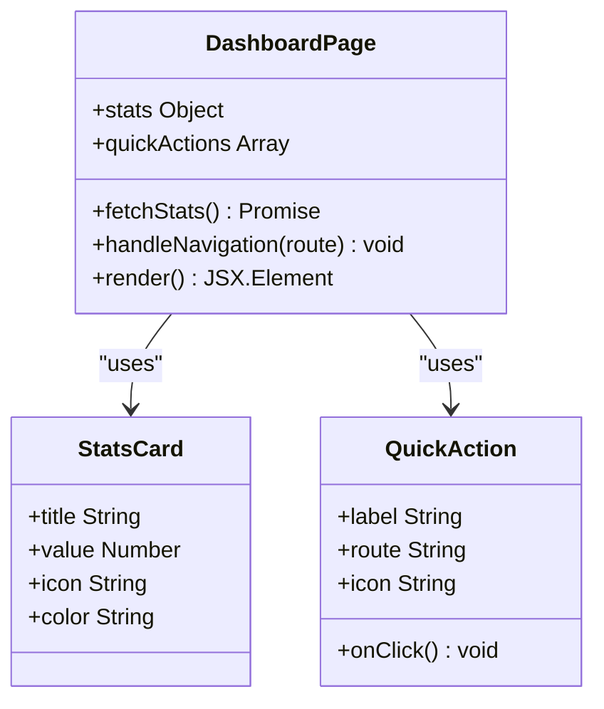
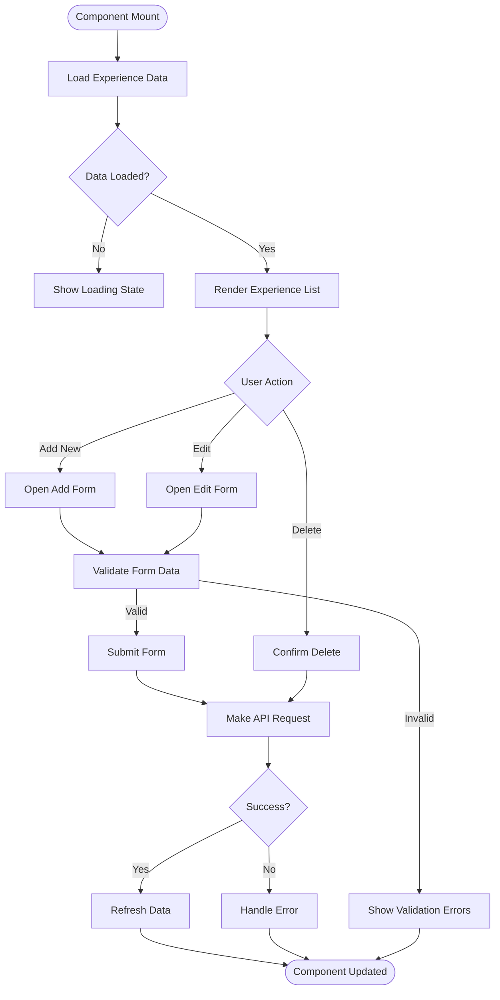
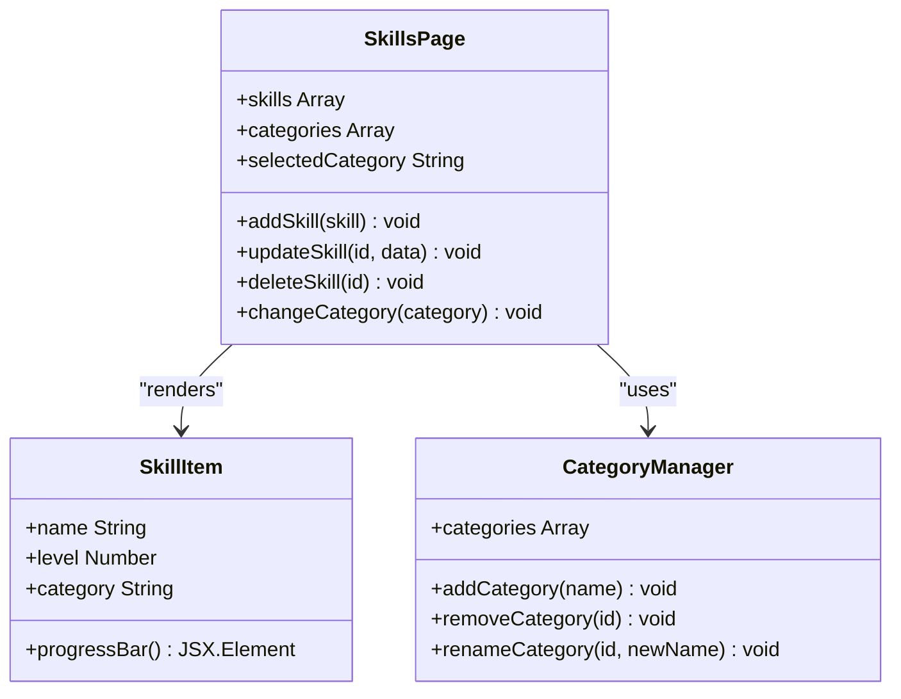
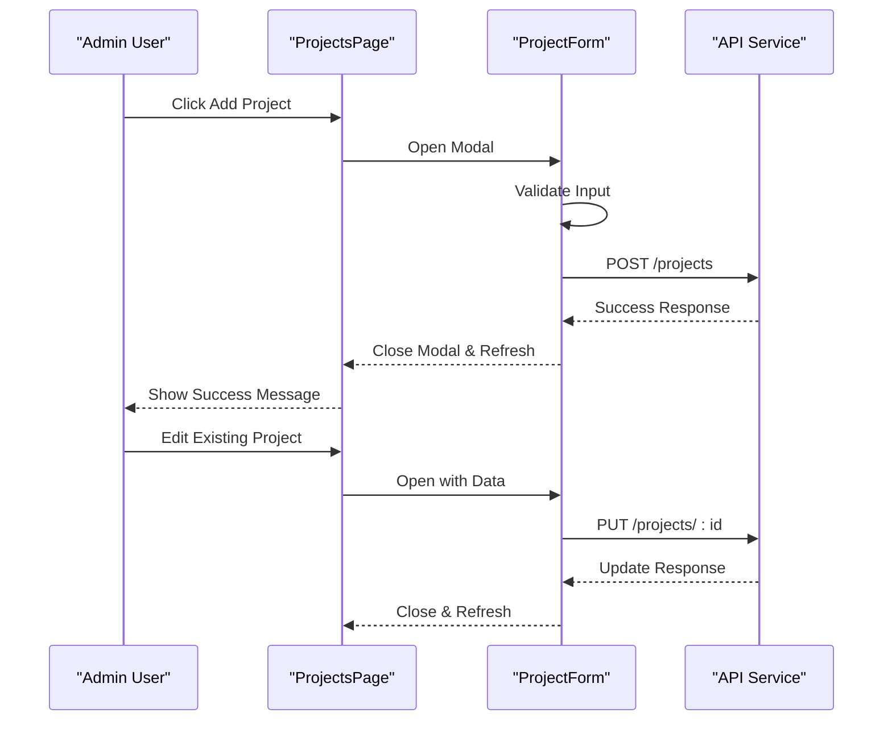
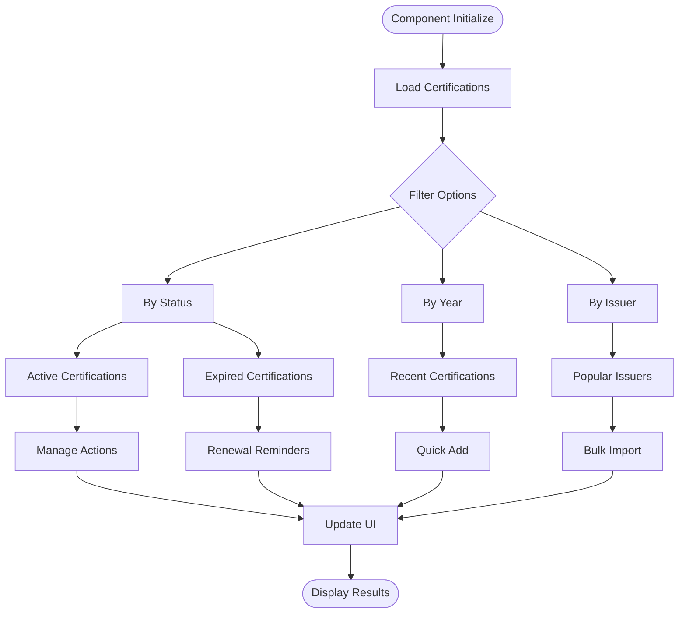
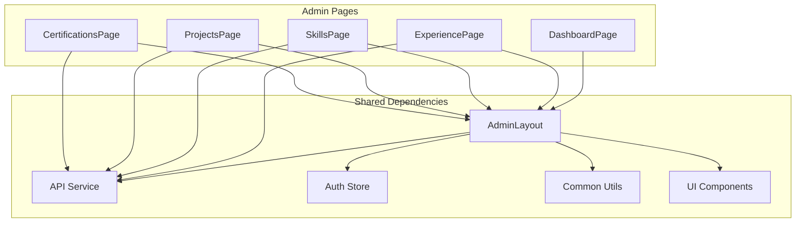

# Admin Dashboard Pages

<cite>
**Referenced Files in This Document**
- [DashboardPage.tsx](file://src/pages/admin/DashboardPage.tsx)
- [ExperiencePage.tsx](file://src/pages/admin/ExperiencePage.tsx)
- [SkillsPage.tsx](file://src/pages/admin/SkillsPage.tsx)
- [ProjectsPage.tsx](file://src/pages/admin/ProjectsPage.tsx)
- [CertificationsPage.tsx](file://src/pages/admin/CertificationsPage.tsx)
- [AdminLayout.tsx](file://src/layouts/AdminLayout.tsx)
- [api.ts](file://src/services/api.ts)
- [authStore.ts](file://src/store/authStore.ts)
- [index.tsx](file://src/router/index.tsx)
</cite>

## Table of Contents
1. [Introduction](#introduction)
2. [Project Structure](#project-structure)
3. [Core Components](#core-components)
4. [Architecture Overview](#architecture-overview)
5. [Detailed Component Analysis](#detailed-component-analysis)
6. [Dependency Analysis](#dependency-analysis)
7. [Performance Considerations](#performance-considerations)
8. [Troubleshooting Guide](#troubleshooting-guide)
9. [Conclusion](#conclusion)

## Introduction
This document provides detailed documentation for all administrative dashboard pages in the resume management application. The admin interface includes a central dashboard for statistics and quick actions, along with dedicated pages for managing work experience entries, skill categories and proficiency levels, project portfolio items, and certification tracking. Each page follows consistent patterns for CRUD operations, form handling, data validation, and API integration.

## Project Structure
The admin dashboard is organized within the `src/pages/admin` directory, with each content type having its own dedicated page component. The layout is managed through a shared admin layout component that provides consistent navigation and styling across all admin pages.

**Diagram sources**
- [DashboardPage.tsx:1-50](file://src/pages/admin/DashboardPage.tsx#L1-L50)
- [AdminLayout.tsx:1-100](file://src/layouts/AdminLayout.tsx#L1-L100)
- [api.ts:1-100](file://src/services/api.ts#L1-L100)

**Section sources**
- [DashboardPage.tsx:1-200](file://src/pages/admin/DashboardPage.tsx#L1-L200)
- [AdminLayout.tsx:1-150](file://src/layouts/AdminLayout.tsx#L1-L150)

## Core Components
The admin dashboard consists of five main components, each serving specific functionality:

### DashboardPage
The central hub providing an overview of the resume data with key statistics and quick action buttons to navigate to different management sections.

### ExperiencePage
Manages work experience entries including job titles, companies, dates, descriptions, and achievements.

### SkillsPage
Handles skill categories (technical skills, soft skills, etc.) and proficiency levels for each skill.

### ProjectsPage
Controls project portfolio items with details like project name, description, technologies used, and links.

### CertificationsPage
Tracks professional certifications including certification names, issuing organizations, dates, and verification links.

**Section sources**
- [DashboardPage.tsx:1-100](file://src/pages/admin/DashboardPage.tsx#L1-L100)
- [ExperiencePage.tsx:1-150](file://src/pages/admin/ExperiencePage.tsx#L1-L150)
- [SkillsPage.tsx:1-120](file://src/pages/admin/SkillsPage.tsx#L1-L120)
- [ProjectsPage.tsx:1-130](file://src/pages/admin/ProjectsPage.tsx#L1-L130)
- [CertificationsPage.tsx:1-110](file://src/pages/admin/CertificationsPage.tsx#L1-L110)

## Architecture Overview
The admin dashboard follows a component-based architecture with clear separation of concerns between UI components, state management, and API services.

**Diagram sources**
- [AdminLayout.tsx:50-150](file://src/layouts/AdminLayout.tsx#L50-L150)
- [api.ts:1-200](file://src/services/api.ts#L1-L200)
- [authStore.ts:1-100](file://src/store/authStore.ts#L1-L100)

## Detailed Component Analysis

### DashboardPage Analysis
The dashboard serves as the entry point for the admin interface, displaying key metrics and providing quick navigation to different management sections.

**Diagram sources**
- [DashboardPage.tsx:1-100](file://src/pages/admin/DashboardPage.tsx#L1-L100)

Key features include:
- Real-time statistics display
- Responsive grid layout for stats cards
- Quick action buttons with routing
- Loading states and error handling

**Section sources**
- [DashboardPage.tsx:1-200](file://src/pages/admin/DashboardPage.tsx#L1-L200)

### ExperiencePage Analysis
Manages work experience entries with full CRUD capabilities and rich text editing support.

**Diagram sources**
- [ExperiencePage.tsx:1-200](file://src/pages/admin/ExperiencePage.tsx#L1-L200)

Features include:
- Rich text editor for experience descriptions
- Date range validation
- Company logo upload support
- Bulk delete functionality
- Search and filter capabilities

**Section sources**
- [ExperiencePage.tsx:1-300](file://src/pages/admin/ExperiencePage.tsx#L1-L300)

### SkillsPage Analysis
Handles skill categorization and proficiency level management with visual indicators.

**Diagram sources**
- [SkillsPage.tsx:1-150](file://src/pages/admin/SkillsPage.tsx#L1-L150)

Key features:
- Visual proficiency indicators (bars, stars, or percentages)
- Dynamic category management
- Drag-and-drop reordering
- Bulk skill import/export
- Real-time preview updates

**Section sources**
- [SkillsPage.tsx:1-250](file://src/pages/admin/SkillsPage.tsx#L1-L250)

### ProjectsPage Analysis
Manages project portfolio entries with technology stack tracking and external links.

**Diagram sources**
- [ProjectsPage.tsx:1-200](file://src/pages/admin/ProjectsPage.tsx#L1-L200)

Features include:
- Technology tag management
- GitHub repository integration
- Live demo link validation
- Screenshot upload support
- Project status tracking (active, completed, archived)

**Section sources**
- [ProjectsPage.tsx:1-350](file://src/pages/admin/ProjectsPage.tsx#L1-L350)

### CertificationsPage Analysis
Tracks professional certifications with verification and expiration date management.

**Diagram sources**
- [CertificationsPage.tsx:1-180](file://src/pages/admin/CertificationsPage.tsx#L1-L180)

Key features:
- Expiration date tracking with alerts
- Verification link validation
- Issuing organization database
- Certificate image upload
- Bulk certification import from CSV

**Section sources**
- [CertificationsPage.tsx:1-220](file://src/pages/admin/CertificationsPage.tsx#L1-L220)

## Dependency Analysis
The admin pages share common dependencies and follow consistent architectural patterns.

**Diagram sources**
- [AdminLayout.tsx:1-100](file://src/layouts/AdminLayout.tsx#L1-L100)
- [api.ts:1-100](file://src/services/api.ts#L1-L100)
- [authStore.ts:1-50](file://src/store/authStore.ts#L1-L50)

**Section sources**
- [api.ts:1-200](file://src/services/api.ts#L1-L200)
- [authStore.ts:1-100](file://src/store/authStore.ts#L1-L100)

## Performance Considerations
The admin dashboard implements several performance optimization strategies:

- **Lazy Loading**: Components are loaded on-demand to reduce initial bundle size
- **Data Caching**: API responses are cached to minimize network requests
- **Virtual Scrolling**: Large lists use virtual scrolling for better performance
- **Debounced Search**: Search inputs are debounced to reduce API calls
- **Optimistic Updates**: UI updates immediately while API requests complete in background

## Troubleshooting Guide

### Common Issues and Solutions

#### Authentication Problems
- Ensure auth token is valid and not expired
- Check browser console for CORS errors
- Verify API endpoint URLs are correct

#### Data Loading Issues
- Check network tab for failed API requests
- Verify user has proper permissions
- Clear browser cache if data appears stale

#### Form Validation Errors
- Check form field constraints and required fields
- Verify data types match API expectations
- Review custom validation rules

#### File Upload Issues
- Verify file size limits and allowed formats
- Check server storage permissions
- Ensure proper MIME type detection

**Section sources**
- [authStore.ts:50-100](file://src/store/authStore.ts#L50-L100)
- [api.ts:100-200](file://src/services/api.ts#L100-L200)

## Conclusion
The admin dashboard provides a comprehensive interface for managing resume content with consistent patterns across all pages. Each component follows established conventions for CRUD operations, form handling, and API integration, making the system maintainable and extensible. The modular architecture allows for easy addition of new content types and customization of existing functionality.