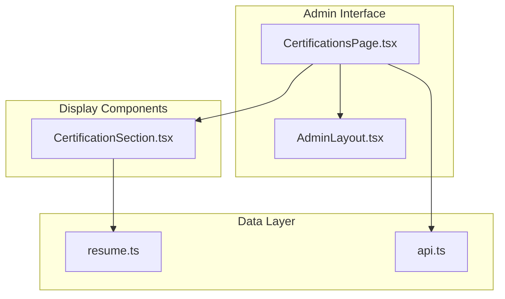
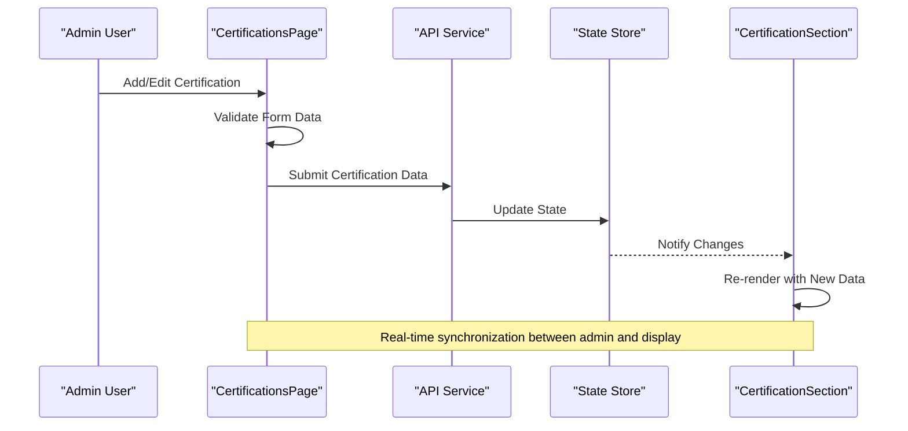
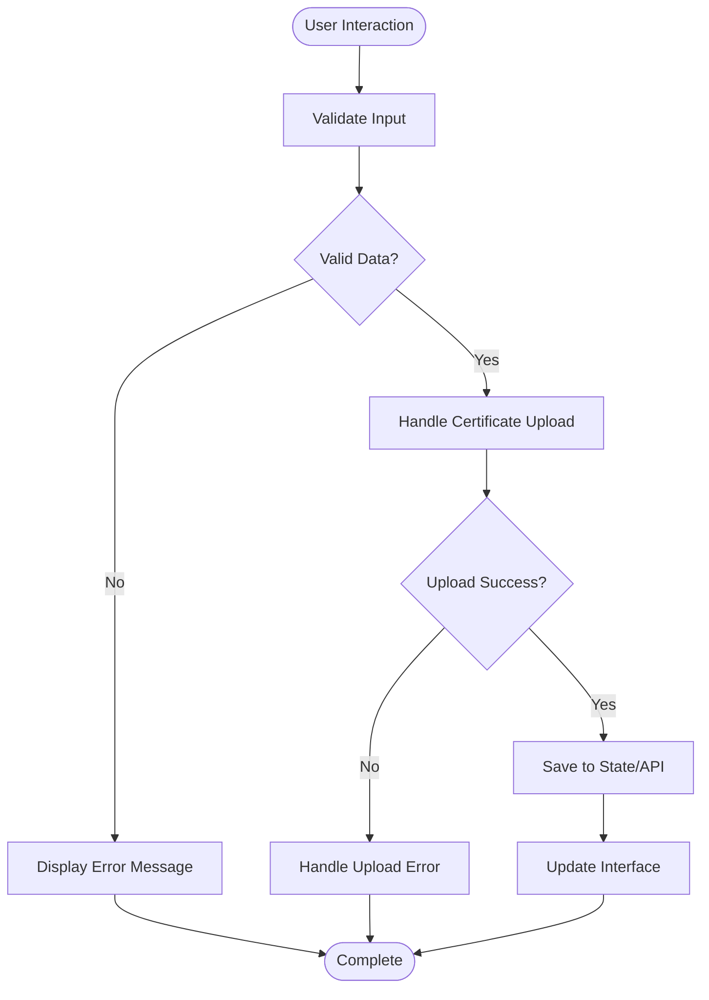
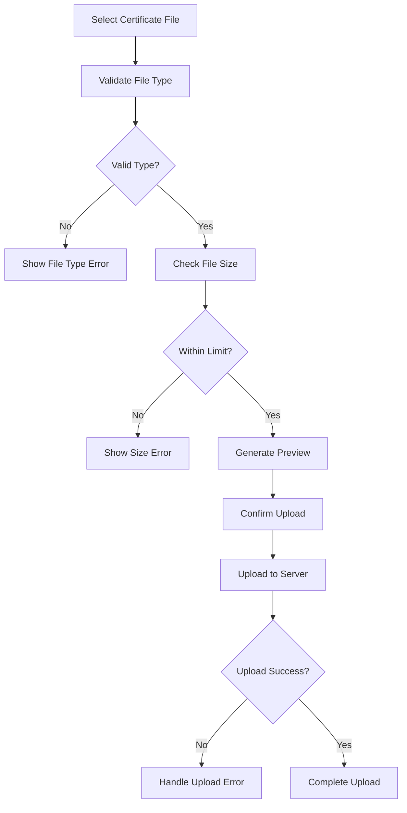
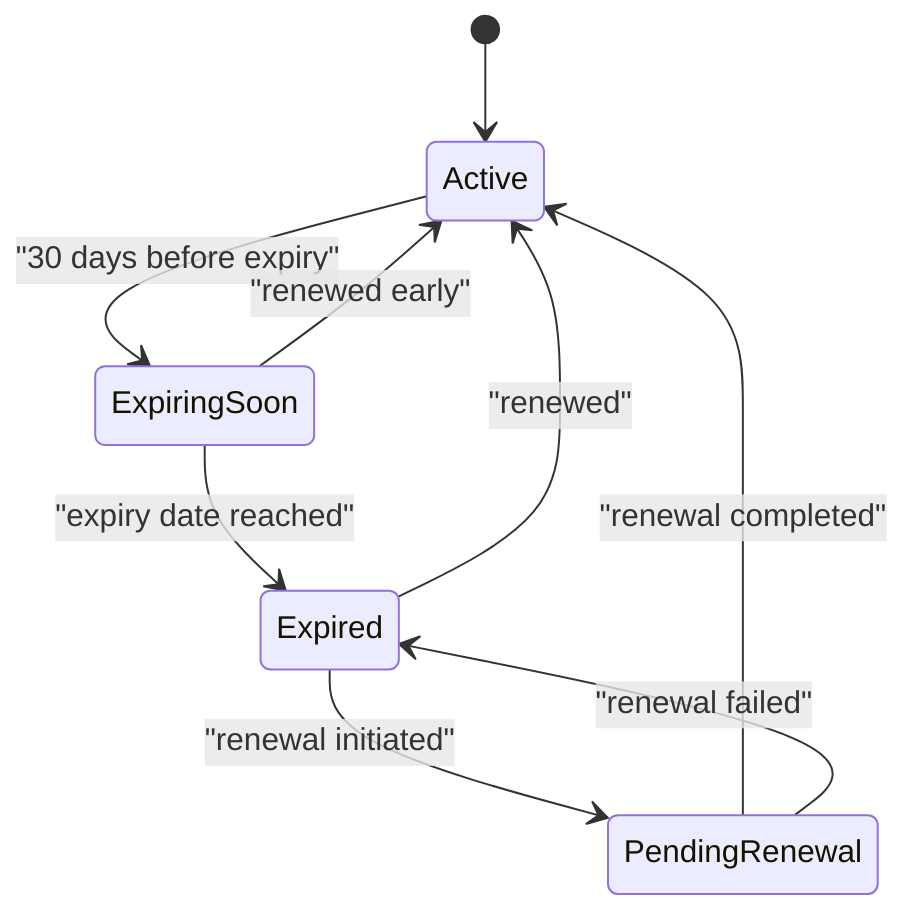
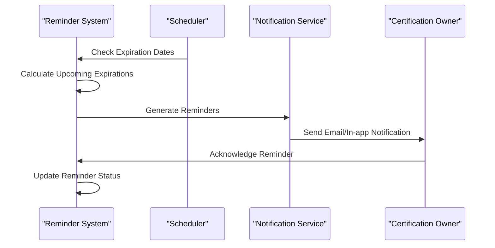

# Certifications Management

<cite>
**Referenced Files in This Document**
- [CertificationsPage.tsx](file://src/pages/admin/CertificationsPage.tsx)
- [CertificationSection.tsx](file://src/components/sections/CertificationSection.tsx)
- [resume.ts](file://src/data/resume.ts)
- [api.ts](file://src/services/api.ts)
- [AdminLayout.tsx](file://src/layouts/AdminLayout.tsx)
</cite>

## Table of Contents
1. [Introduction](#introduction)
2. [Project Structure](#project-structure)
3. [Core Components](#core-components)
4. [Architecture Overview](#architecture-overview)
5. [Detailed Component Analysis](#detailed-component-analysis)
6. [Data Structure Definition](#data-structure-definition)
7. [Form Interface and User Experience](#form-interface-and-user-experience)
8. [Certificate Upload and File Management](#certificate-upload-and-file-management)
9. [Resume Integration](#resume-integration)
10. [Expiration Management and Notifications](#expiration-management-and-notifications)
11. [Category Organization](#category-organization)
12. [Renewal Reminders System](#renewal-reminders-system)
13. [API Integration](#api-integration)
14. [Performance Considerations](#performance-considerations)
15. [Troubleshooting Guide](#troubleshooting-guide)
16. [Conclusion](#conclusion)

## Introduction

The Certifications Management system is a comprehensive solution for managing professional certifications and credentials within a resume management application. This system provides administrators with powerful tools to add, edit, organize, and maintain professional certifications while ensuring seamless integration with the public resume display. The system handles certificate data validation, expiration tracking, verification links, and automated renewal notifications.

## Project Structure

The certification management functionality is distributed across several key components:

**Diagram sources**
- [CertificationsPage.tsx](file://src/pages/admin/CertificationsPage.tsx)
- [CertificationSection.tsx](file://src/components/sections/CertificationSection.tsx)
- [resume.ts](file://src/data/resume.ts)
- [api.ts](file://src/services/api.ts)
- [AdminLayout.tsx](file://src/layouts/AdminLayout.tsx)

**Section sources**
- [CertificationsPage.tsx](file://src/pages/admin/CertificationsPage.tsx)
- [CertificationSection.tsx](file://src/components/sections/CertificationSection.tsx)
- [resume.ts](file://src/data/resume.ts)

## Core Components

The certification management system consists of two primary components working together:

### Admin Interface (CertificationsPage)
- Provides the administrative interface for managing certifications
- Handles form submissions and data validation
- Manages certificate file uploads
- Implements expiration date tracking and renewal reminders

### Display Interface (CertificationSection)
- Renders certifications for public resume viewing
- Formats and displays certification details
- Handles verification links and status indicators
- Manages responsive layout for different screen sizes

**Section sources**
- [CertificationsPage.tsx](file://src/pages/admin/CertificationsPage.tsx)
- [CertificationSection.tsx](file://src/components/sections/CertificationSection.tsx)

## Architecture Overview

The certification management system follows a clean separation of concerns pattern:

**Diagram sources**
- [CertificationsPage.tsx](file://src/pages/admin/CertificationsPage.tsx)
- [api.ts](file://src/services/api.ts)
- [CertificationSection.tsx](file://src/components/sections/CertificationSection.tsx)

## Detailed Component Analysis

### CertificationsPage Component

The main administrative interface that handles all certification management operations:

#### Key Features:
- **Form Management**: Comprehensive form for adding/editing certifications
- **File Upload**: Secure certificate document upload functionality
- **Date Validation**: Automated validation for issue and expiration dates
- **Category Management**: Organize certifications by professional categories
- **Status Tracking**: Monitor certification validity and renewal status

#### Data Flow:

**Diagram sources**
- [CertificationsPage.tsx](file://src/pages/admin/CertificationsPage.tsx)

**Section sources**
- [CertificationsPage.tsx](file://src/pages/admin/CertificationsPage.tsx)

### CertificationSection Component

The public-facing component that displays certifications on the resume:

#### Display Features:
- **Responsive Layout**: Adapts to different screen sizes
- **Status Indicators**: Visual cues for expired, expiring soon, and valid certifications
- **Verification Links**: Clickable links to verify certification authenticity
- **Category Grouping**: Organized display by certification categories
- **Date Formatting**: Human-readable date presentation

**Section sources**
- [CertificationSection.tsx](file://src/components/sections/CertificationSection.tsx)

## Data Structure Definition

The certification data model includes comprehensive fields for professional credential management:

### Core Fields:
- **issuer**: Name of the certifying organization or institution
- **title**: Official name of the certification
- **issueDate**: Date when the certification was issued
- **expirationDate**: Date when the certification expires
- **verificationLink**: URL for online verification of the certification
- **certificateFile**: Path or URL to the uploaded certificate document
- **category**: Professional category for organization (e.g., "Technical", "Management", "Industry-Specific")
- **status**: Current validity status ("valid", "expiring_soon", "expired", "pending_renewal")
- **description**: Additional details about the certification scope and relevance

### Data Validation Rules:
- Issue date must be before expiration date
- Expiration date cannot be in the past for new certifications
- Verification link must be a valid URL format
- Certificate file must be in supported formats (PDF, JPG, PNG)
- Category must be from predefined list

**Section sources**
- [resume.ts](file://src/data/resume.ts)

## Form Interface and User Experience

The certification management form provides an intuitive interface for data entry:

### Form Sections:
1. **Basic Information**
   - Certification title input
   - Issuer organization field
   - Category dropdown selection
   
2. **Date Management**
   - Issue date picker with calendar interface
   - Expiration date picker with automatic validation
   - Auto-calculation of validity period
   
3. **Verification & Documentation**
   - Verification link input with URL validation
   - Certificate file upload with drag-and-drop support
   - File type and size validation
   
4. **Additional Details**
   - Description textarea for certification scope
   - Status auto-determination based on dates
   - Renewal reminder settings

### User Experience Features:
- Real-time form validation with immediate feedback
- Auto-save functionality to prevent data loss
- Responsive design for mobile and desktop
- Accessibility compliance with keyboard navigation
- Clear error messages and success confirmations

**Section sources**
- [CertificationsPage.tsx](file://src/pages/admin/CertificationsPage.tsx)

## Certificate Upload and File Management

The system provides robust file upload capabilities for certificate documents:

### Supported File Types:
- PDF documents (.pdf)
- Image files (.jpg, .jpeg, .png)
- Maximum file size: 10MB per certificate

### Upload Process:

**Diagram sources**
- [CertificationsPage.tsx](file://src/pages/admin/CertificationsPage.tsx)

### File Management Features:
- Drag-and-drop file upload interface
- Progress indication during upload
- Preview generation for image files
- Automatic file compression for large images
- Secure file storage with access controls

**Section sources**
- [CertificationsPage.tsx](file://src/pages/admin/CertificationsPage.tsx)

## Resume Integration

The certification system seamlessly integrates with the resume display through real-time state synchronization:

### Integration Points:
- **State Management**: Centralized state store for certification data
- **Real-time Updates**: Instant reflection of changes in both admin and display views
- **Data Synchronization**: Bidirectional sync between admin edits and public display
- **Caching Strategy**: Optimized loading for better performance

### Display Customization:
- Configurable layout options for certification presentation
- Theme integration with overall resume design
- Responsive breakpoints for optimal mobile experience
- Print-friendly formatting for downloadable resumes

**Section sources**
- [CertificationSection.tsx](file://src/components/sections/CertificationSection.tsx)
- [resume.ts](file://src/data/resume.ts)

## Expiration Management and Notifications

The system includes sophisticated expiration tracking and notification capabilities:

### Expiration Detection:
- **Automatic Status Calculation**: Real-time determination of certification status
- **Expiring Soon Detection**: Flags certifications expiring within configurable timeframe
- **Expired Certification Handling**: Visual indicators and management suggestions
- **Grace Period Support**: Optional grace period after expiration

### Notification System:

**Diagram sources**
- [CertificationsPage.tsx](file://src/pages/admin/CertificationsPage.tsx)

### Notification Channels:
- In-app notifications for immediate awareness
- Email reminders for upcoming expirations
- Dashboard alerts for expired certifications
- Bulk renewal reminders for multiple certifications

**Section sources**
- [CertificationsPage.tsx](file://src/pages/admin/CertificationsPage.tsx)

## Category Organization

The system supports flexible categorization of certifications for better organization:

### Predefined Categories:
- **Technical Certifications**: Programming languages, frameworks, technologies
- **Management Certifications**: Leadership, project management, business administration
- **Industry-Specific**: Healthcare, finance, education, legal, etc.
- **Soft Skills**: Communication, teamwork, problem-solving certifications
- **Compliance**: Regulatory compliance, safety, security certifications

### Category Management:
- Dynamic category creation and modification
- Hierarchical category structure support
- Custom category attributes and metadata
- Search and filtering by category combinations

### Display Organization:
- Category-based grouping in resume display
- Collapsible category sections
- Category-specific styling and icons
- Export functionality by category

**Section sources**
- [CertificationsPage.tsx](file://src/pages/admin/CertificationsPage.tsx)
- [CertificationSection.tsx](file://src/components/sections/CertificationSection.tsx)

## Renewal Reminders System

Automated renewal reminder system ensures certifications remain current:

### Reminder Configuration:
- **Customizable Timeframes**: Set reminder intervals (30, 60, 90 days before expiry)
- **Multiple Recipients**: Configure who receives renewal notifications
- **Escalation Rules**: Progressive reminder intensity for overdue certifications
- **Quiet Hours**: Respect user preferences for notification timing

### Reminder Workflow:

**Diagram sources**
- [CertificationsPage.tsx](file://src/pages/admin/CertificationsPage.tsx)

### Smart Features:
- AI-powered renewal recommendations
- Integration with certification provider websites
- Bulk renewal processing for multiple certifications
- Renewal progress tracking and reporting

**Section sources**
- [CertificationsPage.tsx](file://src/pages/admin/CertificationsPage.tsx)

## API Integration

The certification system integrates with backend services through well-defined APIs:

### API Endpoints:
- **GET /api/certifications**: Retrieve all certifications with filtering options
- **POST /api/certifications**: Create new certification records
- **PUT /api/certifications/:id**: Update existing certification data
- **DELETE /api/certifications/:id**: Remove certification records
- **POST /api/certifications/upload**: Upload certificate files
- **GET /api/certifications/expiring**: Get certifications expiring soon

### Data Synchronization:
- **Real-time Sync**: WebSocket connections for live updates
- **Offline Support**: Local storage with background synchronization
- **Conflict Resolution**: Intelligent merging of concurrent edits
- **Version Control**: Track changes and enable rollback functionality

### Error Handling:
- Comprehensive error logging and monitoring
- Graceful degradation for network failures
- Retry mechanisms for failed API calls
- User-friendly error messages and recovery options

**Section sources**
- [api.ts](file://src/services/api.ts)

## Performance Considerations

The certification system is optimized for performance and scalability:

### Optimization Strategies:
- **Lazy Loading**: Load certification data on demand
- **Image Optimization**: Automatic compression and resizing
- **Caching Strategy**: Multi-level caching for frequently accessed data
- **Database Indexing**: Optimized queries for search and filtering
- **Bundle Splitting**: Code splitting for faster initial load

### Monitoring and Analytics:
- Performance metrics collection and analysis
- User interaction tracking for UX improvements
- Error rate monitoring and alerting
- Resource usage optimization recommendations

## Troubleshooting Guide

Common issues and their solutions:

### Upload Issues:
- **File Too Large**: Compress images or use PDF format
- **Unsupported Format**: Convert to supported file types
- **Network Errors**: Check internet connection and retry
- **Permission Denied**: Verify file upload permissions

### Display Problems:
- **Missing Certifications**: Check data synchronization status
- **Incorrect Dates**: Verify date format and timezone settings
- **Broken Links**: Test verification URLs regularly
- **Layout Issues**: Clear browser cache and refresh

### Performance Issues:
- **Slow Loading**: Optimize image sizes and reduce number of certifications
- **Memory Leaks**: Monitor browser memory usage
- **API Timeouts**: Implement proper timeout handling
- **Storage Limits**: Clean up old certificates and unused files

**Section sources**
- [CertificationsPage.tsx](file://src/pages/admin/CertificationsPage.tsx)
- [api.ts](file://src/services/api.ts)

## Conclusion

The Certifications Management system provides a comprehensive solution for managing professional certifications and credentials. With its intuitive interface, robust data validation, automated expiration tracking, and seamless resume integration, it offers everything needed to maintain accurate and up-to-date professional credentials. The system's modular architecture ensures easy maintenance and future enhancements while providing excellent user experience for both administrators and end users.

Key benefits include:
- **Comprehensive Data Management**: Complete lifecycle management of certification data
- **Automated Expiration Tracking**: Proactive renewal reminders and status updates
- **Flexible Categorization**: Organize certifications by professional domains
- **Seamless Integration**: Real-time synchronization between admin and display interfaces
- **Scalable Architecture**: Built for growth and future feature additions

The system serves as a foundation for professional development tracking and credential management, supporting career growth and continuous learning initiatives.