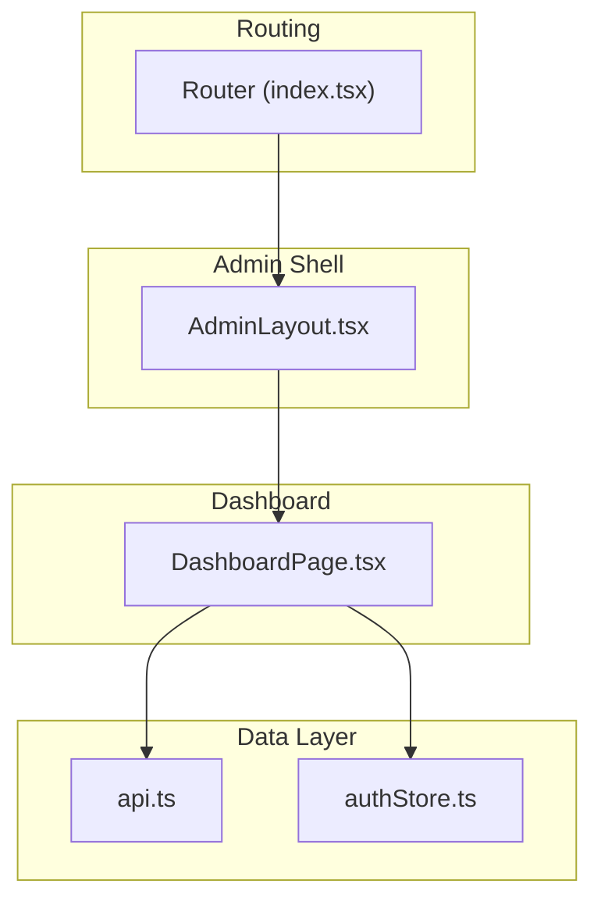
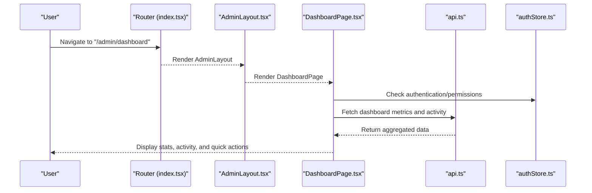
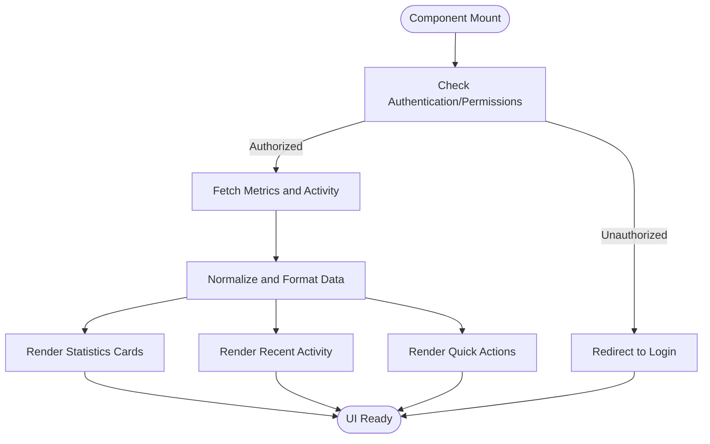
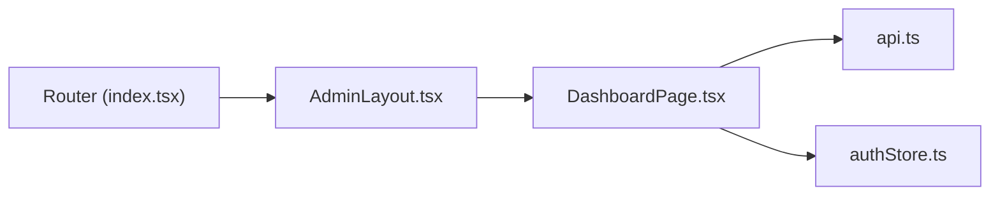

# Dashboard Overview

<cite>
**Referenced Files in This Document**
- [DashboardPage.tsx](file://src/pages/admin/DashboardPage.tsx)
- [AdminLayout.tsx](file://src/layouts/AdminLayout.tsx)
- [index.tsx](file://src/router/index.tsx)
- [api.ts](file://src/services/api.ts)
- [authStore.ts](file://src/store/authStore.ts)
</cite>

## Table of Contents
1. [Introduction](#introduction)
2. [Project Structure](#project-structure)
3. [Core Components](#core-components)
4. [Architecture Overview](#architecture-overview)
5. [Detailed Component Analysis](#detailed-component-analysis)
6. [Dependency Analysis](#dependency-analysis)
7. [Performance Considerations](#performance-considerations)
8. [Troubleshooting Guide](#troubleshooting-guide)
9. [Conclusion](#conclusion)
10. [Appendices](#appendices)

## Introduction
This document provides comprehensive documentation for the DashboardPage component, which serves as the main administrative hub. It displays key statistics, recent activity, and quick action buttons to streamline common tasks. The dashboard aggregates information from different sections and provides shortcuts to content management features such as projects, experience, skills, and certifications. It also outlines the layout structure, data visualization components, and navigation patterns used throughout the admin interface.

## Project Structure
The dashboard is implemented as a page within the admin module and integrates with the application’s routing, layout, services, and authentication store. Key files involved include:
- DashboardPage.tsx: Implements the dashboard UI and logic
- AdminLayout.tsx: Provides the admin shell and navigation
- index.tsx: Configures routes that render the dashboard
- api.ts: Centralizes API calls for fetching dashboard data
- authStore.ts: Manages authentication state and access control

**Diagram sources**
- [index.tsx](file://src/router/index.tsx)
- [AdminLayout.tsx](file://src/layouts/AdminLayout.tsx)
- [DashboardPage.tsx](file://src/pages/admin/DashboardPage.tsx)
- [api.ts](file://src/services/api.ts)
- [authStore.ts](file://src/store/authStore.ts)

**Section sources**
- [DashboardPage.tsx](file://src/pages/admin/DashboardPage.tsx)
- [AdminLayout.tsx](file://src/layouts/AdminLayout.tsx)
- [index.tsx](file://src/router/index.tsx)
- [api.ts](file://src/services/api.ts)
- [authStore.ts](file://src/store/authStore.ts)

## Core Components
- DashboardPage: Renders the main admin dashboard, including:
  - Statistics cards showing counts or metrics
  - Recent activity feed or summary
  - Quick action buttons for navigating to content sections
- AdminLayout: Wraps pages with consistent navigation and sidebar links
- Routing: Maps URLs to the dashboard and other admin pages
- Services: Encapsulate API endpoints for retrieving dashboard metrics and activity
- Auth Store: Controls user session and permissions relevant to dashboard visibility

Key responsibilities:
- Aggregate and display metrics from multiple sections
- Provide quick actions to jump to specific content areas
- Maintain responsive layout and accessibility
- Handle loading and error states gracefully

**Section sources**
- [DashboardPage.tsx](file://src/pages/admin/DashboardPage.tsx)
- [AdminLayout.tsx](file://src/layouts/AdminLayout.tsx)
- [index.tsx](file://src/router/index.tsx)
- [api.ts](file://src/services/api.ts)
- [authStore.ts](file://src/store/authStore.ts)

## Architecture Overview
The dashboard follows a layered architecture:
- Presentation layer: DashboardPage composes UI widgets and layouts
- Navigation layer: Router directs users to the dashboard and related pages
- Business layer: Services call APIs to fetch aggregated data
- State layer: Auth store manages authentication and permissions

**Diagram sources**
- [index.tsx](file://src/router/index.tsx)
- [AdminLayout.tsx](file://src/layouts/AdminLayout.tsx)
- [DashboardPage.tsx](file://src/pages/admin/DashboardPage.tsx)
- [api.ts](file://src/services/api.ts)
- [authStore.ts](file://src/store/authStore.ts)

## Detailed Component Analysis

### DashboardPage Component
Responsibilities:
- Aggregates key statistics from various sections (projects, experience, skills, certifications)
- Displays recent activity summaries
- Provides quick action buttons to navigate to content management pages
- Handles loading and error states for data fetching
- Integrates with authentication to ensure proper access

Data flow:
- On mount, the component requests metrics and activity via the service layer
- Data is normalized and presented in cards and lists
- Quick actions trigger navigation to corresponding admin pages

Customization examples:
- Add new statistics displays by extending the metrics aggregation logic and adding a new card widget
- Customize quick action buttons by updating the action list and navigation targets
- Integrate additional data sources through the service layer

**Diagram sources**
- [DashboardPage.tsx](file://src/pages/admin/DashboardPage.tsx)
- [api.ts](file://src/services/api.ts)
- [authStore.ts](file://src/store/authStore.ts)

**Section sources**
- [DashboardPage.tsx](file://src/pages/admin/DashboardPage.tsx)
- [api.ts](file://src/services/api.ts)
- [authStore.ts](file://src/store/authStore.ts)

### AdminLayout Integration
Responsibilities:
- Provides consistent header and sidebar navigation
- Links to dashboard and other admin pages
- Ensures responsive behavior across devices

Navigation patterns:
- Sidebar items link to Projects, Experience, Skills, Certifications
- Dashboard acts as the central hub with quick actions to these sections

**Section sources**
- [AdminLayout.tsx](file://src/layouts/AdminLayout.tsx)

### Routing Configuration
Responsibilities:
- Defines route for the dashboard
- Protects admin routes based on authentication state

Navigation patterns:
- Direct URL access to /admin/dashboard renders the dashboard
- Unauthorized users are redirected to login

**Section sources**
- [index.tsx](file://src/router/index.tsx)

### Service Layer (API)
Responsibilities:
- Encapsulates API calls for dashboard metrics and activity
- Handles request/response transformations
- Centralizes error handling and retries if needed

Integration points:
- DashboardPage calls service methods to fetch data
- Consistent error handling and loading states are managed at the service level

**Section sources**
- [api.ts](file://src/services/api.ts)

### Authentication Store
Responsibilities:
- Manages user session and permissions
- Exposes state for checking authorization to view the dashboard

Integration points:
- DashboardPage checks permissions before rendering sensitive data
- Redirects unauthorized users to login

**Section sources**
- [authStore.ts](file://src/store/authStore.ts)

## Dependency Analysis
The dashboard depends on several modules:
- Router: Determines when to render the dashboard
- AdminLayout: Provides the surrounding UI framework
- Services: Fetch aggregated data from backend
- Auth Store: Controls access and redirects

**Diagram sources**
- [index.tsx](file://src/router/index.tsx)
- [AdminLayout.tsx](file://src/layouts/AdminLayout.tsx)
- [DashboardPage.tsx](file://src/pages/admin/DashboardPage.tsx)
- [api.ts](file://src/services/api.ts)
- [authStore.ts](file://src/store/authStore.ts)

**Section sources**
- [index.tsx](file://src/router/index.tsx)
- [AdminLayout.tsx](file://src/layouts/AdminLayout.tsx)
- [DashboardPage.tsx](file://src/pages/admin/DashboardPage.tsx)
- [api.ts](file://src/services/api.ts)
- [authStore.ts](file://src/store/authStore.ts)

## Performance Considerations
- Lazy load dashboard data only when the page mounts
- Cache frequently accessed metrics to reduce network calls
- Use pagination or virtualization for large activity feeds
- Debounce search or filter operations if added later
- Optimize re-renders by memoizing static widgets and derived data

[No sources needed since this section provides general guidance]

## Troubleshooting Guide
Common issues and resolutions:
- Dashboard not loading:
  - Verify API connectivity and endpoint availability
  - Check authentication status and permissions
- Missing statistics:
  - Ensure data normalization handles empty or null values
  - Validate backend response schema matches expectations
- Navigation errors:
  - Confirm routes are correctly defined and accessible
  - Check for missing quick action mappings

**Section sources**
- [DashboardPage.tsx](file://src/pages/admin/DashboardPage.tsx)
- [api.ts](file://src/services/api.ts)
- [authStore.ts](file://src/store/authStore.ts)

## Conclusion
The DashboardPage component functions as the central administrative hub, aggregating key metrics, recent activity, and quick actions to streamline content management. Its integration with routing, layout, services, and authentication ensures a cohesive and secure admin experience. Customization is straightforward through extending metrics, adding widgets, and updating quick actions.

[No sources needed since this section summarizes without analyzing specific files]

## Appendices

### Customizing Dashboard Widgets
- Add a new statistics card by defining a new metric source and integrating it into the dashboard layout
- Update quick action buttons to include new content management features
- Extend the service layer to support additional data endpoints

### Adding New Statistics Displays
- Implement a new data fetcher in the service layer
- Normalize and format the data for display
- Create a reusable widget component for consistent styling and behavior

[No sources needed since this section provides general guidance]