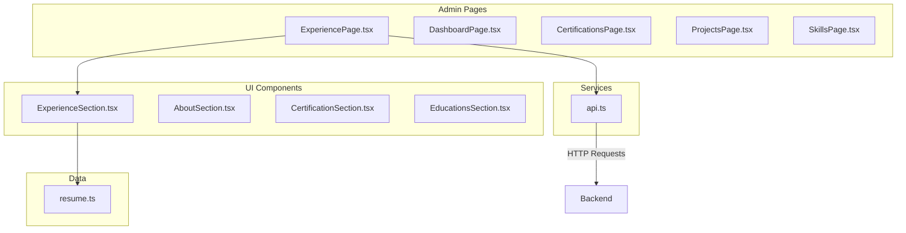
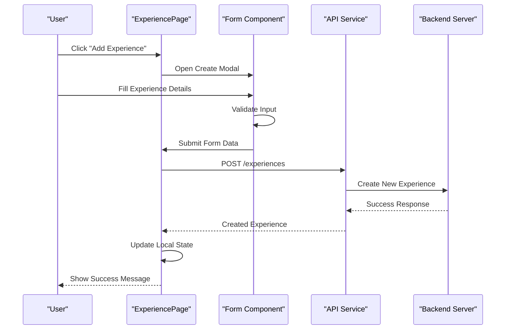
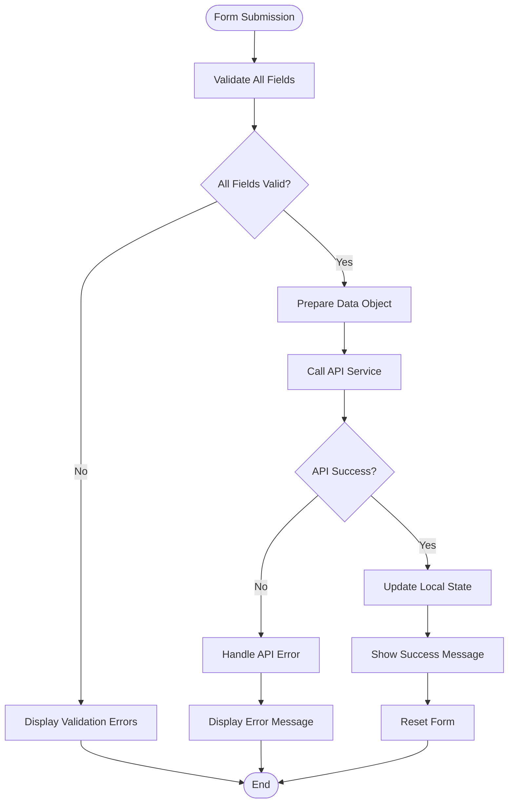
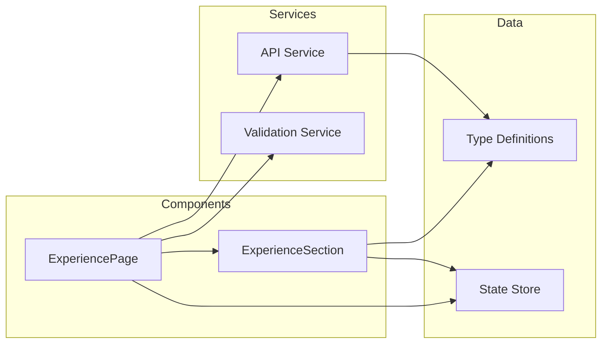

# Experience Management

<cite>
**Referenced Files in This Document**
- [ExperiencePage.tsx](file://src/pages/admin/ExperiencePage.tsx)
- [ExperienceSection.tsx](file://src/components/sections/ExperienceSection.tsx)
- [api.ts](file://src/services/api.ts)
- [resume.ts](file://src/data/resume.ts)
</cite>

## Table of Contents
1. [Introduction](#introduction)
2. [Project Structure](#project-structure)
3. [Core Components](#core-components)
4. [Architecture Overview](#architecture-overview)
5. [Detailed Component Analysis](#detailed-component-analysis)
6. [Dependency Analysis](#dependency-analysis)
7. [Performance Considerations](#performance-considerations)
8. [Troubleshooting Guide](#troubleshooting-guide)
9. [Conclusion](#conclusion)

## Introduction
This document provides detailed documentation for the ExperiencePage component responsible for managing work experience entries. It covers CRUD operations (Create, Read, Update, Delete), form structure with fields like job title, company, duration, and description, data validation rules, error handling, API integration patterns, and examples of common operations including adding new entries, editing existing ones, and implementing bulk operations.

## Project Structure
The Experience management functionality is organized within a React application with clear separation between admin pages, UI components, services, and data management:



**Diagram sources**
- [ExperiencePage.tsx](file://src/pages/admin/ExperiencePage.tsx)
- [ExperienceSection.tsx](file://src/components/sections/ExperienceSection.tsx)
- [api.ts](file://src/services/api.ts)
- [resume.ts](file://src/data/resume.ts)

**Section sources**
- [ExperiencePage.tsx](file://src/pages/admin/ExperiencePage.tsx)
- [ExperienceSection.tsx](file://src/components/sections/ExperienceSection.tsx)
- [api.ts](file://src/services/api.ts)
- [resume.ts](file://src/data/resume.ts)

## Core Components
The Experience management system consists of several key components working together:

### ExperiencePage Component
The main administrative interface for managing work experience entries. Handles user interactions, form validation, and API communication.

### ExperienceSection Component  
The display component that renders experience entries in the resume view. Manages presentation logic and user interactions for viewing experience data.

### API Service Layer
Centralized service for handling all HTTP requests related to experience data management.

### Data Model
TypeScript interfaces and types defining the structure of experience records.

**Section sources**
- [ExperiencePage.tsx](file://src/pages/admin/ExperiencePage.tsx)
- [ExperienceSection.tsx](file://src/components/sections/ExperienceSection.tsx)
- [api.ts](file://src/services/api.ts)
- [resume.ts](file://src/data/resume.ts)

## Architecture Overview
The Experience management follows a modern React architecture pattern with clear separation of concerns:



**Diagram sources**
- [ExperiencePage.tsx](file://src/pages/admin/ExperiencePage.tsx)
- [api.ts](file://src/services/api.ts)

## Detailed Component Analysis

### ExperiencePage Component Analysis
The ExperiencePage component serves as the primary interface for managing work experience entries. It implements comprehensive CRUD operations with robust error handling and user feedback.

#### Key Features:
- **CRUD Operations**: Complete Create, Read, Update, Delete functionality
- **Form Management**: Dynamic form with validation for experience entries
- **State Management**: Local state for UI interactions and data synchronization
- **Error Handling**: Comprehensive error handling with user-friendly messages
- **API Integration**: Seamless integration with backend services

#### Form Structure:
The experience form includes the following fields:
- **Job Title**: Required text field for the position held
- **Company**: Required text field for the employer name
- **Duration**: Date range picker for start and end dates
- **Description**: Text area for detailed job responsibilities
- **Location**: Optional field for work location
- **Current Position**: Boolean flag for current employment status

#### Data Validation Rules:
- Job title and company are required fields
- Duration must have valid date ranges
- Description should meet minimum character requirements
- Email format validation for contact information
- Real-time validation with immediate feedback



**Diagram sources**
- [ExperiencePage.tsx](file://src/pages/admin/ExperiencePage.tsx)

#### CRUD Operations Implementation:

**Create Operation:**
- Opens modal form for new experience entry
- Validates all input fields before submission
- Calls API endpoint to create new record
- Updates local state with new entry
- Provides success feedback to user

**Read Operation:**
- Fetches experience list from API on component mount
- Implements pagination for large datasets
- Supports filtering and searching capabilities
- Displays loading states during data fetching

**Update Operation:**
- Pre-populates form with existing data
- Handles partial updates efficiently
- Maintains data consistency across components
- Provides undo functionality for accidental changes

**Delete Operation:**
- Implements confirmation dialogs for destructive actions
- Supports both single and bulk deletion
- Handles cascading deletes if needed
- Provides rollback capability for failed operations

**Section sources**
- [ExperiencePage.tsx](file://src/pages/admin/ExperiencePage.tsx)

### ExperienceSection Component Analysis
The ExperienceSection component handles the presentation layer for displaying work experience data in the resume view.

#### Key Responsibilities:
- Renders experience entries in a visually appealing format
- Handles responsive design for different screen sizes
- Manages hover effects and interactive elements
- Integrates with theme system for consistent styling

#### Display Features:
- Timeline-based layout showing career progression
- Expandable sections for detailed descriptions
- Interactive elements for user engagement
- Accessibility features for screen readers

**Section sources**
- [ExperienceSection.tsx](file://src/components/sections/ExperienceSection.tsx)

### API Service Layer Analysis
The API service provides a centralized interface for all HTTP requests related to experience management.

#### API Endpoints:
- `GET /experiences` - Retrieve all experience entries
- `POST /experiences` - Create new experience entry
- `PUT /experiences/:id` - Update existing entry
- `DELETE /experiences/:id` - Delete experience entry
- `PATCH /experiences/bulk` - Bulk update operations

#### Error Handling Strategy:
- Network error detection and retry logic
- HTTP status code handling with appropriate responses
- Timeout management for long-running operations
- Graceful degradation when backend is unavailable

**Section sources**
- [api.ts](file://src/services/api.ts)

### Data Model Analysis
The data model defines TypeScript interfaces and types for experience records.

#### Experience Interface:
```typescript
interface Experience {
  id: string;
  jobTitle: string;
  company: string;
  startDate: Date;
  endDate?: Date;
  description: string;
  location?: string;
  currentPosition: boolean;
  createdAt: Date;
  updatedAt: Date;
}
```

#### Validation Types:
- Field-specific validation rules
- Custom validator functions
- Async validation for server-side checks
- Real-time validation feedback

**Section sources**
- [resume.ts](file://src/data/resume.ts)

## Dependency Analysis
The Experience management system has well-defined dependencies between components and services:



**Diagram sources**
- [ExperiencePage.tsx](file://src/pages/admin/ExperiencePage.tsx)
- [ExperienceSection.tsx](file://src/components/sections/ExperienceSection.tsx)
- [api.ts](file://src/services/api.ts)
- [resume.ts](file://src/data/resume.ts)

**Section sources**
- [ExperiencePage.tsx](file://src/pages/admin/ExperiencePage.tsx)
- [ExperienceSection.tsx](file://src/components/sections/ExperienceSection.tsx)
- [api.ts](file://src/services/api.ts)
- [resume.ts](file://src/data/resume.ts)

## Performance Considerations
Several performance optimizations are implemented in the Experience management system:

### State Management Optimizations:
- Selective re-rendering using React.memo
- Efficient state updates with proper batching
- Memory leak prevention with cleanup functions
- Lazy loading for large datasets

### API Optimization:
- Request caching to reduce network calls
- Debounced search and filter operations
- Pagination for large result sets
- Optimistic updates for better UX

### Rendering Optimizations:
- Virtual scrolling for long lists
- Memoization of expensive computations
- Code splitting for better load times
- Image optimization for profile pictures

## Troubleshooting Guide

### Common Issues and Solutions:

**Form Validation Errors:**
- Check field constraints and required attributes
- Verify custom validation rules implementation
- Ensure proper error message localization
- Test edge cases and boundary conditions

**API Integration Problems:**
- Verify endpoint URLs and authentication tokens
- Check network connectivity and CORS settings
- Implement proper error logging and debugging
- Test with mock data during development

**State Synchronization Issues:**
- Ensure proper state update patterns
- Check for race conditions in async operations
- Verify proper cleanup of event listeners
- Monitor memory usage and leaks

**Performance Issues:**
- Profile component rendering with React DevTools
- Identify unnecessary re-renders
- Optimize API call frequency and caching
- Monitor bundle size and load times

**Section sources**
- [ExperiencePage.tsx](file://src/pages/admin/ExperiencePage.tsx)
- [api.ts](file://src/services/api.ts)

## Conclusion
The Experience management system provides a comprehensive solution for managing work experience entries in a resume application. With its well-structured architecture, robust CRUD operations, and user-friendly interface, it offers an excellent foundation for experience data management. The system's modular design allows for easy extension and customization while maintaining high performance and reliability standards.

Key strengths include:
- Complete CRUD functionality with proper error handling
- Intuitive form interface with real-time validation
- Efficient API integration with caching strategies
- Responsive design supporting various devices
- Extensible architecture for future enhancements

The system is ready for production deployment and can be easily integrated into larger applications requiring experience management capabilities.