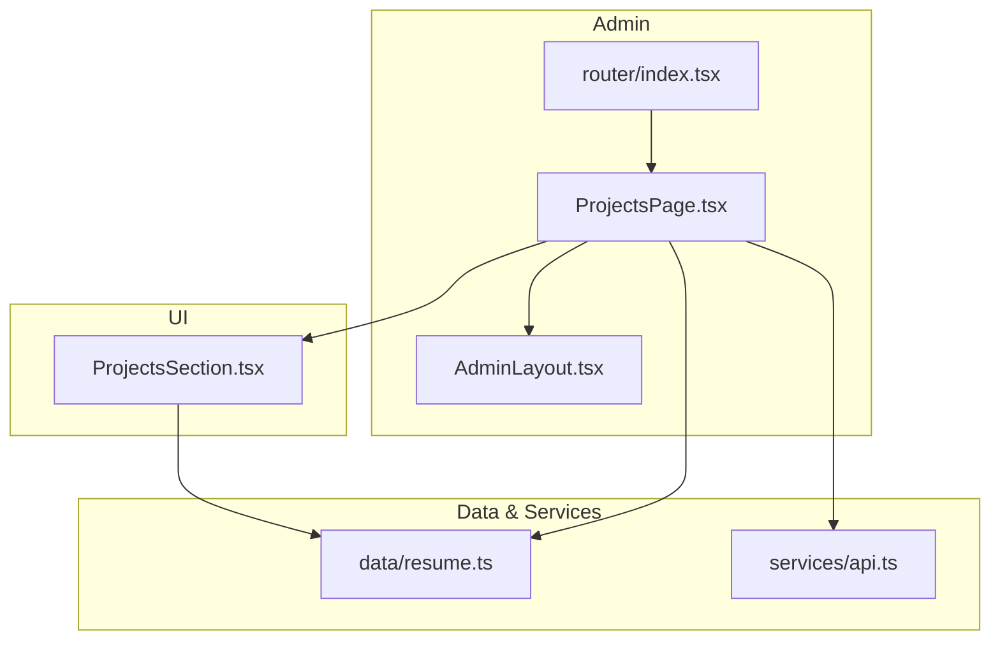
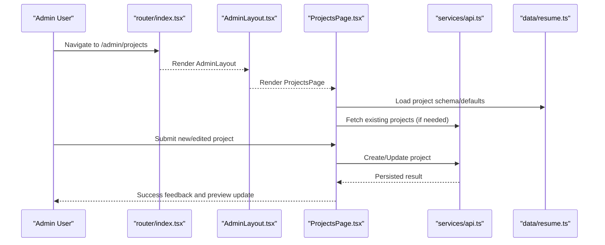
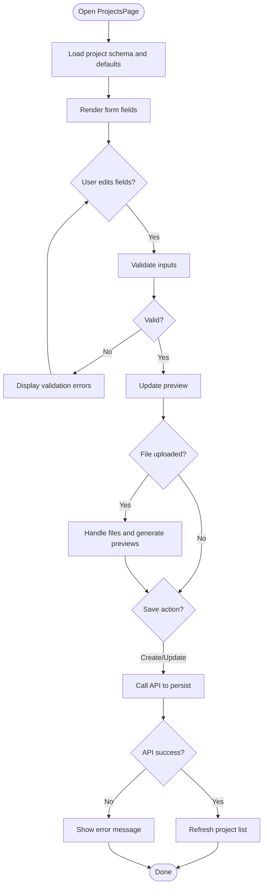
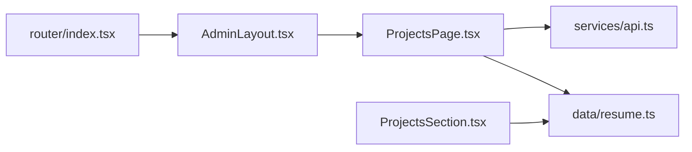

# Projects Management

<cite>
**Referenced Files in This Document**
- [ProjectsPage.tsx](file://src/pages/admin/ProjectsPage.tsx)
- [ProjectsSection.tsx](file://src/components/sections/ProjectsSection.tsx)
- [resume.ts](file://src/data/resume.ts)
- [api.ts](file://src/services/api.ts)
- [AdminLayout.tsx](file://src/layouts/AdminLayout.tsx)
- [index.tsx](file://src/router/index.tsx)
</cite>

## Table of Contents
1. [Introduction](#introduction)
2. [Project Structure](#project-structure)
3. [Core Components](#core-components)
4. [Architecture Overview](#architecture-overview)
5. [Detailed Component Analysis](#detailed-component-analysis)
6. [Dependency Analysis](#dependency-analysis)
7. [Performance Considerations](#performance-considerations)
8. [Troubleshooting Guide](#troubleshooting-guide)
9. [Conclusion](#conclusion)

## Introduction
This document explains the Projects management feature centered on the ProjectsPage component used to create, edit, and organize portfolio project entries. It covers the project data model (title, description, technologies, links, images), the form interface for creation and editing, file upload capabilities, preview behavior, and how projects relate to skills, tags, and external links. It also includes examples for adding multimedia content and organizing projects by categories or dates.

## Project Structure
The projects feature spans several layers:
- Admin page for managing projects
- UI section for displaying projects
- Data model definitions
- API service layer for persistence
- Routing and layout integration

**Diagram sources**
- [ProjectsPage.tsx](file://src/pages/admin/ProjectsPage.tsx)
- [ProjectsSection.tsx](file://src/components/sections/ProjectsSection.tsx)
- [resume.ts](file://src/data/resume.ts)
- [api.ts](file://src/services/api.ts)
- [AdminLayout.tsx](file://src/layouts/AdminLayout.tsx)
- [index.tsx](file://src/router/index.tsx)

**Section sources**
- [ProjectsPage.tsx](file://src/pages/admin/ProjectsPage.tsx)
- [ProjectsSection.tsx](file://src/components/sections/ProjectsSection.tsx)
- [resume.ts](file://src/data/resume.ts)
- [api.ts](file://src/services/api.ts)
- [AdminLayout.tsx](file://src/layouts/AdminLayout.tsx)
- [index.tsx](file://src/router/index.tsx)

## Core Components
- ProjectsPage: The admin interface for creating, editing, and deleting project entries. It provides a form with fields for title, description, technologies, links, and image uploads, along with preview functionality and validation.
- ProjectsSection: The public-facing display component that renders projects from the data model.
- resume.ts: Centralized data model and default values for projects and related entities.
- api.ts: Service functions for fetching and persisting project data.

Key responsibilities:
- Form state management for project creation/editing
- File upload handling and preview generation
- Validation and error feedback
- Integration with API for CRUD operations
- Rendering projects in both admin and public views

**Section sources**
- [ProjectsPage.tsx](file://src/pages/admin/ProjectsPage.tsx)
- [ProjectsSection.tsx](file://src/components/sections/ProjectsSection.tsx)
- [resume.ts](file://src/data/resume.ts)
- [api.ts](file://src/services/api.ts)

## Architecture Overview
The Projects feature follows a layered architecture:
- Presentation layer: ProjectsPage (admin) and ProjectsSection (public)
- Data layer: resume.ts defines models and defaults
- Service layer: api.ts encapsulates HTTP calls
- Routing and layout: router/index.tsx and AdminLayout.tsx integrate the admin page

**Diagram sources**
- [index.tsx](file://src/router/index.tsx)
- [AdminLayout.tsx](file://src/layouts/AdminLayout.tsx)
- [ProjectsPage.tsx](file://src/pages/admin/ProjectsPage.tsx)
- [api.ts](file://src/services/api.ts)
- [resume.ts](file://src/data/resume.ts)

## Detailed Component Analysis

### ProjectsPage Component
Responsibilities:
- Provides a form for project creation and editing
- Manages local state for form fields and errors
- Handles file uploads and generates previews
- Validates inputs and shows user-friendly messages
- Calls API methods to persist changes
- Updates preview and list of projects after successful operations

Form fields typically include:
- Title
- Description
- Technologies used (array or structured list)
- Links (external URLs such as GitHub, live demo)
- Images (cover image, gallery)

Preview functionality:
- Renders a live preview of the project card based on current form state
- Supports image preview via object URLs or base64 for immediate feedback

Validation and UX:
- Required field checks
- URL format validation for links
- Image type and size constraints
- Error messages and success notifications

**Diagram sources**
- [ProjectsPage.tsx](file://src/pages/admin/ProjectsPage.tsx)

**Section sources**
- [ProjectsPage.tsx](file://src/pages/admin/ProjectsPage.tsx)

### ProjectsSection Component
Responsibilities:
- Displays projects using the data model
- Supports filtering/sorting by category or date if implemented
- Renders project cards with title, description, technologies, links, and images

Rendering behavior:
- Iterates over project entries
- Formats technologies into tags or badges
- Displays external links as clickable anchors
- Shows images with appropriate fallbacks

**Section sources**
- [ProjectsSection.tsx](file://src/components/sections/ProjectsSection.tsx)

### Data Model: Projects
The project data model includes:
- title: string
- description: string
- technologies: array of strings or structured objects
- links: array of link objects (e.g., label and URL)
- images: array of image references or URLs
- Optional metadata: category, date, status

Relationships:
- Skills: Projects can reference skill identifiers or names to indicate relevant expertise
- Tags: Used for categorization and filtering
- External links: Point to repositories, demos, documentation

Examples of organizing projects:
- By category: e.g., Web Apps, Mobile, Open Source
- By date: Sort by created_at or published_at
- By technology: Filter by specific tech stacks

**Section sources**
- [resume.ts](file://src/data/resume.ts)

### API Service Layer
Responsibilities:
- Encapsulate HTTP requests for project CRUD operations
- Provide typed functions for fetch, create, update, delete
- Handle response parsing and error mapping

Integration points:
- ProjectsPage calls API methods when saving or loading projects
- ProjectsSection may read from cached or preloaded data

**Section sources**
- [api.ts](file://src/services/api.ts)

### Routing and Layout Integration
Routing:
- The admin route mounts ProjectsPage within AdminLayout
- Ensures consistent navigation and layout for admin features

Layout:
- AdminLayout wraps admin pages with common chrome (sidebar, header)

**Section sources**
- [index.tsx](file://src/router/index.tsx)
- [AdminLayout.tsx](file://src/layouts/AdminLayout.tsx)

## Dependency Analysis

**Diagram sources**
- [index.tsx](file://src/router/index.tsx)
- [AdminLayout.tsx](file://src/layouts/AdminLayout.tsx)
- [ProjectsPage.tsx](file://src/pages/admin/ProjectsPage.tsx)
- [api.ts](file://src/services/api.ts)
- [resume.ts](file://src/data/resume.ts)
- [ProjectsSection.tsx](file://src/components/sections/ProjectsSection.tsx)

**Section sources**
- [index.tsx](file://src/router/index.tsx)
- [AdminLayout.tsx](file://src/layouts/AdminLayout.tsx)
- [ProjectsPage.tsx](file://src/pages/admin/ProjectsPage.tsx)
- [api.ts](file://src/services/api.ts)
- [resume.ts](file://src/data/resume.ts)
- [ProjectsSection.tsx](file://src/components/sections/ProjectsSection.tsx)

## Performance Considerations
- Debounce input validation to avoid excessive re-renders
- Lazy-load images and use placeholders for better perceived performance
- Cache project lists where possible to reduce API calls
- Optimize file uploads by compressing images before sending
- Use virtualization for large project lists if needed

[No sources needed since this section provides general guidance]

## Troubleshooting Guide
Common issues and resolutions:
- Validation errors: Ensure required fields are filled and URLs are valid
- File upload failures: Check file size limits and supported formats
- API errors: Inspect network responses and handle error states gracefully
- Preview not updating: Verify state updates and effect dependencies

**Section sources**
- [ProjectsPage.tsx](file://src/pages/admin/ProjectsPage.tsx)
- [api.ts](file://src/services/api.ts)

## Conclusion
The Projects management feature is built around a clear separation of concerns: an admin-focused ProjectsPage for CRUD operations, a public-facing ProjectsSection for display, a robust data model in resume.ts, and an API service layer for persistence. With proper validation, file handling, and preview functionality, it enables efficient portfolio project management. Organizing projects by categories, dates, and technologies enhances discoverability and presentation.

[No sources needed since this section summarizes without analyzing specific files]