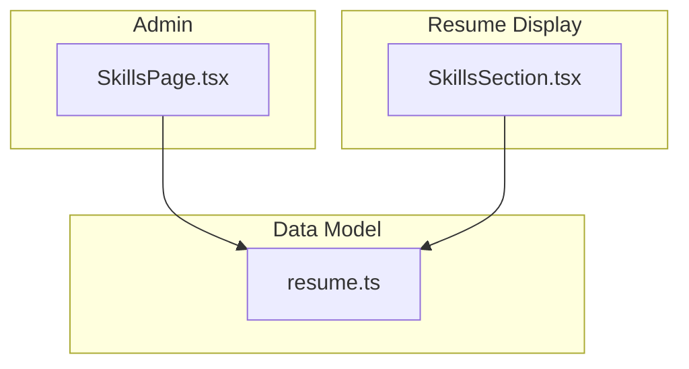
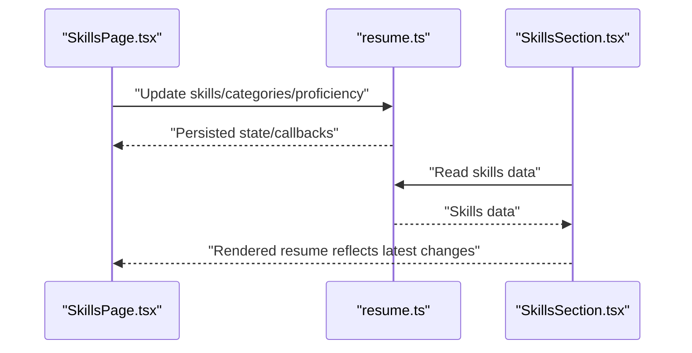
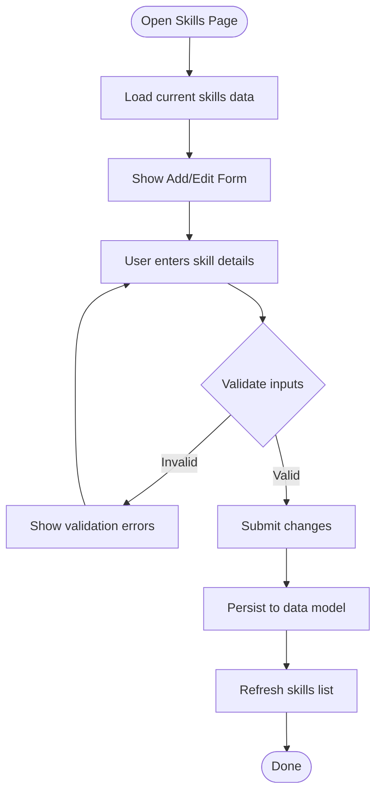
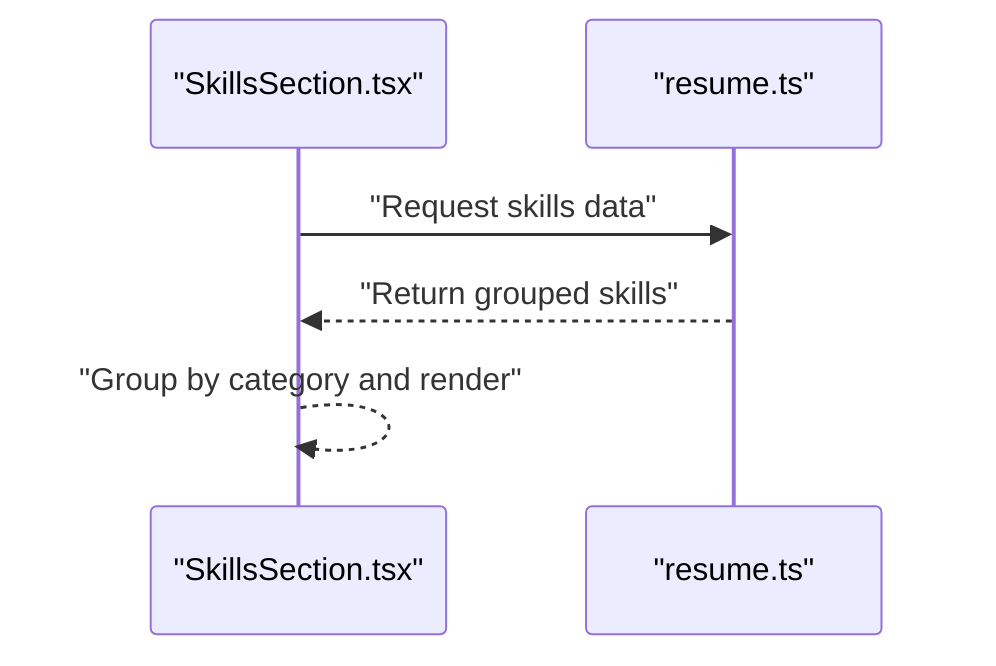
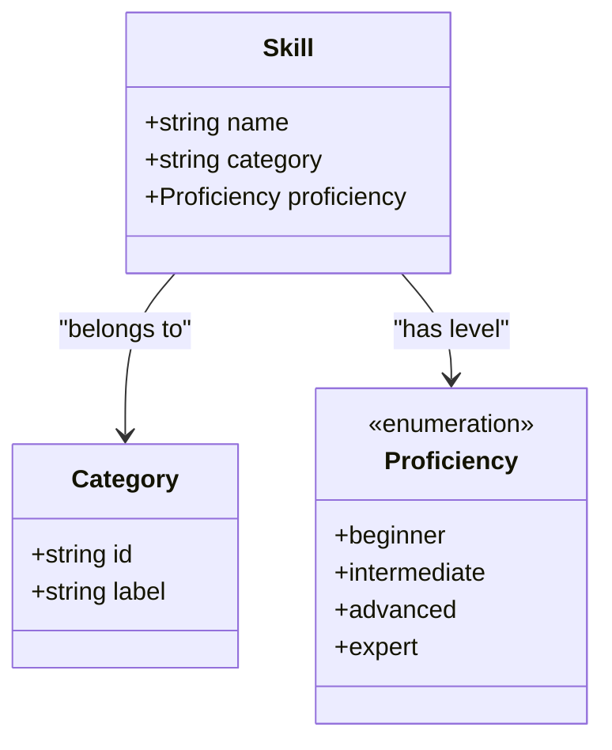
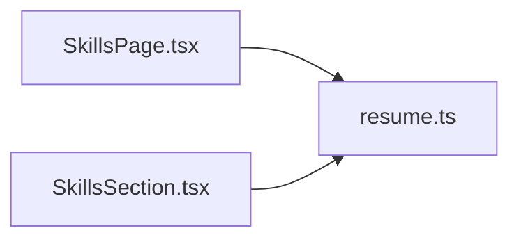

# Skills Management

<cite>
**Referenced Files in This Document**
- [SkillsPage.tsx](file://src/pages/admin/SkillsPage.tsx)
- [SkillsSection.tsx](file://src/components/sections/SkillsSection.tsx)
- [resume.ts](file://src/data/resume.ts)
</cite>

## Table of Contents
1. [Introduction](#introduction)
2. [Project Structure](#project-structure)
3. [Core Components](#core-components)
4. [Architecture Overview](#architecture-overview)
5. [Detailed Component Analysis](#detailed-component-analysis)
6. [Dependency Analysis](#dependency-analysis)
7. [Performance Considerations](#performance-considerations)
8. [Troubleshooting Guide](#troubleshooting-guide)
9. [Conclusion](#conclusion)

## Introduction
This document explains the Skills management feature centered around the SkillsPage component. It covers how skills are categorized, how proficiency levels are defined and edited, and how the data flows into the resume display system. The goal is to help both developers and non-technical users understand how to add skills, set proficiency ratings, organize skills into categories, and maintain a consistent skill hierarchy across the application.

## Project Structure
The skills feature spans three primary areas:
- Admin page for managing skills (add/edit/remove, categorize, set proficiency)
- Resume section that renders skills on the public-facing resume
- Data model definitions used by both admin and resume views

**Diagram sources**
- [SkillsPage.tsx](file://src/pages/admin/SkillsPage.tsx)
- [SkillsSection.tsx](file://src/components/sections/SkillsSection.tsx)
- [resume.ts](file://src/data/resume.ts)

**Section sources**
- [SkillsPage.tsx](file://src/pages/admin/SkillsPage.tsx)
- [SkillsSection.tsx](file://src/components/sections/SkillsSection.tsx)
- [resume.ts](file://src/data/resume.ts)

## Core Components
- SkillsPage (admin): Provides the interface to create, edit, delete, and organize skills. Supports category assignment and proficiency rating configuration.
- SkillsSection (resume): Renders skills grouped by category with proficiency indicators for the public resume view.
- Data model (resume.ts): Defines the structure of skills, categories, and proficiency indicators consumed by both admin and resume components.

Key responsibilities:
- SkillsPage manages form state, validation, and persistence hooks for skills data.
- SkillsSection reads from the shared data model and presents skills in a user-friendly layout.
- resume.ts centralizes type definitions and default structures for skills and categories.

**Section sources**
- [SkillsPage.tsx](file://src/pages/admin/SkillsPage.tsx)
- [SkillsSection.tsx](file://src/components/sections/SkillsSection.tsx)
- [resume.ts](file://src/data/resume.ts)

## Architecture Overview
The skills feature follows a simple two-way data flow:
- Admin writes to the data model via SkillsPage.
- Resume reads from the same data model via SkillsSection.

**Diagram sources**
- [SkillsPage.tsx](file://src/pages/admin/SkillsPage.tsx)
- [SkillsSection.tsx](file://src/components/sections/SkillsSection.tsx)
- [resume.ts](file://src/data/resume.ts)

## Detailed Component Analysis

### SkillsPage (Admin Interface)
Responsibilities:
- Add new skills with name, category, and proficiency level
- Edit existing skills (name, category, proficiency)
- Delete skills
- Organize skills into categories
- Validate inputs before submission
- Persist changes through callbacks or store integration

Form fields typically include:
- Skill name (required, unique within category)
- Category selection (dropdown or searchable list)
- Proficiency indicator (e.g., beginner, intermediate, advanced, expert)

Validation rules:
- Required fields enforced
- Duplicate detection within the same category
- Proficiency must be one of the allowed values

Drag-and-drop:
- If implemented, allows reordering skills within a category or moving between categories. Otherwise, use reorder controls per item.

Integration points:
- On save, updates the shared data model and triggers UI refresh
- Error handling displays inline messages for invalid entries

**Diagram sources**
- [SkillsPage.tsx](file://src/pages/admin/SkillsPage.tsx)

**Section sources**
- [SkillsPage.tsx](file://src/pages/admin/SkillsPage.tsx)

### SkillsSection (Resume Display)
Responsibilities:
- Read skills data from the shared model
- Group skills by category
- Render proficiency indicators visually
- Provide responsive layout for different screen sizes

Rendering behavior:
- Categories displayed as sections or cards
- Each skill shows its name and proficiency indicator
- Optional sorting or filtering by category

**Diagram sources**
- [SkillsSection.tsx](file://src/components/sections/SkillsSection.tsx)
- [resume.ts](file://src/data/resume.ts)

**Section sources**
- [SkillsSection.tsx](file://src/components/sections/SkillsSection.tsx)
- [resume.ts](file://src/data/resume.ts)

### Data Model (resume.ts)
Defines the core types and structures:
- Skill: name, category, proficiency
- Category: identifier, label, optional metadata
- Proficiency: enumerated levels (e.g., beginner, intermediate, advanced, expert)

Usage:
- SkillsPage uses these types to validate and persist input
- SkillsSection consumes these types to render the resume

**Diagram sources**
- [resume.ts](file://src/data/resume.ts)

**Section sources**
- [resume.ts](file://src/data/resume.ts)

## Dependency Analysis
- SkillsPage depends on the data model for types and possibly for persistence hooks.
- SkillsSection depends on the data model for reading skills.
- Both components share the same data contract to ensure consistency between admin and resume views.

**Diagram sources**
- [SkillsPage.tsx](file://src/pages/admin/SkillsPage.tsx)
- [SkillsSection.tsx](file://src/components/sections/SkillsSection.tsx)
- [resume.ts](file://src/data/resume.ts)

**Section sources**
- [SkillsPage.tsx](file://src/pages/admin/SkillsPage.tsx)
- [SkillsSection.tsx](file://src/components/sections/SkillsSection.tsx)
- [resume.ts](file://src/data/resume.ts)

## Performance Considerations
- Keep the skills list lightweight; avoid unnecessary re-renders by memoizing lists where appropriate.
- Use efficient grouping operations when rendering categories.
- Debounce search/filter inputs if implemented.
- Avoid deep cloning large objects during edits; prefer immutable updates.

[No sources needed since this section provides general guidance]

## Troubleshooting Guide
Common issues and resolutions:
- Validation errors not showing: Ensure required fields are marked and error states are bound to form inputs.
- Skills not appearing in resume: Verify data model updates are persisted and read correctly by the resume section.
- Duplicate skill names: Implement uniqueness checks scoped to category.
- Proficiency mismatch: Confirm proficiency values match the enumerated types defined in the data model.

**Section sources**
- [SkillsPage.tsx](file://src/pages/admin/SkillsPage.tsx)
- [SkillsSection.tsx](file://src/components/sections/SkillsSection.tsx)
- [resume.ts](file://src/data/resume.ts)

## Conclusion
The Skills management feature centers on a clear separation between admin editing (SkillsPage) and resume display (SkillsSection), unified by a shared data model (resume.ts). By enforcing validation, supporting categorization, and providing proficiency indicators, the system ensures consistent and user-friendly skill management across the application.

[No sources needed since this section summarizes without analyzing specific files]