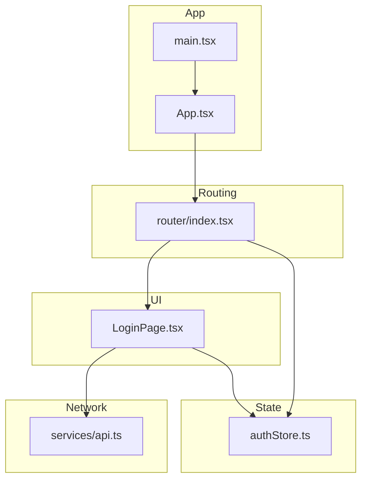
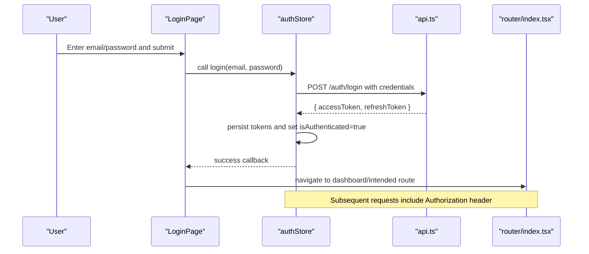
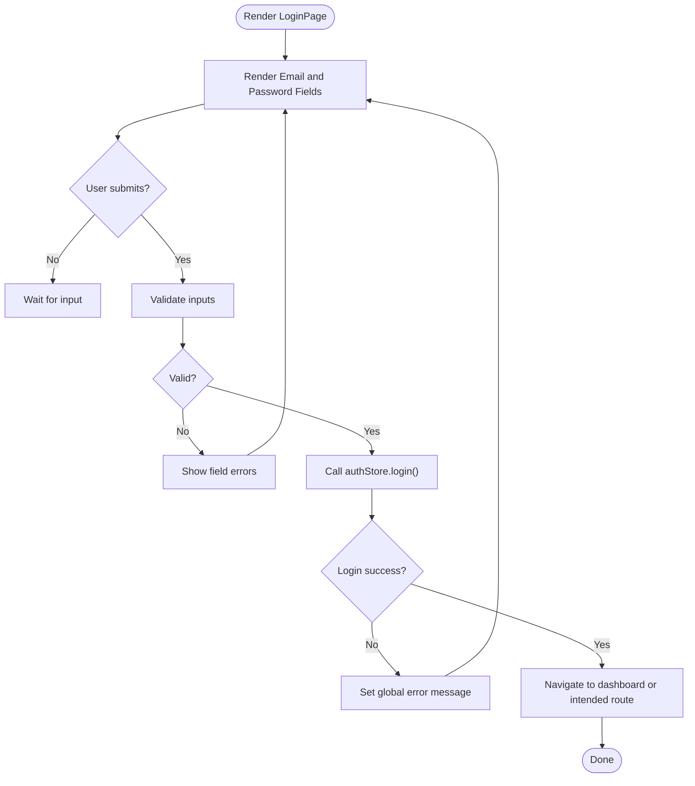
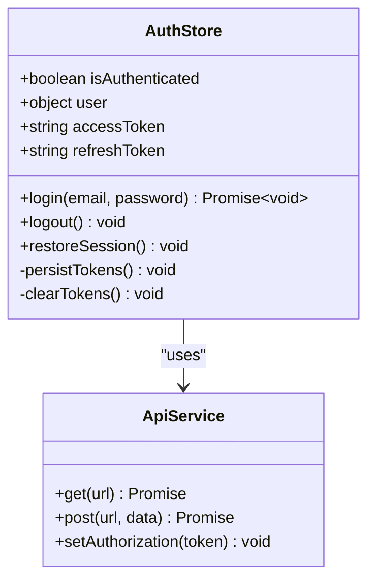
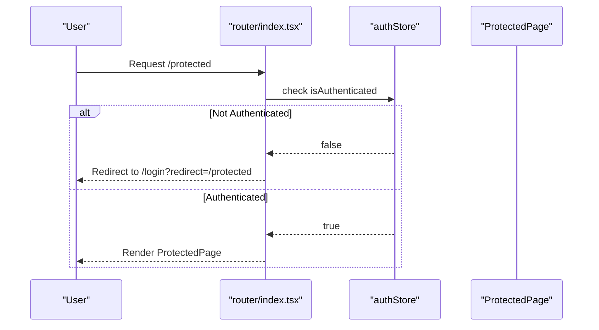
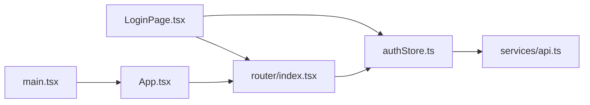

# Authentication Pages

<cite>
**Referenced Files in This Document**
- [LoginPage.tsx](file://src/pages/LoginPage.tsx)
- [authStore.ts](file://src/store/authStore.ts)
- [index.tsx](file://src/router/index.tsx)
- [api.ts](file://src/services/api.ts)
- [App.tsx](file://src/App.tsx)
- [main.tsx](file://src/main.tsx)
</cite>

## Table of Contents
1. [Introduction](#introduction)
2. [Project Structure](#project-structure)
3. [Core Components](#core-components)
4. [Architecture Overview](#architecture-overview)
5. [Detailed Component Analysis](#detailed-component-analysis)
6. [Dependency Analysis](#dependency-analysis)
7. [Performance Considerations](#performance-considerations)
8. [Troubleshooting Guide](#troubleshooting-guide)
9. [Conclusion](#conclusion)
10. [Appendices](#appendices)

## Introduction
This document explains the authentication system and login functionality for the application. It covers the LoginPage component implementation, form handling, validation, and error states; the authentication flow with the authStore including session management, token handling, and logout; and protected route behavior based on authentication state. It also provides guidance for extending the system with features like password reset or multi-factor authentication.

## Project Structure
The authentication-related code is organized into:
- A login page component that handles user input and triggers authentication
- A global store managing authentication state and side effects
- A router that enforces access control via protected routes
- An API service layer for network requests
- Application entry points that wire routing and providers

**Diagram sources**
- [LoginPage.tsx](file://src/pages/LoginPage.tsx)
- [authStore.ts](file://src/store/authStore.ts)
- [index.tsx](file://src/router/index.tsx)
- [api.ts](file://src/services/api.ts)
- [App.tsx](file://src/App.tsx)
- [main.tsx](file://src/main.tsx)

**Section sources**
- [LoginPage.tsx](file://src/pages/LoginPage.tsx)
- [authStore.ts](file://src/store/authStore.ts)
- [index.tsx](file://src/router/index.tsx)
- [api.ts](file://src/services/api.ts)
- [App.tsx](file://src/App.tsx)
- [main.tsx](file://src/main.tsx)

## Core Components
- LoginPage: Renders a login form, manages local state for inputs and errors, validates inputs, and calls the authentication action from the store. On success, it navigates to the dashboard or intended destination.
- authStore: Centralized state for authentication (e.g., isAuthenticated, user, token), actions to log in, log out, and persist tokens across sessions.
- Protected Routes: Router-level guards that redirect unauthenticated users to the login page and allow authenticated users to proceed.

Key responsibilities:
- Form handling and validation in LoginPage
- Token storage and session lifecycle in authStore
- Route protection and redirection logic in the router

**Section sources**
- [LoginPage.tsx](file://src/pages/LoginPage.tsx)
- [authStore.ts](file://src/store/authStore.ts)
- [index.tsx](file://src/router/index.tsx)

## Architecture Overview
The authentication architecture follows a clear separation of concerns:
- UI layer (LoginPage) collects credentials and displays feedback
- State layer (authStore) encapsulates authentication state and persistence
- Network layer (api.ts) abstracts HTTP calls to the backend
- Routing layer (router/index.tsx) enforces access control using authStore state

**Diagram sources**
- [LoginPage.tsx](file://src/pages/LoginPage.tsx)
- [authStore.ts](file://src/store/authStore.ts)
- [api.ts](file://src/services/api.ts)
- [index.tsx](file://src/router/index.tsx)

## Detailed Component Analysis

### LoginPage Component
Responsibilities:
- Render email and password fields
- Validate inputs locally before submission
- Display inline errors and global messages
- Trigger authentication via authStore
- Navigate upon successful login

Form Handling and Validation:
- Controlled inputs for email and password
- Basic validation rules (e.g., required fields, email format)
- Error state per field and overall submission status

Authentication Flow:
- On submit, call the store’s login action
- Handle success by navigating to the target route
- Handle failure by setting error messages and keeping the user on the login page

Error States:
- Field-level errors (invalid email, empty password)
- Network or server errors (invalid credentials, rate limiting)
- Clear errors on focus or re-submission

Navigation:
- Redirect to dashboard or previously requested protected route after login

**Section sources**
- [LoginPage.tsx](file://src/pages/LoginPage.tsx)

#### LoginPage Flowchart

**Diagram sources**
- [LoginPage.tsx](file://src/pages/LoginPage.tsx)

### Authentication Store (authStore)
Responsibilities:
- Maintain authentication state (isAuthenticated, user, tokens)
- Provide login/logout actions
- Persist tokens securely (e.g., localStorage/sessionStorage)
- Attach tokens to outgoing requests via api.ts interceptors or helpers

Session Management:
- On login, store tokens and mark user as authenticated
- On app load, restore session from storage if available
- On logout, clear tokens and reset state

Token Handling:
- Access token included in Authorization headers for API calls
- Refresh token used to obtain new access tokens when expired (optional extension)

Logout Functionality:
- Clears stored tokens and resets authentication state
- Optionally calls a backend endpoint to invalidate sessions

**Section sources**
- [authStore.ts](file://src/store/authStore.ts)
- [api.ts](file://src/services/api.ts)

#### Auth Store Class Diagram

**Diagram sources**
- [authStore.ts](file://src/store/authStore.ts)
- [api.ts](file://src/services/api.ts)

### Protected Routes
Behavior:
- Guard routes by checking authStore.isAuthenticated
- Redirect unauthenticated users to LoginPage
- Allow authenticated users to proceed to protected pages
- Preserve intended destination and redirect back after login

Implementation Notes:
- Use a wrapper component or route guard function
- Integrate with the router configuration to apply guards consistently

**Section sources**
- [index.tsx](file://src/router/index.tsx)

#### Route Protection Sequence

**Diagram sources**
- [index.tsx](file://src/router/index.tsx)
- [authStore.ts](file://src/store/authStore.ts)

### API Service Integration
Responsibilities:
- Centralize HTTP requests
- Attach Authorization header with access token
- Handle common error responses (e.g., 401 Unauthorized)
- Optionally implement token refresh logic

Integration Points:
- Called by authStore during login and token refresh
- Used by protected components for authenticated API calls

**Section sources**
- [api.ts](file://src/services/api.ts)

## Dependency Analysis
The authentication system has clear dependencies:
- LoginPage depends on authStore for state and actions, and on the router for navigation
- authStore depends on api.ts for network operations and on storage APIs for persistence
- Router depends on authStore to enforce access control

**Diagram sources**
- [LoginPage.tsx](file://src/pages/LoginPage.tsx)
- [authStore.ts](file://src/store/authStore.ts)
- [index.tsx](file://src/router/index.tsx)
- [api.ts](file://src/services/api.ts)
- [App.tsx](file://src/App.tsx)
- [main.tsx](file://src/main.tsx)

**Section sources**
- [LoginPage.tsx](file://src/pages/LoginPage.tsx)
- [authStore.ts](file://src/store/authStore.ts)
- [index.tsx](file://src/router/index.tsx)
- [api.ts](file://src/services/api.ts)
- [App.tsx](file://src/App.tsx)
- [main.tsx](file://src/main.tsx)

## Performance Considerations
- Debounce or throttle login attempts to prevent excessive API calls
- Avoid unnecessary re-renders by memoizing selectors or splitting store slices
- Use efficient token storage and avoid heavy serialization
- Implement optimistic UI updates where appropriate, with rollback on failure

[No sources needed since this section provides general guidance]

## Troubleshooting Guide
Common issues and resolutions:
- Invalid credentials: Ensure correct email/password and handle 401 responses gracefully
- Token not attached: Verify Authorization header setup in api.ts and token persistence in authStore
- Redirect loops: Confirm intended destination handling and proper navigation after login
- Session not restored: Check storage read/write logic and app initialization order

Debugging tips:
- Log store state changes around login/logout
- Inspect network requests for missing or malformed headers
- Validate router guards and redirect conditions

**Section sources**
- [authStore.ts](file://src/store/authStore.ts)
- [api.ts](file://src/services/api.ts)
- [index.tsx](file://src/router/index.tsx)

## Conclusion
The authentication system separates UI, state, networking, and routing concerns for clarity and maintainability. LoginPage handles user input and feedback, authStore centralizes session and token management, and the router enforces access control. Extending the system with password reset or multi-factor authentication can be achieved by adding flows in LoginPage and corresponding actions in authStore while preserving the existing patterns.

[No sources needed since this section summarizes without analyzing specific files]

## Appendices

### Extending Authentication Features

- Password Reset Flow
  - Add a “Forgot Password” link on LoginPage
  - Create a request to send a reset email via api.ts
  - Update authStore to manage reset state and confirmation steps
  - After reset, guide users back to login

- Multi-Factor Authentication (MFA)
  - Extend login to support second factor (e.g., OTP)
  - Add MFA verification step in LoginPage after initial credential validation
  - Update authStore to handle MFA tokens and session establishment
  - Protect sensitive routes requiring verified MFA status

[No sources needed since this section provides conceptual guidance]