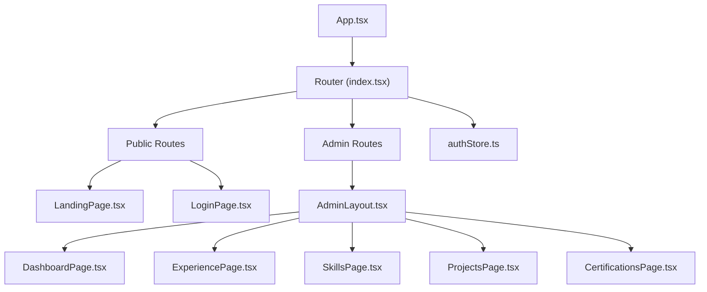
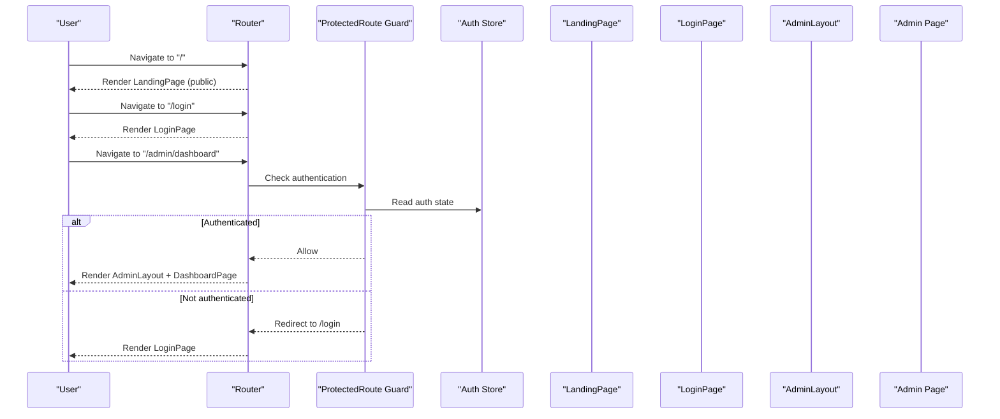
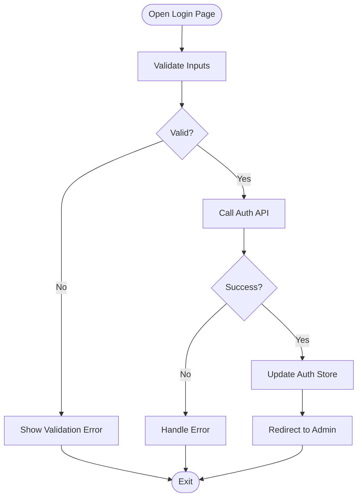
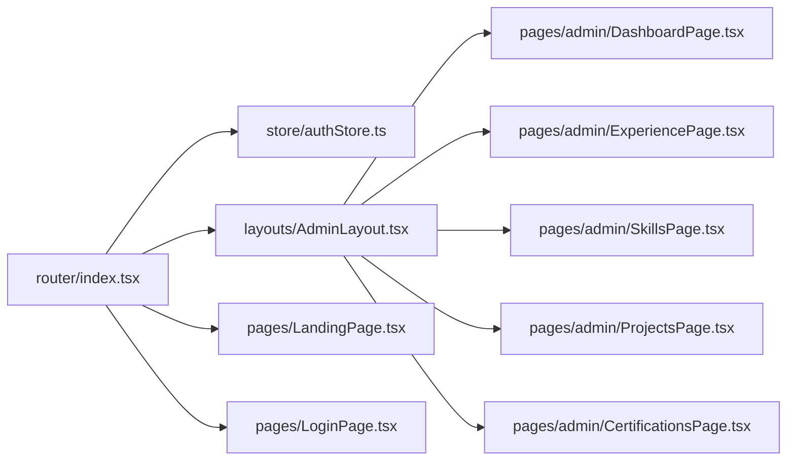

# Pages and Routing

<cite>
**Referenced Files in This Document**
- [src/router/index.tsx](file://src/router/index.tsx)
- [src/pages/LandingPage.tsx](file://src/pages/LandingPage.tsx)
- [src/pages/LoginPage.tsx](file://src/pages/LoginPage.tsx)
- [src/layouts/AdminLayout.tsx](file://src/layouts/AdminLayout.tsx)
- [src/pages/admin/DashboardPage.tsx](file://src/pages/admin/DashboardPage.tsx)
- [src/pages/admin/ExperiencePage.tsx](file://src/pages/admin/ExperiencePage.tsx)
- [src/pages/admin/SkillsPage.tsx](file://src/pages/admin/SkillsPage.tsx)
- [src/pages/admin/ProjectsPage.tsx](file://src/pages/admin/ProjectsPage.tsx)
- [src/pages/admin/CertificationsPage.tsx](file://src/pages/admin/CertificationsPage.tsx)
- [src/store/authStore.ts](file://src/store/authStore.ts)
- [src/App.tsx](file://src/App.tsx)
</cite>

## Table of Contents
1. [Introduction](#introduction)
2. [Project Structure](#project-structure)
3. [Core Components](#core-components)
4. [Architecture Overview](#architecture-overview)
5. [Detailed Component Analysis](#detailed-component-analysis)
6. [Dependency Analysis](#dependency-analysis)
7. [Performance Considerations](#performance-considerations)
8. [Troubleshooting Guide](#troubleshooting-guide)
9. [Conclusion](#conclusion)
10. [Appendices](#appendices)

## Introduction
This document explains the application’s page structure and routing system. It covers the public-facing LandingPage composition, the authentication flow for LoginPage, protected route implementation, administrative dashboard pages, and the AdminLayout component. It also documents router configuration, route guards, navigation patterns, and provides examples for adding new pages and implementing protected routes.

## Project Structure
The routing and pages are organized under src/router and src/pages, with admin-specific pages under src/pages/admin and shared layout logic under src/layouts. Authentication state is managed via a store module.

**Diagram sources**
- [src/App.tsx](file://src/App.tsx)
- [src/router/index.tsx](file://src/router/index.tsx)
- [src/pages/LandingPage.tsx](file://src/pages/LandingPage.tsx)
- [src/pages/LoginPage.tsx](file://src/pages/LoginPage.tsx)
- [src/layouts/AdminLayout.tsx](file://src/layouts/AdminLayout.tsx)
- [src/pages/admin/DashboardPage.tsx](file://src/pages/admin/DashboardPage.tsx)
- [src/pages/admin/ExperiencePage.tsx](file://src/pages/admin/ExperiencePage.tsx)
- [src/pages/admin/SkillsPage.tsx](file://src/pages/admin/SkillsPage.tsx)
- [src/pages/admin/ProjectsPage.tsx](file://src/pages/admin/ProjectsPage.tsx)
- [src/pages/admin/CertificationsPage.tsx](file://src/pages/admin/CertificationsPage.tsx)
- [src/store/authStore.ts](file://src/store/authStore.ts)

**Section sources**
- [src/App.tsx](file://src/App.tsx)
- [src/router/index.tsx](file://src/router/index.tsx)

## Core Components
- Router configuration centralizes all routes, including public and admin sections, and integrates authentication guards.
- LandingPage composes multiple resume sections for public display.
- LoginPage handles user authentication and redirects after successful login.
- AdminLayout provides consistent admin interface chrome (sidebar, header, content area).
- Administrative pages implement CRUD-like views for resume data entities.

Key responsibilities:
- Route definitions and path conventions
- Protected route guard logic
- State synchronization between auth store and UI
- Consistent admin shell rendering

**Section sources**
- [src/router/index.tsx](file://src/router/index.tsx)
- [src/pages/LandingPage.tsx](file://src/pages/LandingPage.tsx)
- [src/pages/LoginPage.tsx](file://src/pages/LoginPage.tsx)
- [src/layouts/AdminLayout.tsx](file://src/layouts/AdminLayout.tsx)
- [src/store/authStore.ts](file://src/store/authStore.ts)

## Architecture Overview
The application uses a client-side router to manage navigation. Public routes render LandingPage and LoginPage without restrictions. Admin routes are wrapped by a protected route guard that checks authentication state before rendering AdminLayout and its child pages.

**Diagram sources**
- [src/router/index.tsx](file://src/router/index.tsx)
- [src/pages/LandingPage.tsx](file://src/pages/LandingPage.tsx)
- [src/pages/LoginPage.tsx](file://src/pages/LoginPage.tsx)
- [src/layouts/AdminLayout.tsx](file://src/layouts/AdminLayout.tsx)
- [src/store/authStore.ts](file://src/store/authStore.ts)

## Detailed Component Analysis

### Router Configuration and Route Guards
- Centralized route map defines public and admin paths.
- Protected route wrapper enforces authentication checks against the auth store.
- Navigation utilities provide programmatic routing and redirection.

Implementation highlights:
- Define routes for public and admin sections.
- Wrap admin routes with a guard that reads auth state and redirects unauthenticated users.
- Use lazy loading where appropriate to improve initial load performance.

**Section sources**
- [src/router/index.tsx](file://src/router/index.tsx)
- [src/store/authStore.ts](file://src/store/authStore.ts)

### LandingPage
- Composes multiple resume sections to present public-facing content.
- Integrates navigation elements and section anchors if applicable.
- Renders hero, about, experience, skills, projects, certifications, education, knowledge, and organization sections.

Behavioral notes:
- Sections are composed declaratively.
- Data may be sourced from local modules or APIs.
- Accessibility and SEO considerations apply to headings and meta information.

**Section sources**
- [src/pages/LandingPage.tsx](file://src/pages/LandingPage.tsx)

### LoginPage and Authentication Flow
- Handles user credentials submission and calls authentication service.
- Updates auth store on success and navigates to intended destination or default admin route.
- Displays error messages for invalid credentials or network failures.

Flow overview:
- User submits form -> validate inputs -> call API -> update store -> redirect.

**Diagram sources**
- [src/pages/LoginPage.tsx](file://src/pages/LoginPage.tsx)
- [src/store/authStore.ts](file://src/store/authStore.ts)

**Section sources**
- [src/pages/LoginPage.tsx](file://src/pages/LoginPage.tsx)
- [src/store/authStore.ts](file://src/store/authStore.ts)

### AdminLayout
- Provides consistent admin shell: sidebar navigation, top bar, breadcrumbs, and main content area.
- Manages responsive behavior and active route highlighting.
- Wraps all admin pages to ensure uniform UX.

Responsibilities:
- Render navigation links for admin pages.
- Maintain collapsed/expanded states for sidebar.
- Provide outlet for child admin routes.

**Section sources**
- [src/layouts/AdminLayout.tsx](file://src/layouts/AdminLayout.tsx)

### Administrative Dashboard Pages
Each admin page focuses on a specific domain of resume data:

- DashboardPage
  - High-level metrics and quick actions.
  - Links to other admin pages.
- ExperiencePage
  - List, create, edit, delete experiences.
  - Search and filter capabilities.
- SkillsPage
  - Manage skill entries and proficiency levels.
- ProjectsPage
  - CRUD for project records with metadata.
- CertificationsPage
  - Manage certification entries and validity dates.

Common patterns:
- Data fetching hooks or services.
- Form handling for create/edit operations.
- Confirmation dialogs for destructive actions.
- Pagination and search where applicable.

**Section sources**
- [src/pages/admin/DashboardPage.tsx](file://src/pages/admin/DashboardPage.tsx)
- [src/pages/admin/ExperiencePage.tsx](file://src/pages/admin/ExperiencePage.tsx)
- [src/pages/admin/SkillsPage.tsx](file://src/pages/admin/SkillsPage.tsx)
- [src/pages/admin/ProjectsPage.tsx](file://src/pages/admin/ProjectsPage.tsx)
- [src/pages/admin/CertificationsPage.tsx](file://src/pages/admin/CertificationsPage.tsx)

### Adding a New Admin Page
Steps:
1. Create a new page component under src/pages/admin.
2. Add a route entry in the router configuration under the admin section.
3. Ensure the route is wrapped by the protected route guard.
4. Add a navigation link in AdminLayout to expose the page.
5. Implement data fetching and forms as needed.

Example outline:
- New file: src/pages/admin/NewFeaturePage.tsx
- Router entry: /admin/new-feature
- Link in AdminLayout sidebar
- Protected by auth guard

**Section sources**
- [src/router/index.tsx](file://src/router/index.tsx)
- [src/layouts/AdminLayout.tsx](file://src/layouts/AdminLayout.tsx)

### Implementing a Protected Route
Pattern:
- Wrap admin routes with a guard that checks auth state.
- Redirect unauthenticated users to /login with optional return URL.
- On successful authentication, restore navigation target.

Considerations:
- Avoid infinite redirect loops.
- Preserve intended destination safely.
- Debounce frequent auth state changes if necessary.

**Section sources**
- [src/router/index.tsx](file://src/router/index.tsx)
- [src/store/authStore.ts](file://src/store/authStore.ts)

## Dependency Analysis
- Router depends on auth store for guard logic.
- AdminLayout depends on router for active link highlighting and navigation.
- Admin pages depend on data services and stores for state management.
- LandingPage depends on section components and data modules.

**Diagram sources**
- [src/router/index.tsx](file://src/router/index.tsx)
- [src/store/authStore.ts](file://src/store/authStore.ts)
- [src/layouts/AdminLayout.tsx](file://src/layouts/AdminLayout.tsx)
- [src/pages/LandingPage.tsx](file://src/pages/LandingPage.tsx)
- [src/pages/LoginPage.tsx](file://src/pages/LoginPage.tsx)
- [src/pages/admin/DashboardPage.tsx](file://src/pages/admin/DashboardPage.tsx)
- [src/pages/admin/ExperiencePage.tsx](file://src/pages/admin/ExperiencePage.tsx)
- [src/pages/admin/SkillsPage.tsx](file://src/pages/admin/SkillsPage.tsx)
- [src/pages/admin/ProjectsPage.tsx](file://src/pages/admin/ProjectsPage.tsx)
- [src/pages/admin/CertificationsPage.tsx](file://src/pages/admin/CertificationsPage.tsx)

**Section sources**
- [src/router/index.tsx](file://src/router/index.tsx)
- [src/store/authStore.ts](file://src/store/authStore.ts)
- [src/layouts/AdminLayout.tsx](file://src/layouts/AdminLayout.tsx)

## Performance Considerations
- Use route-based code splitting to reduce initial bundle size.
- Lazy-load admin pages and heavy sections.
- Memoize expensive computations within sections.
- Cache API responses where appropriate.
- Optimize images and assets used in LandingPage sections.

[No sources needed since this section provides general guidance]

## Troubleshooting Guide
Common issues and resolutions:
- Infinite redirect loop on protected routes: ensure guard checks auth state correctly and sets return URL safely.
- Auth state not updating: verify store updates and re-renders propagate to guarded routes.
- Missing navigation links: confirm AdminLayout includes updated route entries.
- 404 errors on new pages: check route registration and casing consistency.

Debugging tips:
- Log route transitions and guard decisions.
- Inspect auth store state during login flows.
- Verify environment variables for API endpoints.

**Section sources**
- [src/router/index.tsx](file://src/router/index.tsx)
- [src/store/authStore.ts](file://src/store/authStore.ts)

## Conclusion
The routing architecture cleanly separates public and admin areas, enforces authentication through guards, and provides a consistent admin interface via AdminLayout. LandingPage composes resume sections for public consumption, while LoginPage orchestrates authentication and redirection. Following the outlined patterns ensures maintainability and scalability as new pages and features are added.

[No sources needed since this section summarizes without analyzing specific files]

## Appendices

### Example: Adding a New Protected Admin Page
- Create page: src/pages/admin/NewPage.tsx
- Register route: add /admin/new-page under admin routes
- Wrap with protected route guard
- Add link in AdminLayout sidebar
- Implement data fetching and forms

**Section sources**
- [src/router/index.tsx](file://src/router/index.tsx)
- [src/layouts/AdminLayout.tsx](file://src/layouts/AdminLayout.tsx)