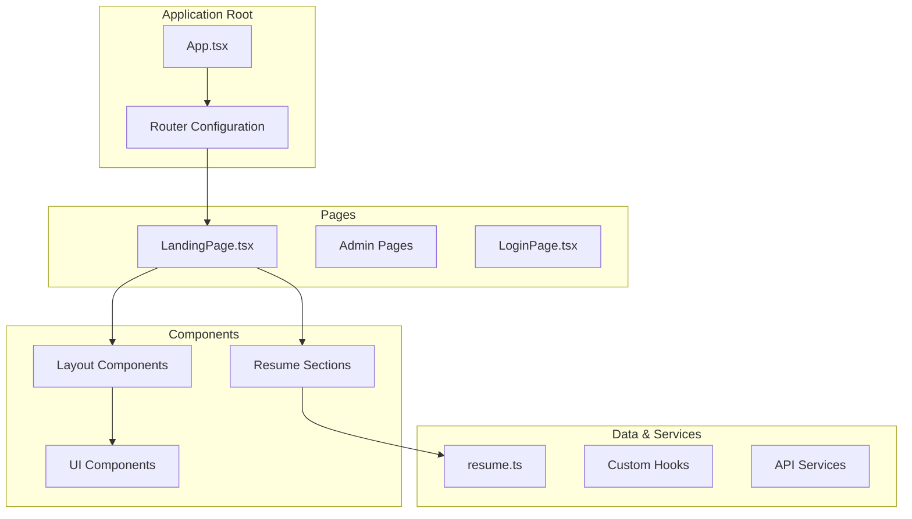
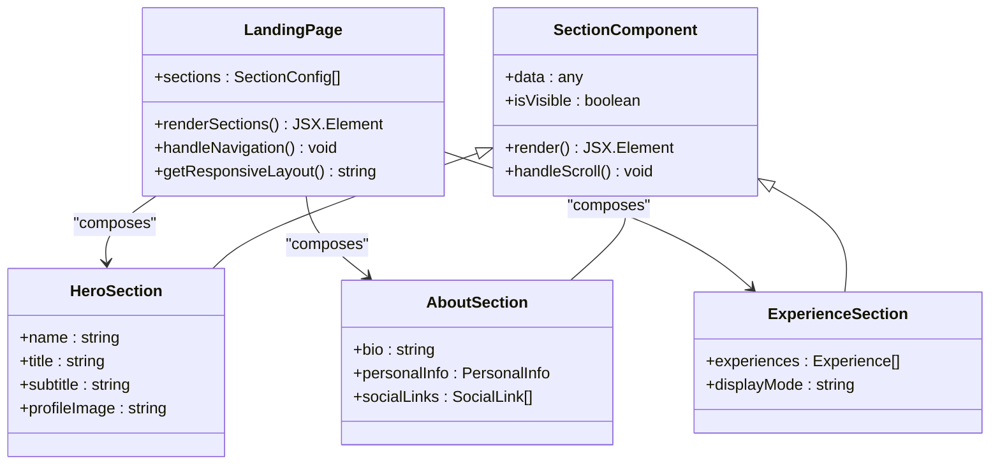
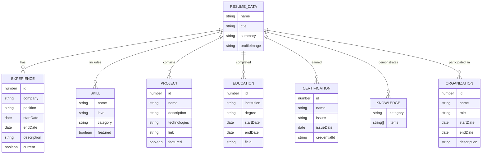
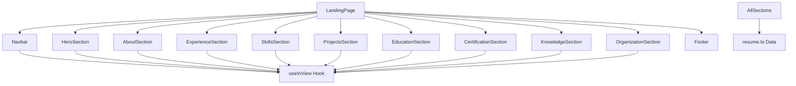
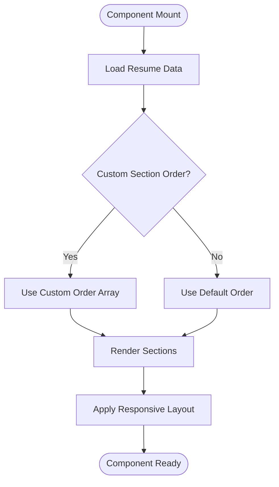
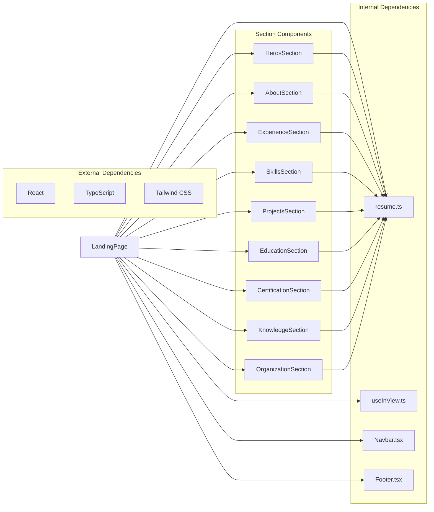

# Public Pages

<cite>
**Referenced Files in This Document**
- [LandingPage.tsx](file://src/pages/LandingPage.tsx)
- [HeroSection.tsx](file://src/components/sections/HeroSection.tsx)
- [AboutSection.tsx](file://src/components/sections/AboutSection.tsx)
- [ExperienceSection.tsx](file://src/components/sections/ExperienceSection.tsx)
- [SkillsSection.tsx](file://src/components/sections/SkillsSection.tsx)
- [ProjectsSection.tsx](file://src/components/sections/ProjectsSection.tsx)
- [EducationSection.tsx](file://src/components/sections/EducationSection.tsx)
- [CertificationSection.tsx](file://src/components/sections/CertificationSection.tsx)
- [KnowledgeSection.tsx](file://src/components/sections/KnowledgeSection.tsx)
- [OrganizationSection.tsx](file://src/components/sections/OrganizationSection.tsx)
- [Navbar.tsx](file://src/components/Navbar.tsx)
- [Footer.tsx](file://src/components/Footer.tsx)
- [resume.ts](file://src/data/resume.ts)
- [useInView.ts](file://src/hooks/useInView.ts)
- [App.tsx](file://src/App.tsx)
- [index.tsx](file://src/router/index.tsx)
</cite>

## Table of Contents
1. [Introduction](#introduction)
2. [Project Structure](#project-structure)
3. [Core Components](#core-components)
4. [Architecture Overview](#architecture-overview)
5. [Detailed Component Analysis](#detailed-component-analysis)
6. [Dependency Analysis](#dependency-analysis)
7. [Performance Considerations](#performance-considerations)
8. [Troubleshooting Guide](#troubleshooting-guide)
9. [Conclusion](#conclusion)
10. [Appendices](#appendices)

## Introduction

The resume portfolio application is a modern React-based web application designed to showcase professional experience, skills, and achievements through an interactive and responsive interface. The LandingPage component serves as the primary entry point for visitors, providing a comprehensive overview of the resume content through well-organized sections.

This documentation focuses on the public-facing pages, particularly the LandingPage component that orchestrates all resume sections including Hero, About, Experience, Skills, Projects, Education, Certifications, Knowledge, and Organization sections. The application follows modern React patterns with TypeScript support, component composition, and responsive design principles.

## Project Structure

The application follows a modular architecture with clear separation of concerns:



**Diagram sources**
- [App.tsx](file://src/App.tsx)
- [LandingPage.tsx](file://src/pages/LandingPage.tsx)
- [resume.ts](file://src/data/resume.ts)

The landing page composes multiple section components to create a cohesive resume presentation. Each section component handles its specific domain while maintaining consistent styling and behavior.

**Section sources**
- [App.tsx](file://src/App.tsx)
- [LandingPage.tsx](file://src/pages/LandingPage.tsx)

## Core Components

### LandingPage Component Architecture

The LandingPage component acts as the main orchestrator for displaying resume content. It manages the composition of all resume sections and handles navigation integration.

#### Section Composition Pattern

The landing page uses a declarative approach to compose sections:



**Diagram sources**
- [LandingPage.tsx](file://src/pages/LandingPage.tsx)
- [HeroSection.tsx](file://src/components/sections/HeroSection.tsx)
- [AboutSection.tsx](file://src/components/sections/AboutSection.tsx)
- [ExperienceSection.tsx](file://src/components/sections/ExperienceSection.tsx)

### Data Management

The application uses a centralized data management approach through the `resume.ts` file, which contains all resume-related data structures and configurations.

#### Resume Data Structure



**Diagram sources**
- [resume.ts](file://src/data/resume.ts)

**Section sources**
- [resume.ts](file://src/data/resume.ts)

## Architecture Overview

The landing page architecture follows a component composition pattern with clear separation between data, presentation, and interaction logic.

### Component Hierarchy



**Diagram sources**
- [LandingPage.tsx](file://src/pages/LandingPage.tsx)
- [Navbar.tsx](file://src/components/Navbar.tsx)
- [useInView.ts](file://src/hooks/useInView.ts)
- [resume.ts](file://src/data/resume.ts)

### Navigation Integration

The landing page integrates seamlessly with the application's navigation system through the Navbar component, which provides smooth scrolling to different sections and maintains active state based on scroll position.

**Section sources**
- [LandingPage.tsx](file://src/pages/LandingPage.tsx)
- [Navbar.tsx](file://src/components/Navbar.tsx)

## Detailed Component Analysis

### LandingPage Component

The LandingPage component serves as the main container that orchestrates all resume sections. It manages section visibility, responsive layout, and navigation integration.

#### Key Responsibilities

- **Section Composition**: Imports and renders all resume section components
- **Data Management**: Consumes resume data from the centralized data source
- **Responsive Design**: Adapts layout based on screen size
- **Navigation Integration**: Works with Navbar for smooth scrolling
- **SEO Optimization**: Implements proper meta tags and semantic HTML

#### Section Order Configuration

The landing page allows customization of section order through a configuration array:



**Diagram sources**
- [LandingPage.tsx](file://src/pages/LandingPage.tsx)

### Section Components

Each section component follows a consistent pattern for data consumption, rendering, and interactivity.

#### HeroSection Component

The HeroSection displays the user's introduction, profile image, and key information. It serves as the visual anchor for the landing page.

#### AboutSection Component

The AboutSection presents biographical information, personal details, and social media links in a structured format.

#### ExperienceSection Component

The ExperienceSection showcases professional work history with detailed descriptions, dates, and company information.

#### SkillsSection Component

The SkillsSection organizes technical and soft skills into categories with proficiency indicators.

#### ProjectsSection Component

The ProjectsSection highlights notable projects with descriptions, technologies used, and external links.

#### EducationSection Component

The EducationSection displays academic background including degrees, institutions, and graduation dates.

#### CertificationSection Component

The CertificationSection lists professional certifications with issuing organizations and validity periods.

#### KnowledgeSection Component

The KnowledgeSection categorizes areas of expertise and specialized knowledge domains.

#### OrganizationSection Component

The OrganizationSection documents involvement in professional organizations, associations, or community groups.

**Section sources**
- [HeroSection.tsx](file://src/components/sections/HeroSection.tsx)
- [AboutSection.tsx](file://src/components/sections/AboutSection.tsx)
- [ExperienceSection.tsx](file://src/components/sections/ExperienceSection.tsx)
- [SkillsSection.tsx](file://src/components/sections/SkillsSection.tsx)
- [ProjectsSection.tsx](file://src/components/sections/ProjectsSection.tsx)
- [EducationSection.tsx](file://src/components/sections/EducationSection.tsx)
- [CertificationSection.tsx](file://src/components/sections/CertificationSection.tsx)
- [KnowledgeSection.tsx](file://src/components/sections/KnowledgeSection.tsx)
- [OrganizationSection.tsx](file://src/components/sections/OrganizationSection.tsx)

## Dependency Analysis

The landing page has well-defined dependencies that promote modularity and maintainability.

### Component Dependencies



**Diagram sources**
- [LandingPage.tsx](file://src/pages/LandingPage.tsx)
- [resume.ts](file://src/data/resume.ts)
- [useInView.ts](file://src/hooks/useInView.ts)

### Data Flow

The application follows a unidirectional data flow pattern where data flows from the centralized data source through the landing page to individual section components.

**Section sources**
- [LandingPage.tsx](file://src/pages/LandingPage.tsx)
- [resume.ts](file://src/data/resume.ts)

## Performance Considerations

### Lazy Loading Implementation

The landing page implements lazy loading for section components to improve initial load performance:

- **Component Splitting**: Each section is loaded only when needed
- **Image Optimization**: Profile images and other assets are optimized for web delivery
- **Code Splitting**: Large dependencies are split into separate bundles

### Scroll Performance

- **Intersection Observer**: Uses modern browser APIs for efficient scroll detection
- **Debounced Handlers**: Scroll event handlers are debounced to prevent performance issues
- **Virtual Scrolling**: Large datasets are handled efficiently through virtualization techniques

### Memory Management

- **Cleanup Functions**: Proper cleanup of event listeners and observers
- **State Management**: Efficient state updates to minimize re-renders
- **Component Unmounting**: Proper cleanup when components are removed from the DOM

## Troubleshooting Guide

### Common Issues and Solutions

#### Section Not Displaying

**Problem**: A specific section is not appearing on the landing page.

**Solution**: 
1. Verify the section is imported in the LandingPage component
2. Check if the section is included in the sections array
3. Ensure the section data exists in resume.ts
4. Verify there are no console errors preventing rendering

#### Navigation Not Working

**Problem**: Clicking navigation links doesn't scroll to the correct section.

**Solution**:
1. Check that each section has a unique ID matching the navigation link
2. Verify the useInView hook is properly implemented
3. Ensure smooth scrolling is enabled in the CSS
4. Test browser compatibility for smooth scrolling API

#### Responsive Design Issues

**Problem**: Sections don't display correctly on mobile devices.

**Solution**:
1. Review Tailwind CSS breakpoints and classes
2. Check for fixed positioning that might cause overflow
3. Verify flexbox/grid layouts adapt to smaller screens
4. Test on actual devices and not just browser resizing

#### Performance Problems

**Problem**: Page loads slowly or scrolls jerkily.

**Solution**:
1. Implement lazy loading for heavy components
2. Optimize images and assets
3. Use memoization for expensive calculations
4. Profile with browser developer tools to identify bottlenecks

## Conclusion

The resume portfolio application's LandingPage component provides a robust foundation for showcasing professional information through a modern, responsive interface. The component composition pattern ensures maintainability and scalability, while the centralized data management promotes consistency across sections.

Key strengths of the implementation include:

- **Modular Architecture**: Clear separation of concerns with dedicated section components
- **Responsive Design**: Mobile-first approach with adaptive layouts
- **Performance Optimization**: Lazy loading and efficient rendering strategies
- **SEO Considerations**: Semantic HTML and proper meta tag implementation
- **Extensibility**: Easy addition of new sections and customization options

The application serves as an excellent template for building professional portfolio websites with modern web development practices.

## Appendices

### Customization Examples

#### Adding a New Section

To add a new section to the landing page:

1. Create a new section component following the existing pattern
2. Import the section in LandingPage.tsx
3. Add the section to the sections array
4. Define the data structure in resume.ts
5. Update navigation if needed

#### Reordering Sections

Modify the sections array in LandingPage.tsx to change the display order:

```typescript
// Example section order configuration
const sections = [
  'hero',
  'about', 
  'experience',
  'skills',
  'projects',
  'education',
  'certifications',
  'knowledge',
  'organization'
];
```

#### Styling Customization

All sections use Tailwind CSS classes for consistent styling. Modify the global styles in index.css or component-specific styles to customize appearance.

**Section sources**
- [LandingPage.tsx](file://src/pages/LandingPage.tsx)
- [resume.ts](file://src/data/resume.ts)
- [index.css](file://src/index.css)