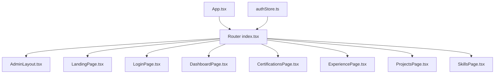
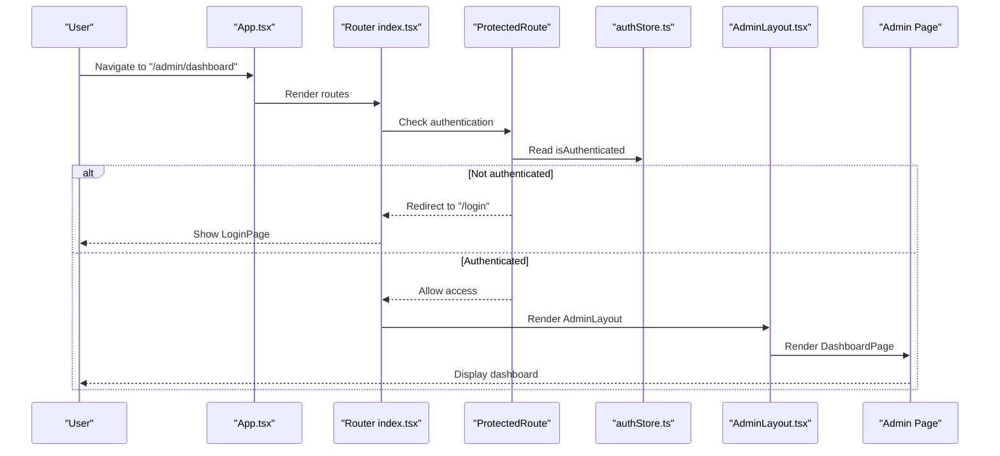
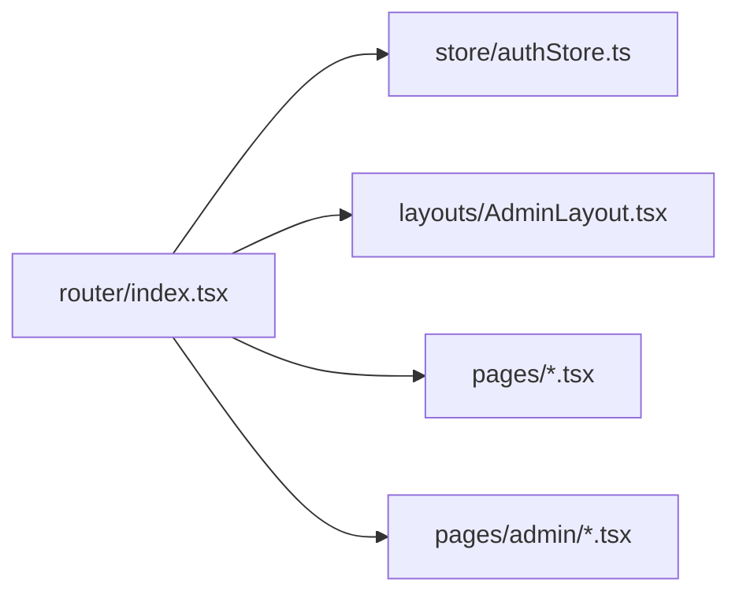

# Routing Configuration

<cite>
**Referenced Files in This Document**
- [src/router/index.tsx](file://src/router/index.tsx)
- [src/layouts/AdminLayout.tsx](file://src/layouts/AdminLayout.tsx)
- [src/pages/admin/DashboardPage.tsx](file://src/pages/admin/DashboardPage.tsx)
- [src/pages/admin/CertificationsPage.tsx](file://src/pages/admin/CertificationsPage.tsx)
- [src/pages/admin/ExperiencePage.tsx](file://src/pages/admin/ExperiencePage.tsx)
- [src/pages/admin/ProjectsPage.tsx](file://src/pages/admin/ProjectsPage.tsx)
- [src/pages/admin/SkillsPage.tsx](file://src/pages/admin/SkillsPage.tsx)
- [src/pages/LandingPage.tsx](file://src/pages/LandingPage.tsx)
- [src/pages/LoginPage.tsx](file://src/pages/LoginPage.tsx)
- [src/store/authStore.ts](file://src/store/authStore.ts)
- [src/App.tsx](file://src/App.tsx)
- [src/main.tsx](file://src/main.tsx)
</cite>

## Table of Contents
1. [Introduction](#introduction)
2. [Project Structure](#project-structure)
3. [Core Components](#core-components)
4. [Architecture Overview](#architecture-overview)
5. [Detailed Component Analysis](#detailed-component-analysis)
6. [Dependency Analysis](#dependency-analysis)
7. [Performance Considerations](#performance-considerations)
8. [Troubleshooting Guide](#troubleshooting-guide)
9. [Conclusion](#conclusion)
10. [Appendices](#appendices)

## Introduction
This document explains the complete routing system configuration and implementation for the application, focusing on React Router usage, route definitions, nested routes, dynamic patterns, protected routes with authentication-based access control, and performance optimization techniques such as lazy loading and code splitting. It also provides practical guidance for adding new routes, implementing route parameters and query strings, and performing programmatic navigation.

## Project Structure
The routing-related files are organized under dedicated directories:
- Route definitions live in src/router/index.tsx
- Admin layout is implemented in src/layouts/AdminLayout.tsx
- Public pages reside in src/pages (e.g., LandingPage, LoginPage)
- Admin pages reside in src/pages/admin (e.g., Dashboard, Certifications, Experience, Projects, Skills)
- Authentication state is managed in src/store/authStore.ts
- Application bootstrap wires everything together in src/App.tsx and src/main.tsx

**Diagram sources**
- [src/App.tsx](file://src/App.tsx)
- [src/router/index.tsx](file://src/router/index.tsx)
- [src/layouts/AdminLayout.tsx](file://src/layouts/AdminLayout.tsx)
- [src/pages/LandingPage.tsx](file://src/pages/LandingPage.tsx)
- [src/pages/LoginPage.tsx](file://src/pages/LoginPage.tsx)
- [src/pages/admin/DashboardPage.tsx](file://src/pages/admin/DashboardPage.tsx)
- [src/pages/admin/CertificationsPage.tsx](file://src/pages/admin/CertificationsPage.tsx)
- [src/pages/admin/ExperiencePage.tsx](file://src/pages/admin/ExperiencePage.tsx)
- [src/pages/admin/ProjectsPage.tsx](file://src/pages/admin/ProjectsPage.tsx)
- [src/pages/admin/SkillsPage.tsx](file://src/pages/admin/SkillsPage.tsx)
- [src/store/authStore.ts](file://src/store/authStore.ts)

**Section sources**
- [src/router/index.tsx](file://src/router/index.tsx)
- [src/layouts/AdminLayout.tsx](file://src/layouts/AdminLayout.tsx)
- [src/pages/LandingPage.tsx](file://src/pages/LandingPage.tsx)
- [src/pages/LoginPage.tsx](file://src/pages/LoginPage.tsx)
- [src/pages/admin/DashboardPage.tsx](file://src/pages/admin/DashboardPage.tsx)
- [src/pages/admin/CertificationsPage.tsx](file://src/pages/admin/CertificationsPage.tsx)
- [src/pages/admin/ExperiencePage.tsx](file://src/pages/admin/ExperiencePage.tsx)
- [src/pages/admin/ProjectsPage.tsx](file://src/pages/admin/ProjectsPage.tsx)
- [src/pages/admin/SkillsPage.tsx](file://src/pages/admin/SkillsPage.tsx)
- [src/store/authStore.ts](file://src/store/authStore.ts)
- [src/App.tsx](file://src/App.tsx)
- [src/main.tsx](file://src/main.tsx)

## Core Components
- Router configuration: Centralized route definitions and guards are defined in the router module.
- AdminLayout: Provides a consistent shell for admin pages, including header, sidebar, and content area.
- Auth store: Holds authentication state used by route guards to protect admin routes.
- Pages: Public and admin page components rendered by their respective routes.

Key responsibilities:
- Define static and nested routes for public and admin sections
- Implement protected routes using authentication state
- Provide reusable layout for admin interface
- Enable programmatic navigation and route parameter handling

**Section sources**
- [src/router/index.tsx](file://src/router/index.tsx)
- [src/layouts/AdminLayout.tsx](file://src/layouts/AdminLayout.tsx)
- [src/store/authStore.ts](file://src/store/authStore.ts)

## Architecture Overview
The routing architecture uses React Router to manage navigation between public and admin areas. Protected routes enforce authentication via an auth store. The AdminLayout component encapsulates shared UI structure for all admin pages.

**Diagram sources**
- [src/App.tsx](file://src/App.tsx)
- [src/router/index.tsx](file://src/router/index.tsx)
- [src/store/authStore.ts](file://src/store/authStore.ts)
- [src/layouts/AdminLayout.tsx](file://src/layouts/AdminLayout.tsx)
- [src/pages/admin/DashboardPage.tsx](file://src/pages/admin/DashboardPage.tsx)
- [src/pages/LoginPage.tsx](file://src/pages/LoginPage.tsx)

## Detailed Component Analysis

### Router Configuration
- Centralizes all route definitions
- Defines public routes (e.g., landing, login)
- Groups admin routes under a protected path
- Uses nested routes to render AdminLayout and child pages
- Supports dynamic segments and query string handling through React Router APIs

Best practices:
- Keep route order from most specific to least specific
- Use lazy loading for heavy admin pages
- Encapsulate authentication checks in a single guard component

**Section sources**
- [src/router/index.tsx](file://src/router/index.tsx)

### AdminLayout Component
- Renders consistent admin shell across all admin pages
- Contains common elements like header, sidebar, and main content area
- Ensures uniform spacing, typography, and responsive behavior
- Can be extended to include breadcrumbs or global notifications

Usage:
- Wrap admin routes with AdminLayout to maintain consistent UI
- Place page-specific content inside the layout’s outlet/content slot

**Section sources**
- [src/layouts/AdminLayout.tsx](file://src/layouts/AdminLayout.tsx)

### Protected Routes and Authentication Guards
- Protects admin routes based on authentication state
- Redirects unauthenticated users to login
- Optionally redirects back to the intended destination after successful login
- Reads authentication state from the centralized auth store

Implementation pattern:
- Create a guard component that checks auth state
- If not authenticated, redirect to login; otherwise, render the target route
- Integrate guard into route definitions for admin paths

**Section sources**
- [src/router/index.tsx](file://src/router/index.tsx)
- [src/store/authStore.ts](file://src/store/authStore.ts)

### Public Pages
- LandingPage: Entry point for non-admin users
- LoginPage: Handles user authentication flow and redirects upon success

These pages are accessible without authentication and typically link to admin routes after login.

**Section sources**
- [src/pages/LandingPage.tsx](file://src/pages/LandingPage.tsx)
- [src/pages/LoginPage.tsx](file://src/pages/LoginPage.tsx)

### Admin Pages
- DashboardPage: Main overview for admin users
- CertificationsPage, ExperiencePage, ProjectsPage, SkillsPage: Feature-specific admin pages

All these pages are rendered within AdminLayout and can use route parameters and query strings as needed.

**Section sources**
- [src/pages/admin/DashboardPage.tsx](file://src/pages/admin/DashboardPage.tsx)
- [src/pages/admin/CertificationsPage.tsx](file://src/pages/admin/CertificationsPage.tsx)
- [src/pages/admin/ExperiencePage.tsx](file://src/pages/admin/ExperiencePage.tsx)
- [src/pages/admin/ProjectsPage.tsx](file://src/pages/admin/ProjectsPage.tsx)
- [src/pages/admin/SkillsPage.tsx](file://src/pages/admin/SkillsPage.tsx)

### Adding New Routes
Steps:
1. Create a new page component under the appropriate folder (public or admin).
2. Add a new route definition in the router module:
   - For public routes, add directly under the root route group.
   - For admin routes, add under the protected admin group so guards apply.
3. If the new route requires parameters, define dynamic segments in the route path.
4. Use React Router hooks to read parameters and query strings in the page component.
5. If the page is heavy, wrap it with lazy loading to enable code splitting.

Examples:
- Dynamic route: /admin/projects/:id
- Query string: /admin/certifications?category=frontend
- Programmatic navigation: navigate("/admin/dashboard")

**Section sources**
- [src/router/index.tsx](file://src/router/index.tsx)
- [src/pages/admin/ProjectsPage.tsx](file://src/pages/admin/ProjectsPage.tsx)
- [src/pages/admin/CertificationsPage.tsx](file://src/pages/admin/CertificationsPage.tsx)

### Route Parameters and Query Strings
- Route parameters: Access via React Router’s useParams hook
- Query strings: Access via React Router’s useSearchParams hook
- Validation: Validate and sanitize inputs before use in API calls or state updates

Common patterns:
- Optional parameters with fallback values
- Search filters using query strings
- Deep linking to specific items with IDs

**Section sources**
- [src/pages/admin/ProjectsPage.tsx](file://src/pages/admin/ProjectsPage.tsx)
- [src/pages/admin/CertificationsPage.tsx](file://src/pages/admin/CertificationsPage.tsx)

### Programmatic Navigation
- Use React Router’s navigate function to programmatically change routes
- Common scenarios: post-login redirection, form submission completion, error handling
- Preserve intended destination by storing and redirecting after authentication

Example flows:
- After successful login, redirect to the originally requested admin route
- On form errors, navigate to an error page with context
- On success, navigate to a confirmation page

**Section sources**
- [src/pages/LoginPage.tsx](file://src/pages/LoginPage.tsx)
- [src/router/index.tsx](file://src/router/index.tsx)

### Performance Optimization: Lazy Loading and Code Splitting
- Use React.lazy and Suspense to load route components on demand
- Benefits: Reduced initial bundle size, faster first paint, improved perceived performance
- Strategy: Lazy-load heavy admin pages while keeping lightweight public pages eager-loaded

Implementation tips:
- Wrap each admin page import with React.lazy
- Provide meaningful fallback UI during loading
- Ensure error boundaries handle lazy-loading failures gracefully

**Section sources**
- [src/router/index.tsx](file://src/router/index.tsx)

## Dependency Analysis
The router depends on:
- Authentication state from the auth store to enforce protected routes
- Layout components to provide consistent UI shells
- Page components for rendering content at each route

**Diagram sources**
- [src/router/index.tsx](file://src/router/index.tsx)
- [src/store/authStore.ts](file://src/store/authStore.ts)
- [src/layouts/AdminLayout.tsx](file://src/layouts/AdminLayout.tsx)
- [src/pages/LandingPage.tsx](file://src/pages/LandingPage.tsx)
- [src/pages/LoginPage.tsx](file://src/pages/LoginPage.tsx)
- [src/pages/admin/DashboardPage.tsx](file://src/pages/admin/DashboardPage.tsx)
- [src/pages/admin/CertificationsPage.tsx](file://src/pages/admin/CertificationsPage.tsx)
- [src/pages/admin/ExperiencePage.tsx](file://src/pages/admin/ExperiencePage.tsx)
- [src/pages/admin/ProjectsPage.tsx](file://src/pages/admin/ProjectsPage.tsx)
- [src/pages/admin/SkillsPage.tsx](file://src/pages/admin/SkillsPage.tsx)

**Section sources**
- [src/router/index.tsx](file://src/router/index.tsx)
- [src/store/authStore.ts](file://src/store/authStore.ts)

## Performance Considerations
- Lazy-load admin pages to reduce initial bundle size
- Use Suspense with clear loading indicators
- Avoid unnecessary re-renders by memoizing route components when appropriate
- Prefer shallow routing where possible to minimize navigation overhead
- Cache frequently accessed data to reduce network requests

[No sources needed since this section provides general guidance]

## Troubleshooting Guide
Common issues and resolutions:
- Unprotected admin routes: Ensure all admin routes are wrapped with the protected route guard
- Redirect loops: Verify authentication checks and redirect logic do not create cycles
- Missing route parameters: Confirm dynamic segments match the expected format and are handled in components
- Query string parsing errors: Validate and sanitize search params before use
- Lazy-loading failures: Wrap lazy imports with error boundaries and provide fallback UI

Checklist:
- All admin routes pass through the guard
- Login redirects preserve intended destination
- Route paths are ordered correctly
- Error boundaries cover lazy-loaded components

**Section sources**
- [src/router/index.tsx](file://src/router/index.tsx)
- [src/store/authStore.ts](file://src/store/authStore.ts)
- [src/pages/LoginPage.tsx](file://src/pages/LoginPage.tsx)

## Conclusion
The routing system is structured around React Router with clear separation between public and admin routes, protected by authentication guards. AdminLayout ensures a consistent admin interface, while lazy loading optimizes performance. Following the guidelines in this document will help you extend routes safely, implement dynamic patterns, and maintain high performance.

[No sources needed since this section summarizes without analyzing specific files]

## Appendices

### Quick Reference: Adding a New Admin Route
- Create page component under src/pages/admin
- Add route under protected admin group in router module
- Wrap with AdminLayout if not already grouped
- Implement lazy loading for heavy components
- Test authentication guard and navigation

**Section sources**
- [src/router/index.tsx](file://src/router/index.tsx)
- [src/layouts/AdminLayout.tsx](file://src/layouts/AdminLayout.tsx)