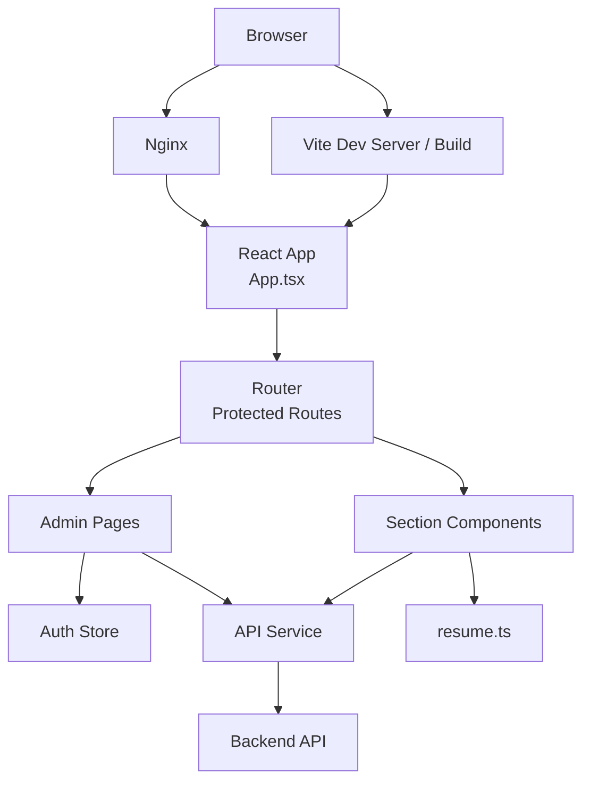
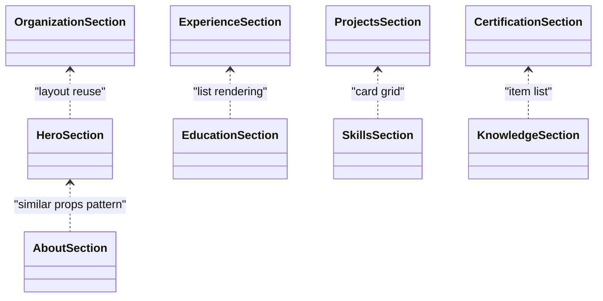
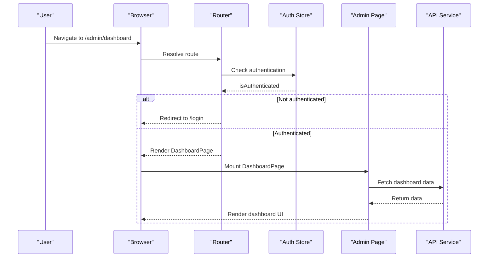
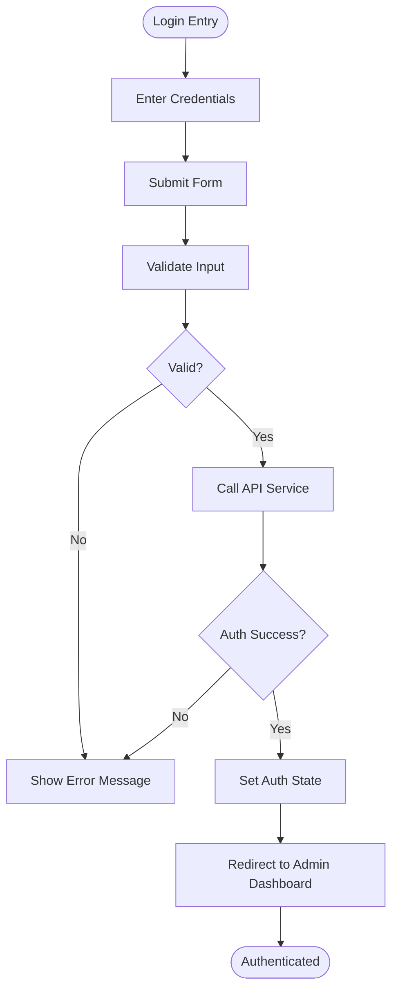
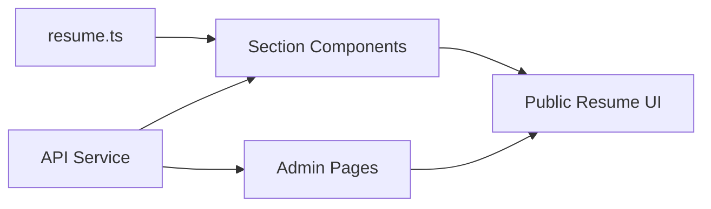
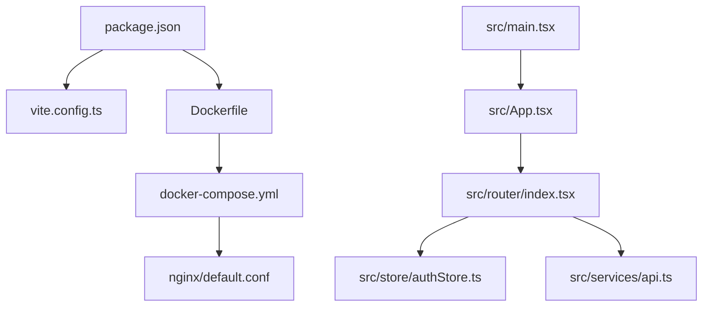

# Project Overview

<cite>
**Referenced Files in This Document**
- [README.md](file://README.md)
- [package.json](file://package.json)
- [Dockerfile](file://Dockerfile)
- [docker-compose.yml](file://docker-compose.yml)
- [vite.config.ts](file://vite.config.ts)
- [index.html](file://index.html)
- [src/main.tsx](file://src/main.tsx)
- [src/App.tsx](file://src/App.tsx)
- [src/router/index.tsx](file://src/router/index.tsx)
- [src/store/authStore.ts](file://src/store/authStore.ts)
- [src/services/api.ts](file://src/services/api.ts)
- [src/layouts/AdminLayout.tsx](file://src/layouts/AdminLayout.tsx)
- [src/pages/LandingPage.tsx](file://src/pages/LandingPage.tsx)
- [src/pages/LoginPage.tsx](file://src/pages/LoginPage.tsx)
- [src/pages/admin/DashboardPage.tsx](file://src/pages/admin/DashboardPage.tsx)
- [src/pages/admin/ExperiencePage.tsx](file://src/pages/admin/ExperiencePage.tsx)
- [src/pages/admin/ProjectsPage.tsx](file://src/pages/admin/ProjectsPage.tsx)
- [src/pages/admin/CertificationsPage.tsx](file://src/pages/admin/CertificationsPage.tsx)
- [src/pages/admin/SkillsPage.tsx](file://src/pages/admin/SkillsPage.tsx)
- [src/components/sections/HeroSection.tsx](file://src/components/sections/HeroSection.tsx)
- [src/components/sections/AboutSection.tsx](file://src/components/sections/AboutSection.tsx)
- [src/components/sections/ExperienceSection.tsx](file://src/components/sections/ExperienceSection.tsx)
- [src/components/sections/EducationSection.tsx](file://src/components/sections/EducationSection.tsx)
- [src/components/sections/ProjectsSection.tsx](file://src/components/sections/ProjectsSection.tsx)
- [src/components/sections/SkillsSection.tsx](file://src/components/sections/SkillsSection.tsx)
- [src/components/sections/CertificationSection.tsx](file://src/components/sections/CertificationSection.tsx)
- [src/components/sections/KnowledgeSection.tsx](file://src/components/sections/KnowledgeSection.tsx)
- [src/components/sections/OrganizationSection.tsx](file://src/components/sections/OrganizationSection.tsx)
- [src/data/resume.ts](file://src/data/resume.ts)
- [nginx/default.conf](file://nginx/default.conf)
</cite>

## Table of Contents
1. [Introduction](#introduction)
2. [Project Structure](#project-structure)
3. [Core Components](#core-components)
4. [Architecture Overview](#architecture-overview)
5. [Detailed Component Analysis](#detailed-component-analysis)
6. [Dependency Analysis](#dependency-analysis)
7. [Performance Considerations](#performance-considerations)
8. [Troubleshooting Guide](#troubleshooting-guide)
9. [Conclusion](#conclusion)

## Introduction
This Resume Portfolio Application is a modern, React-based resume showcase with an integrated administrative dashboard. It serves two primary purposes:
- Public-facing resume display: A responsive, interactive portfolio that highlights your experience, projects, skills, education, certifications, and more through dedicated section components.
- Private content management: An admin dashboard for authenticated users to manage resume data, including experiences, projects, skills, and certifications.

The application leverages React with TypeScript, Vite for fast development and optimized builds, and Docker for containerized deployment. It uses protected routes to secure admin features and a centralized authentication store to manage user sessions. The design emphasizes accessibility, responsiveness, and maintainability through modular section components and clear separation between public and private interfaces.

## Project Structure
The project follows a feature-oriented structure:
- src/components/sections: Reusable section components for the public resume (Hero, About, Experience, Education, Projects, Skills, Certifications, Knowledge, Organization).
- src/pages: Route-level pages including LandingPage, LoginPage, and admin pages under pages/admin.
- src/router: Centralized routing configuration with protected route logic.
- src/store: Global state management for authentication.
- src/services: API service layer for data operations.
- src/layouts: Layout wrappers such as AdminLayout for consistent admin UI.
- src/data: Static or initial data sources like resume.ts.
- nginx: Nginx configuration for production serving.
- Root configuration files: package.json, vite.config.ts, Dockerfile, docker-compose.yml, index.html.

```mermaid
graph TB
subgraph "Public Resume"
Hero["HeroSection"]
About["AboutSection"]
Exp["ExperienceSection"]
Edu["EducationSection"]
Proj["ProjectsSection"]
Skill["SkillsSection"]
Cert["CertificationSection"]
Know["KnowledgeSection"]
Org["OrganizationSection"]
end
subgraph "Admin Dashboard"
Login["LoginPage"]
Dash["DashboardPage"]
ExpAdmin["ExperiencePage"]
ProjAdmin["ProjectsPage"]
SkillAdmin["SkillsPage"]
CertAdmin["CertificationsPage"]
end
Router["Router<br/>Protected Routes"] --> Hero
Router --> About
Router --> Exp
Router --> Edu
Router --> Proj
Router --> Skill
Router --> Cert
Router --> Know
Router --> Org
Router --> Login
Router --> Dash
Router --> ExpAdmin
Router --> ProjAdmin
Router --> SkillAdmin
Router --> CertAdmin
```

**Diagram sources**
- [src/router/index.tsx](file://src/router/index.tsx)
- [src/components/sections/HeroSection.tsx](file://src/components/sections/HeroSection.tsx)
- [src/components/sections/AboutSection.tsx](file://src/components/sections/AboutSection.tsx)
- [src/components/sections/ExperienceSection.tsx](file://src/components/sections/ExperienceSection.tsx)
- [src/components/sections/EducationSection.tsx](file://src/components/sections/EducationSection.tsx)
- [src/components/sections/ProjectsSection.tsx](file://src/components/sections/ProjectsSection.tsx)
- [src/components/sections/SkillsSection.tsx](file://src/components/sections/SkillsSection.tsx)
- [src/components/sections/CertificationSection.tsx](file://src/components/sections/CertificationSection.tsx)
- [src/components/sections/KnowledgeSection.tsx](file://src/components/sections/KnowledgeSection.tsx)
- [src/components/sections/OrganizationSection.tsx](file://src/components/sections/OrganizationSection.tsx)
- [src/pages/LoginPage.tsx](file://src/pages/LoginPage.tsx)
- [src/pages/admin/DashboardPage.tsx](file://src/pages/admin/DashboardPage.tsx)
- [src/pages/admin/ExperiencePage.tsx](file://src/pages/admin/ExperiencePage.tsx)
- [src/pages/admin/ProjectsPage.tsx](file://src/pages/admin/ProjectsPage.tsx)
- [src/pages/admin/SkillsPage.tsx](file://src/pages/admin/SkillsPage.tsx)
- [src/pages/admin/CertificationsPage.tsx](file://src/pages/admin/CertificationsPage.tsx)

**Section sources**
- [src/router/index.tsx](file://src/router/index.tsx)
- [src/components/sections/HeroSection.tsx](file://src/components/sections/HeroSection.tsx)
- [src/components/sections/AboutSection.tsx](file://src/components/sections/AboutSection.tsx)
- [src/components/sections/ExperienceSection.tsx](file://src/components/sections/ExperienceSection.tsx)
- [src/components/sections/EducationSection.tsx](file://src/components/sections/EducationSection.tsx)
- [src/components/sections/ProjectsSection.tsx](file://src/components/sections/ProjectsSection.tsx)
- [src/components/sections/SkillsSection.tsx](file://src/components/sections/SkillsSection.tsx)
- [src/components/sections/CertificationSection.tsx](file://src/components/sections/CertificationSection.tsx)
- [src/components/sections/KnowledgeSection.tsx](file://src/components/sections/KnowledgeSection.tsx)
- [src/components/sections/OrganizationSection.tsx](file://src/components/sections/OrganizationSection.tsx)
- [src/pages/LoginPage.tsx](file://src/pages/LoginPage.tsx)
- [src/pages/admin/DashboardPage.tsx](file://src/pages/admin/DashboardPage.tsx)
- [src/pages/admin/ExperiencePage.tsx](file://src/pages/admin/ExperiencePage.tsx)
- [src/pages/admin/ProjectsPage.tsx](file://src/pages/admin/ProjectsPage.tsx)
- [src/pages/admin/SkillsPage.tsx](file://src/pages/admin/SkillsPage.tsx)
- [src/pages/admin/CertificationsPage.tsx](file://src/pages/admin/CertificationsPage.tsx)

## Core Components
- Section components: Modular, reusable UI blocks that render specific resume segments (e.g., HeroSection, AboutSection, ExperienceSection, EducationSection, ProjectsSection, SkillsSection, CertificationSection, KnowledgeSection, OrganizationSection). These components consume data from src/data/resume.ts or via the API service layer.
- Admin dashboard: A set of protected pages (DashboardPage, ExperiencePage, ProjectsPage, SkillsPage, CertificationsPage) wrapped by AdminLayout for consistent navigation and layout.
- Authentication system: Centralized auth store (authStore.ts) manages login state and session persistence; LoginPage handles credential submission and redirects to protected routes upon success.
- Routing and protection: router/index.tsx defines public and protected routes, gating access to admin pages based on authentication status.
- API integration: services/api.ts encapsulates HTTP requests for fetching and updating resume data used by both public sections and admin pages.

Practical examples:
- Public resume display: Users navigate to the landing page and scroll through section components that render resume content responsively.
- Private content management: Authenticated users access the admin dashboard to edit experiences, projects, skills, and certifications; changes are persisted via the API service.

**Section sources**
- [src/data/resume.ts](file://src/data/resume.ts)
- [src/store/authStore.ts](file://src/store/authStore.ts)
- [src/services/api.ts](file://src/services/api.ts)
- [src/router/index.tsx](file://src/router/index.tsx)
- [src/pages/LoginPage.tsx](file://src/pages/LoginPage.tsx)
- [src/layouts/AdminLayout.tsx](file://src/layouts/AdminLayout.tsx)
- [src/pages/admin/DashboardPage.tsx](file://src/pages/admin/DashboardPage.tsx)
- [src/pages/admin/ExperiencePage.tsx](file://src/pages/admin/ExperiencePage.tsx)
- [src/pages/admin/ProjectsPage.tsx](file://src/pages/admin/ProjectsPage.tsx)
- [src/pages/admin/SkillsPage.tsx](file://src/pages/admin/SkillsPage.tsx)
- [src/pages/admin/CertificationsPage.tsx](file://src/pages/admin/CertificationsPage.tsx)

## Architecture Overview
The application separates public and private concerns:
- Public interface: Composed of section components rendered on the landing page, driven by static data or API responses.
- Private interface: Admin dashboard pages protected by route guards and authentication checks.
- Data layer: Centralized API service abstracts backend interactions; local data source provides initial content.
- Build and runtime: Vite powers development and production builds; Docker containers serve the app with Nginx for efficient static asset delivery.

**Diagram sources**
- [src/App.tsx](file://src/App.tsx)
- [src/router/index.tsx](file://src/router/index.tsx)
- [src/components/sections/HeroSection.tsx](file://src/components/sections/HeroSection.tsx)
- [src/pages/admin/DashboardPage.tsx](file://src/pages/admin/DashboardPage.tsx)
- [src/store/authStore.ts](file://src/store/authStore.ts)
- [src/services/api.ts](file://src/services/api.ts)
- [src/data/resume.ts](file://src/data/resume.ts)
- [nginx/default.conf](file://nginx/default.conf)

## Detailed Component Analysis

### Public Resume Section Components
Section components encapsulate resume segments and render them responsively. They consume data from either static sources or the API service layer. Examples include HeroSection, AboutSection, ExperienceSection, EducationSection, ProjectsSection, SkillsSection, CertificationSection, KnowledgeSection, and OrganizationSection.

**Diagram sources**
- [src/components/sections/HeroSection.tsx](file://src/components/sections/HeroSection.tsx)
- [src/components/sections/AboutSection.tsx](file://src/components/sections/AboutSection.tsx)
- [src/components/sections/ExperienceSection.tsx](file://src/components/sections/ExperienceSection.tsx)
- [src/components/sections/EducationSection.tsx](file://src/components/sections/EducationSection.tsx)
- [src/components/sections/ProjectsSection.tsx](file://src/components/sections/ProjectsSection.tsx)
- [src/components/sections/SkillsSection.tsx](file://src/components/sections/SkillsSection.tsx)
- [src/components/sections/CertificationSection.tsx](file://src/components/sections/CertificationSection.tsx)
- [src/components/sections/KnowledgeSection.tsx](file://src/components/sections/KnowledgeSection.tsx)
- [src/components/sections/OrganizationSection.tsx](file://src/components/sections/OrganizationSection.tsx)

**Section sources**
- [src/components/sections/HeroSection.tsx](file://src/components/sections/HeroSection.tsx)
- [src/components/sections/AboutSection.tsx](file://src/components/sections/AboutSection.tsx)
- [src/components/sections/ExperienceSection.tsx](file://src/components/sections/ExperienceSection.tsx)
- [src/components/sections/EducationSection.tsx](file://src/components/sections/EducationSection.tsx)
- [src/components/sections/ProjectsSection.tsx](file://src/components/sections/ProjectsSection.tsx)
- [src/components/sections/SkillsSection.tsx](file://src/components/sections/SkillsSection.tsx)
- [src/components/sections/CertificationSection.tsx](file://src/components/sections/CertificationSection.tsx)
- [src/components/sections/KnowledgeSection.tsx](file://src/components/sections/KnowledgeSection.tsx)
- [src/components/sections/OrganizationSection.tsx](file://src/components/sections/OrganizationSection.tsx)

### Admin Dashboard and Protected Routes
The admin dashboard comprises multiple pages for managing resume data. Access is controlled via protected routes and authentication state.

**Diagram sources**
- [src/router/index.tsx](file://src/router/index.tsx)
- [src/store/authStore.ts](file://src/store/authStore.ts)
- [src/pages/admin/DashboardPage.tsx](file://src/pages/admin/DashboardPage.tsx)
- [src/services/api.ts](file://src/services/api.ts)

**Section sources**
- [src/router/index.tsx](file://src/router/index.tsx)
- [src/store/authStore.ts](file://src/store/authStore.ts)
- [src/pages/admin/DashboardPage.tsx](file://src/pages/admin/DashboardPage.tsx)
- [src/services/api.ts](file://src/services/api.ts)

### Authentication Flow
Authentication is managed centrally and enforced at the router level to protect admin routes.

**Diagram sources**
- [src/pages/LoginPage.tsx](file://src/pages/LoginPage.tsx)
- [src/services/api.ts](file://src/services/api.ts)
- [src/store/authStore.ts](file://src/store/authStore.ts)

**Section sources**
- [src/pages/LoginPage.tsx](file://src/pages/LoginPage.tsx)
- [src/services/api.ts](file://src/services/api.ts)
- [src/store/authStore.ts](file://src/store/authStore.ts)

### Data Layer and Resume Content
Resume content can be sourced from static data or fetched via the API service. Section components consume this data to render the public resume.

**Diagram sources**
- [src/data/resume.ts](file://src/data/resume.ts)
- [src/services/api.ts](file://src/services/api.ts)
- [src/components/sections/HeroSection.tsx](file://src/components/sections/HeroSection.tsx)
- [src/pages/admin/DashboardPage.tsx](file://src/pages/admin/DashboardPage.tsx)

**Section sources**
- [src/data/resume.ts](file://src/data/resume.ts)
- [src/services/api.ts](file://src/services/api.ts)

## Dependency Analysis
Key dependencies and their roles:
- React and TypeScript: Core framework and type safety.
- Vite: Development server and build tooling.
- Docker and Nginx: Containerization and production serving.
- Router: Defines public and protected routes.
- Auth store: Manages authentication state.
- API service: Encapsulates backend communication.

**Diagram sources**
- [package.json](file://package.json)
- [vite.config.ts](file://vite.config.ts)
- [Dockerfile](file://Dockerfile)
- [docker-compose.yml](file://docker-compose.yml)
- [nginx/default.conf](file://nginx/default.conf)
- [src/main.tsx](file://src/main.tsx)
- [src/App.tsx](file://src/App.tsx)
- [src/router/index.tsx](file://src/router/index.tsx)
- [src/store/authStore.ts](file://src/store/authStore.ts)
- [src/services/api.ts](file://src/services/api.ts)

**Section sources**
- [package.json](file://package.json)
- [vite.config.ts](file://vite.config.ts)
- [Dockerfile](file://Dockerfile)
- [docker-compose.yml](file://docker-compose.yml)
- [nginx/default.conf](file://nginx/default.conf)
- [src/main.tsx](file://src/main.tsx)
- [src/App.tsx](file://src/App.tsx)
- [src/router/index.tsx](file://src/router/index.tsx)
- [src/store/authStore.ts](file://src/store/authStore.ts)
- [src/services/api.ts](file://src/services/api.ts)

## Performance Considerations
- Use lazy loading for admin pages to reduce initial bundle size.
- Memoize expensive computations within section components where appropriate.
- Optimize images and assets for faster load times.
- Leverage Vite’s code splitting and caching strategies.
- Ensure API calls are cached or debounced to minimize redundant network requests.

[No sources needed since this section provides general guidance]

## Troubleshooting Guide
Common issues and resolutions:
- Authentication failures: Verify credentials and API endpoints; check error messages returned by the API service.
- Protected route redirection: Ensure auth store reflects correct state; confirm router guards are configured properly.
- Missing resume data: Confirm data source availability (static vs API); validate field mappings in section components.
- Build or deployment errors: Inspect Docker logs and Nginx configuration; ensure environment variables are set correctly.

**Section sources**
- [src/store/authStore.ts](file://src/store/authStore.ts)
- [src/services/api.ts](file://src/services/api.ts)
- [src/router/index.tsx](file://src/router/index.tsx)
- [nginx/default.conf](file://nginx/default.conf)

## Conclusion
The Resume Portfolio Application combines a visually engaging public resume with a robust admin dashboard for content management. Its architecture emphasizes modularity through section components, secure access via protected routes, and scalable data handling through a centralized API service. With React, TypeScript, Vite, and Docker, it delivers a modern, maintainable, and deployable solution suitable for showcasing professional profiles while enabling efficient content updates.

[No sources needed since this section summarizes without analyzing specific files]