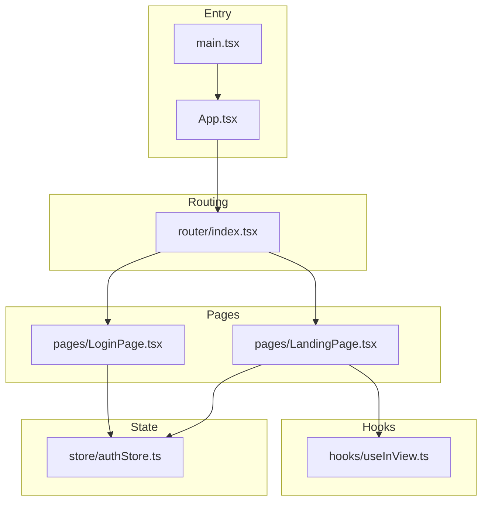
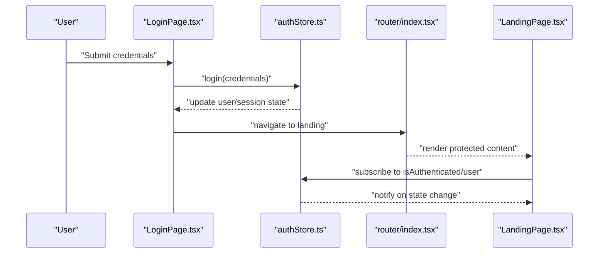
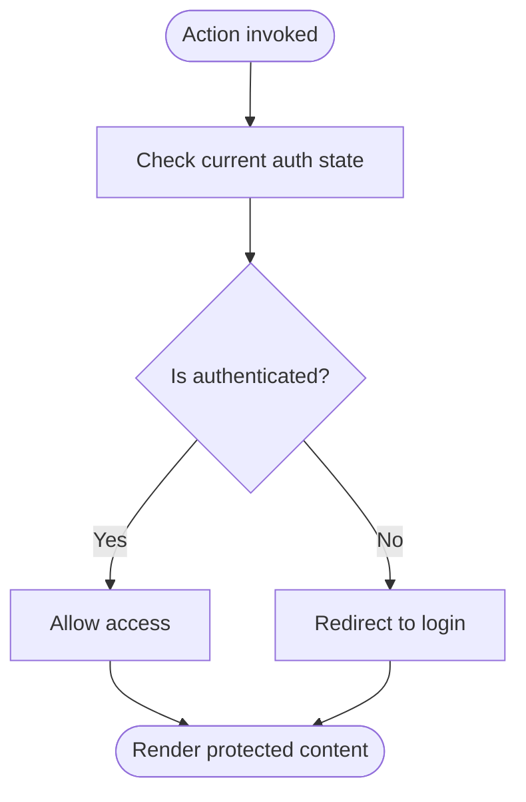
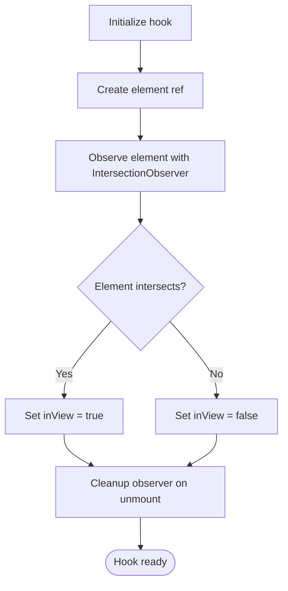
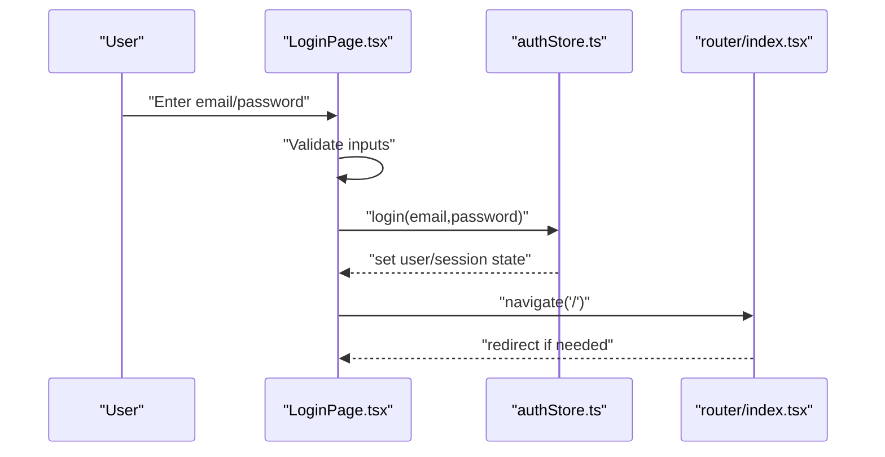
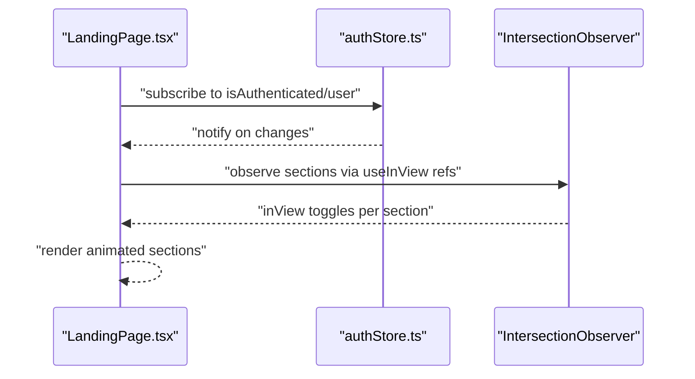
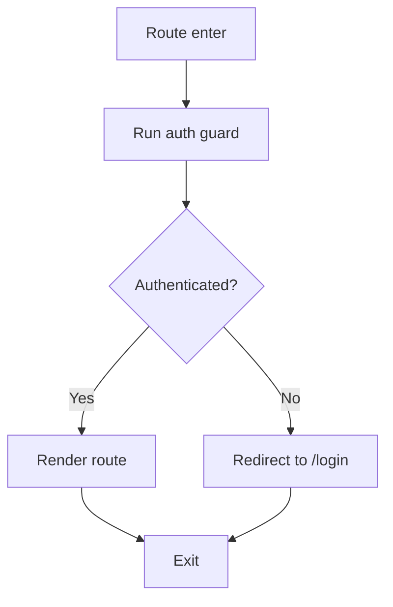
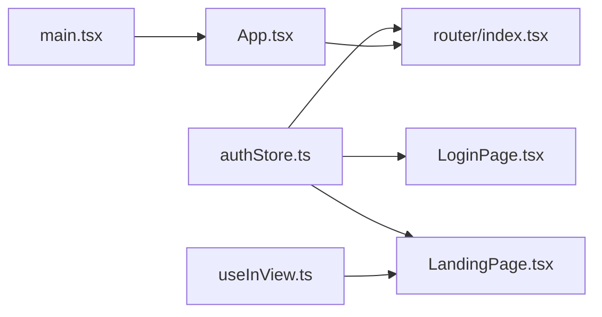

# State Management

<cite>
**Referenced Files in This Document**
- [authStore.ts](file://src/store/authStore.ts)
- [useInView.ts](file://src/hooks/useInView.ts)
- [LoginPage.tsx](file://src/pages/LoginPage.tsx)
- [LandingPage.tsx](file://src/pages/LandingPage.tsx)
- [index.tsx](file://src/router/index.tsx)
- [App.tsx](file://src/App.tsx)
- [main.tsx](file://src/main.tsx)
</cite>

## Table of Contents
1. [Introduction](#introduction)
2. [Project Structure](#project-structure)
3. [Core Components](#core-components)
4. [Architecture Overview](#architecture-overview)
5. [Detailed Component Analysis](#detailed-component-analysis)
6. [Dependency Analysis](#dependency-analysis)
7. [Performance Considerations](#performance-considerations)
8. [Troubleshooting Guide](#troubleshooting-guide)
9. [Conclusion](#conclusion)
10. [Appendices](#appendices)

## Introduction
This document explains the application’s state management patterns with a focus on:
- Authentication store implementation (user state, session management, login/logout flows, protected route integration)
- Custom useInView hook for intersection observer and scroll-based animations
- State persistence strategies
- Event handling patterns
- Decisions around component state vs global state
- Guidance for extending the auth store and creating custom hooks following established patterns

The goal is to make these concepts accessible while providing enough technical depth for developers to extend and maintain the codebase confidently.

## Project Structure
The state-related code is organized into focused modules:
- Store: Global authentication state via a dedicated store module
- Hooks: Reusable logic such as intersection observer usage
- Pages: Feature pages that consume the store and router
- Router: Route guards and navigation orchestration
- App and main entry points: Application bootstrap and provider setup

**Diagram sources**
- [main.tsx](file://src/main.tsx)
- [App.tsx](file://src/App.tsx)
- [index.tsx](file://src/router/index.tsx)
- [LoginPage.tsx](file://src/pages/LoginPage.tsx)
- [LandingPage.tsx](file://src/pages/LandingPage.tsx)
- [authStore.ts](file://src/store/authStore.ts)
- [useInView.ts](file://src/hooks/useInView.ts)

**Section sources**
- [main.tsx](file://src/main.tsx)
- [App.tsx](file://src/App.tsx)
- [index.tsx](file://src/router/index.tsx)
- [LoginPage.tsx](file://src/pages/LoginPage.tsx)
- [LandingPage.tsx](file://src/pages/LandingPage.tsx)
- [authStore.ts](file://src/store/authStore.ts)
- [useInView.ts](file://src/hooks/useInView.ts)

## Core Components
- Authentication store: Centralized user/session state and actions for login/logout, persisted across sessions when configured.
- Intersection observer hook: Encapsulates visibility detection for elements to trigger scroll-based animations or lazy behaviors.
- Login page: Orchestrates user input, calls authentication actions, and navigates upon success.
- Landing page: Consumes auth state to conditionally render content and uses the intersection observer hook for animations.
- Router: Guards routes based on authentication state and redirects unauthenticated users.

Key responsibilities:
- Auth store exposes user state and methods to mutate it; components subscribe only to what they need.
- The useInView hook abstracts IntersectionObserver lifecycle and exposes a ref and an in-view flag.
- Pages coordinate UI state and side effects without leaking concerns into the store.

**Section sources**
- [authStore.ts](file://src/store/authStore.ts)
- [useInView.ts](file://src/hooks/useInView.ts)
- [LoginPage.tsx](file://src/pages/LoginPage.tsx)
- [LandingPage.tsx](file://src/pages/LandingPage.tsx)
- [index.tsx](file://src/router/index.tsx)

## Architecture Overview
The application follows a unidirectional data flow:
- User interactions trigger actions in the auth store
- Auth store updates persisted state and notifies subscribers
- Components re-render with new state
- Router enforces access control based on auth state

**Diagram sources**
- [LoginPage.tsx](file://src/pages/LoginPage.tsx)
- [authStore.ts](file://src/store/authStore.ts)
- [index.tsx](file://src/router/index.tsx)
- [LandingPage.tsx](file://src/pages/LandingPage.tsx)

## Detailed Component Analysis

### Authentication Store
Responsibilities:
- Maintain user identity and session flags
- Provide login and logout actions
- Persist state across reloads when enabled
- Expose selectors for derived state (e.g., isAuthenticated)

Patterns:
- Immutable updates via functional setters
- Optional persistence layer using storage APIs
- Minimal surface area for consumers to reduce coupling

Extending the store:
- Add new user properties by updating the state shape and corresponding setters
- Introduce new actions for operations like profile updates or token refresh
- Keep persistence configuration centralized to avoid duplication

Protected route integration:
- Guard routes by checking authentication state before rendering
- Redirect unauthenticated users to login with optional return URL preservation

**Diagram sources**
- [authStore.ts](file://src/store/authStore.ts)
- [index.tsx](file://src/router/index.tsx)

**Section sources**
- [authStore.ts](file://src/store/authStore.ts)
- [index.tsx](file://src/router/index.tsx)

### useInView Hook
Purpose:
- Detect when an element enters or leaves the viewport using IntersectionObserver
- Provide a stable ref and a boolean indicating visibility
- Manage observer lifecycle automatically

Usage patterns:
- Attach the returned ref to the target element
- Use the in-view flag to trigger animations or lazy loading
- Avoid unnecessary re-renders by memoizing dependencies where appropriate

**Diagram sources**
- [useInView.ts](file://src/hooks/useInView.ts)

**Section sources**
- [useInView.ts](file://src/hooks/useInView.ts)

### Login Page
Responsibilities:
- Collect user credentials
- Call login action from the auth store
- Handle success and error states
- Navigate to protected routes upon successful login

Flow:
- Validate inputs locally
- Invoke store login method
- Update UI based on response
- Redirect to landing or dashboard

**Diagram sources**
- [LoginPage.tsx](file://src/pages/LoginPage.tsx)
- [authStore.ts](file://src/store/authStore.ts)
- [index.tsx](file://src/router/index.tsx)

**Section sources**
- [LoginPage.tsx](file://src/pages/LoginPage.tsx)
- [authStore.ts](file://src/store/authStore.ts)
- [index.tsx](file://src/router/index.tsx)

### Landing Page
Responsibilities:
- Consume auth state to conditionally render content
- Use useInView hook to animate sections on scroll
- Optionally display user-specific information

Patterns:
- Subscribe to minimal slices of auth state to avoid unnecessary re-renders
- Combine local UI state with global auth state judiciously

**Diagram sources**
- [LandingPage.tsx](file://src/pages/LandingPage.tsx)
- [authStore.ts](file://src/store/authStore.ts)
- [useInView.ts](file://src/hooks/useInView.ts)

**Section sources**
- [LandingPage.tsx](file://src/pages/LandingPage.tsx)
- [authStore.ts](file://src/store/authStore.ts)
- [useInView.ts](file://src/hooks/useInView.ts)

### Router Integration
Responsibilities:
- Protect routes based on authentication state
- Redirect unauthenticated users to login
- Preserve intended destination for post-login redirect

Patterns:
- Centralized guard logic to avoid duplication across components
- Consistent behavior for public vs private routes

**Diagram sources**
- [index.tsx](file://src/router/index.tsx)
- [authStore.ts](file://src/store/authStore.ts)

**Section sources**
- [index.tsx](file://src/router/index.tsx)
- [authStore.ts](file://src/store/authStore.ts)

## Dependency Analysis
High-level relationships:
- LoginPage depends on authStore for login mutations
- LandingPage depends on authStore for reading user state and on useInView for animations
- Router depends on authStore to enforce access control
- App and main orchestrate providers and routing setup

**Diagram sources**
- [authStore.ts](file://src/store/authStore.ts)
- [LoginPage.tsx](file://src/pages/LoginPage.tsx)
- [LandingPage.tsx](file://src/pages/LandingPage.tsx)
- [useInView.ts](file://src/hooks/useInView.ts)
- [index.tsx](file://src/router/index.tsx)
- [App.tsx](file://src/App.tsx)
- [main.tsx](file://src/main.tsx)

**Section sources**
- [authStore.ts](file://src/store/authStore.ts)
- [LoginPage.tsx](file://src/pages/LoginPage.tsx)
- [LandingPage.tsx](file://src/pages/LandingPage.tsx)
- [useInView.ts](file://src/hooks/useInView.ts)
- [index.tsx](file://src/router/index.tsx)
- [App.tsx](file://src/App.tsx)
- [main.tsx](file://src/main.tsx)

## Performance Considerations
- Prefer granular subscriptions to the auth store to minimize re-renders
- Memoize expensive computations derived from auth state
- Debounce or throttle frequent events (e.g., scroll-driven animations) where necessary
- Ensure IntersectionObserver instances are cleaned up to prevent memory leaks
- Avoid storing transient UI state in the global store; keep it local to components

[No sources needed since this section provides general guidance]

## Troubleshooting Guide
Common issues and resolutions:
- Auth state not persisting: Verify persistence configuration and storage availability
- Routes not protecting correctly: Ensure guards check the latest auth state and handle redirects consistently
- Animations not triggering: Confirm refs are attached to elements and observers are initialized after mount
- Unexpected re-renders: Narrow down subscriptions and avoid subscribing to entire store objects

**Section sources**
- [authStore.ts](file://src/store/authStore.ts)
- [index.tsx](file://src/router/index.tsx)
- [useInView.ts](file://src/hooks/useInView.ts)

## Conclusion
The application employs clear separation between global and local state, with a focused authentication store and reusable hooks. Protected routes ensure security, while the intersection observer hook enables performant scroll-based animations. Following the patterns outlined here will help you extend functionality safely and maintain consistency across the codebase.

[No sources needed since this section summarizes without analyzing specific files]

## Appendices

### Extending the Auth Store
Steps:
- Add new fields to the user/session state shape
- Implement setters or actions to update those fields
- Optionally integrate with persistence layer to include new fields
- Update consumers to subscribe only to relevant slices

Guidelines:
- Keep actions atomic and idempotent
- Validate inputs before mutating state
- Document expected side effects and persistence behavior

**Section sources**
- [authStore.ts](file://src/store/authStore.ts)

### Creating Custom Hooks Following the Same Patterns
Recommendations:
- Encapsulate complex logic behind a simple API (ref + flags)
- Manage side effects internally (e.g., event listeners, observers)
- Return stable references to avoid unnecessary re-renders
- Provide clear documentation for usage and limitations

Example pattern:
- Accept configuration options
- Initialize internal state and effects
- Return a tuple or object with ref(s) and status flags

**Section sources**
- [useInView.ts](file://src/hooks/useInView.ts)