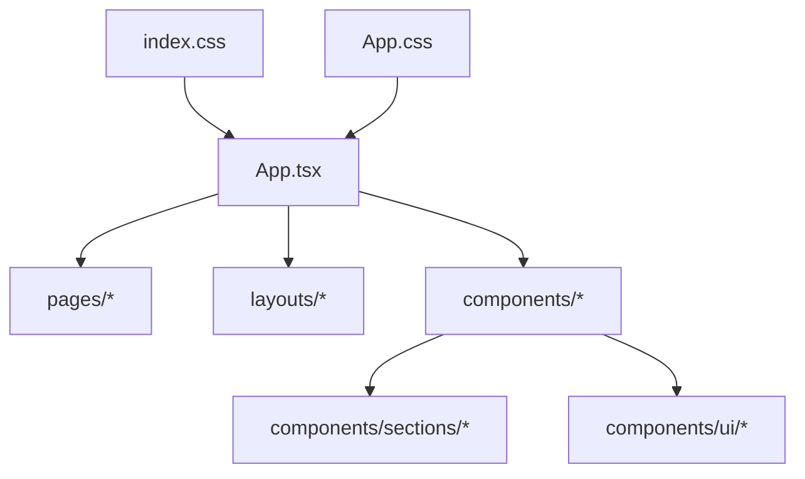
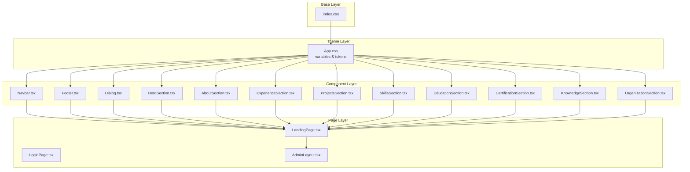
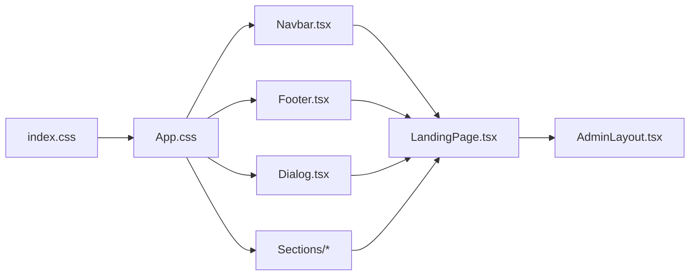

# Styling and Theming

<cite>
**Referenced Files in This Document**
- [index.css](file://src/index.css)
- [App.css](file://src/App.css)
- [App.tsx](file://src/App.tsx)
- [main.tsx](file://src/main.tsx)
- [LandingPage.tsx](file://src/pages/LandingPage.tsx)
- [LoginPage.tsx](file://src/pages/LoginPage.tsx)
- [AdminLayout.tsx](file://src/layouts/AdminLayout.tsx)
- [Navbar.tsx](file://src/components/Navbar.tsx)
- [Footer.tsx](file://src/components/Footer.tsx)
- [FloatingScrollButton.tsx](file://src/components/FloatingScrollButton.tsx)
- [Dialog.tsx](file://src/components/ui/Dialog.tsx)
- [AboutSection.tsx](file://src/components/sections/AboutSection.tsx)
- [ExperienceSection.tsx](file://src/components/sections/ExperienceSection.tsx)
- [ProjectsSection.tsx](file://src/components/sections/ProjectsSection.tsx)
- [SkillsSection.tsx](file://src/components/sections/SkillsSection.tsx)
- [EducationSection.tsx](file://src/components/sections/EducationSection.tsx)
- [CertificationSection.tsx](file://src/components/sections/CertificationSection.tsx)
- [KnowledgeSection.tsx](file://src/components/sections/KnowledgeSection.tsx)
- [OrganizationSection.tsx](file://src/components/sections/OrganizationSection.tsx)
- [HeroSection.tsx](file://src/components/sections/HeroSection.tsx)
</cite>

## Table of Contents
1. [Introduction](#introduction)
2. [Project Structure](#project-structure)
3. [Core Components](#core-components)
4. [Architecture Overview](#architecture-overview)
5. [Detailed Component Analysis](#detailed-component-analysis)
6. [Dependency Analysis](#dependency-analysis)
7. [Performance Considerations](#performance-considerations)
8. [Troubleshooting Guide](#troubleshooting-guide)
9. [Conclusion](#conclusion)
10. [Appendices](#appendices)

## Introduction
This document explains the styling architecture and theming system used across the application. It covers global styles, component-specific styles, responsive design patterns, naming conventions, and guidelines for extending the visual design system consistently. The goal is to help developers understand how styles are organized, how themes can be customized, and how to maintain a cohesive look and feel across all components.

## Project Structure
The styling approach combines global CSS with component-level styles:
- Global styles are centralized in index.css and App.css.
- Component styles are typically co-located within each component file or managed via utility classes.
- Layouts and pages import shared UI components that encapsulate their own styles.

**Diagram sources**
- [index.css](file://src/index.css)
- [App.css](file://src/App.css)
- [App.tsx](file://src/App.tsx)

**Section sources**
- [index.css](file://src/index.css)
- [App.css](file://src/App.css)
- [App.tsx](file://src/App.tsx)
- [main.tsx](file://src/main.tsx)

## Core Components
Styling responsibilities are distributed as follows:
- Global resets and base typography live in index.css.
- Application-wide layout and theme variables are defined in App.css.
- Page-level containers and page-specific overrides are applied in page files (e.g., LandingPage.tsx, LoginPage.tsx).
- Shared UI elements (Navbar, Footer, Dialog) encapsulate their own styles and reuse consistent spacing, colors, and typography tokens.
- Section components follow a uniform structure for content blocks, ensuring consistency across resume sections.

Key points:
- Use semantic class names aligned with component boundaries.
- Prefer utility-first patterns where appropriate to reduce duplication.
- Keep responsive rules close to the components they style.

**Section sources**
- [index.css](file://src/index.css)
- [App.css](file://src/App.css)
- [LandingPage.tsx](file://src/pages/LandingPage.tsx)
- [LoginPage.tsx](file://src/pages/LoginPage.tsx)
- [AdminLayout.tsx](file://src/layouts/AdminLayout.tsx)
- [Navbar.tsx](file://src/components/Navbar.tsx)
- [Footer.tsx](file://src/components/Footer.tsx)
- [Dialog.tsx](file://src/components/ui/Dialog.tsx)

## Architecture Overview
The styling architecture follows a layered model:
- Base layer: global resets, typography, and color tokens.
- Theme layer: variables for colors, spacing, typography scale, and breakpoints.
- Component layer: reusable UI primitives and section layouts.
- Page layer: composition of components into full pages.

**Diagram sources**
- [index.css](file://src/index.css)
- [App.css](file://src/App.css)
- [Navbar.tsx](file://src/components/Navbar.tsx)
- [Footer.tsx](file://src/components/Footer.tsx)
- [Dialog.tsx](file://src/components/ui/Dialog.tsx)
- [HeroSection.tsx](file://src/components/sections/HeroSection.tsx)
- [AboutSection.tsx](file://src/components/sections/AboutSection.tsx)
- [ExperienceSection.tsx](file://src/components/sections/ExperienceSection.tsx)
- [ProjectsSection.tsx](file://src/components/sections/ProjectsSection.tsx)
- [SkillsSection.tsx](file://src/components/sections/SkillsSection.tsx)
- [EducationSection.tsx](file://src/components/sections/EducationSection.tsx)
- [CertificationSection.tsx](file://src/components/sections/CertificationSection.tsx)
- [KnowledgeSection.tsx](file://src/components/sections/KnowledgeSection.tsx)
- [OrganizationSection.tsx](file://src/components/sections/OrganizationSection.tsx)
- [LandingPage.tsx](file://src/pages/LandingPage.tsx)
- [LoginPage.tsx](file://src/pages/LoginPage.tsx)
- [AdminLayout.tsx](file://src/layouts/AdminLayout.tsx)

## Detailed Component Analysis

### Global Styles and Theme Tokens
- index.css provides foundational resets and base typography settings.
- App.css defines theme tokens such as color palette, spacing units, typography scale, and breakpoint definitions. These tokens are consumed by components through CSS custom properties or utility classes.

Guidelines:
- Centralize all design tokens in App.css to ensure consistency.
- Reference tokens rather than hardcoding values in components.
- Maintain a single source of truth for colors, fonts, and spacing.

**Section sources**
- [index.css](file://src/index.css)
- [App.css](file://src/App.css)

### Layout and Pages
- LandingPage.tsx and LoginPage.tsx compose sections and UI primitives using the theme tokens.
- AdminLayout.tsx establishes admin-specific layout constraints and navigation scaffolding.

Responsive behavior:
- Mobile-first media queries are preferred; start with small screens and progressively enhance for larger viewports.
- Use flexible grids and fluid typography to adapt content across devices.

**Section sources**
- [LandingPage.tsx](file://src/pages/LandingPage.tsx)
- [LoginPage.tsx](file://src/pages/LoginPage.tsx)
- [AdminLayout.tsx](file://src/layouts/AdminLayout.tsx)

### Shared UI Components
- Navbar.tsx and Footer.tsx encapsulate common layout regions and apply consistent spacing, typography, and interactive states.
- Dialog.tsx manages modal presentation, focus management, and overlay styling.

Accessibility considerations:
- Ensure sufficient contrast ratios for text and interactive elements.
- Provide keyboard navigation and focus indicators.

**Section sources**
- [Navbar.tsx](file://src/components/Navbar.tsx)
- [Footer.tsx](file://src/components/Footer.tsx)
- [Dialog.tsx](file://src/components/ui/Dialog.tsx)

### Section Components
Each section component (HeroSection, AboutSection, ExperienceSection, ProjectsSection, SkillsSection, EducationSection, CertificationSection, KnowledgeSection, OrganizationSection) follows a consistent pattern:
- Semantic markup for content hierarchy.
- Reusable card-like containers with consistent padding and borders.
- Responsive grid or flex layouts to accommodate varying screen sizes.

Consistency tips:
- Use shared spacing and typography tokens from App.css.
- Keep component-scoped styles minimal; prefer token-driven styling.
- Avoid deep nesting to reduce specificity conflicts.

**Section sources**
- [HeroSection.tsx](file://src/components/sections/HeroSection.tsx)
- [AboutSection.tsx](file://src/components/sections/AboutSection.tsx)
- [ExperienceSection.tsx](file://src/components/sections/ExperienceSection.tsx)
- [ProjectsSection.tsx](file://src/components/sections/ProjectsSection.tsx)
- [SkillsSection.tsx](file://src/components/sections/SkillsSection.tsx)
- [EducationSection.tsx](file://src/components/sections/EducationSection.tsx)
- [CertificationSection.tsx](file://src/components/sections/CertificationSection.tsx)
- [KnowledgeSection.tsx](file://src/components/sections/KnowledgeSection.tsx)
- [OrganizationSection.tsx](file://src/components/sections/OrganizationSection.tsx)

### Floating Scroll Button
- FloatingScrollButton.tsx provides a scroll-to-top control with consistent styling and interaction feedback.

Best practices:
- Debounce scroll listeners to avoid performance issues.
- Animate visibility transitions smoothly.

**Section sources**
- [FloatingScrollButton.tsx](file://src/components/FloatingScrollButton.tsx)

## Dependency Analysis
Styling dependencies flow from global to component layers:
- index.css sets baseline styles.
- App.css introduces theme tokens consumed by components.
- Components import and use tokens directly or via utility classes.
- Pages assemble components without duplicating theme logic.

**Diagram sources**
- [index.css](file://src/index.css)
- [App.css](file://src/App.css)
- [Navbar.tsx](file://src/components/Navbar.tsx)
- [Footer.tsx](file://src/components/Footer.tsx)
- [Dialog.tsx](file://src/components/ui/Dialog.tsx)
- [LandingPage.tsx](file://src/pages/LandingPage.tsx)
- [AdminLayout.tsx](file://src/layouts/AdminLayout.tsx)

**Section sources**
- [index.css](file://src/index.css)
- [App.css](file://src/App.css)
- [LandingPage.tsx](file://src/pages/LandingPage.tsx)
- [AdminLayout.tsx](file://src/layouts/AdminLayout.tsx)

## Performance Considerations
- Minimize CSS specificity and avoid heavy selectors to keep rendering efficient.
- Prefer utility classes and token-based styling to reduce duplicate rules.
- Defer non-critical animations and transitions to improve initial paint performance.
- Use responsive images and optimize assets referenced by components.

[No sources needed since this section provides general guidance]

## Troubleshooting Guide
Common styling issues and resolutions:
- Inconsistent spacing or colors: verify usage of tokens from App.css instead of hardcoded values.
- Overlapping styles: check for high specificity in component CSS and refactor to flatter hierarchies.
- Responsive misalignment: review media query breakpoints and ensure mobile-first rules are applied correctly.
- Accessibility problems: confirm contrast ratios and focus indicators in interactive components like Dialog and Navbar.

**Section sources**
- [App.css](file://src/App.css)
- [Dialog.tsx](file://src/components/ui/Dialog.tsx)
- [Navbar.tsx](file://src/components/Navbar.tsx)

## Conclusion
The application’s styling architecture centers on a clear separation between global resets, theme tokens, and component styles. By adhering to consistent naming conventions, leveraging tokens, and following a mobile-first responsive strategy, the team can maintain a cohesive visual design while enabling easy customization and extension.

[No sources needed since this section summarizes without analyzing specific files]

## Appendices

### Styling Conventions and Naming Patterns
- Use descriptive, semantic class names tied to component purpose.
- Prefix component-specific classes when necessary to avoid collisions.
- Group related styles logically within component files.

### Extending the Visual Design System
- Add new tokens to App.css and reference them across components.
- Create reusable UI primitives in components/ui for shared interactions.
- Document any new tokens or patterns in a central style guide.

[No sources needed since this section provides general guidance]