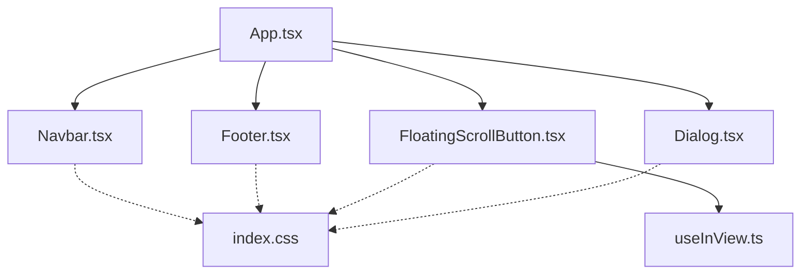
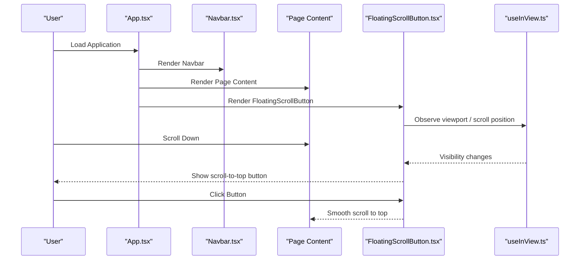
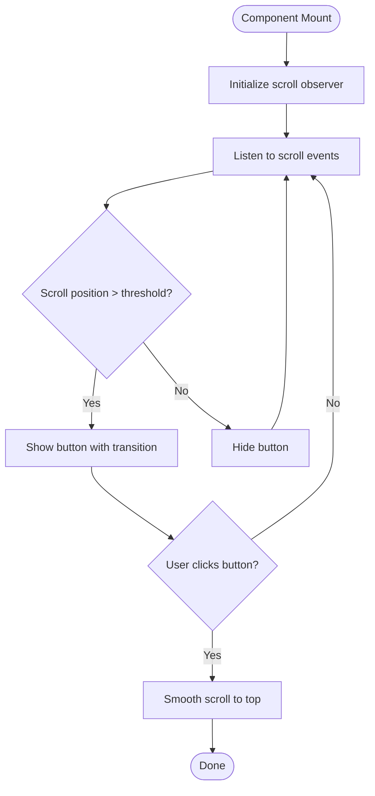
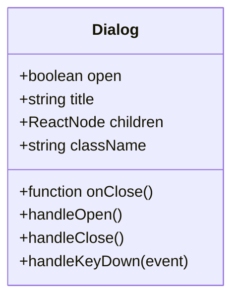
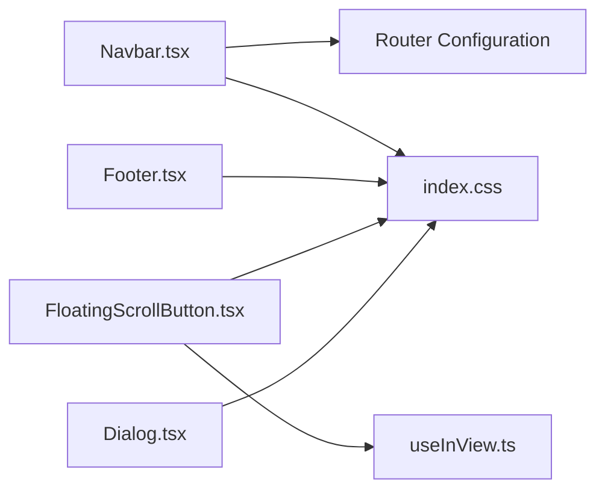

# UI Components

<cite>
**Referenced Files in This Document**
- [Navbar.tsx](file://src/components/Navbar.tsx)
- [Footer.tsx](file://src/components/Footer.tsx)
- [FloatingScrollButton.tsx](file://src/components/FloatingScrollButton.tsx)
- [Dialog.tsx](file://src/components/ui/Dialog.tsx)
- [useInView.ts](file://src/hooks/useInView.ts)
- [App.tsx](file://src/App.tsx)
- [index.css](file://src/index.css)
</cite>

## Table of Contents
1. [Introduction](#introduction)
2. [Project Structure](#project-structure)
3. [Core Components](#core-components)
4. [Architecture Overview](#architecture-overview)
5. [Detailed Component Analysis](#detailed-component-analysis)
6. [Dependency Analysis](#dependency-analysis)
7. [Performance Considerations](#performance-considerations)
8. [Troubleshooting Guide](#troubleshooting-guide)
9. [Conclusion](#conclusion)

## Introduction
This document provides detailed documentation for the reusable UI components used throughout the application, focusing on:
- Navbar: responsive behavior, navigation logic, and mobile menu implementation
- Footer: structure and customization options
- FloatingScrollButton: scroll detection mechanism and user interaction patterns
- Dialog: API including props, events, and accessibility features

It also includes usage examples, styling customization guidelines, and integration patterns with other components.

## Project Structure
The UI components are organized under src/components, with shared UI primitives under src/components/ui. The Navbar, Footer, and FloatingScrollButton are top-level components, while Dialog is a reusable primitive. A custom hook useInView supports intersection-based visibility logic that can be leveraged by components like FloatingScrollButton.

**Diagram sources**
- [App.tsx](file://src/App.tsx)
- [Navbar.tsx](file://src/components/Navbar.tsx)
- [Footer.tsx](file://src/components/Footer.tsx)
- [FloatingScrollButton.tsx](file://src/components/FloatingScrollButton.tsx)
- [Dialog.tsx](file://src/components/ui/Dialog.tsx)
- [useInView.ts](file://src/hooks/useInView.ts)
- [index.css](file://src/index.css)

**Section sources**
- [App.tsx](file://src/App.tsx)
- [index.css](file://src/index.css)

## Core Components
- Navbar: Provides site-wide navigation with responsive layout and a collapsible mobile menu. It integrates with routing to navigate between pages and sections.
- Footer: Displays footer content and links; designed to be customizable via props or theme variables.
- FloatingScrollButton: A floating button that appears when the user scrolls down and smoothly scrolls back to the top. Uses intersection observation or scroll listeners for performance.
- Dialog: A modal dialog component exposing a clear API for open/close state, focus management, keyboard handling, and accessibility attributes.

[No sources needed since this section provides general guidance]

## Architecture Overview
The components follow a simple composition model:
- App orchestrates page rendering and composes Navbar, Footer, and FloatingScrollButton at the root level.
- Dialog is consumed within feature pages or modals as needed.
- FloatingScrollButton may leverage useInView or window scroll events to determine visibility.
- Styling is centralized in index.css and component-specific styles where applicable.

**Diagram sources**
- [App.tsx](file://src/App.tsx)
- [Navbar.tsx](file://src/components/Navbar.tsx)
- [FloatingScrollButton.tsx](file://src/components/FloatingScrollButton.tsx)
- [useInView.ts](file://src/hooks/useInView.ts)

## Detailed Component Analysis

### Navbar
Responsiveness and mobile menu:
- Desktop: displays full navigation links horizontally.
- Mobile: collapses into a hamburger menu; toggles visibility based on state.

Navigation logic:
- Links route to internal pages or anchor targets.
- Active link highlighting reflects current route or section.

Accessibility:
- Semantic <nav> element with proper aria attributes.
- Keyboard support for opening/closing the mobile menu.

Styling customization:
- Use CSS classes for breakpoints and transitions.
- Theme variables can adjust colors, spacing, and typography.

Usage example:
- Place <Navbar /> at the root of your app layout.
- Configure routes or anchors via props if supported.

Integration patterns:
- Works alongside page sections that expose id anchors.
- Can be combined with a layout wrapper to maintain consistent header across pages.

**Section sources**
- [Navbar.tsx](file://src/components/Navbar.tsx)
- [index.css](file://src/index.css)

### Footer
Structure:
- Contains branding, links, and optional secondary information.
- Responsive grid/flex layout adapts to screen sizes.

Customization options:
- Props for text content, links, and social icons.
- CSS variables for colors, spacing, and typography.

Accessibility:
- Proper heading hierarchy and link semantics.
- Sufficient color contrast and focus states.

Usage example:
- Add <Footer /> at the bottom of your layout.
- Pass props to customize content per project or environment.

Integration patterns:
- Pair with Navbar to create a complete page shell.
- Can be themed using global CSS variables.

**Section sources**
- [Footer.tsx](file://src/components/Footer.tsx)
- [index.css](file://src/index.css)

### FloatingScrollButton
Scroll detection mechanism:
- Observes scroll position or uses an IntersectionObserver to detect when the button should appear.
- Hides near the top of the page and shows after a threshold.

User interaction patterns:
- Appears with a fade/slide transition.
- On click, triggers smooth scrolling to the top of the document.

Accessibility:
- Focusable with visible focus ring.
- Descriptive label for screen readers.

Styling customization:
- Positioning (fixed), size, colors, and animation duration can be adjusted via CSS variables or props.

Usage example:
- Render <FloatingScrollButton /> anywhere in the app body.
- Optionally configure thresholds and animations via props.

Integration patterns:
- Works independently of routing; suitable for single-page apps with long sections.
- Can be combined with useInView for advanced visibility logic.

**Diagram sources**
- [FloatingScrollButton.tsx](file://src/components/FloatingScrollButton.tsx)
- [useInView.ts](file://src/hooks/useInView.ts)

**Section sources**
- [FloatingScrollButton.tsx](file://src/components/FloatingScrollButton.tsx)
- [useInView.ts](file://src/hooks/useInView.ts)
- [index.css](file://src/index.css)

### Dialog
API overview:
- Props:
  - open: boolean controlling visibility
  - onClose: callback invoked when closing
  - title: string for accessible title
  - children: content inside the dialog
  - className: additional class names for styling
  - role and aria attributes for accessibility
- Events:
  - onClose triggered by backdrop click, Escape key, or programmatic close
  - Optional onOpen for side effects when opened

Accessibility features:
- Focus trap within the dialog
- Escape key closes the dialog
- Proper ARIA roles and labels
- Prevents background scroll when open

Styling customization:
- Overlay and container styles via CSS variables or className overrides
- Animation durations and easing configurable through CSS

Usage example:
- Control open state from parent component state.
- Provide a descriptive title and accessible actions.

Integration patterns:
- Wrap confirmations, forms, or detail views.
- Compose with other UI elements like buttons and inputs.

**Diagram sources**
- [Dialog.tsx](file://src/components/ui/Dialog.tsx)

**Section sources**
- [Dialog.tsx](file://src/components/ui/Dialog.tsx)
- [index.css](file://src/index.css)

## Dependency Analysis
- Navbar depends on routing configuration and CSS for responsive design.
- Footer is self-contained but may reference global styles.
- FloatingScrollButton may depend on useInView for intersection-based visibility.
- Dialog is independent and styled via CSS variables or className overrides.

**Diagram sources**
- [Navbar.tsx](file://src/components/Navbar.tsx)
- [Footer.tsx](file://src/components/Footer.tsx)
- [FloatingScrollButton.tsx](file://src/components/FloatingScrollButton.tsx)
- [Dialog.tsx](file://src/components/ui/Dialog.tsx)
- [useInView.ts](file://src/hooks/useInView.ts)
- [index.css](file://src/index.css)

**Section sources**
- [Navbar.tsx](file://src/components/Navbar.tsx)
- [Footer.tsx](file://src/components/Footer.tsx)
- [FloatingScrollButton.tsx](file://src/components/FloatingScrollButton.tsx)
- [Dialog.tsx](file://src/components/ui/Dialog.tsx)
- [useInView.ts](file://src/hooks/useInView.ts)
- [index.css](file://src/index.css)

## Performance Considerations
- Debounce or throttle scroll listeners in FloatingScrollButton to avoid excessive re-renders.
- Prefer IntersectionObserver over scroll events when possible for better performance.
- Keep Navbar lightweight; lazy-load heavy dependencies if necessary.
- Avoid unnecessary re-renders in Dialog by memoizing children when appropriate.
- Use CSS transitions instead of JS animations for smoother interactions.

[No sources needed since this section provides general guidance]

## Troubleshooting Guide
Common issues and resolutions:
- Navbar mobile menu not toggling:
  - Ensure state updates are bound correctly and event handlers are attached.
  - Verify CSS media queries and z-index values.
- FloatingScrollButton not appearing:
  - Confirm scroll threshold logic and observer setup.
  - Check that the container allows scrolling and has sufficient height.
- Dialog not trapping focus:
  - Validate focus management implementation and ensure tab order is correct.
  - Test keyboard interactions (Escape, Tab).
- Accessibility problems:
  - Verify ARIA attributes and semantic HTML usage.
  - Ensure sufficient color contrast and focus indicators.

**Section sources**
- [Navbar.tsx](file://src/components/Navbar.tsx)
- [FloatingScrollButton.tsx](file://src/components/FloatingScrollButton.tsx)
- [Dialog.tsx](file://src/components/ui/Dialog.tsx)
- [index.css](file://src/index.css)

## Conclusion
The UI components provide a cohesive, accessible, and customizable foundation for the application. By following the usage examples, styling guidelines, and integration patterns outlined here, you can consistently implement responsive navigation, footers, scroll utilities, and dialogs across your project.

[No sources needed since this section summarizes without analyzing specific files]